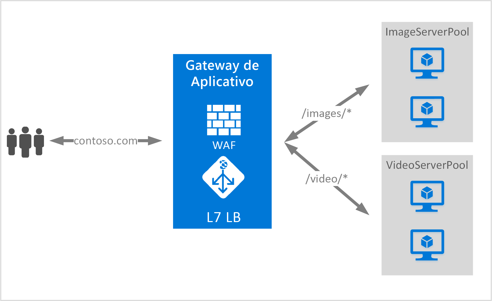

# <a name="url-path-based-routing-overview"></a>Visão geral do Roteamento Baseado em Caminho de URL

O Roteamento Baseado em Caminho de URL permite rotear o tráfego para pools do servidor de back-end com base nos Caminhos de URL da solicitação. 

Um dos cenários possíveis é rotear as solicitações de tipos de conteúdo diferentes para pools de servidores de back-end diferentes.

No exemplo a seguir, o Gateway de Aplicativo está fornecendo tráfego para contoso.com de três pools de servidor de back-end, como por exemplo: VideoServerPool, ImageServerPool e DefaultServerPool.



As solicitações de http\://contoso.com/video/* são roteadas para VideoServerPool e as de http\://contoso.com/images/* são roteadas para ImageServerPool. O DefaultServerPool será selecionado se nenhum dos padrões de caminho forem compatíveis.

> [!IMPORTANT]
> As regras são processadas na ordem em que elas são listadas no portal. É altamente recomendável configurar primeiro os ouvintes de vários locais para configurar um ouvinte básico.  Isso garante que o tráfego seja roteado para o back-end correto. Se um ouvinte básico for listado primeiro e corresponder a uma solicitação de entrada, ele é processado por esse ouvinte.

## <a name="urlpathmap-configuration-element"></a>Elemento de configuração UrlPathMap

O elemento urlPathMap é usado para especificar padrões de Caminho para mapeamentos de pool do servidor de back-end. O seguinte é o snippet do elemento urlPathMap do arquivo de modelo.

```json
"urlPathMaps": [{
    "name": "{urlpathMapName}",
    "id": "/subscriptions/{subscriptionId}/../microsoft.network/applicationGateways/{gatewayName}/urlPathMaps/{urlpathMapName}",
    "properties": {
        "defaultBackendAddressPool": {
            "id": "/subscriptions/    {subscriptionId}/../microsoft.network/applicationGateways/{gatewayName}/backendAddressPools/{poolName1}"
        },
        "defaultBackendHttpSettings": {
            "id": "/subscriptions/{subscriptionId}/../microsoft.network/applicationGateways/{gatewayName}/backendHttpSettingsList/{settingname1}"
        },
        "pathRules": [{
            "name": "{pathRuleName}",
            "properties": {
                "paths": [
                    "{pathPattern}"
                ],
                "backendAddressPool": {
                    "id": "/subscriptions/{subscriptionId}/../microsoft.network/applicationGateways/{gatewayName}/backendAddressPools/{poolName2}"
                },
                "backendHttpsettings": {
                    "id": "/subscriptions/{subscriptionId}/../microsoft.network/applicationGateways/{gatewayName}/backendHttpsettingsList/{settingName2}"
                }
            }
        }]
    }
}]
```

### <a name="pathpattern"></a>PathPattern

PathPattern é uma a lista de padrões de caminho para correspondência. Cada um deve começar com / e o único lugar onde um "*" é permitido é no final após um "/". A cadeia alimentada para o correspondente de caminho não inclui nenhum texto após o primeiro? ou #, e esses caracteres não são permitidos aqui. Caso contrário, todos os caracteres permitidos em um URL serão permitidos no PathPattern.

Os padrões compatíveis dependem de se você implanta o Gateway de Aplicativo v1 ou v2:

#### <a name="v1"></a>v1

As regras de caminho não diferenciam maiúsculas de minúsculas.

|Padrão de caminho v1  |É compatível?  |
|---------|---------|
|`/images/*`     |Sim|
|`/images*`     |não|
|`/images/*.jpg`     |não|
|`/*.jpg`     |não|
|`/Repos/*/Comments/*`     |não|
|`/CurrentUser/Comments/*`     |Sim|

#### <a name="v2"></a>v2

As regras de caminho diferenciam maiúsculas de minúsculas.

|Padrão de caminho v2  |É compatível?  |
|---------|---------|
|`/images/*`     |Sim|
|`/images*`     |Sim|
|`/images/*.jpg`     |não|
|`/*.jpg`     |não|
|`/Repos/*/Comments/*`     |não|
|`/CurrentUser/Comments/*`     |Sim|

Você pode conferir um [modelo do Resource Manager usando o roteamento baseado em URL](https://azure.microsoft.com/documentation/templates/201-application-gateway-url-path-based-routing) para obter mais informações.

## <a name="pathbasedrouting-rule"></a>Regra de PathBasedRouting

RequestRoutingRule do tipo PathBasedRouting é usada para associar um ouvinte a um urlPathMap. Todas as solicitações recebidas por este ouvinte são roteadas com base na política especificada no urlPathMap.
snippet de código da regra de PathBasedRouting:

```json
"requestRoutingRules": [
    {

"name": "{ruleName}",
"id": "/subscriptions/{subscriptionId}/../microsoft.network/applicationGateways/{gatewayName}/requestRoutingRules/{ruleName}",
"properties": {
    "ruleType": "PathBasedRouting",
    "httpListener": {
        "id": "/subscriptions/{subscriptionId}/../microsoft.network/applicationGateways/{gatewayName}/httpListeners/<listenerName>"
    },
    "urlPathMap": {
        "id": "/subscriptions/{subscriptionId}/../microsoft.network/applicationGateways/{gatewayName}/ urlPathMaps/{urlpathMapName}"
    },

}
    }
]
```

## <a name="next-steps"></a>Próximas etapas

Depois de conhecer o roteamento de conteúdo baseado em URL, acesse [criar um application gateway usando o roteamento baseado em URL](application-gateway-create-url-route-portal.md) para criar um application gateway com as regras de roteamento de URL.
