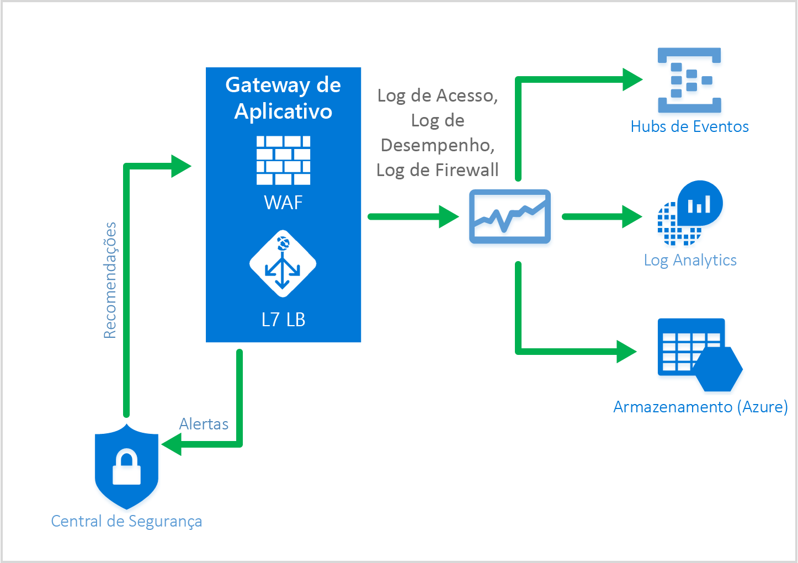

# <a name="web-application-firewall-waf"></a>Firewall do aplicativo Web (WAF)

O Firewall de aplicativo Web (WAF) disponível no SKU do WAF do Gateway de Aplicativo fornece proteção aos aplicativos Web contra vulnerabilidades e explorações comuns da Web. O firewall de aplicativo Web tem base em regras dos [conjuntos de regras principais do OWASP](https://www.owasp.org/index.php/Category:OWASP_ModSecurity_Core_Rule_Set_Project) 3.0 ou 2.2.9. Os aplicativos Web cada vez mais são alvos de ataques mal-intencionados que exploram vulnerabilidades conhecidas comuns. Os ataques de injeção de SQL, os ataques de scripts entre sites, entre outros, são comuns entre essas explorações. Pode ser difícil impedir esses ataques no código do aplicativo e pode exigir manutenção rigorosa, aplicação de patches e monitoramento em várias camadas da topologia do aplicativo. Um firewall de aplicativo Web centralizado ajuda a simplificar bastante o gerenciamento de segurança e oferece mais garantia ao administrador do aplicativo contra ameaças ou invasões. Uma solução WAF também pode reagir a uma ameaça de segurança mais rapidamente ao aplicar um patch contra uma vulnerabilidade conhecida em um local central do que a proteção de cada um dos aplicativos Web individuais. Os gateways de aplicativos existentes podem ser facilmente convertidos em um gateway de aplicativo com firewall de aplicativo Web.


O Gateway de Aplicativo funciona como um controlador de entrega do aplicativo e oferece a terminação SSL, a afinidade de sessão baseada em cookies, a distribuição de carga round robin, o roteamento baseado em conteúdo, a capacidade de hospedar vários sites e os aprimoramentos de segurança. Os aprimoramentos de segurança oferecidos pelo Gateway de Aplicativo incluem gerenciamento de política SSL, suporte a SSL de ponta a ponta. Agora, a segurança do aplicativo foi reforçada pele integração direta do WAF (firewall do aplicativo Web) à oferta ADC. Isso oferece uma forma fácil de configurar um local central para gerenciar e proteger seus aplicativos Web contra vulnerabilidades comuns da Web.

## <a name="benefits"></a>Benefícios

Estes são os principais benefícios fornecidos pelo Gateway de Aplicativo e pelo firewall do aplicativo Web:

### <a name="protection"></a>Proteção

* Protege seu aplicativo Web de vulnerabilidades e ataques da Web sem modificar o código de back-end.

* Protege vários aplicativos Web ao mesmo tempo por trás de um gateway de aplicativo. O Gateway de Aplicativo oferece suporte à hospedagem de até 20 sites por trás de um único gateway e que podem ser protegidos contra ataques da Web com WAF.

### <a name="monitoring"></a>Monitoramento

* Monitore seu aplicativo Web contra ataques usando um log de WAF em tempo real. Esse log é integrado ao [Azure Monitor](../monitoring-and-diagnostics/monitoring-overview.md) a fim de acompanhar os logs e alertas de WAF e monitorar facilmente as tendências.

* O WAF será integrado com a Central de Segurança do Azure em breve. A Central de Segurança do Azure permite uma exibição central do estado da segurança de todos os seus recursos do Azure.

### <a name="customization"></a>Personalização

* A capacidade de personalizar regras e grupos de regras de WAF a fim de atender suas necessidades de seu aplicativo e eliminar falsos positivos.

## <a name="features"></a>Recursos

O firewall de aplicativo Web vem pré-configurado por padrão com o CRS 3.0, ou você pode optar por usar o 2.2.9. O CRS 3.0 oferece menos falsos positivos do que o 2.2.9. Há a capacidade de [personalizar regras para atender às suas necessidades](application-gateway-customize-waf-rules-portal.md). Algumas das vulnerabilidades da Web comuns contra as quais o firewall do aplicativo Web protege incluem:

* Proteção contra injeção de SQL
* Proteção contra scripts entre sites
* Proteção Contra Ataques Comuns da Web, como a injeção de comandos, as solicitações HTTP indesejadas, a divisão de resposta HTTP e o ataque de inclusão de arquivo remoto
* Proteção contra violações de protocolo HTTP
* Proteção contra anomalias de protocolo HTTP, como ausência de host de agente do usuário e de cabeçalhos de aceitação
* Prevenção contra bots, rastreadores e scanners
* Detecção de problemas de configuração de aplicativo comuns (por exemplo, Apache, IIS etc.)

Para obter uma lista mais detalhada das regras e suas proteções, confira os seguintes [Conjuntos de regras principais](#core-rule-sets).

### <a name="core-rule-sets"></a>Conjuntos de regras principais

O Gateway de Aplicativo dá suporte a dois conjuntos de regras, CRS 3.0 e CRS 2.2.9. Esses conjuntos de regras principais são coleções de regras que protegem seus aplicativos Web contra atividades mal-intencionadas.

#### <a name="owasp30"></a>OWASP_3.0

O conjunto de regras principais 3.0 fornecido tem 13 grupos de regras, conforme mostra a tabela a seguir. Cada um desses grupos de regra contém várias regras, que podem ser desabilitadas.

|RuleGroup|Descrição|
|---|---|
|**[REQUEST-910-IP-REPUTATION](application-gateway-crs-rulegroups-rules.md#crs910)**|Contém as regras para proteção contra spam conhecidos ou atividade mal-intencionada.|
|**[REQUEST-911-METHOD-ENFORCEMENT](application-gateway-crs-rulegroups-rules.md#crs911)**|Contém as regras para bloquear métodos (PUT, PATCH< .)|
|**[REQUEST-912-DOS-PROTECTION](application-gateway-crs-rulegroups-rules.md#crs912)**| Contém as regras para proteção contra ataques de DoS (Negação de serviço).|
|**[REQUEST-913-SCANNER-DETECTION](application-gateway-crs-rulegroups-rules.md#crs913)**| Contém as regras para proteção contra os scanners de porta e ambiente.|
|**[REQUEST-920-PROTOCOL-ENFORCEMENT](application-gateway-crs-rulegroups-rules.md#crs920)**|Contém as regras para proteção contra problemas de protocolo e codificação.|
|**[REQUEST-921-PROTOCOL-ATTACK](application-gateway-crs-rulegroups-rules.md#crs921)**|Contém as regras para proteger contra injeção de cabeçalho, solicitações indesejadas e divisão de resposta|
|**[REQUEST-930-APPLICATION-ATTACK-LFI](application-gateway-crs-rulegroups-rules.md#crs930)**|Contém as regras para proteção contra ataques de arquivo e caminho.|
|**[REQUEST-931-APPLICATION-ATTACK-RFI](application-gateway-crs-rulegroups-rules.md#crs931)**|Contém as regras para proteção contra RFI (Inclusão de arquivo remoto)|
|**[REQUEST-932-APPLICATION-ATTACK-RCE](application-gateway-crs-rulegroups-rules.md#crs932)**|Contém as regras para proteção contra execução remota de código.|
|**[REQUEST-933-APPLICATION-ATTACK-PHP](application-gateway-crs-rulegroups-rules.md#crs933)**|Contém as regras para proteção contra ataques de injeção de PHP.|
|**[REQUEST-941-APPLICATION-ATTACK-XSS](application-gateway-crs-rulegroups-rules.md#crs941)**|Contém regras para proteção contra scripts entre site.|
|**[REQUEST-942-APPLICATION-ATTACK-SQLI](application-gateway-crs-rulegroups-rules.md#crs942)**|Contém as regras para proteção contra ataques de injeção de SQL.|
|**[REQUEST-943-APPLICATION-ATTACK-SESSION-FIXATION](application-gateway-crs-rulegroups-rules.md#crs943)**|Contém as regras para proteção contra ataques de fixação da sessão.|

#### <a name="owasp229"></a>OWASP_2.2.9

O conjunto de regras principais 2.2.9 fornecido tem 10 grupos de regras, conforme mostra a tabela a seguir. Cada um desses grupos de regra contém várias regras, que podem ser desabilitadas.

|RuleGroup|Descrição|
|---|---|
|**[crs_20_protocol_violations](application-gateway-crs-rulegroups-rules.md#crs20)**|Contém as regras para proteção contra violações de protocolo (caracteres inválidos, GET com um corpo de solicitação etc.)|
|**[crs_21_protocol_anomalies](application-gateway-crs-rulegroups-rules.md#crs21)**|Contém as regras para proteção contra informações de cabeçalho incorretas.|
|**[crs_23_request_limits](application-gateway-crs-rulegroups-rules.md#crs23)**|Contém as regras para proteção contra argumentos ou arquivos que excedem os limites.|
|**[crs_30_http_policy](application-gateway-crs-rulegroups-rules.md#crs30)**|Contém as regras para proteção contra métodos restritos, cabeçalhos e tipos de arquivo. |
|**[crs_35_bad_robots](application-gateway-crs-rulegroups-rules.md#crs35)**|Contém as regras para proteção contra scanners e rastreadores da Web.|
|**[crs_40_generic_attacks](application-gateway-crs-rulegroups-rules.md#crs40)**|Contém as regras para proteção contra ataques genéricos (fixação da sessão, inclusão de arquivo remoto, injeção de PHP etc.)|
|**[crs_41_sql_injection_attacks](application-gateway-crs-rulegroups-rules.md#crs41sql)**|Contém as regras para proteção contra ataques de injeção de SQL|
|**[crs_41_xss_attacks](application-gateway-crs-rulegroups-rules.md#crs41xss)**|Contém regras para proteção contra scripts entre site.|
|**[crs_42_tight_security](application-gateway-crs-rulegroups-rules.md#crs42)**|Contém uma regra para proteção contra ataques de passagem de caminho|
|**[crs_45_trojans](application-gateway-crs-rulegroups-rules.md#crs45)**|Contém regras para proteção contra cavalos de Troia backdoor.|

### <a name="waf-modes"></a>Modos de WAF

O WAF do Gateway de Aplicativo pode ser configurado para ser executado nestes dois modos:

* **Modo de Detecção** – quando configurado para execução no modo de detecção, o WAF do Gateway de Aplicativo monitora e registra em um arquivo de log todos os alertas de ameaça. O log de diagnóstico para o Gateway de Aplicativo deve estar ativado usando a seção **Diagnóstico**. Você também precisa garantir que o log do WAF esteja selecionado e ativado. Ao ser executado no firewall do aplicativo Web no modo de detecção não bloqueia solicitações de entrada.
* **Modo de Prevenção** – quando configurado para ser executado no modo de prevenção, o Gateway de Aplicativo bloqueia ativamente invasões e ataques detectados por suas regras. O invasor recebe uma exceção 403 acesso não autorizado e a conexão é encerrada. O modo de Prevenção continua a registrar em log tais ataques nos logs do WAF.

### <a name="application-gateway-waf-reports"></a>Monitoramento de WAF

É importante monitorar a integridade de seu gateway de aplicativo. O monitoramento da integridade de seu firewall de aplicativo Web, e dos aplicativos que ele protege, é fornecido por meio do registro em log e da integração com o Azure Monitor, a Central de Segurança do Azure (em breve) e o Log Analytics.



#### <a name="azure-monitor"></a>Azure Monitor

Cada log de gateway de aplicativo é integrado ao [Azure Monitor](../monitoring-and-diagnostics/monitoring-overview.md).  Isso permite o controle das informações de diagnóstico, incluindo logs e alertas de WAF.  Esse recurso é fornecido Gateway de Aplicativo no portal na guia **Diagnóstico** ou diretamente no serviço Azure Monitor. Para saber mais sobre como habilitar logs de diagnóstico para o gateway de aplicativo, visite [Diagnóstico do Gateway de aplicativo](application-gateway-diagnostics.md)

#### <a name="logging"></a>Registro em log

O WAF do Gateway de Aplicativo fornece relatórios detalhados sobre cada ameaça detectada. O registro em log é integrado aos Logs de diagnóstico do Azure e os alertas são registrados em um formato json. Esses logs podem ser integrados ao [Log Analytics](../log-analytics/log-analytics-azure-networking-analytics.md).


```json
{
  "resourceId": "/SUBSCRIPTIONS/{subscriptionId}/RESOURCEGROUPS/{resourceGroupId}/PROVIDERS/MICROSOFT.NETWORK/APPLICATIONGATEWAYS/{appGatewayName}",
  "operationName": "ApplicationGatewayFirewall",
  "time": "2017-03-20T15:52:09.1494499Z",
  "category": "ApplicationGatewayFirewallLog",
  "properties": {
    "instanceId": "ApplicationGatewayRole_IN_0",
    "clientIp": "104.210.252.3",
    "clientPort": "4835",
    "requestUri": "/?a=%3Cscript%3Ealert(%22Hello%22);%3C/script%3E",
    "ruleSetType": "OWASP",
    "ruleSetVersion": "3.0",
    "ruleId": "941320",
    "message": "Possible XSS Attack Detected - HTML Tag Handler",
    "action": "Blocked",
    "site": "Global",
    "details": {
      "message": "Warning. Pattern match \"<(a|abbr|acronym|address|applet|area|audioscope|b|base|basefront|bdo|bgsound|big|blackface|blink|blockquote|body|bq|br|button|caption|center|cite|code|col|colgroup|comment|dd|del|dfn|dir|div|dl|dt|em|embed|fieldset|fn|font|form|frame|frameset|h1|head|h ...\" at ARGS:a.",
      "data": "Matched Data: <script> found within ARGS:a: <script>alert(\\x22hello\\x22);</script>",
      "file": "rules/REQUEST-941-APPLICATION-ATTACK-XSS.conf",
      "line": "865"
    }
  }
} 

```

## <a name="application-gateway-waf-sku-pricing"></a>Preços da SKU do WAF do Gateway de Aplicativo

O firewall de aplicativo Web está disponível em um novo um SKU do WAF. Esse SKU está disponível apenas no modelo de provisionamento do Azure Resource Manager e não no modelo de implantação clássico. Além disso, o SKU do WAF vem apenas em instâncias de gateway de aplicativo médias e grandes. Todos os limites do gateway de aplicativo também se aplicam ao SKU do WAF. Preço tem base nos encargos por hora da instância do gateway e nos encargos de processamento de dados. O preços do gateway por hora para o SKU do WAF é diferente dos encargos pelo SKU Standard e podem ser encontrados em [Detalhes de preços do Gateway de Aplicativo](https://azure.microsoft.com/pricing/details/application-gateway/). Os encargos de processamento de dados permanecem os mesmos. Não há cobrança por regra ou grupo de regras. Você pode proteger vários aplicativos Web atrás do mesmo firewall de aplicativo Web, e não há encargos adicionais para dar suporte a vários aplicativos. 

A cobrança pelo WAF começa efetivamente no dia 05/05/2017. Até lá, a cobrança pelos gateways do SKU do WAF ocorrerá de acordo com as taxas padrão.

## <a name="next-steps"></a>Próximas etapas

Depois de aprender mais sobre os recursos do WAF, visite [Como configurar o firewall de aplicativo Web no Gateway de Aplicativo](application-gateway-web-application-firewall-portal.md).


