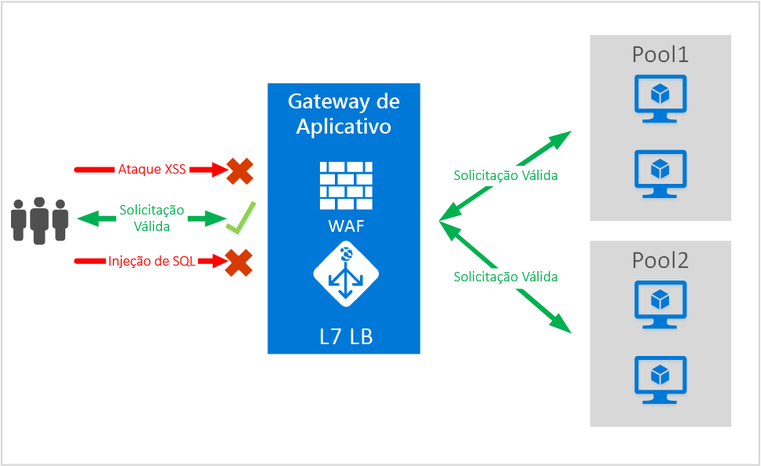
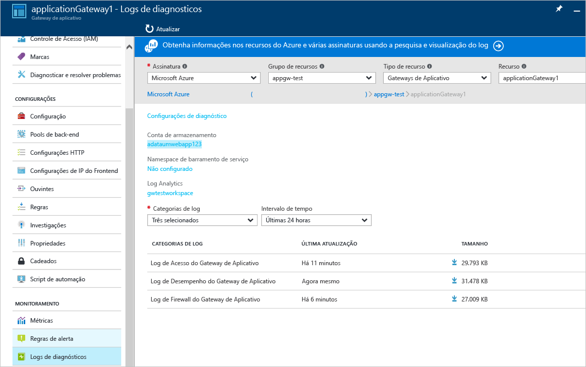

# <a name="application-gateway-web-application-firewall-preview"></a>Firewall do Aplicativo Web do Gateway de Aplicativo (visualização)

O WAF (Firewall do aplicativo Web) é um recurso do gateway de aplicativo do Azure que fornece proteção para aplicativos Web que utilizam o gateway de aplicativo para as funções ADC (controle de entrega de aplicativos) padrão. O firewall do aplicativo Web faz isso protegendo-os contra a maioria das 10 vulnerabilidades mais comuns da Web segundo o OWASP. Os aplicativos Web cada vez mais são alvos de ataques mal-intencionados que exploram vulnerabilidades conhecidas comuns. Os ataques de injeção de SQL, os ataques de scripts entre sites, entre outros, são comuns entre essas explorações. Pode ser difícil impedir esses ataques no código do aplicativo e pode exigir manutenção rigorosa, aplicação de patches e monitoramento em várias camadas da topologia do aplicativo. Um firewall do aplicativo Web para proteger contra ataques da Web simplifica muito o gerenciamento de segurança e oferece mais garantia para o aplicativo contra ameaças de invasões. Uma solução WAF também pode reagir a uma ameaça de segurança mais rapidamente ao aplicar um patch contra uma vulnerabilidade conhecida em um local central do que a proteção de cada um dos aplicativos Web individuais. Os gateways de aplicativos existentes podem ser facilmente convertidos em um gateway de aplicativo com o firewall do aplicativo Web.



O Gateway de Aplicativo funciona como um controlador de entrega do aplicativo e oferece a terminação SSL, a afinidade de sessão baseada em cookies, a distribuição de carga round robin, o roteamento baseado em conteúdo, a capacidade de hospedar vários sites e os aprimoramentos de segurança. Os aprimoramentos de segurança oferecidos pelo Gateway de Aplicativo incluem gerenciamento de política SSL, suporte a SSL de ponta a ponta. Estamos fortalecendo os recursos de segurança de aplicativo do nosso serviço ao introduzirmos o WAF (firewall do aplicativo Web) diretamente integrado à oferta ADC. Isso oferece uma forma fácil de configurar um local central para gerenciar e proteger seus aplicativos Web contra vulnerabilidades comuns da Web.

Configurar o WAF no gateway de aplicativo oferece os seguintes benefícios:

* Protege seu aplicativo Web de vulnerabilidades e ataques da Web sem modificar o código de back-end.
* Protege vários aplicativos Web ao mesmo tempo por trás de um gateway de aplicativo. O Gateway de Aplicativo oferece suporte à hospedagem de até 20 sites por trás de um único gateway e que podem ser protegidos contra ataques da Web.
* Monitore seu aplicativo Web contra ataques usando o relatório em tempo real gerado pelos logs do WAF do gateway de aplicativo.
* Determinados controles de conformidade exigem que todos os pontos de extremidade voltados para a Internet estejam protegidos por uma solução WAF. Usando o gateway de aplicativo com WAF habilitado, você pode atender a esses requisitos de conformidade.

## <a name="overview"></a>Visão geral

O WAF do Gateway de Aplicativo é oferecido em uma nova SKU (SKU WAF) e vem pré-configurado com o Conjunto de Regras Principal do ModSecurity e do OWASP para oferecer proteção de linha de base contra a maioria das 10 principais vulnerabilidades da Web mais comuns do OWASP.

* Proteção contra injeção de SQL
* Proteção contra scripts entre sites
* Proteção Contra Ataques Comuns da Web, como a injeção de comandos, as solicitações HTTP indesejadas, a divisão de resposta HTTP e o ataque de inclusão de arquivo remoto
* Proteção contra violações de protocolo HTTP
* Proteção contra anomalias de protocolo HTTP, como ausência de host de agente do usuário e de cabeçalhos de aceitação
* Prevenção contra bots, rastreadores e scanners
* Detecção de problemas de configuração de aplicativo comuns (por exemplo, Apache, IIS etc.)

## <a name="waf-modes"></a>Modos de WAF

O WAF do Gateway de Aplicativo pode ser configurado para ser executado nestes dois modos:

* **Modo de Detecção** – quando configurado para execução no modo de detecção, o WAF do Gateway de Aplicativo monitora e registra em um arquivo de log todos os alertas de ameaça. Você precisa garantir que o log de diagnóstico para o Gateway de Aplicativo esteja ativado usando a seção Diagnóstico. Você também precisa garantir que o log do WAF esteja selecionado e ativado.
* **Modo de Prevenção** – quando configurado para ser executado no modo de prevenção, o Gateway de Aplicativo bloqueia ativamente invasões e ataques detectados por suas regras. O invasor recebe uma exceção 403 acesso não autorizado e a conexão é encerrada. O modo de Prevenção continua a registrar em log tais ataques nos logs do WAF.

## <a name="application-gateway-waf-reports"></a>Relatórios do WAF do Gateway de Aplicativo

O WAF do Gateway de Aplicativo fornece relatórios detalhados sobre cada ameaça detectada. O registro em log é integrado aos Logs de Diagnóstico do Azure e os alertas são registrados em um formato json.



```json
{
    "resourceId": "/SUBSCRIPTIONS/<subscriptionId>/RESOURCEGROUPS/<resourceGroupName>/PROVIDERS/MICROSOFT.NETWORK/APPLICATIONGATEWAYS/<applicationGatewayName>",
    "operationName": "ApplicationGatewayFirewall",
    "time": "2016-09-20T00:40:04.9138513Z",
    "category": "ApplicationGatewayFirewallLog",
    "properties":     {
        "instanceId":"ApplicationGatewayRole_IN_0",
        "clientIp":"108.41.16.164",
        "clientPort":1815,
        "requestUri":"/wavsep/active/RXSS-Detection-Evaluation-POST/",
        "ruleId":"OWASP_973336",
        "message":"XSS Filter - Category 1: Script Tag Vector",
        "action":"Logged",
        "site":"Global",
        "message":"XSS Filter - Category 1: Script Tag Vector",
        "details":{"message":" Warning. Pattern match "(?i)(<script","file":"/owasp_crs/base_rules/modsecurity_crs_41_xss_attacks.conf","line":"14"}}
}
```

## <a name="application-gateway-waf-sku-pricing"></a>Preços da SKU do WAF do Gateway de Aplicativo

Durante a visualização, não há cobranças adicionais pelo uso do WAF do Gateway de Aplicativo. Você continua a ser cobrados pelos encargos existentes da SKU Básica. Os encargos de SKU WAF serão comunicados no momento de GA. Os clientes que optaram por implantar o Gateway de Aplicativo na SKU do WAF só começariam a acumular preços da SKU do WAF após o anúncio do GA.

## <a name="next-steps"></a>Próximas etapas

Depois de aprender mais sobre os recursos do WAF, acesse [Como configurar o Firewall do Aplicativo Web no Gateway de Aplicativo](application-gateway-web-application-firewall-portal.md).


<!--HONumber=Dec16_HO3-->


