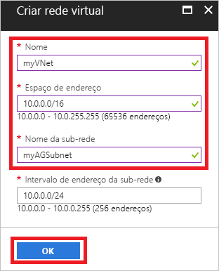
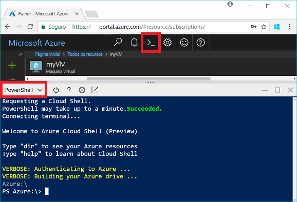
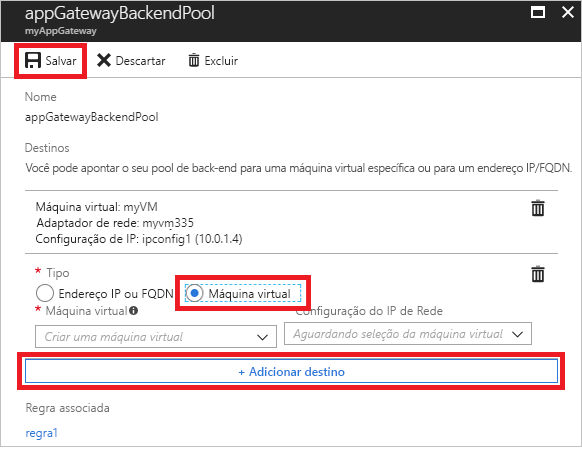
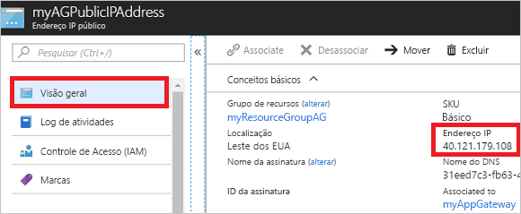

# <a name="quickstart-direct-web-traffic-with-azure-application-gateway---azure-portal"></a>Início Rápido: Direcionar o tráfego da Web com o Gateway de Aplicativo do Azure – portal do Azure

Com o Gateway de Aplicativo do Azure, você pode direcionar seu tráfego de web de aplicativo para recursos específicos designando ouvintes para portas, criando regras, e adicionando recursos a um pool de back-end.

Este guia de início rápido mostra como usar o portal do Azure para criar rapidamente o gateway de aplicativo com duas máquinas virtuais em seu pool de back-end. Em seguida, teste-o para verificar se ele está funcionando corretamente.

Se você não tiver uma assinatura do Azure, crie uma [conta gratuita](https://azure.microsoft.com/free/?WT.mc_id=A261C142F) antes de começar.

## <a name="log-in-to-azure"></a>Fazer logon no Azure

Faça logon no Portal do Azure em [http://portal.azure.com](http://portal.azure.com)

## <a name="create-an-application-gateway"></a>Criar um Gateway de Aplicativo

Você precisa criar uma rede virtual para o gateway de aplicativo ser capaz de se comunicar com outros recursos. Você pode criar uma rede virtual ao mesmo tempo que cria o gateway de aplicativo. Duas sub-redes são criadas neste exemplo: uma para o gateway de aplicativo e a outra para as máquinas virtuais. 

1. Clique em **Criar um recurso** encontrado na parte superior esquerda do portal do Azure.
2. Selecione **Rede** e depois **Gateway de Aplicativo** na lista em destaque.
3. Insira esses valores para o gateway de aplicativo:

    - *myAppGateway* - para o nome do gateway de aplicativo.
    - *myResourceGroupAG* - para o novo grupo de recursos.

    

4. Aceite os valores padrão para as outras configurações e, em seguida, clique em **OK**.
5. Clique em **Escolher uma rede virtual** > **Criar novo**, e insira esses valores para a rede virtual:

    - *myVNet* – para o nome da rede virtual.
    - *10.0.0.0/16* – para o espaço de endereço da rede virtual.
    - *myAGSubnet* – para o nome da sub-rede.
    - *10.0.0.0/24* - para o espaço de endereço da sub-rede.

    

6. Clique em **OK** para criar a rede virtual e a sub-rede.
6. Clique em **Escolher um endereço IP público** > **Criar novo**, e digite o nome do endereço IP público. Neste exemplo, o endereço IP público é denominado *myAGPublicIPAddress*. Aceite os valores padrão para as outras configurações e, em seguida, clique em **OK**.
8. Aceite os valores padrão para a configuração do ouvinte, deixe o firewall do aplicativo web desabilitado e, em seguida, clique em **OK**.
9. Examine as configurações na página de resumo e clique em **OK** para criar a rede virtual, o endereço IP público e o gateway de aplicativo. A criação do gateway de aplicativo pode levar até 30 minutos, aguarde até que a implantação seja concluída com êxito antes de passar para a próxima seção.

### <a name="add-a-subnet"></a>Adicionar uma sub-rede

1. Clique em **Todos os recursos** no menu esquerdo e depois clique em **myVNet** da lista de recursos.
2. Clique em **Sub-redes** > **Sub-rede**.

    

3. Digite *myBackendSubnet* para o nome da sub-rede e depois clique em **OK**.

## <a name="create-backend-servers"></a>Criar servidores de back-end

Neste exemplo, você cria duas máquinas virtuais para serem usadas como servidores de back-end para o gateway do aplicativo. 

### <a name="create-a-virtual-machine"></a>Criar uma máquina virtual

1. Clique em **Novo**.
2. Clique em **Computação** e, em seguida, selecione **Datacenter do Windows Server 2016** na lista em Destaque.
3. Insira esses valores para a máquina virtual:

    - *myVM* – para o nome da máquina virtual.
    - *azureuser* – para o nome de usuário do administrador.
    - *Azure123456!* para a senha.
    - Clique em **Usar existente** e selecione *myResourceGroupAG*.

4. Clique em **OK**.
5. Selecione **DS1_V2** para o tamanho da máquina virtual e então clique em **Selecionar**.
6. Verifique se **myVNet** está selecionado para a rede virtual e se a sub-rede é **myBackendSubnet**. 
7. Clique em **Desabilitado** para desabilitar o diagnóstico de inicialização.
8. Clique em **OK**, examine as configurações na página de resumo e, em seguida, clique em **Criar**.

### <a name="install-iis"></a>Instalar o IIS

Você instala o IIS nas máquinas virtuais para verificar se o gateway de aplicativo foi criado com êxito.

1. Abra o shell interativo e verifique se ele está definido como **PowerShell**.

    

2. Execute o comando a seguir para instalar o IIS na máquina virtual: 

    ```azurepowershell-interactive
    Set-AzureRmVMExtension `
      -ResourceGroupName myResourceGroupAG `
      -ExtensionName IIS `
      -VMName myVM `
      -Publisher Microsoft.Compute `
      -ExtensionType CustomScriptExtension `
      -TypeHandlerVersion 1.4 `
      -SettingString '{"commandToExecute":"powershell Add-WindowsFeature Web-Server; powershell Add-Content -Path \"C:\\inetpub\\wwwroot\\Default.htm\" -Value $($env:computername)"}' `
      -Location EastUS
    ```

3. Crie uma segunda máquina virtual e instale o IIS usando as etapas que você acabou de concluir. Insira *myVM2* para seu nome e para VMName em Set-AzureRmVMExtension.

### <a name="add-backend-servers"></a>Adicionar servidores de back-end

Depois de criar as máquinas virtuais, você precisa adicioná-las ao pool de back-end no gateway do aplicativo.

1. Clique em **Todos os recursos** > **myAppGateway**.
2. Clique em **Pools de back-end**. Um pool padrão foi criado automaticamente com o gateway de aplicativo. Clique em **appGatewayBackendPool**.
3. Clique em **Adicionar destino** > **Máquina Virtual**e, em seguida, selecione *myVM*. Selecione em **Adicionar destino** > **Máquina Virtual**e, em seguida, selecione *myVM2*.

    

4. Clique em **Salvar**.

## <a name="test-the-application-gateway"></a>Testar o gateway de aplicativo

Não é necessário instalar o IIS para criar o gateway de aplicativo, mas você o instalou neste guia de início rápido para verificar se o gateway do aplicativo foi criado com êxito.

1. Localize o endereço IP público para o gateway do aplicativo na tela de Visão geral. Clique em **Todos os recursos** > **myAGPublicIPAddress**.

    

2. Copie o endereço IP público e cole-o na barra de endereços do seu navegador.

    

Quando você atualizar o navegador, você deve ver o nome da outra VM aparecer.

## <a name="clean-up-resources"></a>Limpar recursos

Primeiro, explore os recursos que foram criados com o gateway de aplicativo e, quando não forem mais necessários, você pode remover o grupo de recursos, o gateway de aplicativo e todos os recursos relacionados. Para fazer isso, selecione o grupo de recursos na folha do gateway de aplicativo e clique em **Excluir**.

## <a name="next-steps"></a>Próximas etapas

> [!div class="nextstepaction"]
> [Gerenciar o tráfego da web com um gateway de aplicativo usando a CLI do Azure](./tutorial-manage-web-traffic-cli.md)
