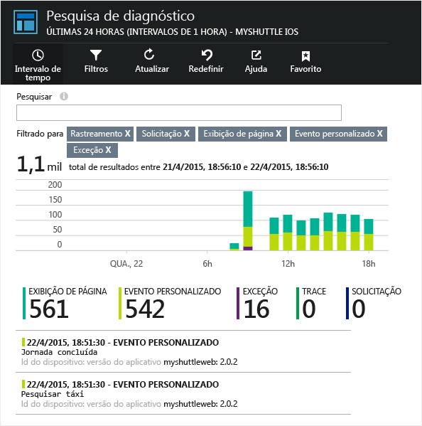
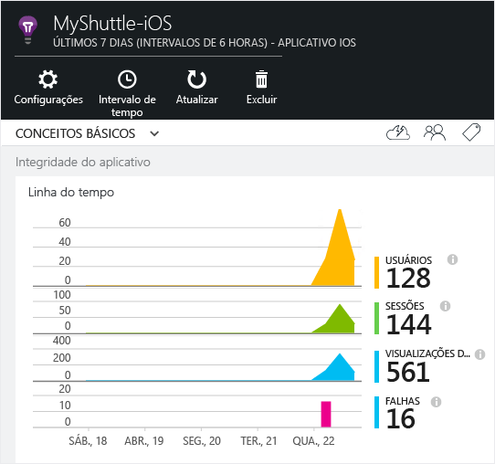
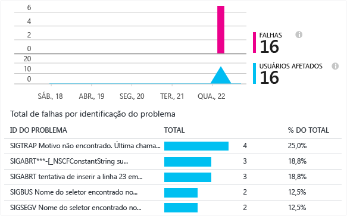

<properties
    pageTitle="Análises para aplicativos Android | Microsoft Azure"
    description="Analise o uso e o desempenho de seu aplicativo Android."
    services="application-insights"
    documentationCenter="android"
    authors="alancameronwills"
    manager="douge"/>

<tags
    ms.service="application-insights"
    ms.workload="mobile"
    ms.tgt_pltfrm="mobile-android"
    ms.devlang="na"
    ms.topic="get-started-article"
	ms.date="11/14/2015"
    ms.author="awills"/>

# Análise de aplicativos Android

O Application Insights do Visual Studio permite que você monitore seu aplicativo móvel quanto ao uso, eventos e falhas.

> [AZURE.NOTE]Recomendamos o [HockeyApp](http://support.hockeyapp.net/kb/client-integration-android/hockeyapp-for-android-sdk) para obter o gerenciamento de relatórios de falha, análise, distribuição e comentários.

## Requisitos

Você precisará de:

* Uma assinatura do [Microsoft Azure](http://azure.com). Entre com uma conta da Microsoft, que você pode ter para o Windows, XBox Live ou outros serviços de nuvem da Microsoft.
* Android Studio
* SDK do Android versão 9 ou posterior.

## Criar um recurso do Application Insights

No [Portal do Azure][portal], crie um novo recurso do Application Insights. Selecione a opção Android.


A folha que será aberta é o local em que você verá os dados de uso e desempenho sobre seu aplicativo. Para retornar a ela na próxima vez em que fizer logon no Azure, você deverá encontrar um bloco para ela na tela inicial. Como alternativa, clique em Procurar para localizá-la.

## Configuração

Siga o [guia de configuração](https://github.com/Microsoft/ApplicationInsights-Android#-3-setup).


## Usar o SDK

Inicialize o SDK e inicie o rastreamento de telemetria.

Adicione a importação a seguir à sua atividade-raiz de aplicativos:

```java

     import com.microsoft.applicationinsights.library.ApplicationInsights;
```

Adicione também o seguinte retorno de chamada da atividade `onCreate`:

```java

    ApplicationInsights.setup(this.getApplicationContext(), this.getApplication());
    ApplicationInsights.start();
```

Quando `ApplicationInsights.start()` é chamado, o SDK começa a acompanhar a atividade de ciclo de vida do Android e quaisquer exceções não tratadas.

> [AZURE.NOTE]Eventos de ciclo de vida do aplicativo só são coletados no Android SDK versão 15 ou posterior (Ice Cream Sandwich+).

Além disso, exceções tratadas, rastreamentos, métricas e eventos personalizados podem ser coletados. Use qualquer uma das [APIs do Application Insights][api] para enviar telemetria.

* TrackEvent(eventName) para outras ações de usuário
* TrackTrace(logEvent) para [registro de diagnóstico][diagnostic]
* TrackHandledException(exception) em cláusulas catch
* TrackMetric (nome, valor) em uma tarefa em segundo plano para enviar relatórios regulares de métricas não anexadas a eventos específicos

O código a seguir é um exemplo de inicialização e coleta de telemetria manual:

```java

    public class MyActivity extends Activity {

      @Override
      protected void onCreate(Bundle savedInstanceState) {

        ApplicationInsights.setup(this);
        //... other initialization code ...//
        ApplicationInsights.start();

        // track telemetry data
        TelemetryClient client = TelemetryClient.getInstance();
        HashMap<String, String> properties = new HashMap<String, String>();
        properties.put("property1", "my custom property");
        client.trackEvent("sample event", properties);
        client.trackTrace("sample trace");
        client.trackMetric("sample metric", 3);
        client.trackHandledException(new Exception("sample exception"));
      }
    }
```

## <a name="run"></a> Execute seu projeto

Execute o aplicativo (SHIFT + F10 no Windows, CTRL + R em OS X) para gerar a telemetria.

## Exibir seus dados no Application Insights

Retorne ao http://portal.azure.com e navegue até o recurso do Application Insights.

Clique em **Pesquisar** para abrir a [Pesquisa de Diagnóstico][diagnostic], que é onde os primeiros eventos serão exibidos. Se você não vir nada, espere um ou dois minutos e clique em **Atualizar**.



À medida que o aplicativo for usado, os dados aparecerão na folha de visão geral.



Clique em qualquer gráfico para obter mais detalhes. Por exemplo, falhas:




## <a name="usage"></a>Próximas etapas

[Acompanhar o uso do seu aplicativo][track]

[Pesquisa de diagnóstico][diagnostic]

[Gerenciador de Métricas][metrics]

[Solucionar problemas][qna]


<!--Link references-->

[api]: app-insights-api-custom-events-metrics.md
[diagnostic]: app-insights-diagnostic-search.md
[metrics]: app-insights-metrics-explorer.md
[portal]: http://portal.azure.com/
[qna]: app-insights-troubleshoot-faq.md
[track]: app-insights-api-custom-events-metrics.md

<!---HONumber=Nov15_HO4-->