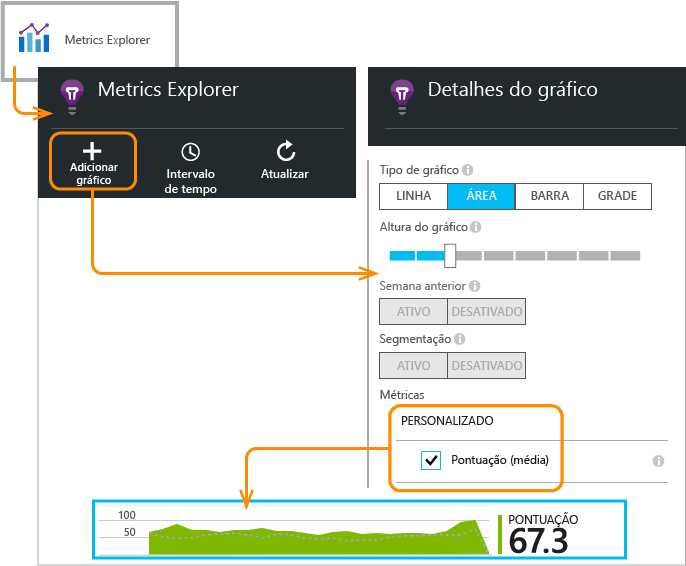

<properties 
	pageTitle="API do Application Insights para métricas e eventos personalizados" 
	description="Insira algumas linhas de código em seu aplicativo da área de trabalho ou de dispositivo, página da Web ou serviço para acompanhar o uso e diagnosticar problemas." 
	services="application-insights"
    documentationCenter="" 
	authors="alancameronwills" 
	manager="douge"/>
 
<tags 
	ms.service="application-insights" 
	ms.workload="tbd" 
	ms.tgt_pltfrm="ibiza" 
	ms.devlang="multiple" 
	ms.topic="article" 
	ms.date="09/23/2015" 
	ms.author="awills"/>

# API do Application Insights para métricas e eventos personalizados 

*O Application Insights está em modo de visualização.*

Insira algumas linhas de código em seu aplicativo para descobrir o que os usuários estão fazendo com ele ou para ajudar a diagnosticar problemas. Você pode enviar telemetria de aplicativos da área de trabalho e de dispositivo, clientes Web e servidores Web.

Os coletores de dados do Application Insights usam essa API para enviar telemetria padrão, como exibições de páginas e relatórios de exceções, mas também pode usá-la para enviar sua própria telemetria personalizada.

## Resumo da API

A API é uniforme em todas as plataformas, exceto por algumas pequenas variações.

Método | Usado para
---|---
[`TrackPageView`](#page-views) | Páginas, telas, folhas ou formulários
[`TrackEvent`](#track-event) | Ações de usuário e outros eventos. Usado para acompanhar o comportamento do usuário ou para monitorar o desempenho.
[`TrackMetric`](#track-metric) | Medições de desempenho, como comprimentos de fila, não relacionadas a eventos específicos
[`TrackException`](#track-exception)|Registrar em log exceções para diagnóstico. Rastrear onde elas ocorrem em relação a outros eventos e examinar os rastreamentos de pilha.
[`TrackRequest`](#track-request)| Registrar em log a frequência e a duração das solicitações do servidor para análise de desempenho.
[`TrackTrace`](#track-trace)|Mensagens de log de diagnóstico. Você também pode capturar logs de terceiros.
[`TrackDependency`](#track-dependency)|Registre em log a duração e a frequência das chamadas para componentes externos dos quais seu aplicativo depende.

Você pode [anexar propriedades e métricas](#properties) à maioria dessas chamadas de telemetria.


## <a name="prep"></a>Antes de começar

Se você ainda não tiver feito essas coisas:

* Adicione o SDK do Application Insights a seu projeto:
 * [Projeto do ASP.NET][greenbrown]
 * [Projeto do Windows][windows]
 * [Projeto Java][java] 
 * [JavaScript em cada página da Web][client]   

* Em seu código de servidor Web ou dispositivo, inclua:

    *C#:* `using Microsoft.ApplicationInsights;`

    *VB:* `Imports Microsoft.ApplicationInsights`

    *Java:* `import com.microsoft.applicationinsights.TelemetryClient;`

## Construir um TelemetryClient

Construa uma instância de TelemetryClient (exceto em JavaScript em páginas da Web):

*C#:*

    private TelemetryClient telemetry = new TelemetryClient();

*VB:*

    Private Dim telemetry As New TelemetryClient

*Java*

    private TelemetryClient telemetry = new TelemetryClient();

TelemetryClient é thread-safe.

É recomendável usar uma instância de `TelemetryClient` para cada módulo do seu aplicativo. Por exemplo, você pode ter um `TelemetryClient` em seu serviço Web para relatar solicitações http de entrada e outro em uma classe de middleware para relatar eventos de lógica de negócios. Você pode definir propriedades como `TelemetryClient.Context.User.Id` para rastrear usuários e sessões ou `TelemetryClient.Context.Device.Id` para identificar o computador. Essas informações são anexadas a todos os eventos enviados pela instância.


## Acompanhar evento

No Application Insights, um *evento personalizado* é um ponto de dados que você pode exibir no [Metrics Explorer][metrics] como uma contagem agregada e também como ocorrências individuais na [Pesquisa de Diagnóstico][diagnostic]. (Ele não está relacionado ao MVC ou a outros “eventos” de estrutura.)

Insira chamadas TrackEvent em seu código para contar com que frequência os usuários escolhem um determinado recurso e com que frequência eles atingem metas específicas, ou talvez cometam tipos de erros específicos.

Por exemplo, em um aplicativo de jogo, envie um evento sempre que um usuário ganhar o jogo:

*JavaScript*

    appInsights.trackEvent("WinGame");

*C#*
    
    telemetry.TrackEvent("WinGame");

*VB*


    telemetry.TrackEvent("WinGame")

*Java*

    telemetry.trackEvent("WinGame");

Aqui, “WinGame” é o nome que aparece no portal do Application Insights. Clique no bloco Eventos Personalizados na folha de visão geral:


O gráfico é agrupado pelo nome do Evento para que você possa ver as contribuições relativas dos eventos mais importantes. Para controlar isso, selecione o gráfico e use o controle de Agrupamento.


Na lista abaixo do gráfico, selecione um nome de evento. Clique para ver ocorrências individuais do evento.


Clique em qualquer ocorrência para ver mais detalhes.

## <a name="properties"></a>Filtrar, pesquisar e segmentar seus dados com propriedades

Você pode anexar propriedades e medidas para seus eventos (e também para métricas, exibições de página e outros dados de telemetria).

**Propriedades** são valores de cadeia de caracteres que você pode usar para filtrar a telemetria nos relatórios de uso. Por exemplo, se o aplicativo fornecer vários jogos, você vai querer anexar o nome do jogo para cada evento, de modo que você possa ver que jogos são mais populares.

Há um limite de cerca de 1 k para o tamanho da cadeia de caracteres. (Se você deseja enviar grandes quantidades de dados, use o parâmetro de mensagem de [TrackTrace](#track-trace).)

**Métricas** são valores numéricos que podem ser apresentados graficamente. Por exemplo, convém verificar se há um aumento gradual nas pontuações que seus jogadores atingem. Os gráficos podem ser segmentados pelas propriedades enviadas com o evento para que você possa obter gráficos separado ou empilhados para jogos diferentes.

Os valores das métricas devem ser >= 0 para serem exibidos corretamente.


Há alguns [limites no número de propriedades, valores de propriedade e métricas](#limits) que você pode usar.


*JavaScript*

    appInsights.trackEvent
      ("WinGame",
         // String properties:
         {Game: currentGame.name, Difficulty: currentGame.difficulty},
         // Numeric metrics:
         {Score: currentGame.score, Opponents: currentGame.opponentCount}
         );

    appInsights.trackPageView
        ("page name", "http://fabrikam.com/pageurl.html",
          // String properties:
         {Game: currentGame.name, Difficulty: currentGame.difficulty},
         // Numeric metrics:
         {Score: currentGame.score, Opponents: currentGame.opponentCount}
         );
          

*C#*

    // Set up some properties and metrics:
    var properties = new Dictionary <string, string> 
       {{"game", currentGame.Name}, {"difficulty", currentGame.Difficulty}};
    var metrics = new Dictionary <string, double>
       {{"Score", currentGame.Score}, {"Opponents", currentGame.OpponentCount}};

    // Send the event:
    telemetry.TrackEvent("WinGame", properties, metrics);


*VB*

    ' Set up some properties:
    Dim properties = New Dictionary (Of String, String)
    properties.Add("game", currentGame.Name)
    properties.Add("difficulty", currentGame.Difficulty)

    Dim metrics = New Dictionary (Of String, Double)
    metrics.Add("Score", currentGame.Score)
    metrics.Add("Opponents", currentGame.OpponentCount)

    ' Send the event:
    telemetry.TrackEvent("WinGame", properties, metrics)


*Java*
    
    Map<String, String> properties = new HashMap<String, String>();
    properties.put("game", currentGame.getName());
    properties.put("difficulty", currentGame.getDifficulty());
    
    Map<String, Double> metrics = new HashMap<String, Double>();
    metrics.put("Score", currentGame.getScore());
    metrics.put("Opponents", currentGame.getOpponentCount());
    
    telemetry.trackEvent("WinGame", properties, metrics);


> [AZURE.NOTE]Tome cuidado para não registrar informações que permitam identificação pessoal nas propriedades.

**Se você usou métricas**, abra o Gerenciador de Métricas e selecione a métrica no grupo Personalizado:



*Se a sua métrica não aparecer ou se o cabeçalho Personalizado não estiver lá, feche a folha de seleção e tente mais tarde. Às vezes, pode levar uma hora para que as métricas sejam agregadas por meio do pipeline.*

**Se você usou propriedades e métricas**, segmente a métrica pela propriedade:


**Na Pesquisa de Diagnóstico**, você pode exibir as propriedades e as métricas de ocorrências individuais de um evento.


Use o campo Pesquisa para ver as ocorrências de eventos com um valor da propriedade específico.


[Saiba mais sobre expressões de pesquisa][diagnostic]

#### Maneira alternativa de definir propriedades e métricas

Se for mais conveniente, você poderá coletar os parâmetros de um evento em um objeto separado:

    var event = new EventTelemetry();

    event.Name = "WinGame";
    event.Metrics["processingTime"] = stopwatch.Elapsed.TotalMilliseconds;
    event.Properties["game"] = currentGame.Name;
    event.Properties["difficulty"] = currentGame.Difficulty;
    event.Metrics["Score"] = currentGame.Score;
    event.Metrics["Opponents"] = currentGame.Opponents.Length;

    telemetry.TrackEvent(event);


#### <a name="timed"></a> Eventos de tempo

Às vezes, você deseja registrar quanto tempo leva para realizar alguma ação. Por exemplo, talvez você queira saber quanto tempo os usuários levam para considerar as opções de um jogo. Este é um exemplo útil de usos do parâmetro de medição.


*C#*

    var stopwatch = System.Diagnostics.Stopwatch.StartNew();

    // ... perform the timed action ...

    stopwatch.Stop();

    var metrics = new Dictionary <string, double>
       {{"processingTime", stopwatch.Elapsed.TotalMilliseconds}};

    // Set up some properties:
    var properties = new Dictionary <string, string> 
       {{"signalSource", currentSignalSource.Name}};

    // Send the event:
    telemetry.TrackEvent("SignalProcessed", properties, metrics);


## Acompanhar Métrica

Use TrackMetric para enviar métricas que não estão associadas a eventos específicos. Por exemplo, você pode monitorar um comprimento de fila em intervalos regulares.

As métricas são exibidas como gráficos estatísticos no gerenciador de métricas, mas, diferentemente dos eventos, você não pode pesquisar ocorrências individuais na pesquisa de diagnóstico.

Os valores das métricas devem ser >= 0 para serem exibidos corretamente.


*JavaScript*

    appInsights.trackMetric("Queue", queue.Length);

*C#*

    telemetry.TrackMetric("Queue", queue.Length);

*VB*

    telemetry.TrackMetric("Queue", queue.Length)

*Java*

    telemetry.trackMetric("Queue", queue.Length);

De fato, você pode fazer isso em um thread em segundo plano:

*C#*

    private void Run() {
     var appInsights = new TelemetryClient();
     while (true) {
      Thread.Sleep(60000);
      appInsights.TrackMetric("Queue", queue.Length);
     }
    }


Para ver os resultados, abra o Metrics Explorer e adicione um novo gráfico. Defina-o para exibir sua métrica.


Há alguns [limites no número de métricas](#limits) você pode usar.

## Visualizações de página

Em um dispositivo ou aplicativo de página da Web, a telemetria de exibição de páginas é enviada por padrão quando cada tela ou página é carregada. Porém, você pode alterar isso para acompanhar as exibições de páginas em momentos diferentes ou adicionais. Por exemplo, em um aplicativo que exibe guias ou folhas, talvez você queira acompanhar uma "página" sempre que o usuário abrir uma nova folha.


Dados de usuário e de sessão são enviados como propriedades, juntamente com exibições de páginas, assim, os gráficos de usuário e sessão são ativados quando há telemetria de exibições de páginas.

#### Exibições de páginas personalizadas

*JavaScript*

    appInsights.trackPageView("tab1");

*C#*

    telemetry.TrackPageView("GameReviewPage");

*VB*

    telemetry.TrackPageView("GameReviewPage")


Se você tiver várias guias contidas em diferentes páginas HTML, você pode especificar a URL também:

    appInsights.trackPageView("tab1", "http://fabrikam.com/page1.htm");


## Acompanhar solicitação

Usada pelo SDK do servidor para registrar as solicitações de HTTP.

Você mesmo também poderá chamá-la se desejar simular solicitações em um contexto em que você não tenha o módulo de serviço Web em execução.

*C#*

    // At start of processing this request:

    // Operation Id and Name are attached to all telemetry and help you identify
    // telemetry associated with one request:
    telemetry.Context.Operation.Id = Guid.NewGuid().ToString();
    telemetry.Context.Operation.Name = requestName;
    
    var stopwatch = System.Diagnostics.Stopwatch.StartNew();

    // ... process the request ...

    stopwatch.Stop();
    telemetryClient.TrackRequest(requestName, DateTime.Now,
       stopwatch.Elapsed, 
       "200", true);  // Response code, success


## Acompanhar exceção

Envie exceções ao Application Insights: para [contá-las][metrics], como uma indicação da frequência de um problema; e para [examinar ocorrências individuais][diagnostic]. Os relatórios incluem os rastreamentos de pilha.

*C#*

    try
    {
        ...
    }
    catch (Exception ex)
    {
       telemetry.TrackException(ex);
    }

*JavaScript*

    try
    {
       ...
    }
    catch (ex)
    {
       appInsights.trackException(ex);
    }

Os SDKs capturam muitas exceções automaticamente; portanto, você não precisa chamar sempre explicitamente o TrackException.

* ASP.NET: [escrever código para capturar exceções](app-insights-asp-net-exceptions.md)
* J2EE: [as exceções são capturadas automaticamente](app-insights-java-get-started.md#exceptions-and-request-failures)
* Aplicativos do Windows: [as falhas são detectadas automaticamente](app-insights-windows-crashes.md)
* JavaScript: detectado automaticamente. Se você quiser desabilitar a coleta automática, adicione uma linha no trecho de código que você inserir em suas páginas da Web:

    ```
    ({
      instrumentationKey: "your key"
      , disableExceptionTracking: true
    })
    ```


## Acompanhar rastreamento 

Use-o para ajudar a diagnosticar problemas enviando uma 'trilha de navegação estrutural' ao Application Insights. Você pode enviar partes de dados de diagnóstico e inspecioná-los na [Pesquisa de diagnóstico][diagnostic].

 

[Adaptadores de log][trace] usam essa API para enviar logs de terceiros ao portal.


*C#*

    telemetry.TrackTrace(message, SeverityLevel.Warning, properties);

O limite de tamanho para `message` é muito maior do que o limite para propriedades. Você pode pesquisar no conteúdo da mensagem, mas (diferentemente de valores de propriedade) não é possível filtrar nele.

## Rastrear dependência

Use essa chamada para acompanhar os tempos de resposta e taxas de êxito de chamadas para uma parte externa do código. Os resultados são exibidos nos gráficos de dependência no portal.

```C#

            var success = false;
            var startTime = DateTime.UtcNow;
            var timer = System.Diagnostics.Stopwatch.StartNew();
            try
            {
                success = dependency.Call();
            }
            finally
            {
                timer.Stop();
                telemetry.TrackDependency("myDependency", "myCall", startTime, timer.Elapsed, success);
            }
```

Lembre-se de que os SDKs de servidor incluem um [módulo de dependência](app-insights-dependencies.md) que descobre e rastreia automaticamente determinadas chamadas de dependência; por exemplo, para bancos de dados e APIs REST. Você precisa instalar um agente em seu servidor para fazer com que o módulo funcione. Se você desejar controlar chamadas que não são detectadas pelo acompanhamento automatizado, ou se você não quiser instalar o agente, você usaria essa chamada.

Para desativar o módulo padrão de rastreamento de dependência, edite [ApplicationInsights.config](app-insights-configuration-with-applicationinsights-config.md) e exclua a referência a `DependencyCollector.DependencyTrackingTelemetryModule`.


## Usuários autenticados

Em um aplicativo Web, os usuários são, por padrão identificados pelo cookie. Um usuário pode ser contado mais de uma vez se acessar o aplicativo de um computador diferente ou um navegador, ou excluir cookies.

Mas se os usuários entram em seu aplicativo, você pode obter uma contagem mais precisa, definindo a ID do usuário autenticado no código do navegador:

*JavaScript*

```JS
    // Called when my app has identified the user.
    function Authenticated(signInId) {
      var validatedId = signInId.replace(/[,;=| ]+/g, "_");
      appInsights.setAuthenticatedUserContext(validatedId);
      ...
    }
```

Em um aplicativo MVC Web ASP.NET, por exemplo:

*Razor*

        @if (Request.IsAuthenticated)
        {
            <script>
                appInsights.setAuthenticatedUserContext("@User.Identity.Name".replace(/[,;=| ]+/g, "_"));
            </script>
        }

Não é necessário usar o nome do usuário real de conexão. Só deve ser uma ID exclusiva para esse usuário. Não deve incluir espaços ou os caracteres `,;=|`.

A ID de usuário também é definida em um cookie de sessão e enviada ao servidor. Se o servidor SDK estiver instalado, a ID de usuário autenticado será enviada como parte das propriedades de contexto de telemetria do cliente e servidor, para que você possa filtrar e pesquisar nela.

Se seu aplicativo agrupa os usuários em contas, você também pode passar um identificador para a conta (com as mesmas restrições de caracteres).


      appInsights.setAuthenticatedUserContext(validatedId, accountId);

No [Metrics Explorer](app-insights-metrics-explorer.md), você pode criar um gráfico que contabiliza **Usuários Autenticados** e **Contas de usuário**.

Você também pode [pesquisar][diagnostic] por pontos de dados do cliente com contas e nomes de usuário específicos.


## <a name="defaults"></a>Definir padrões para telemetria personalizada selecionada

Se quiser definir valores de propriedade padrão para alguns dos eventos personalizados que escrever, você poderá defini-los em um TelemetryClient. Eles são anexados a cada item de telemetria enviado do cliente.

*C#*

    using Microsoft.ApplicationInsights.DataContracts;

    var gameTelemetry = new TelemetryClient();
    gameTelemetry.Context.Properties["Game"] = currentGame.Name;
    // Now all telemetry will automatically be sent with the context property:
    gameTelemetry.TrackEvent("WinGame");
    
*VB*

    Dim gameTelemetry = New TelemetryClient()
    gameTelemetry.Context.Properties("Game") = currentGame.Name
    ' Now all telemetry will automatically be sent with the context property:
    gameTelemetry.TrackEvent("WinGame")

*Java*

    import com.microsoft.applicationinsights.TelemetryClient;
    import com.microsoft.applicationinsights.TelemetryContext;
    ...


    TelemetryClient gameTelemetry = new TelemetryClient();
    TelemetryContext context = gameTelemetry.getContext();
    context.getProperties().put("Game", currentGame.Name);
    
    gameTelemetry.TrackEvent("WinGame");


    
Chamadas de telemetria individuais podem substituir os valores padrão em seus dicionários de propriedades.

**Para clientes Web JavaScript**, [use inicializadores de telemetria JavaScript](#js-initializer).


## <a name="ikey"></a> Definir a chave de instrumentação para telemetria personalizada selecionada

*C#*
    
    var telemetry = new TelemetryClient();
    telemetry.Context.InstrumentationKey = "---my key---";
    // ...


## Inicializadores de telemetria

Use inicializadores de telemetria para definir propriedades globais que são enviadas com todas as telemetrias e para substituir o comportamento selecionado dos módulos de telemetria padrão.

Por exemplo, o Application Insights para o pacote da Web coleta a telemetria sobre solicitações HTTP. Por padrão, ele sinaliza como qualquer solicitação com um código de resposta de falha > = 400. Mas se você desejar tratar 400 como sucesso, você pode fornecer um inicializador de telemetria que define a propriedade de sucesso.

Se você fornecer um inicializador de telemetria, ele é chamado sempre que qualquer um dos métodos Track*() for chamado. Isso inclui métodos chamados pelos módulos de telemetria padrão. Por convenção, esses módulos não definem qualquer propriedade que já foi definida por um inicializador.

**Definir seu inicializador**

*C#*

```C#

    using System;
    using Microsoft.ApplicationInsights.Channel;
    using Microsoft.ApplicationInsights.DataContracts;
    using Microsoft.ApplicationInsights.Extensibility;

    namespace MvcWebRole.Telemetry
    {
      /*
       * Custom TelemetryInitializer that overrides the default SDK 
       * behavior of treating response codes >= 400 as failed requests
       * 
       */
      public class MyTelemetryInitializer : ITelemetryInitializer
      {
        public void Initialize(ITelemetry telemetry)
        {
            var requestTelemetry = telemetry as RequestTelemetry;
            // Is this a TrackRequest() ?
            if (requestTelemetry == null) return;
            int code;
            bool parsed = Int32.TryParse(requestTelemetry.ResponseCode, out code);
            if (!parsed) return;
            if (code >= 400 && code < 500)
            {
                // If we set the Success property, the SDK won't change it:
                requestTelemetry.Success = true;
                // Allow us to filter these requests in the portal:
                requestTelemetry.Context.Properties["Overridden400s"] = "true";
            }
            // else leave the SDK to set the Success property      
        }
      }
    }
```

**Carregue seu inicializador**

Em ApplicationInsights.config:

    <ApplicationInsights>
      <TelemetryInitializers>
        <!-- Fully qualified type name, assembly name: -->
        <Add Type="MvcWebRole.Telemetry.MyTelemetryInitializer, MvcWebRole"/> 
        ...
      </TelemetryInitializers>
    </ApplicationInsights>

*Como alternativa,* você pode instanciar o inicializador no código, por exemplo em Global.aspx.cs:


```C#
    protected void Application_Start()
    {
        // ...
        TelemetryConfiguration.Active.TelemetryInitializers
        .Add(new MyTelemetryInitializer());
    }
```


[Ver mais deste exemplo.](https://github.com/Microsoft/ApplicationInsights-Home/tree/master/Samples/AzureEmailService/MvcWebRole)

<a name="js-initializer"></a>
### Inicializadores de telemetria JavaScript

*JavaScript*

Insira um inicializador de telemetria logo após o código de inicialização que você obteve do portal:

```JS

    <script type="text/javascript">
        // ... initialization code
        ...({
            instrumentationKey: "your instrumentation key"
        });
        window.appInsights = appInsights;


        // Adding telemetry initializer.
        // This is called whenever a new telemetry item
        // is created.

        appInsights.queue.push(function () {
            appInsights.context.addTelemetryInitializer(function (envelope) {
                var telemetryItem = envelope.data.baseData;

                // To check the telemetry item’s type - for example PageView:
                if (envelope.name == Microsoft.ApplicationInsights.Telemetry.PageView.envelopeType) {
                    // this statement removes url from all page view documents
                    telemetryItem.url = "URL CENSORED";
                }

                // To set custom properties:
                telemetryItem.properties = telemetryItem.properties || {};
                telemetryItem.properties["globalProperty"] = "boo";

                // To set custom metrics:
                telemetryItem.measurements = telemetryItem.measurements || {};
                telemetryItem.measurements["globalMetric"] = 100;
            });
        });

        // End of inserted code.

        appInsights.trackPageView();
    </script>
```

Para obter um resumo das propriedades não personalizadas disponíveis em telemetryItem, consulte [modelo de dados](app-insights-export-data-model.md/#lttelemetrytypegt).

Você pode adicionar quantos inicializadores desejar.

## <a name="dynamic-ikey"></a> Chave de instrumentação dinâmica

Para evitar a mistura de telemetria dos ambientes de desenvolvimento, teste e produção, você pode [criar recursos separados do Application Insights][create] e alterar suas chaves dependendo do ambiente.

Em vez de obter a chave de instrumentação do arquivo de configuração, você pode defini-la em seu código. Defina a chave em um método de inicialização como global.aspx.cs em um serviço ASP.NET:

*C#*

    protected void Application_Start()
    {
      Microsoft.ApplicationInsights.Extensibility.
        TelemetryConfiguration.Active.InstrumentationKey = 
          // - for example -
          WebConfigurationManager.Settings["ikey"];
      ...

*JavaScript*

    appInsights.config.instrumentationKey = myKey; 


Em páginas da web, convém defini-lo com base no estado do servidor Web, em vez de codificá-lo literalmente no script. Por exemplo, em uma página da Web gerada em um aplicativo ASP.NET:

*JavaScript no Razor*

    <script type="text/javascript">
    // Standard Application Insights web page script:
    var appInsights = window.appInsights || function(config){ ...
    // Modify this part:
    }({instrumentationKey:  
      // Generate from server property:
      @Microsoft.ApplicationInsights.Extensibility.
         TelemetryConfiguration.Active.InstrumentationKey"
    }) // ...


## Liberando dados

Normalmente o SDK envia dados em momentos escolhidos para minimizar o impacto sobre o usuário. No entanto, em alguns casos você talvez queira liberar o buffer - por exemplo, se você estiver usando o SDK em um aplicativo que é desligado.

*C#*

    telemetry.Flush();

    // Allow some time for flushing before shutdown.
    System.Threading.Thread.Sleep(1000);

Observe que a função é assíncrono para canais de memória, mas síncrona se você optar por usar o [canal persistente](app-insights-windows-desktop.md#persistence-channel).


## Desabilitar a telemetria padrão

Você pode [desabilitar partes selecionadas da telemetria padrão][config] editando `ApplicationInsights.config`. Você poderá fazer isso, por exemplo, se quiser enviar seus próprios dados de TrackRequest.

[Saiba mais][config].


## <a name="debug"></a>Modo de desenvolvedor

Durante a depuração, é útil ter sua telemetria emitida pelo pipeline para que você possa ver os resultados imediatamente. Você também obtém mensagens adicionais que ajudarão a rastrear problemas com a telemetria. Desative-a na produção, pois isso pode tornar seu aplicativo mais lento.


*C#*
    
    TelemetryConfiguration.Active.TelemetryChannel.DeveloperMode = true;

*VB*

    TelemetryConfiguration.Active.TelemetryChannel.DeveloperMode = True

## TelemetryContext

TelemetryClient tem uma propriedade de Contexto, que contém um número de valores que serão enviadas junto com todos os dados de telemetria. Normalmente, eles são definidos pelos módulos padrão de telemetria, mas você pode também defini-las por conta própria. Por exemplo:

    telemetryClient.Context.Operation.Name = “MyOperationName”;

Se você definir qualquer um desses valores por conta própria, considere remover a linha relevante de [Applicationinsights.config][config], de modo que os valores e os valores padrão não fiquem confusos.

* **Componente** identifica o aplicativo e sua versão
* Dados do **Dispositivo** sobre o dispositivo no qual o aplicativo está em execução (em aplicativos da web, este é o dispositivo de cliente ou servidor do qual a telemetria é enviada)
* **InstrumentationKey** identifica o recurso Application Insights no Azure onde a telemetria aparecerá. Geralmente retirados do Applicationinsights.config
* **Local** identifica a localização geográfica do dispositivo.
* **Operação** em aplicativos da web, a solicitação HTTP atual. Em outros tipos de aplicativos, você pode definir isso para agrupar eventos juntos.
 * **ID**: um valor gerado que correlaciona eventos diferentes, para que quando você inspecionar qualquer evento no diagnóstico de pesquisa, você pode localizar "itens relacionados"
 * **Name**: um identificador, geralmente a URL da solicitação HTTP. 
 * **SyntheticSource**: se não for nula ou vazia, essa cadeia de caracteres indica que a origem da solicitação foi identificada como um teste de robô ou web. Por padrão, elas são excluídas de cálculos no Metrics Explorer.
* As **Propriedades** que são enviadas com todos os dados de telemetria. Pode ser substituído nas chamadas individuais de Track*.
* **Sessão** identifica a sessão do usuário. A ID é definida como um valor gerado, que é alterado quando o usuário não foi ativo por um tempo.
* **User** Informações do usuário. 


## <a name="default-properties"></a>Inicializadores de contexto - definir propriedades padrão para toda a telemetria

Você pode configurar um inicializador universal para que todos os novos clientes de telemetria usem automaticamente seu contexto. Isso inclui a telemetria padrão enviada pelos módulos de telemetria específicos de plataforma, como rastreamento de solicitações de servidor Web.

Um uso típico é para identificar a telemetria provenientes de diferentes versões ou componentes de seu aplicativo. No portal, você pode filtrar ou agrupar resultados de acordo com a propriedade "Versão do aplicativo".

Em geral, [é recomendável usar inicializadores de telemetria em vez de inicializadores de contexto](http://apmtips.com/blog/2015/06/09/do-not-use-context-initializers/).

#### Definir um inicializador de contexto


*C#*

```C#

    using System;
    using Microsoft.ApplicationInsights.Channel;
    using Microsoft.ApplicationInsights.DataContracts;
    using Microsoft.ApplicationInsights.Extensibility;

    namespace MyNamespace
    {
      // Context initializer class
      public class MyContextInitializer : IContextInitializer
      {
        public void Initialize (TelemetryContext context)
        {
            if (context == null) return;

            context.Component.Version = "v2.1";
        }
      }
    }
```

*Java*

```Java

    import com.microsoft.applicationinsights.extensibility.ContextInitializer;
    import com.microsoft.applicationinsights.telemetry.TelemetryContext;

    public class MyContextInitializer implements ContextInitializer {
      @Override
      public void initialize(TelemetryContext context) {
        context.Component.Version = "2.1";
      }
    }
```

#### Carregar seu inicializador de contexto

Em ApplicationInsights.config:

    <ApplicationInsights>
      <ContextInitializers>
        <!-- Fully qualified type name, assembly name: -->
        <Add Type="MyNamespace.MyContextInitializer, MyAssemblyName"/> 
        ...
      </ContextInitializers>
    </ApplicationInsights>

*Como alternativa,* você pode instanciar o inicializador no código:

*C#*

```C#

    protected void Application_Start()
    {
        // ...
        TelemetryConfiguration.Active.ContextInitializers
        .Add(new MyContextInitializer());
    }
```

*Java*

```Java

    // load the context initializer
    TelemetryConfiguration.getActive().getContextInitializers().add(new MyContextInitializer());
```


## Limites

Há alguns limites no número de métricas você pode usar.

1. Até 500 pontos de dados de telemetria por segundo por chave de instrumentação (ou seja, por aplicativo). Isso inclui a telemetria padrão enviada pelas métricas dos módulos e eventos personalizados, SDK e outra telemetria enviada pelo seu código.
1.	Máximo de 200 nomes exclusivos de métrica e 200 nomes de propriedade exclusivo para seu aplicativo. As métricas incluem o envio de dados por meio de TrackMetric, bem como as medidas em outros tipos de dados como eventos. Os nomes de propriedades e métricas são globais por chave de instrumentação, não no escopo do tipo de dados.
2.	As propriedades podem ser usadas para filtragem e agrupamento, somente enquanto tiverem menos de 100 valores exclusivos para cada propriedade. Depois que os valores exclusivos excederem 100, a propriedade ainda pode ser usada para pesquisa e filtragem, mas não para filtros.
3.	As propriedades padrão como Solicitar Nome e URL da Página estão limitadas a 1000 valores exclusivos por semana. Depois de 1000 valores exclusivos, os valores adicionais são marcados como "Outros valores". O valor original ainda pode ser usado para filtragem e pesquisa de texto completo.

* *P: Por quanto tempo são mantidos os dados?*

    Consulte [Privacidade e retenção de dados][data].


## Documentos de Referência

* [Referência do ASP.NET](https://msdn.microsoft.com/library/dn817570.aspx)
* [Referência do Java](http://dl.windowsazure.com/applicationinsights/javadoc/)
* [Referência do JavaScript](https://github.com/Microsoft/ApplicationInsights-JS/blob/master/API-reference.md)
* [SDK do Android](https://github.com/Microsoft/ApplicationInsights-Android)
* [SDK do iOS](https://github.com/Microsoft/ApplicationInsights-iOS)


## Código do SDK

* [SDK de Núcleo do ASP.NET](https://github.com/Microsoft/ApplicationInsights-dotnet)
* [ASP.NET 5](https://github.com/Microsoft/ApplicationInsights-aspnet5)
* [SDK do Android](https://github.com/Microsoft/ApplicationInsights-Android)
* [Java SDK](https://github.com/Microsoft/ApplicationInsights-Java)
* [SDK do JavaScript](https://github.com/Microsoft/ApplicationInsights-JS)
* [SDK do iOS](https://github.com/Microsoft/ApplicationInsights-iOS)
* [Todas as plataformas](https://github.com/Microsoft?utf8=%E2%9C%93&query=applicationInsights)

## Perguntas

* *Que exceções podem acionar chamadas Track\_()?*
    
    Nenhum. Você não precisa encapsulá-las em cláusulas try-catch. Se o SDK encontrar problemas, ele registrará em log mensagens que você verá na saída do console de depuração, e, se as mensagens forem exibidas, na pesquisa de diagnóstico.


* *P: Existe uma API REST?*

    Sim, mas nós ainda não a publicamos.

## <a name="next"></a>Próximas etapas


[Pesquisar eventos e logs][diagnostic]

[Exemplos e explicações passo a passo](app-insights-code-samples.md)

[Solucionar problemas][qna]


<!--Link references-->

[client]: app-insights-javascript.md
[config]: app-insights-configuration-with-applicationinsights-config.md
[create]: app-insights-create-new-resource.md
[data]: app-insights-data-retention-privacy.md
[diagnostic]: app-insights-diagnostic-search.md
[exceptions]: app-insights-asp-net-exceptions.md
[greenbrown]: app-insights-start-monitoring-app-health-usage.md
[java]: app-insights-java-get-started.md
[metrics]: app-insights-metrics-explorer.md
[qna]: app-insights-troubleshoot-faq.md
[trace]: app-insights-search-diagnostic-logs.md
[windows]: app-insights-windows-get-started.md

 

<!---HONumber=Oct15_HO1-->