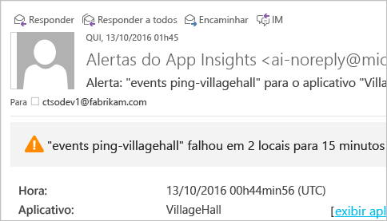
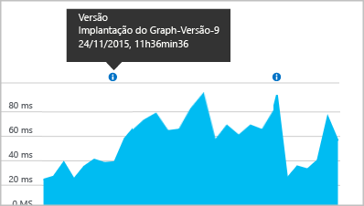

# <a name="set-up-application-insights-for-aspnet"></a>Configurar o Application Insights para ASP.NET
O [Application Insights do Visual Studio](app-insights-overview.md) monitora seus aplicativos em tempo real para ajudá-lo a [detectar e diagnosticar problemas de desempenho e exceções](app-insights-detect-triage-diagnose.md) e [descobrir como seu aplicativo é usado](app-insights-overview-usage.md).  Ele funciona para aplicativos hospedados em seus próprios servidores IIS locais ou em VMs de nuvem, bem como aplicativos Web do Azure.

## <a name="before-you-start"></a>Antes de começar
Você precisa de:

* Atualização 3 ou mais recente do Visual Studio 2013. Mais tarde é melhor.
* Uma assinatura do [Microsoft Azure](http://azure.com). Se sua equipe ou organização tem uma assinatura do Azure, o proprietário pode adicioná-lo a ela, usando sua [Conta da Microsoft](http://live.com). 

Há artigos alternativos para conferir se você está interessado em:

* [Instrumentar um aplicativo Web em tempo de execução](app-insights-monitor-performance-live-website-now.md)
* [Serviços de Nuvem do Azure](app-insights-cloudservices.md)

## <a name="a-nameidea-1-add-application-insights-sdk"></a><a name="ide"></a> 1. Adicionar o SDK do Application Insights
### <a name="if-its-a-new-project"></a>Se é um novo projeto...
Verifique se o Application Insights está selecionado quando você criar um novo projeto no Visual Studio. 


### <a name="-or-if-its-an-existing-project"></a>...ou então, se é um projeto existente
Clique com o botão direito do mouse no projeto no Gerenciador de Soluções e escolha **Adicionar o Application Insights Telemetry** ou **Configurar o Application Insights**.


* Projeto do ASP.NET Core? - [Siga estas instruções para corrigir algumas linhas de código](https://github.com/Microsoft/ApplicationInsights-aspnetcore/wiki/Getting-Started#add-application-insights-instrumentation-code-to-startupcs). 

## <a name="a-nameruna-2-run-your-app"></a><a name="run"></a> 2. Executar seu aplicativo
Execute seu aplicativo com F5 e experimente: abra páginas diferentes para gerar alguma telemetria.

No Visual Studio, você vê uma contagem dos eventos que foram registrados. 


## <a name="3-see-your-telemetry"></a>3. Confira sua telemetria...
### <a name="-in-visual-studio"></a>... no Visual Studio
Abra a janela do Application Insights no Visual Studio: clique no botão Application Insights ou clique em seu projeto no Gerenciador de Soluções:


Essa exibição mostra a telemetria gerada no lado do servidor do aplicativo. Experimente os filtros e clique em qualquer evento para ver mais detalhes.

[Saiba mais sobre as ferramentas do Application Insights no Visual Studio](app-insights-visual-studio.md).

<a name="monitor"></a> 

### <a name="-in-the-portal"></a>...no portal
A menos que escolha *Instalar o SDK,* você também pode ver a telemetria no portal da Web do Application Insights. 

O portal tem mais gráficos, ferramentas analíticas e painéis do que o Visual Studio. 

Abra o recurso Application Insights no [Portal do Azure](https://portal.azure.com/).


O portal é aberto em uma exibição da telemetria do aplicativo: 

* A primeira telemetria aparece no [Fluxo de Métricas Ativo](app-insights-metrics-explorer.md#live-metrics-stream).
* Eventos individuais são mostrados em **Pesquisar** (1). Os dados podem levar alguns minutos para serem mostrados. Clique em qualquer evento para ver suas propriedades. 
* As métricas agregadas são exibidas nos gráficos (2). Pode levar alguns minutos para que os dados sejam exibidos aqui. Clique em qualquer gráfico para abrir uma folha com mais detalhes.

[Saiba mais sobre como usar o Application Insights no portal do Azure](app-insights-dashboards.md).

## <a name="4-publish-your-app"></a>4. Publicar seu aplicativo
Publica seu aplicativo no servidor IIS ou no Azure. Observe o [Fluxo de Métricas Ativo](app-insights-metrics-explorer.md#live-metrics-stream) para verificar se tudo está funcionando corretamente.

Você verá a telemetria se acumulando no portal do Application Insights, em que você pode monitorar as métricas, pesquisar a telemetria e configurar [painéis](app-insights-dashboards.md). Você também pode usar a poderosa [Linguagem de consulta de análise](app-insights-analytics.md) para analisar o uso e o desempenho ou encontrar eventos específicos. 

Você também pode continuar a analisar a telemetria no [Visual Studio](app-insights-visual-studio.md) com ferramentas como pesquisa de diagnóstico e [Trends](app-insights-visual-studio-trends.md).

> [!NOTE]
> Se seu aplicativo enviar telemetria suficiente para se aproximar das [limitações](app-insights-pricing.md#limits-summary), a [amostragem](app-insights-sampling.md) automática será ativada. A amostragem reduz a quantidade de telemetria enviada do seu aplicativo, preservando dados correlacionados para fins de diagnóstico.
> 
> 

## <a name="a-namelanda-what-did-add-application-insights-do"></a><a name="land"></a> Qual a função de "Adicionar o Application Insights"?
O Application Insights envia telemetria do aplicativo para o portal do Application Insights (que é hospedado no Microsoft Azure):


O comando fazia três coisas:

1. Adicionar o pacote NuGet do SDK da Web do Application Insights ao seu projeto. Para vê-lo no Visual Studio, clique com o botão direito em seu projeto e escolha Gerenciar pacotes NuGet.
2. Criar um recurso do Application Insights no [portal do Azure](https://portal.azure.com/). É onde você verá seus dados. Ele recupera a *chave de instrumentação* , que identifica o recurso.
3. Insere a chave de instrumentação em `ApplicationInsights.config`, de modo que o SDK possa enviar telemetria ao portal.

Se desejar, você poderá executar essas etapas manualmente para [ASP.NET 4](app-insights-windows-services.md) ou [ASP.NET Core](https://github.com/Microsoft/ApplicationInsights-aspnetcore/wiki/Getting-Started).

### <a name="to-upgrade-to-future-sdk-versions"></a>Como atualizar para versões futuras do SDK
Para atualizar para uma [nova versão do SDK](https://github.com/Microsoft/ApplicationInsights-dotnet-server/releases), abra o Gerenciador de pacotes do NuGet e filtre os pacotes instalados. Selecione Microsoft.ApplicationInsights.Web e escolha Atualizar.

Se você fez todas as personalizações no ApplicationInsights.config, salve uma cópia antes de atualizar e, depois, mescle suas alterações à nova versão.

## <a name="add-more-telemetry"></a>Adicionar mais telemetria
### <a name="web-pages-and-singlepage-apps"></a>Páginas da Web e aplicativos de página única
1. [Adicione o trecho de JavaScript](app-insights-javascript.md) a páginas da Web para destacar as folhas de navegador e de uso com dados sobre exibições de página, tempos de carregamento, exceções do navegador, desempenho de chamada AJAX, contagens de usuário e de sessão.
2. [Eventos personalizados de código](app-insights-api-custom-events-metrics.md) para contagem, tempo ou medição de ações do usuário.

### <a name="dependencies-exceptions-and-performance-counters"></a>Dependências, exceções e contadores de desempenho
[Instale o Monitor de Status](app-insights-monitor-performance-live-website-now.md) em cada uma de suas máquinas de servidor para obter telemetria adicional sobre seu aplicativo. Isto é o que você obtém:

* [Contadores de desempenho](app-insights-performance-counters.md) - 
  CPU, memória, disco e outros contadores de desempenho relacionados ao seu aplicativo. 
* [Exceções](app-insights-asp-net-exceptions.md) - telemetria mais detalhada para algumas exceções.
* [Dependências](app-insights-asp-net-dependencies.md) - chamadas para serviços de API REST ou SQL. Descubra se respostas lentas por componentes externos estão causando problemas de desempenho em seu aplicativo. (Se o aplicativo é executado no .NET 4.6, não é necessário o Monitor de Status para obter essa telemetria.)

### <a name="diagnostic-code"></a>Código de diagnóstico
Está com um problema? Se você deseja inserir o código no aplicativo para ajudar a diagnosticá-lo, há várias opções:

* [Capturar rastreamentos de log](app-insights-asp-net-trace-logs.md): se você já está usando Log4N, NLog ou System.Diagnostics.Trace para registrar eventos de rastreamento, a saída pode ser enviada ao Application Insights para que você possa correlacioná-la com solicitações, pesquisá-la e analisá-la. 
* [Métricas e eventos personalizados](app-insights-api-custom-events-metrics.md): use trackevent() e trackmetric() no servidor ou no código da página da Web.
* [Telemetria de marca com propriedades adicionais](app-insights-api-filtering-sampling.md#add-properties)

Use [Pesquisar](app-insights-diagnostic-search.md) para localizar e correlacionar eventos específicos e [Análise](app-insights-analytics.md) para executar consultas mais poderosas.

## <a name="alerts"></a>Alertas
Seja o primeiro a saber se o aplicativo tem problemas. (Não aguarde até que os usuários o informem!) 

* [Criar testes da Web](app-insights-monitor-web-app-availability.md) para certificar-se de que seu site está visível na Web.
* [Diagnóstico proativo](app-insights-proactive-diagnostics.md) executar automaticamente (se o aplicativo tem uma certa quantidade mínima de tráfego). Você não precisa fazer nada para configurá-los. Eles informam se o aplicativo tem uma taxa incomum de solicitações com falha.
* [Definir alertas de métrica](app-insights-alerts.md) para avisar se uma métrica ultrapassar um limite. Você pode defini-los em métricas personalizadas que você codifica em seu aplicativo.

Por padrão, as notificações de alerta são enviadas ao proprietário da assinatura do Azure. 



## <a name="version-and-release-tracking"></a>Versão e controle de versão
### <a name="track-application-version"></a>Rastrear versão do aplicativo
Verifique se `buildinfo.config` foi gerado pelo processo do MSBuild. No arquivo. csproj, adicione:  

```XML

    <PropertyGroup>
      <GenerateBuildInfoConfigFile>true</GenerateBuildInfoConfigFile>    <IncludeServerNameInBuildInfo>true</IncludeServerNameInBuildInfo>
    </PropertyGroup> 
```

Quando ele tem as informações de compilação, o módulo da web Application Insights adiciona automaticamente **Versão do aplicativo** como uma propriedade para cada item de telemetria. Isso permite que você filtre por versão ao executar [pesquisas de diagnóstico](app-insights-diagnostic-search.md) ou ao [explorar métricas](app-insights-metrics-explorer.md). 

No entanto, observe que o número de versão de compilação é gerado apenas pelo MSBuild, não pela compilação de desenvolvedor no Visual Studio.

### <a name="release-annotations"></a>Anotações da versão
Se usar o Visual Studio Team Services, você poderá [obter um marcador de anotação](app-insights-annotations.md) adicionado a seus gráficos sempre que lançar uma nova versão.



## <a name="next-steps"></a>Próximas etapas
|  |
| --- | --- |
| **[Trabalhar com o Application Insights no Visual Studio](app-insights-visual-studio.md)**<br/>Depurar com telemetria, pesquisa de diagnóstico, detalhar para o código. |
| **[Trabalhando com o portal do Application Insights](app-insights-dashboards.md)**<br/>Painéis, poderosas ferramentas de diagnóstico e análise, alertas, um mapa de dependências em tempo real de seu aplicativo e a exportação de telemetria. |
| **[Adicionar mais dados](app-insights-asp-net-more.md)**<br/>Monitorar o uso, a disponibilidade, as dependências e as exceções. Integrar rastreamentos de estruturas de logs. Escrever telemetria personalizada. |


<!--HONumber=Nov16_HO2-->


