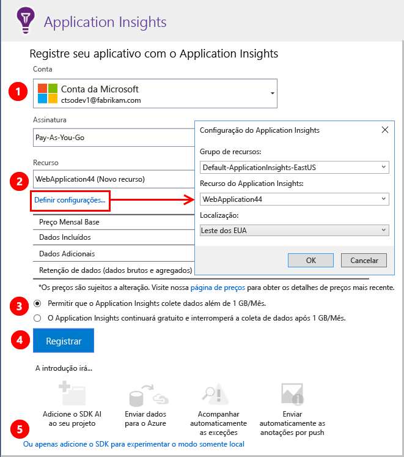
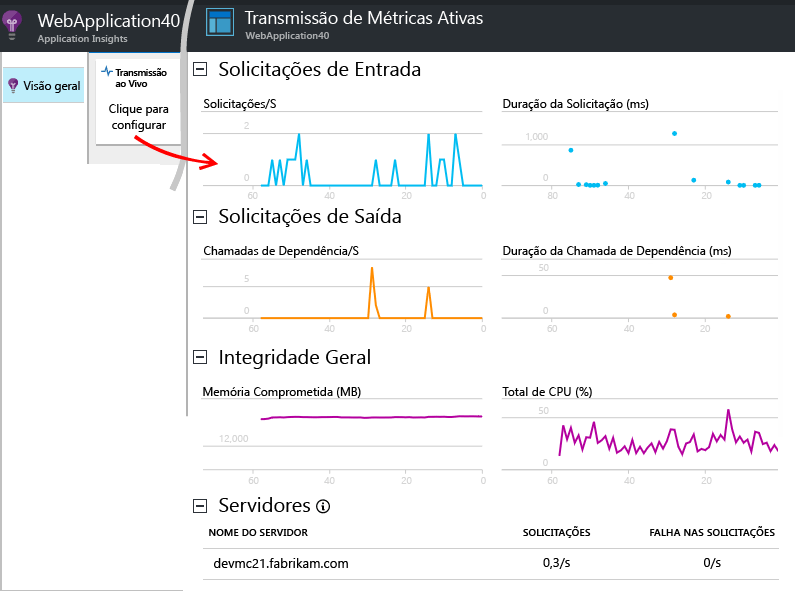
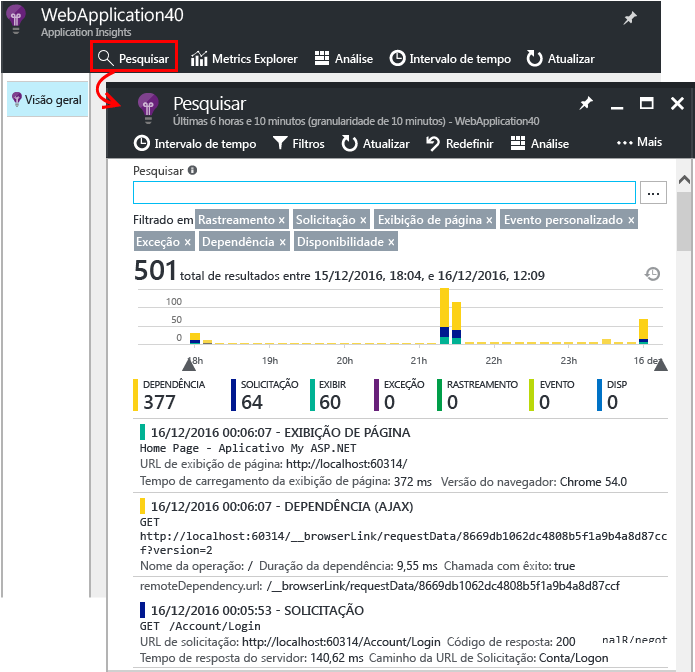
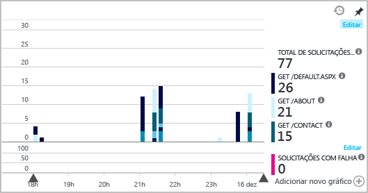

# <a name="set-up-application-insights-for-your-aspnet-website"></a>Configurar o Application Insights para seu site ASP.NET
O [Azure Application Insights](app-insights-overview.md) monitora seus aplicativos em tempo real para ajudá-lo a [detectar e diagnosticar problemas de desempenho e exceções](app-insights-detect-triage-diagnose.md). Ele também ajuda a [descobrir como seu aplicativo é usado](app-insights-overview-usage.md). Ele funciona para o recurso de aplicativos Web do serviço de aplicativo do Azure, bem como aplicativos hospedados em seus próprios servidores do IIS local ou em VMs na nuvem.

## <a name="before-you-start"></a>Antes de começar
Você precisa de:

* Atualização 3 ou mais recente do Visual Studio 2013. Mais tarde é melhor.
* Uma assinatura do [Microsoft Azure](http://azure.com). Se sua equipe ou organização tem uma assinatura do Azure, o proprietário pode adicioná-lo a ela, usando sua [conta da Microsoft](http://live.com).

Há tópicos alternativos para conferir se você está interessado em:

* [Instrumentar um aplicativo Web em tempo de execução](app-insights-monitor-performance-live-website-now.md)
* [Serviços de Nuvem do Azure](app-insights-cloudservices.md)

## <a name="a-nameidea-step-1-add-the-application-insights-sdk"></a><a name="ide"></a>Etapa 1: Adicionar o SDK do Application Insights

Clique com o botão direito do mouse no projeto de aplicativo Web no Gerenciador de Soluções e escolha **Adicionar**, **Application Insights Telemetry...** ou **Configurar o Application Insights**.


(No Visual Studio 2015, há também uma opção adicioná-lo na caixa de diálogo Novo projeto.)

Ir para a página de configuração do Application Insights:



1. Selecione a conta e assinatura que você usa para acessar o Azure.
2. Selecione o recurso no Azure onde você deseja ver os dados do seu aplicativo. Normalmente, você cria um recurso separado para cada um aplicativo. Se você deseja definir o grupo de recursos ou o local onde os dados estão armazenado, clique **configurações**. Grupos de recursos são usados para controlar o acesso aos dados. Por exemplo, se você tiver vários aplicativos que fazem parte do mesmo sistema, você pode colocar seus dados do Application Insights no mesmo grupo de recursos.
3. O Application Insights está gratuitos até um determinado volume de telemetria. Você pode impor um limite de volume para evitar encargos. Depois que o recurso for criado, você pode alterar sua seleção no portal abrindo **recursos + preços**, **gerenciamento do volume de dados**, **limite diário de volume**.
4. Clique em **registrar** vá em frente e configurar o Application Insights para seu aplicativo web. Telemetria será enviada para o [portal do Azure](https://portal.azure.com), durante a depuração e depois de ter publicado seu aplicativo.
5. Como alternativa, você pode adicionar apenas o SDK do Application Insights ao seu aplicativo. Nesse caso, você poderá ver a telemetria no Visual Studio enquanto você está depurando. Posteriormente, você pode retornar a esta página de configuração, ou você poderia esperar até depois de implantar seu aplicativo e [ative telemetria em tempo de execução](app-insights-monitor-performance-live-website-now.md).


## <a name="a-nameruna-step-2-run-your-app"></a><a name="run"></a>Etapa 2: Executar seu aplicativo
Execute o aplicativo com F5. Abra páginas diferentes para gerar alguma telemetria.

No Visual Studio, você vê uma contagem dos eventos que foram registrados.


## <a name="step-3-see-your-telemetry-in-visual-studio-or-application-insights"></a>Etapa 3: Consulte sua telemetria no Visual Studio ou o Application Insights
Você pode ver sua telemetria no Visual Studio ou no portal da web Application Insights.

**No Visual Studio**, abra a janela do Application Insights. Clique no botão **Application Insights** ou clique com o botão direito do mouse em seu projeto no Gerenciador de Soluções, selecione **Application Insights** e clique em **Pesquisar Telemetria Dinâmica**.

Na janela de pesquisa do Application Insights do Visual Studio, consulte o **dados da sessão de depuração** exibição de telemetria gerada no lado do servidor de seu aplicativo. Experimente os filtros e clique em qualquer evento para ver mais detalhes.


> [!NOTE]
> Caso você não veja os dados, verifique se o intervalo de tempo está correto e clique no ícone Pesquisa.

[Saiba mais sobre as ferramentas do Application Insights no Visual Studio](app-insights-visual-studio.md).

<a name="monitor"></a>
### <a name="the-application-insights-web-portal"></a>O portal da Web do Application Insights
Você também pode ver a telemetria **no portal da web Application Insights**, a menos que você optou por instalar somente o SDK. O portal tem mais gráficos, ferramentas analíticas e painéis do que o Visual Studio.

Abra seu recurso do Application Insights. Entre no [portal do Azure](https://portal.azure.com/) e localize-o ou clique com o botão direito do mouse no projeto no Visual Studio e deixe que ele o leve até lá.


> [!NOTE]
> Se você receber um erro de acesso, você pode ter mais de um conjunto de credenciais de Microsoft e você pode estar conectado com o conjunto errado. No portal, saia e entre novamente.

O portal é aberto em uma exibição da telemetria do aplicativo.


Clique em qualquer bloco ou gráfico para ver mais detalhes.

### <a name="more-details-in-the-application-insights-web-portal"></a>Para obter mais detalhes no portal da web Application Insights
Aqui estão alguns exemplos de como o portal fornece mais detalhes para você.

* [**Fluxo de Métricas ao Vivo** ](app-insights-live-stream.md) exibe telemetria quase instantaneamente.

    

    Abra o Live Metrics Stream enquanto o aplicativo estiver em execução para permitir que eles se conectem.

    O Live Metrics Stream mostra apenas telemetria um minuto após o envio. Para obter mais investigações históricas, use a Pesquisa, o Metrics Explorer e a Análise. Os dados podem levar alguns minutos para serem mostrados nesses locais.

* [**Pesquisar** ](app-insights-diagnostic-search.md) mostra eventos individuais, como solicitações, exceções e exibições de página. Você pode filtrar por tipo de evento, correspondência de termo e valores de propriedade. Clique em qualquer evento para ver suas propriedades e eventos relacionados.

    

 * No modo de desenvolvimento, você pode ver uma série de eventos de dependência (AJAX). Essas são as sincronizações entre o navegador e o emulador do servidor. Para ocultá-los, clique no filtro **Dependência**.
* [**Métricas agregadas**](app-insights-metrics-explorer.md), como taxas de solicitação e de falha, são exibidas nos gráficos. Clique em qualquer gráfico para abrir uma folha com mais detalhes. Clique na marca **Editar** de qualquer gráfico para definir filtros e tamanho.

    

[Saiba mais sobre como usar o Application Insights no portal do Azure](app-insights-dashboards.md).

## <a name="step-4-publish-your-app"></a>Etapa 4: Publicar seu aplicativo
Publica seu aplicativo no servidor IIS ou no Azure. Observe o [Fluxo de Métricas Ativo](app-insights-metrics-explorer.md#live-metrics-stream) para verificar se tudo está funcionando corretamente.

A telemetria se acumula no portal do Application Insights, em que você pode monitorar as métricas, pesquisar a telemetria e configurar [painéis](app-insights-dashboards.md). Você também pode usar a poderosa [Linguagem de consulta de análise](app-insights-analytics.md) para analisar o uso e o desempenho ou para encontrar eventos específicos.

Você também pode continuar a analisar a telemetria no [Visual Studio](app-insights-visual-studio.md) com ferramentas como pesquisa de diagnóstico e de [tendências](app-insights-visual-studio-trends.md).

> [!NOTE]
> Se seu aplicativo enviar telemetria suficiente para se aproximar das [limitações](app-insights-pricing.md#limits-summary), a [amostragem](app-insights-sampling.md) automática será ativada. A amostragem reduz a quantidade de telemetria enviada do seu aplicativo, preservando dados correlacionados para fins de diagnóstico.
>
>

## <a name="a-namelanda-what-does-the-add-application-insights-command-do"></a><a name="land"></a>O que faz o comando Adicionar Application Insights?
O Application Insights envia telemetria do aplicativo para o portal do Application Insights (hospedado no Azure).


O comando faz três coisas:

1. Adiciona o pacote NuGet do SDK da Web do Application Insights ao seu projeto. Para vê-lo no Visual Studio, clique com o botão direito em seu projeto e escolha **Gerenciar pacotes NuGet**.
2. Cria um recurso do Application Insights no [portal do Azure](https://portal.azure.com/). É onde você vê seus dados. Ele recupera a *chave de instrumentação* , que identifica o recurso.
3. Insere a chave de instrumentação em `ApplicationInsights.config`, de modo que o SDK possa enviar telemetria ao portal.

Se desejar, você poderá executar essas etapas manualmente para [ASP.NET 4](app-insights-windows-services.md) ou [ASP.NET Core](https://github.com/Microsoft/ApplicationInsights-aspnetcore/wiki/Getting-Started).

### <a name="upgrade-to-future-sdk-versions"></a>Atualizar para versões futuras do SDK
Para atualizar para uma [nova versão do SDK](https://github.com/Microsoft/ApplicationInsights-dotnet-server/releases), abra o **gerenciador de pacotes do NuGet** novamente e filtre os pacotes instalados. Selecione **Microsoft.ApplicationInsights.Web** e escolha **Atualizar**.

Se você fez todas as personalizações no ApplicationInsights.config, salve uma cópia dele antes de atualizar. Em seguida, mescle suas alterações para a nova versão.

## <a name="add-more-telemetry"></a>Adicionar mais telemetria
A seguir estão os outros tipos de telemetria, que você pode adicionar.
### <a name="dependencies-exceptions-and-performance-counters"></a>Dependências, exceções e contadores de desempenho

[Instale o Monitor de Status](http://go.microsoft.com/fwlink/?LinkId=506648) em cada computador servidor do IIS para obter telemetria adicional sobre seus aplicativos Web. Se ele já estiver instalado, você não precisará fazer nada. (Você pode ter usado o monitor de status, para iniciar o monitoramento de um aplicativo em tempo de execução).

Usando o monitor de status além do SDK do tempo de compilação, você obtém um conjunto mais completo de telemetria que inclui:

* [Contadores de desempenho](app-insights-performance-counters.md): CPU, memória, disco e outros contadores de desempenho relacionados ao seu aplicativo.
* [Exceções](app-insights-asp-net-exceptions.md): telemetria mais detalhada para algumas exceções.
* [Dependências](app-insights-asp-net-dependencies.md): incluindo valores de retorno.

### <a name="webpages-and-single-page-apps"></a>Páginas da Web e aplicativos de página única
1. [Adicione o trecho de JavaScript](app-insights-javascript.md) a páginas da Web para mostrar dados sobre exibições de página, tempos de carregamento, exceções do navegador, desempenho de chamada AJAX, contagens de usuário e de sessão. Eles aparecem na folha de Navegador e Uso.
2. [Eventos personalizados de código](app-insights-api-custom-events-metrics.md) para contagem, tempo ou medição de ações do usuário.


### <a name="diagnostic-code"></a>Código de diagnóstico
Está com um problema? Se você deseja inserir o código no aplicativo para ajudar a diagnosticá-lo, há várias opções:

* [Capturar rastreamentos de log](app-insights-asp-net-trace-logs.md): se você já estiver usando Log4N, NLog ou System.Diagnostics.Trace para registrar eventos de rastreamento, a saída poderá ser enviada ao Application Insights. Você pode correlacionar essa saída com solicitações, pesquisar por ele e analisá-los.
* [Métricas e eventos personalizados](app-insights-api-custom-events-metrics.md): use trackevent() e trackmetric() no servidor ou no código da página da Web.
* [Telemetria de marca com propriedades adicionais](app-insights-api-filtering-sampling.md#add-properties).

Use [Pesquisar](app-insights-diagnostic-search.md) para localizar e correlacionar eventos específicos e [Análise](app-insights-analytics.md) para executar consultas mais poderosas.

## <a name="alerts"></a>Alertas
Seja o primeiro a saber se o aplicativo tem problemas.

* [Testes de disponibilidade](app-insights-monitor-web-app-availability.md): criar testes para verificar se seu site está visível na web.
* [Inteligente diagnóstico](app-insights-proactive-diagnostics.md): esses testes são executados automaticamente, portanto você não precisa fazer nada para configurá-los. Eles informam se o aplicativo tem uma taxa incomum de solicitações com falha.
* [Alertas de métrica](app-insights-alerts.md): defina-os para avisar se uma métrica ultrapassar um limite. Você pode defini-los em métricas personalizadas que você codifica em seu aplicativo.

Por padrão, as notificações de alerta são enviadas ao proprietário da assinatura do Azure.


## <a name="version-and-release-tracking"></a>Versão e controle de versão
Para controlar a versão do aplicativo, certifique-se de `buildinfo.config` é gerado pelo processo de Microsoft Build Engine. No arquivo. csproj, adicione:  

```XML

    <PropertyGroup>
      <GenerateBuildInfoConfigFile>true</GenerateBuildInfoConfigFile>    <IncludeServerNameInBuildInfo>true</IncludeServerNameInBuildInfo>
    </PropertyGroup>
```

Quando ele tem as informações de compilação, o módulo da web Application Insights adiciona automaticamente **Versão do aplicativo** como uma propriedade para cada item de telemetria. Isso permite que você filtre por versão ao executar [pesquisas de diagnóstico](app-insights-diagnostic-search.md) ou ao [explorar métricas](app-insights-metrics-explorer.md).

No entanto, observe que o número de versão de compilação é gerado apenas pelo Microsoft Build Engine, não pela compilação de desenvolvedor no Visual Studio.

### <a name="release-annotations"></a>Anotações da versão
Se usar o Visual Studio Team Services, você poderá [obter um marcador de anotação](app-insights-annotations.md) adicionado a seus gráficos sempre que lançar uma nova versão. A imagem a seguir mostra como esse marcador é exibido.


## <a name="next-steps"></a>Próximas etapas
**[Trabalhar com o Application Insights no Visual Studio](app-insights-visual-studio.md)**<br/>Inclui informações sobre a depuração de telemetria, pesquisa de diagnóstico e análise por meio de código.

**[Trabalhando com o portal do Application Insights](app-insights-dashboards.md)**<br/> Inclui informações sobre painéis, poderosas ferramentas de diagnóstico e análise, alertas, um mapa de dependências em tempo real de seu aplicativo e a exportação de telemetria.

