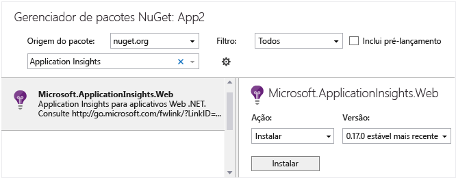

# <a name="application-insights-for-azure-cloud-services"></a>Application Insights para Serviços de Nuvem do Azure
Os [aplicativos de serviços de Nuvem do Microsoft Azure](https://azure.microsoft.com/services/cloud-services/) podem ser monitorados pelo [Application Insights][start] quanto a disponibilidade, desempenho, falhas e uso. Com os comentários que você obtiver sobre o desempenho e a eficiência de seu aplicativo em uso, você pode fazer escolhas informadas sobre a direção do projeto em cada ciclo de vida de desenvolvimento.


## <a name="before-you-start"></a>Antes de começar
Você precisará de:

* Uma assinatura do [Microsoft Azure](http://azure.com). Entre com uma conta da Microsoft, que você pode ter para o Windows, XBox Live ou outros serviços de nuvem da Microsoft. 
* Ferramentas do Microsoft Azure 2.9 ou posteriores
* Developer Analytics Tools 7.10 ou posteriores

## <a name="quick-start"></a>Início rápido
A maneira mais rápida e fácil de monitorar seu serviço de nuvem com o Application Insights é escolher essa opção quando você publica seu serviço no Azure.


Esta opção instrumenta o aplicativo em tempo de execução, oferecendo a você toda a telemetria necessária para monitorar solicitações, exceções e dependências na função web, bem como contadores de desempenho nas funções de trabalho. Os rastreamentos de diagnóstico gerados pelo aplicativo também são enviados para o Application Insights.

Se isso for tudo o que você precisa, você está pronto! As próximas etapas são [exibição das métricas do seu aplicativo](app-insights-metrics-explorer.md), [consulta de seus dados com o Analytics](app-insights-analytics.md) e talvez a configuração de um [painel](app-insights-dashboards.md). Você talvez queira configurar [testes de disponibilidade](app-insights-monitor-web-app-availability.md) e [adicionar código às suas páginas da Web](app-insights-javascript.md) para monitorar o desempenho no navegador.

Mas você também pode obter mais opções:

* Enviar dados de diferentes componentes e criar configurações para recursos separados.
* Adicione telemetria personalizada do seu aplicativo.

Se essas opções interessam a você, continue lendo.

## <a name="sample-application-instrumented-with-application-insights"></a>Aplicativo de exemplo instrumentado com o Application Insights
Vejamos esse [aplicativo de exemplo](https://github.com/Microsoft/ApplicationInsights-Home/tree/master/Samples/AzureEmailService) no qual o Application Insights é adicionado a um serviço de nuvem com duas funções de trabalho hospedadas no Azure. 

O que se segue informa como adaptar seu próprio projeto de serviço de nuvem da mesma maneira.

## <a name="plan-resources-and-resource-groups"></a>Planejar recursos e grupos de recursos
A telemetria do aplicativo é armazenada, analisada e exibida em um recurso do Azure do tipo Application Insights. 

Cada recurso pertence somente a um grupo de recursos. Os grupos de recursos são usados para gerenciar custos, conceder acesso a membros da equipe e implantar atualizações em uma única transação coordenada. Por exemplo, você pode [escrever um script para implantar](../azure-resource-manager/resource-group-template-deploy.md) um Serviço de Nuvem do Azure e seus recursos em uma operação de monitoramento do Application Insights.

### <a name="resources-for-components"></a>Recursos para componentes
O esquema recomendado é criar um recurso separado para cada componente do aplicativo - ou seja, cada função Web e função de trabalho. Você pode analisar cada componente separadamente, mas pode criar um [painel](app-insights-dashboards.md) que reúna os principais gráficos de todos os componentes, para que você possa compará-los e monitorá-los juntos. 

É um esquema alternativo enviar a telemetria de mais de uma função para o mesmo recurso, mas [Adicionar uma propriedade de dimensão para cada item de telemetria](app-insights-api-filtering-sampling.md#add-properties-itelemetryinitializer) que identifica sua função de origem. Nesse esquema, os gráficos de métricas, como exceções, normalmente mostram uma agregação das contagens das diferentes funções, mas é possível segmentar o gráfico pelo identificador de função, quando necessário. As pesquisas também podem ser filtradas na mesma dimensão. Essa alternativa torna um pouco mais fácil ver tudo ao mesmo tempo, mas também pode causar uma certa confusão entre as funções.

A telemetria do navegador geralmente é incluída no mesmo recurso que sua função Web do lado servidor.

Coloque os recursos do Application Insights para os diferentes componentes em um grupo de recursos. Isso facilita seu gerenciamento em conjunto. 

### <a name="separating-development-test-and-production"></a>A separação de desenvolvimento, teste e produção
Se você estiver desenvolvendo eventos personalizados para o próximo recurso enquanto a versão anterior estiver ativa, será recomendável enviar a telemetria de desenvolvimento para um recurso separado do Application Insights. Caso contrário, será difícil encontrar a telemetria de teste entre todo o tráfego do site ativo.

Para evitar essa situação, crie recursos separados para cada configuração de compilação ou 'carimbo' (desenvolvimento, teste, produção,...) do sistema. Coloque os recursos para cada configuração de compilação em um grupo de recursos separado. 

Para enviar a telemetria para os recursos apropriados, você pode configurar o SDK do Application Insights para que ele escolha uma chave de instrumentação diferente, dependendo da configuração de compilação. 

## <a name="create-an-application-insights-resource-for-each-role"></a>Criar um recurso do Application Insights para cada função
Se você decidiu criar um recurso separado para cada função – e talvez um conjunto separado para cada configuração de build –, é mais fácil criar todos eles no portal do Application Insights. (Se você cria muitos recursos, pode [automatizar o processo](app-insights-powershell.md).

1. No [Portal do Azure][portal], crie um novo recurso do Application Insights. Para o tipo de aplicativo, escolha o aplicativo ASP.NET. 

    
2. Observe que recurso é identificado por uma Chave de Instrumentação. Talvez isso seja necessário mais tarde, se você quiser configurar ou verificar manualmente a configuração do SDK.

     

## <a name="set-up-azure-diagnostics-for-each-role"></a>Configurar o diagnóstico do Azure para cada função
Defina esta opção para monitorar seu aplicativo com o Application Insights. Para funções web, isso fornece monitoramento de desempenho, alertas e diagnóstico, bem como análise de uso. Para outras funções, você pode pesquisar e monitorar o diagnóstico do Azure, como reinicialização, contadores de desempenho e chamadas para System.Diagnostics.Trace. 

1. No Visual Studio Solution Explorer, em &lt;SeuServiçoDeNuvem&gt;, Funções, abra as propriedades de cada função.
2. Em **Configuração**, defina **Enviar dados de diagnóstico para o Application Insights** e selecione o recurso apropriado do Application Insights criado anteriormente.

Se você tiver optado por usar um recurso Application Insights separado para cada configuração de compilação, selecione primeiro a configuração.


Isso tem o efeito de inserção de suas chaves de instrumentação do Application Insights nos arquivos chamados `ServiceConfiguration.*.cscfg`. ([Exemplo de código](https://github.com/Microsoft/ApplicationInsights-Home/blob/master/Samples/AzureEmailService/AzureEmailService/ServiceConfiguration.Cloud.cscfg)).

Se desejar variar o nível de informações de diagnóstico enviadas para o Application Insights, faça isso [editando os arquivos `.cscfg` diretamente](app-insights-azure-diagnostics.md).

## <a name="sdk"></a>Instalar o SDK em cada projeto
Esta opção proporciona a capacidade de adicionar telemetria de negócios personalizados para qualquer função, para uma análise mais próxima de como seu aplicativo é usado e como é seu desempenho.

No Visual Studio, configure o SDK do Application Insights para cada projeto de aplicativo de nuvem.

1. **Funções Web**: clique com o botão direito no projeto e escolha **Configurar o Application Insights** ou **Adicionar > Application Insights Telemetry**.

2. **Funções de trabalho**: 
 * Clique com o botão direito no projeto e selecione **Gerenciar Pacotes Nuget**.
 * Adicione [Application Insights para Windows Servers](https://www.nuget.org/packages/Microsoft.ApplicationInsights.WindowsServer/).

    

3. Configure o SDK para enviar dados ao recurso do Application Insights.

    Em uma função de inicialização adequada, defina a chave de instrumentação no parâmetro de configuração no arquivo .cscfg:
 
    ```C#
   
     TelemetryConfiguration.Active.InstrumentationKey = RoleEnvironment.GetConfigurationSettingValue("APPINSIGHTS_INSTRUMENTATIONKEY");
    ```
   
    Faça isso para cada função em seu aplicativo. Veja os exemplos:
   
   * [Função Web](https://github.com/Microsoft/ApplicationInsights-Home/blob/master/Samples/AzureEmailService/MvcWebRole/Global.asax.cs#L27)
   * [Função de trabalho](https://github.com/Microsoft/ApplicationInsights-Home/blob/master/Samples/AzureEmailService/WorkerRoleA/WorkerRoleA.cs#L232)
   * [Para páginas da Web](https://github.com/Microsoft/ApplicationInsights-Home/blob/master/Samples/AzureEmailService/MvcWebRole/Views/Shared/_Layout.cshtml#L13) 
4. Defina o arquivo ApplicationInsights.config para sempre ser copiado no diretório de saída. 
   
    (No arquivo. config, você verá mensagens solicitando que você coloque a chave de instrumentação lá. No entanto, para aplicativos em nuvem é melhor defini-la por meio do arquivo .cscfg. Isso garante que a função seja identificada corretamente no portal).

#### <a name="run-and-publish-the-app"></a>Executar e publicar o aplicativo
Execute o aplicativo e entre no Azure. Abra os recursos do Application Insights que você criou, veja que os pontos de dados individuais aparecerem em [Pesquisa](app-insights-diagnostic-search.md) e os dados agregados no [Metrics Explorer](app-insights-metrics-explorer.md). 

Adicione mais telemetria: confira as seções a seguir e publique seu aplicativo para obter comentários em tempo real sobre o diagnóstico e de uso. 

#### <a name="no-data"></a>Não há dados?
* Abra o bloco [Pesquisar][diagnostic] para ver eventos individuais.
* Use o aplicativo abrindo páginas diferentes, para que ele gere alguma telemetria.
* Aguarde alguns segundos e clique em Atualizar.
* Consulte [Solução de problemas][qna].

## <a name="view-azure-diagnostic-events"></a>Exibir eventos de diagnóstico do Azure
Onde encontrar o diagnóstico:

* Os contadores de desempenho são exibidos como métricas personalizadas. 
* Os logs de eventos do Windows são mostrados como eventos de rastreamentos e personalizados.
* Logs do aplicativo, logs de ETW e todos os logs de infraestrutura de diagnóstico são exibidos como rastreamentos.

Para ver os contadores de eventos e os contadores de desempenho, abra o [Metrics Explorer](app-insights-metrics-explorer.md) e adicione um novo gráfico:


Use [Pesquisar](app-insights-diagnostic-search.md) em uma [consulta do Analytics](app-insights-analytics-tour.md) para pesquisar os vários logs de rastreamento enviados pelo Diagnóstico do Azure. Por exemplo, suponha que você tem uma exceção sem tratamento que causou a falha e reciclagem de uma Função. Essa informação será mostrada no canal do Aplicativo do Log de Eventos do Windows. É possível usar a Pesquisa para examinar o erro do Log de Eventos do Windows e obter o rastreamento de pilha completo da exceção. Isso ajudará você a encontrar a causa raiz do problema.


## <a name="more-telemetry"></a>Mais telemetria
As seções a seguir mostram como obter a telemetria adicional de diferentes aspectos de seu aplicativo.

## <a name="track-requests-from-worker-roles"></a>Acompanhar as solicitações das funções de trabalho
Nas funções web, o módulo de solicitações automaticamente coleta dados sobre solicitações HTTP. Consulte o [MVCWebRole de exemplo](https://github.com/Microsoft/ApplicationInsights-Home/tree/master/Samples/AzureEmailService/MvcWebRole) para obter exemplos de como você pode substituir o comportamento de coleção padrão. 

Você pode capturar o desempenho das chamadas a funções de trabalho acompanhando-as da mesma maneira como faz com solicitações HTTP. No Application Insights, o tipo de telemetria Solicitação mede uma unidade de trabalho do servidor nomeada que pode ser cronometrada e ser bem-sucedida ou falhar de forma independente. Embora as solicitações HTTP sejam capturadas automaticamente pelo SDK, você pode inserir seu próprio código para acompanhar as solicitações para funções de trabalho.

Consulte as duas funções de trabalho de exemplo instrumentadas para solicitações de relatório: [WorkerRoleA](https://github.com/Microsoft/ApplicationInsights-Home/tree/master/Samples/AzureEmailService/WorkerRoleA) e [WorkerRoleB](https://github.com/Microsoft/ApplicationInsights-Home/tree/master/Samples/AzureEmailService/WorkerRoleB)

## <a name="exceptions"></a>Exceções
Consulte [Monitoramento de exceções no Application Insights](app-insights-asp-net-exceptions.md) para obter informações sobre como você pode coletar exceções sem tratamento de diferentes tipos de aplicativos Web.

A função web de exemplo tem controladores MVC5 e API Web 2. As exceções sem tratamento das duas são capturadas com os seguintes manipuladores:

* Configuração do [AiHandleErrorAttribute](https://github.com/Microsoft/ApplicationInsights-Home/blob/master/Samples/AzureEmailService/MvcWebRole/Telemetry/AiHandleErrorAttribute.cs) [aqui](https://github.com/Microsoft/ApplicationInsights-Home/blob/master/Samples/AzureEmailService/MvcWebRole/App_Start/FilterConfig.cs#L12) para controladores MVC5
* Configuração do [AiWebApiExceptionLogger](https://github.com/Microsoft/ApplicationInsights-Home/blob/master/Samples/AzureEmailService/MvcWebRole/Telemetry/AiWebApiExceptionLogger.cs) [aqui](https://github.com/Microsoft/ApplicationInsights-Home/blob/master/Samples/AzureEmailService/MvcWebRole/App_Start/WebApiConfig.cs#L25) para controladores da API Web 2

Para funções de trabalho, há duas maneiras de acompanhar exceções:

* TrackException(ex)
* Se você tiver adicionado o pacote NuGet do ouvinte de rastreamento do Application Insights, poderá usar **System.Diagnostics.Trace** para registrar as exceções. [Exemplo de código.](https://github.com/Microsoft/ApplicationInsights-Home/blob/master/Samples/AzureEmailService/WorkerRoleA/WorkerRoleA.cs#L107)

## <a name="performance-counters"></a>Contadores de desempenho
Os seguintes contadores são coletados por padrão:

    * \Process(??APP_WIN32_PROC??)\% Tempo do Processador
    * \Memória\Bytes Disponíveis
    * \.Exceções NET CLR (?. APP_CLR_PROC?)\# de exceções lançadas / s
    * \Processo(??APP_WIN32_PROC??)\Bytes Privados
    * \Processo(??APP_WIN32_PROC??)\Bytes de dados de ES/s
    * \Processador(_Total)\% Tempo do processador

Para funções web, esses contadores também são coletados:

    * \Aplicativos ASP.NET(??APP_W3SVC_PROC??)\Solicitções/S
    * \Aplicativos ASP.NET (?. APP_W3SVC_PROC?)\Tempo de Execução de Solicitação
    * \Aplicativos ASP.NET (?. APP_W3SVC_PROC?)\Solicitações na Fila do Aplicativo

É possível especificar contadores de desempenho adicionais, personalizados ou do Windows editando ApplicationInsights.config, [como neste exemplo](https://github.com/Microsoft/ApplicationInsights-Home/blob/master/Samples/AzureEmailService/WorkerRoleA/ApplicationInsights.config#L14).

  

## <a name="correlated-telemetry-for-worker-roles"></a>Telemetria correlacionada para funções de trabalho
É uma experiência de diagnóstico avançada, quando você pode ver o que levou a uma solicitação com falha ou alta latência. Com as funções da web, o SDK automaticamente configura a correlação entre a telemetria relacionada. Para funções de trabalho, você pode usar um inicializador de telemetria personalizado para definir um atributo de contexto Operation.Id comum para todas as telemetrias para obter isso. Isso permite ver se o problema de latência/falha foi causado devido a uma dependência ou ao código, rapidamente! 

Faça assim:

* Defina a ID de correlação em uma CallContext conforme mostrado [aqui](https://github.com/Microsoft/ApplicationInsights-Home/blob/master/Samples/AzureEmailService/WorkerRoleA/WorkerRoleA.cs#L36). Nesse caso, estamos usando a ID da solicitação como a id de correlação
* Adicione uma implementação personalizada de TelemetryInitializer, para definir a Operation.Id com o conjunto de correlationId acima. Há um exemplo aqui: [ItemCorrelationTelemetryInitializer](https://github.com/Microsoft/ApplicationInsights-Home/blob/master/Samples/AzureEmailService/WorkerRoleA/Telemetry/ItemCorrelationTelemetryInitializer.cs#L13)
* Adicione o inicializador de telemetria personalizado. Você pode fazer isso no arquivo ApplicationInsights.config ou no código conforme mostrado [aqui](https://github.com/Microsoft/ApplicationInsights-Home/blob/master/Samples/AzureEmailService/WorkerRoleA/WorkerRoleA.cs#L233)

É isso! A experiência do portal já está conectada para ajudá-lo a ver todas as telemetrias associadas rapidamente:


## <a name="client-telemetry"></a>Telemetria do cliente
[Adicione o SDK do JavaScript a suas páginas da Web][client] para obter a telemetria baseada em navegador, como contagens de exibição de página, tempos de carregamento de página, exceções de script e para permitir que você escreva telemetria personalizada em seus scripts de página.

## <a name="availability-tests"></a>Testes de disponibilidade
[Configure os testes da Web][availability] para certificar-se de manter seu aplicativo operante e responsivo.

## <a name="display-everything-together"></a>Exibir tudo juntos
Para obter uma visão geral do sistema, você pode agrupar os gráficos de monitoramento da chave em um [painel](app-insights-dashboards.md). Por exemplo, você pode fixar as contagens de solicitação e de falha de cada função. 

Se o sistema usa outros serviços do Azure, como o Stream Analytics, inclua seus gráficos de monitoramento também. 

Se você tiver um aplicativo de cliente móvel, insira um código para enviar eventos personalizados sobre operações de chave de usuário e crie uma [ponte HockeyApp](app-insights-hockeyapp-bridge-app.md). Crie consultas no [Analytics](app-insights-analytics.md) para exibir a contagem de eventos e fixe-os ao painel.

## <a name="example"></a>Exemplo
[O exemplo](https://github.com/Microsoft/ApplicationInsights-Home/tree/master/Samples/AzureEmailService) monitora um serviço que tem uma função web e duas funções de trabalho.

## <a name="exception-method-not-found-on-running-in-azure-cloud-services"></a>Exceção "método não encontrado" em execução nos Serviços de Nuvem do Azure
Você compilou para .NET 4.6? O 4.6 não tem suporte automático nas funções dos Serviços de Nuvem do Azure. [Instale o 4.6 em cada função](../cloud-services/cloud-services-dotnet-install-dotnet.md) antes de executar seu aplicativo.

## <a name="video"></a>Vídeo

> [!VIDEO https://channel9.msdn.com/events/Connect/2016/100/player]

## <a name="next-steps"></a>Próximas etapas
* [Configurar o envio dos Diagnósticos do Azure ao Application Insights](app-insights-azure-diagnostics.md)
* [Automatizar a criação de recursos do Application Insights](app-insights-powershell.md)
* [Automatizar o diagnóstico do Azure](app-insights-powershell-azure-diagnostics.md)

[api]: app-insights-api-custom-events-metrics.md
[availability]: app-insights-monitor-web-app-availability.md
[azure]: app-insights-azure.md
[client]: app-insights-javascript.md
[diagnostic]: app-insights-diagnostic-search.md
[netlogs]: app-insights-asp-net-trace-logs.md
[portal]: http://portal.azure.com/
[qna]: app-insights-troubleshoot-faq.md
[redfield]: app-insights-monitor-performance-live-website-now.md
[start]: app-insights-overview.md 

