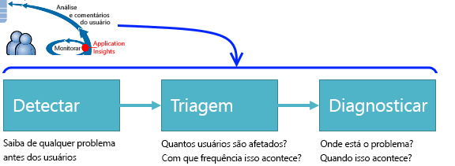
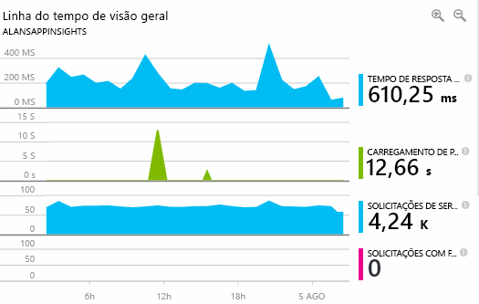
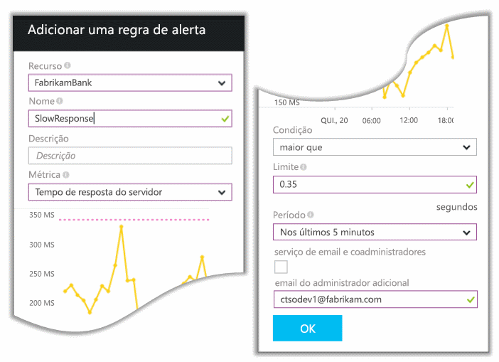
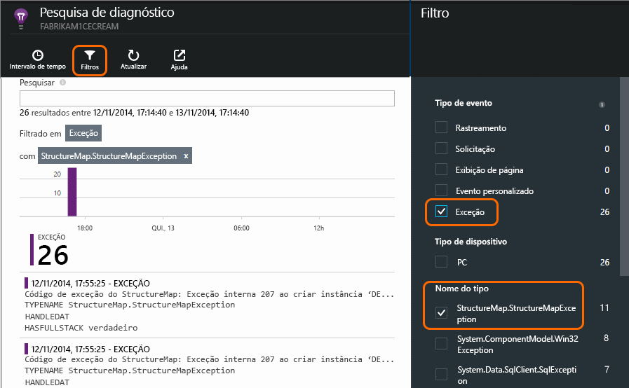
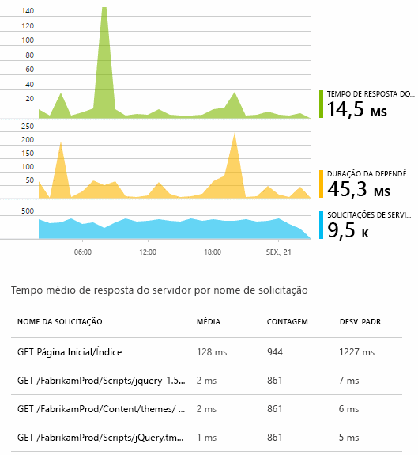
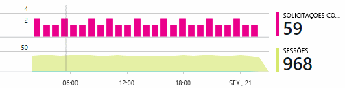
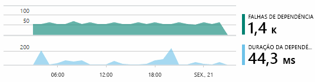

<properties
	pageTitle="Detectar, realizar a triagem e diagnosticar"
	description="Analise as falhas, detecte e diagnostique problemas de desempenho em seus aplicativos"
	authors="alancameronwills"
	services="application-insights"
    documentationCenter=""
	manager="keboyd"/>

<tags
	ms.service="application-insights"
	ms.workload="tbd"
	ms.tgt_pltfrm="ibiza"
	ms.devlang="na"
	ms.topic="get-started-article" 
	ms.date="04/02/2015"
	ms.author="awills"/>

# Detectar, realizar triagem e diagnosticar com o Application Insights

*O Application Insights está em modo de visualização.*

Após ter publicado seu aplicativo, o Application Insights ajuda a garantir que ele esteja sendo executado do modo correto e apresentando um bom desempenho. Se houver um problema, você deseja saber sobre isso em breve e, em seguida, você deseja saber o que fazer a respeito.

* *"Alguns dias atrás, implantamos um hotfix “secundário”. Não executamos uma aprovação de teste ampla, mas infelizmente algumas alterações inesperadas foram mescladas à carga, gerando incompatibilidade entre o front-end e back-end. Imediatamente as exceções de servidor aumentaram drasticamente, nosso alerta disparou e fomos informados sobre a situação. Alguns cliques no portal do Application Insights, temos informações suficientes de pilhas de chamadas de exceção para restringir o problema. Revertemos imediatamente e limitamos os danos. O Application Insights tornou essa parte do ciclo das Operações de Desenvolvimento muito fácil e prática."*

Podemos pensar nessa parte do ciclo das Operações de Desenvolvimento como um pipeline:

Depois de você diagnosticar o problema, você sabe onde concentrar seus esforços - seja depurando seu código, alocando mais memória ou criando uma dependência subsequentemente. Finalmente, você pode verificar se a correção funcionou:

Vamos ver como o Application Insights funciona em cada estágio do pipeline.

O Application Insights funciona para aplicativos de dispositivos e aplicativos Web. Neste passo a passo, vamos nos concentrar em um aplicativo Web. Vamos acompanhar a equipe OBS no Fabrikam Bank, que é responsável pelo sistema bancário online. Eles adicionaram o Application Insights ao seus projetos da Web.

## Detectar baixa disponibilidade

Marcela Markova é especialista em testes da equipe de OBS e assume a liderança no monitoramento de desempenho online. Ela define vários [testes da Web][availability]:

* Um teste de URL única para a página de aterrissagem principal para o aplicativo, http://fabrikambank.com/onlinebanking/. Ela define os critérios de código HTTP 200 e o texto “Bem-vindo!”. Se esse teste falhar, há algum problema sério com a rede ou os servidores, ou talvez um problema de implantação. (Ou alguém alterou a mensagem “bem-vindo!” na página sem informá-la.)

* Um teste de várias etapas mais aprofundado, que faz logon e obtém uma listagem atual das contas, verificando alguns detalhes principais em cada página. Esse teste verifica se o link para o banco de dados de contas está funcionando. Ela usa uma ID do cliente fictícia: algumas delas são mantidas para fins de teste.

Com esses testes configurados, Marcela está confiante de que a equipe saberá rapidamente sobre qualquer interrupção.

Falhas aparecem como pontos vermelhos no gráfico de visão geral do teste da Web:

Mas o mais importante, um alerta sobre qualquer falha será enviado por email à equipe de desenvolvimento. Desse modo, eles sabem a respeito antes de quase todos os clientes.

## Monitorar métricas de desempenho

Na mesma página de visão geral do gráfico de disponibilidade, há um gráfico que mostra uma variedade de [principais métricas][perf].

O tempo de processamento do cliente é derivado da telemetria enviada diretamente por meio de páginas da Web. Os outros mostram métricas calculadas em servidores Web.

A contagem de solicitações com falha indica casos em que os usuários já viram um erro - geralmente após uma exceção lançada no código. Talvez eles vejam uma mensagem dizendo "Desculpe, não foi possível atualizar os detalhes agora" ou, na hipótese mais vergonhosa possível, um despejo de pilha na tela do usuário, cortesia do servidor Web.

Marcela gosta de examinar esses gráficos de tempos em tempos. A tela de fundo constante com solicitações com falha é um pouco deprimente, mas ela está relacionada a um bug que a equipe está investigando, e portanto, deve diminuir quando a correção for liberada. Mas se houver um pico repentino em solicitações com falha ou em alguma das outras métricas, como tempo de resposta do servidor, Marcela que saber a respeito imediatamente. Isso pode indicar um problema imprevisto causado por um lançamento de código, ou uma falha em uma dependência como um banco de dados, ou ainda uma má reação a uma carga alta de solicitações.

#### Alertas

Portanto, ela define dois [alertas][metrics]: um para tempos de resposta maiores que um limite típico e outro para uma taxa de solicitações com falha maior do que aquela na tela de fundo atual.

Junto com o alerta de disponibilidade, eles dão a certeza de que, assim que qualquer coisa incomum acontecer, ela saberá a respeito.

Também é possível definir alertas em uma grande variedade de outras métricas. Por exemplo, você pode receber emails se a contagem de exceções aumentar excessivamente ou se a memória disponível tornar-se baixa demais, ou ainda se houver um pico em solicitações de cliente.

## Detectando exceções

Exceções são relatadas ao Application Insights chamando [TrackException()][api]:

    var telemetry = new TelemetryClient();
    ...
    try
    { ...
    }
    catch (Exception ex)
    {
       // Set up some properties:
       var properties = new Dictionary <string, string>
         {{"Game", currentGame.Name}};

       var measurements = new Dictionary <string, double>
         {{"Users", currentGame.Users.Count}};

       // Send the exception telemetry:
       telemetry.TrackException(ex, properties, measurements);
    }

A equipe do Fabrikam Bank evoluiu na prática de sempre enviar telemetria em uma exceção, a menos que haja uma óbvia recuperação.

Na verdade, a estratégia deles é ainda mais ampla do que isso: enviam telemetria em todos os casos nos quais o cliente está frustrado em relação ao que queria fazer, independentemente de isto corresponder a uma exceção no código ou não. Por exemplo, se o sistema de transferência externa interbancária retorna uma mensagem "não é possível concluir esta transação" por algum motivo operacional (sem culpa do cliente), eles acompanham esse evento.

    var successCode = AttemptTransfer(transferAmount, ...);
    if (successCode < 0)
    {
       var properties = new Dictionary <string, string>
            {{ "Code", returnCode, ... }};
       var measurements = new Dictionary <string, double>
         {{"Value", transferAmount}};
       telemetry.TrackEvent("transfer failed", properties, measurements);
    }

TrackException é usado para relatar exceções porque ele envia uma cópia da pilha; o TrackEvent é usado para relatar outros eventos. Você pode anexar as propriedades que podem ser úteis no diagnóstico.

Exceções e eventos aparecem na folha [Pesquisa de diagnóstico][diagnostic]. Você pode analisar para ver as propriedades adicionais e o rastreamento de pilha.

## Monitoramento de eventos positivos

A equipe de desenvolvimento da Fabrikam deseja controlar coisas boas, tanto quanto aquelas desagradáveis. Em parte porque é bom saber quanto sucesso está ocorrendo e onde; e segundo porque é desagradável quando coisas boas param repentinamente de acontecer.

Por exemplo, muitas viagens de usuário tem um bastante claro “funil”: muitos clientes examinam as taxas de diferentes tipos de empréstimo; alguns deles preenchem o formulário de cotação, e daqueles que recebem uma cotação, alguns vão em frente e tiram o empréstimo.

A equipe de desenvolvimento insere chamadas TrackMetric() em cada estágio no funil. No Metrics Explorer, Brian, o arquiteto, pode comparar os valores de cada métrica para estimar com que sucesso o sistema está vendendo empréstimos.

A especialista em experiência do usuário Úrsula também fica de olho nas métricas positivas. Se o gráfico mostra uma queda repentina em qualquer estágio no funil, isso indica que há algum problema lá. Talvez esteja difícil encontrar o botão certo, ou talvez o texto não seja muito estimulante. Ou talvez haja um bug: os usuários clicam no botão, mas nada acontece.

## Monitoramento proativo  

Marcela não fica apenas sentada esperando por alertas. Logo após cada reimplantação, ela examina [tempos de resposta][perf] -tanto o quadro geral e a tabela de solicitações mais lentas quanto as contagens de exceção.

Ela pode avaliar o efeito no desempenho de cada implantação, geralmente comparando cada semana com a última. Se houver uma deterioração repentina do quadro, ela levanta a questão com os desenvolvedores relevantes.

## Triagem

Triagem - avaliar a gravidade e a extensão de um problema - é a primeira etapa depois da detecção. Devemos chamar a equipe à meia-noite? Ou o problema pode esperar até o próximo intervalo conveniente na lista de pendências? Há algumas perguntas cruciais na triagem.

Que quantidade do problema em questão está acontecendo? Os gráficos na folha visão geral oferecem alguma perspectiva para um problema. Por exemplo, o aplicativo da Fabrikam gerou quatro alertas de teste da Web em uma noite. Examinando o gráfico pela manhã, a equipe pôde ver que existiam realmente alguns pontos vermelhos, embora a maioria dos testes tenham resultado em verde. Detalhando o gráfico de disponibilidade, ficou claro que todos esses problemas intermitentes eram de um local de teste. Isso, obviamente, foi um problema de rede que afetou somente uma rota e provavelmente se resolveria sozinho.

Por outro lado, um aumento drástico e estável no gráfico de tempos de resposta ou contagens de exceção é, obviamente, motivo para pânico.

Uma tática de triagem útil é “Experimente você mesmo”. Se você tiver o mesmo problema, saberá que ele é real.

Que fração dos usuários são afetados? Para obter uma resposta aproximada, divida a taxa de falha pela contagem de sessão.

No caso de resposta lenta, compare a tabela das solicitações com respostas mais lentas com a frequência de uso de cada página.

Quão importante é o cenário bloqueado? Se esse for um problema funcional bloqueando uma história de usuário específica, isso importa muito? Se os clientes não podem pagar suas contas, isso é sério; se eles não podem alterar suas preferências de cor da tela, talvez isso possa esperar. Os detalhes do evento ou da exceção, ou a identidade da página lenta, informam onde os clientes estão tendo problemas.

## Diagnóstico

O diagnóstico não é exatamente o mesmo que depuração. Antes de iniciar o rastreamento por meio do código, você deve ter uma ideia de porquê, de quando e de onde o problema está ocorrendo.

**Quando isso acontece?** A exibição do histórico fornecida pelos gráficos de evento e de métrica facilita correlacionar os efeitos e as possíveis causas. Se houver picos intermitentes em taxas de exceção ou de tempo de resposta, examine a contagem de solicitações: se eles atingirem o pico ao mesmo tempo, o cenário parece com o de um problema de recurso. Você precisa atribuir mais CPU ou memória? Ou é uma dependência que não é capaz de dar conta da carga?

**O problema é conosco?** Se você tiver uma queda repentina no desempenho de um determinado tipo de solicitação - por exemplo, quando o cliente deseja um demonstrativo de conta - há uma possibilidade de ser um subsistema externo em vez de seu aplicativo Web. No Metrics Explorer, selecione a taxa de falha de dependência e taxas de duração da dependência e compare seus históricos pelas últimas horas ou dias ao problema que é detectado. Se há alterações correlacionadas, um subsistema externo pode ser a causa.

Alguns problemas de dependência de lentidão são problemas de localização geográfica. O Fabrikam Bank usa máquinas virtuais do Azure, e descobriu que eles tinham inadvertidamente localizado seu servidor Web e servidor de conta em diferentes países. Obtiveram uma melhoria expressiva migrando um deles.

**O que fizemos?** Se o problema não parece estar em uma dependência e se não esteve sempre lá, provavelmente é causado por uma alteração recente. A perspectiva histórica fornecida pelos gráficos de métrica e evento facilita correlacionar alterações repentinas com implantações. Isso reduz o escopo da busca pelo problema.

**O que está acontecendo?** Alguns problemas ocorrem apenas raramente e podem ser difíceis de rastrear por testes offline. Tudo o que podemos fazer é tentar capturar o bug quando ele ocorre, em tempo real. Você pode inspecionar os despejos de pilha em relatórios de exceção. Além disso, você pode escrever chamadas de rastreamento, com sua estrutura de registros favorita, ou então com TrackTrace() ou TrackEvent().

A Fabrikam tinha um problema intermitente com transferências entre contas, mas apenas com determinados tipos de conta. Para entender melhor o que estava acontecendo, eles inseriram chamadas TrackTrace() em pontos-chave do código, anexando o tipo de conta como uma propriedade para cada chamada. Isso facilitou filtrar apenas esses rastreamentos na pesquisa de diagnóstico. Eles também anexaram valores de parâmetro, como propriedades e medidas, às chamadas de rastreamento.

## Lidando com o problema

Depois de diagnosticar o problema, você pode fazer um plano para corrigi-lo. Talvez você precise reverter uma alteração recente, ou talvez você possa simplesmente seguir em frente e corrigir o problema. Quando a correção tiver sido realizada, o Application Insights dirá a você se o processo foi bem-sucedido.

A equipe de desenvolvimento do banco da Fabrikam utiliza uma abordagem mais estruturada para medição de desempenho do que costumava utilizar antes do Application Insights.

* Eles definem metas de desempenho em termos de medidas específicas na página de visão geral do Application Insights.

* Eles criam medidas de desempenho no aplicativo desde o início, como as métricas que medem o progresso do usuário por meio de “funis”.

## Uso

O Application Insights também pode ser usado para saber o que os usuários fazem com um aplicativo. Depois que ele é executado sem problemas, a equipe gostaria de saber quais recursos são os mais populares, do que os usuários gostam ou com o que têm dificuldade e com que frequência eles retornam. Isso os ajudará a definir as prioridades para seus futuros trabalhos. Além disso, eles podem planejar medir o sucesso de cada recurso como parte do ciclo de desenvolvimento. [Leia mais][usage].

## Seus aplicativos

Portanto, é assim que uma equipe usa o Application Insights não apenas para corrigir problemas individuais, mas para melhorar seu ciclo de vida de desenvolvimento. Espero que isso tenha dado a você algumas ideias sobre como o Application Insights pode lhe ajudar a melhorar o desempenho dos seus próprios aplicativos.

## Vídeo

[AZURE.VIDEO performance-monitoring-application-insights]

<!--Link references-->

[api]: app-insights-api-custom-events-metrics.md
[availability]: app-insights-monitor-web-app-availability.md
[diagnostic]: app-insights-diagnostic-search.md
[metrics]: app-insights-metrics-explorer.md
[perf]: app-insights-web-monitor-performance.md
[usage]: app-insights-web-track-usage.md
 

<!---HONumber=July15_HO4-->