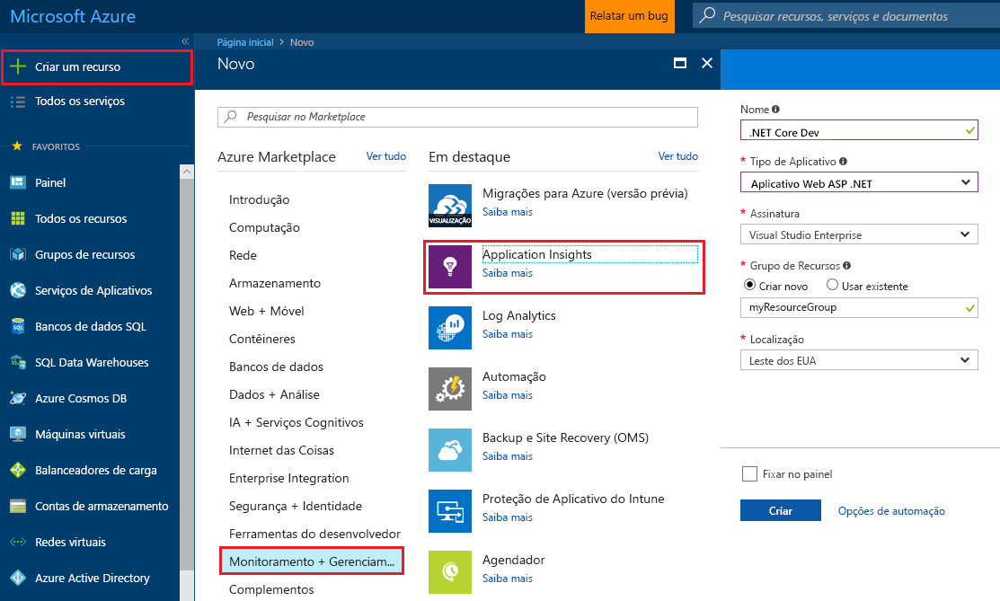
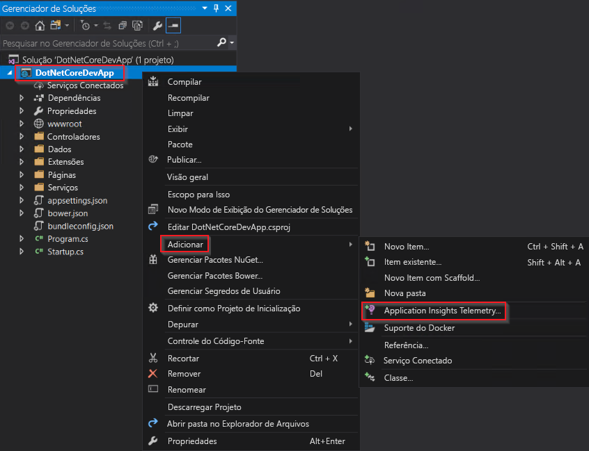
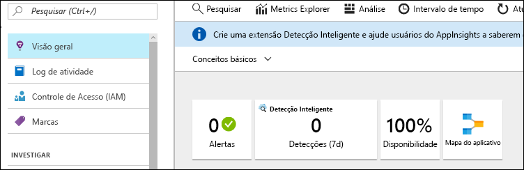
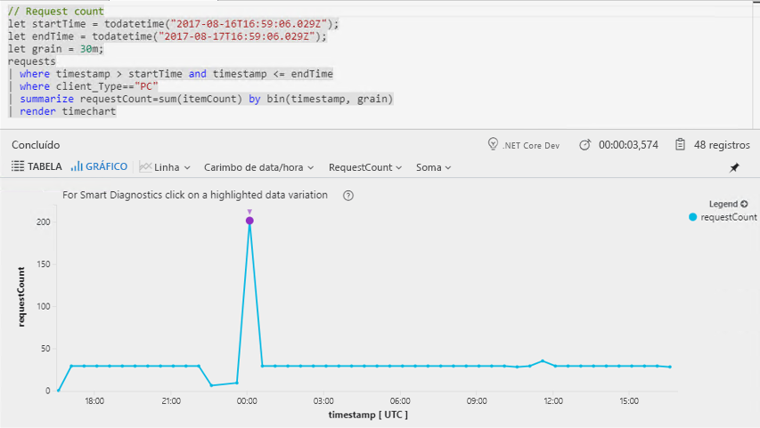
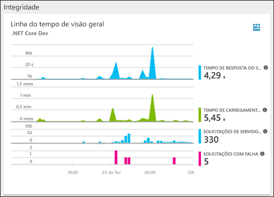
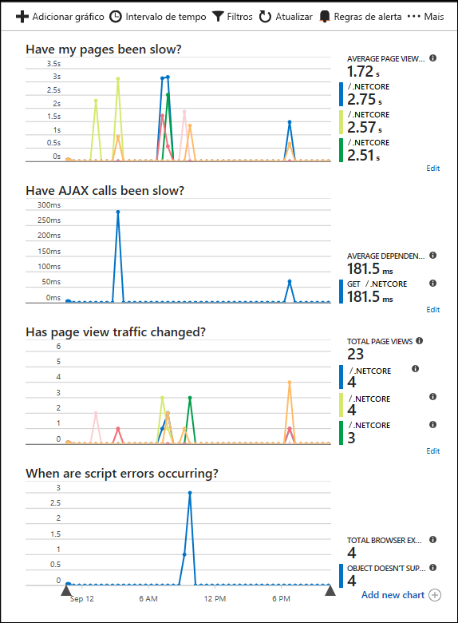

# <a name="start-monitoring-your-aspnet-core-web-application"></a>Começar a monitorar o aplicativo Web ASP.NET Core

Com o Azure Application Insights, você pode monitorar facilmente o aplicativo Web quanto à sua disponibilidade, desempenho e uso. Você também pode identificar e diagnosticar erros rapidamente em seu aplicativo sem esperar que um usuário os relate. 

Este guia de início rápido lhe ajuda a adicionar o SDK do Application Insights para um aplicativo Web ASP.NET Core existente. 

## <a name="prerequisites"></a>Pré-requisitos

Para concluir este guia de início rápido:

- [Instale o Visual Studio 2017](https://www.visualstudio.com/downloads/) com as cargas de trabalho a seguir:
  - Desenvolvimento Web e ASP.NET
  - Desenvolvimento do Azure
- [Instalar o SDK 2.0 do .NET Core](https://www.microsoft.com/net/core)
- Você precisará de uma assinatura do Azure e de um aplicativo Web .NET Core existente.

Se você não tiver um aplicativo Web ASP.NET Core, você poderá criar um seguindo o [guia Criar um aplicativo Web ASP.NET Core](https://docs.microsoft.com/en-us/aspnet/core/tutorials/publish-to-azure-webapp-using-vs).

Se você não tiver uma assinatura do Azure, crie uma conta [gratuita](https://azure.microsoft.com/free/) antes de começar.

## <a name="log-in-to-the-azure-portal"></a>Faça logon no Portal do Azure

Faça logon no [Portal do Azure](https://portal.azure.com/).

## <a name="enable-application-insights"></a>Habilitar o Application Insights

O Application Insights pode coletar dados de telemetria de qualquer aplicativo conectado à Internet, independentemente de ele estar sendo executado localmente ou na nuvem. Use as etapas a seguir para começar a exibir esses dados.

1. Selecione **Novo** > **Monitoramento + Gerenciamento** > **Application Insights**.

   

    Uma caixa de configuração será exibida, use a tabela a seguir para preencher os campos de entrada.

    | Configurações        |  Valor           | Descrição  |
   | ------------- |:-------------|:-----|
   | **Nome**      | Valor Globalmente Exclusivo | Nome que identifica o aplicativo que você está monitorando |
   | **Tipo de Aplicativo** | Aplicativo Web ASP.NET | O tipo do aplicativo que você está monitorando |
   | **Grupo de recursos**     | myResourceGroup      | Nome para o novo grupo de recursos no qual hospedar dados do Application Insights |
   | **Localidade** | Leste dos EUA | Escolher uma localização perto de você ou perto onde seu aplicativo está hospedado |

2. Clique em **Criar**.

## <a name="configure-app-insights-sdk"></a>Configurar o SDK do Application Insights

1. Abra o **projeto** de aplicativo Web ASP.NET Core no Visual Studio > Clique com o botão direito do mouse no AppName no **Gerenciador de Soluções** > Selecione **Adicionar** > **Application Insights Telemetry**.

    

2. Clique no botão **Começar Gratuitamente** > Selecione o **Recurso existente** criado no Portal do Azure > clique em **Registrar**.

3. Selecione **Depurar** > **Iniciar sem Depuração** (Ctrl + F5) para iniciar seu aplicativo

> [!NOTE]
> Leva 3 a 5 minutos para que os dados comecem a aparecer no portal. Se esse aplicativo é um aplicativo de teste de baixo tráfego, tenha em mente que a maioria das métricas só são capturadas quando há operações ou solicitações ativas.

## <a name="start-monitoring-in-the-azure-portal"></a>Iniciar o monitoramento no Portal do Azure

1. Agora você pode reabrir o a página **Visão Geral** do Application Insights no Portal do Azure, selecionando **Projeto** > **Application Insights** > **Abrir Portal do Application Insights** para exibir detalhes sobre o seu aplicativo em execução no momento.

   

2. Clique em **Mapa do aplicativo** para obter um layout visual das relações de dependência entre os componentes do aplicativo. Cada componente mostra KPIs como alertas, desempenho, falhas e carregamento.

   

3. Clique no ícone **Análise do Aplicativo** .  Isso abre a **Análise do Application Insights**, que fornece uma linguagem de consulta avançada para analisar todos os dados coletados pelo Application Insights. Nesse caso, uma consulta que renderiza a contagem de solicitações como um gráfico é gerada para você. Você pode escrever suas próprias consultas para analisar outros dados.

   

4. Volte para a página **Visão Geral** e examine a **linha do tempo de Visão Geral de Integridade**.  Esse painel fornece estatísticas sobre a integridade do aplicativo, incluindo o número de solicitações de entrada, a duração dessas solicitações e as falhas que ocorrem. 

   

   Para habilitar o gráfico **Tempo de Carregamento da Exibição de Página** para popular usando dados de **telemetria do lado do cliente**, adicione esse script a cada página que você desejar acompanhar:

   ```HTML
   <!-- 
   To collect end-user usage analytics about your application, 
   insert the following script into each page you want to track.
   Place this code immediately before the closing </head> tag,
   and before any other scripts. Your first data will appear 
   automatically in just a few seconds.
   -->
   <script type="text/javascript">
     var appInsights=window.appInsights||function(config){
       function i(config){t[config]=function(){var i=arguments;t.queue.push(function(){t[config].apply(t,i)})}}var t={config:config},u=document,e=window,o="script",s="AuthenticatedUserContext",h="start",c="stop",l="Track",a=l+"Event",v=l+"Page",y=u.createElement(o),r,f;y.src=config.url||"https://az416426.vo.msecnd.net/scripts/a/ai.0.js";u.getElementsByTagName(o)[0].parentNode.appendChild(y);try{t.cookie=u.cookie}catch(p){}for(t.queue=[],t.version="1.0",r=["Event","Exception","Metric","PageView","Trace","Dependency"];r.length;)i("track"+r.pop());return i("set"+s),i("clear"+s),i(h+a),i(c+a),i(h+v),i(c+v),i("flush"),config.disableExceptionTracking||(r="onerror",i("_"+r),f=e[r],e[r]=function(config,i,u,e,o){var s=f&&f(config,i,u,e,o);return s!==!0&&t["_"+r](config,i,u,e,o),s}),t
       }({
           instrumentationKey:"<insert instrumentation key>"
       });
       
       window.appInsights=appInsights;
       appInsights.trackPageView();
   </script>
   ```

5. Clique em **Navegador** sob o cabeçalho **Investigar**. Aqui você encontra métricas relacionadas ao desempenho das páginas do aplicativo. Você pode clicar em **Adicionar novo gráfico** para criar exibições personalizadas adicionais ou selecionar **Editar** para modificar a altura, paleta de cores, agrupamentos, métricas e tipos de gráfico existentes.

   

## <a name="clean-up-resources"></a>Limpar recursos

Se você pretende continuar trabalhando com guias de início rápido posteriores ou com os tutoriais, não limpe os recursos criados neste guia de início rápido. Caso contrário, siga estas etapas para excluir todos os recursos criados por esse início rápido no Portal do Azure.

1. No menu à esquerda no Portal do Azure, clique em **Grupos de recursos** e clique em **myResourceGroup**.
2. Em sua página de grupo de recursos, clique em **Excluir**, digite **myResourceGroup** na caixa de texto e clique **Excluir**.

## <a name="next-steps"></a>Próximas etapas

> [!div class="nextstepaction"]
> [Localizar e diagnosticar problemas de desempenho](https://docs.microsoft.com/en-us/azure/application-insights/app-insights-analytics)

