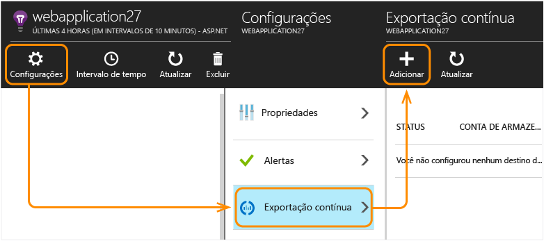
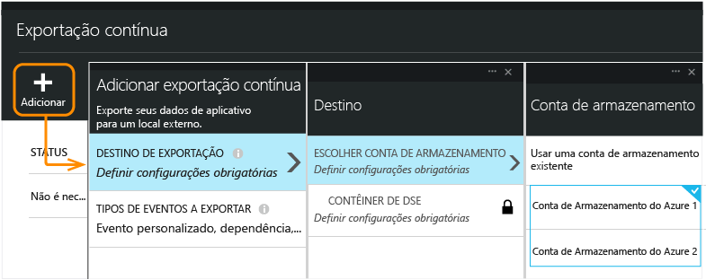
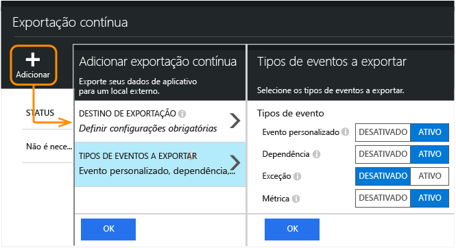
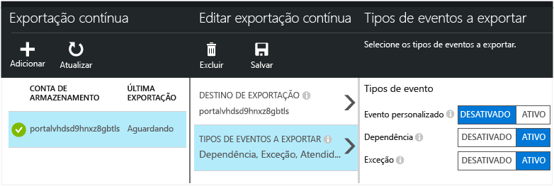
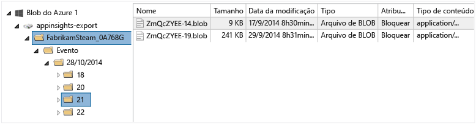
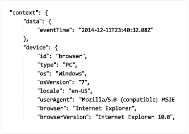
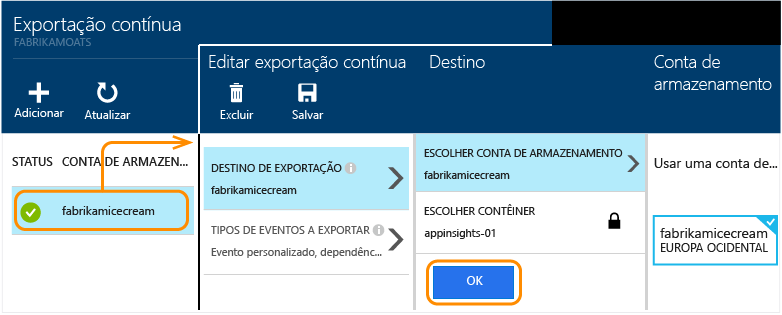

<properties 
	pageTitle="Exportação contínua de telemetria por meio do Application Insights" 
	description="Exportar dados de uso e diagnóstico para armazenamento no Microsoft Azure e baixá-los de lá." 
	services="application-insights" 
    documentationCenter=""
	authors="alancameronwills" 
	manager="douge"/>

<tags 
	ms.service="application-insights" 
	ms.workload="tbd" 
	ms.tgt_pltfrm="ibiza" 
	ms.devlang="na" 
	ms.topic="article" 
	ms.date="09/23/2015" 
	ms.author="awills"/>
 
# Exportar telemetria do Application Insights

Deseja fazer algumas análises personalizadas em sua telemetria? Ou talvez você gostaria de receber um alerta por email sobre eventos com propriedades específicas? Exportação contínua é ideal para isso. Os eventos que você vê no portal do Application Insights podem ser exportados para armazenamento no Microsoft Azure no formato JSON. Ali, você pode baixar os dados e gravar qualquer código de que você precisa para processá-los.

A Exportação Contínua está disponível no período de avaliação gratuita nos [planos de preços Standard e Premium](http://azure.microsoft.com/pricing/details/application-insights/).

(Se você quiser apenas fazer uma [exportação única](app-insights-metrics-explorer.md#export-to-excel) do que você vê em uma folha de métrica ou pesquisa, clique em Exportar na parte superior da folha.)

## Criar uma conta de armazenamento

Se você ainda não tiver uma conta de armazenamento "clássica", crie uma agora.

1. Crie uma conta de armazenamento “clássica” na sua assinatura do [Portal do Azure](https://portal.azure.com).

    

2. Criar um contêiner.

    

##  Configurar a exportação contínua

Na folha Visão geral do aplicativo no portal do Application Insights, abra Exportação contínua:

Adicione uma exportação e escolha uma [conta de armazenamento do Azure](../storage-introduction.md) no qual você deseja colocar os dados:

Escolha os tipos de eventos que você deseja exportar:

Depois de criar sua exportação, ela começa a ser realizada. (Você só obtém os dados que chegam após a criação da exportação.)

Pode haver um atraso de aproximadamente uma hora antes de os dados aparecem no blob.

Se você quiser alterar os tipos de evento mais tarde, basta editar a exportação:

Para interromper o fluxo, clique em Desabilitar. Quando você clicar em Habilitar novamente, o fluxo será reiniciado com novos dados. Você não obterá os dados recebidos no portal enquanto a exportação estava desabilitada.

Para interromper o fluxo permanentemente, exclua a exportação. Isso não exclui seus dados do armazenamento.

#### Não consegue adicionar nem alterar uma exportação?

* Para adicionar ou alterar exportações, você precisa de direitos de acesso de Proprietário, Colaborador ou Colaborador do Application Insights. [Saiba mais sobre as funções][roles].

##  Quais eventos você recebe?

Os dados exportados são a telemetria bruta que recebemos de seu aplicativo, exceto que adicionamos dados de localização que calculamos por meio do endereço IP do cliente.

Outras métricas calculadas não são incluídas. Por exemplo, nós não exportamos a utilização média de CPU, mas exportamos a telemetria bruta por meio da qual a média é computada.

Os dados também incluem os resultados de qualquer [teste de disponibilidade via Web](app-insights-monitor-web-app-availability.md) que você configurou.

##  Inspecionar os dados

Você pode inspecionar o armazenamento diretamente no portal. Clique em **Procurar**, selecione sua conta de armazenamento e abra **Contêineres**.

Para inspecionar o armazenamento do Azure no Visual Studio, abra **Exibir** e **Cloud Explorer**. (Se você não tiver esse comando de menu, precisará instalar o SDK do Azure: abra o diálogo **Novo Projeto**, expanda Visual C#/Nuvem e escolha **Obter o SDK do Microsoft Azure para .NET**.)

Quando você abrir o armazenamento de blob, verá um contêiner com um conjunto de arquivos de blob. O URI de cada arquivo deriva o nome do recurso Application Insights, da chave de instrumentação e do tipo/data/hora de telemetria. (O nome do recurso está todo em letras minúsculas e a chave de instrumentação omite traços.)

A data e hora são em formato UTC, e referentes a quando a telemetria foi depositada no repositório - não à hora em que essa telemetria foi gerada. Então, se você escrever código para baixar os dados, ele pode percorrer os dados linearmente.

##  Formato dos dados

* Cada blob é um arquivo de texto que contém várias linhas separadas por “ \\n”.
* Cada linha é um documento JSON não formatado. Se você quiser ficar olhando para ele, abra-o no Visual Studio e escolha Editar, Avançado, Arquivo de Formato:

As durações de tempo são em tiques, em que 10.000 tiques = 1 ms. Por exemplo, esses valores mostram um tempo de 10 ms para enviar uma solicitação do navegador, 30 ms recebê-la e 1,8 s para processar a página no navegador:

	"sendRequest": {"value": 10000.0},
	"receiveRequest": {"value": 30000.0},
	"clientProcess": {"value": 17970000.0}

[Referência de modelo de dados detalhados para os tipos de propriedades e valores.](app-insights-export-data-model.md)

## Processamento dos dados

Em pequena escala, você pode escrever um código para extrair e separar seus dados, lê-los em uma planilha e assim por diante. Por exemplo:

    private IEnumerable<T> DeserializeMany<T>(string folderName)
    {
      var files = Directory.EnumerateFiles(folderName, "*.blob", SearchOption.AllDirectories);
      foreach (var file in files)
      {
         using (var fileReader = File.OpenText(file))
         {
            string fileContent = fileReader.ReadToEnd();
            IEnumerable<string> entities = fileContent.Split('\n').Where(s => !string.IsNullOrWhiteSpace(s));
            foreach (var entity in entities)
            {
                yield return JsonConvert.DeserializeObject<T>(entity);
            }
         }
      }
    }

Para obter um exemplo de código maior, consulte [usando uma função de trabalho][exportasa].

## Excluir dados antigos
Observe que você é responsável por gerenciar a capacidade de armazenamento e excluir dados antigos, se necessário.

## Se você regenerar sua chave de armazenamento...

Se você alterar a chave para seu armazenamento, a exportação contínua deixará de funcionar. Você verá uma notificação em sua conta do Azure.

Abrir a folha Exportação Contínua e edite sua exportação. Edite o destino de exportação, mas mantenha o mesmo armazenamento selecionado. Clique em OK para confirmar.

A exportação contínua será reiniciada.

## Exportar para o Power BI

O [Microsoft Power BI](https://powerbi.microsoft.com/) apresenta seus dados em elementos visuais variados e avançados, com a capacidade de reunir informações de várias fontes. Você pode transmitir dados de telemetria sobre o desempenho e o uso de seus aplicativos do Application Insights para o Power BI.

[Transmitir Application Insights para o Power BI](app-insights-export-power-bi.md)

## Exportar para SQL

Outra opção é mover os dados para um banco de dados SQL, no qual você pode executar análises mais potentes.

Temos exemplos mostrando dois métodos alternativos de mover os dados do armazenamento de blob para um banco de dados:

* [Exportar para SQL usando uma função de trabalho][exportcode]
* [Exportar para o SQL usando o Stream Analytics][exportasa]

Em escalas maiores, considere usar o [HDInsight](http://azure.microsoft.com/services/hdinsight/) - clusters de Hadoop na nuvem. O HDInsight fornece uma variedade de tecnologias para gerenciar e analisar grandes volumes de dados.

## Perguntas e respostas

* *Mas tudo o que eu quero é um download único de um gráfico.*  
 
    Sim, você pode fazer isso. Na parte superior da folha, clique [Exportar dados](app-insights-metrics-explorer.md#export-to-excel).

* *Eu configuro uma exportação, mas não há nenhum dado no meu repositório.*

    O Application Insights recebeu qualquer telemetria do seu aplicativo desde que você configurou a exportação? Você receberá apenas novos dados.

* *Eu tentei configurar uma exportação, mas o acesso foi negado*

    Se a conta pertence à sua organização, você precisa ser membro do grupo de proprietários ou do grupo de colaboradores.

    <!-- Your account has to be either a paid-for account, or in the free trial period. -->

* *Eu posso exportar diretamente para meu próprio repositório local?*

    Não, infelizmente. Nosso mecanismo de exportação funciona apenas com o armazenamento do Azure no momento.

* *Há qualquer limite para a quantidade de dados que você coloca em meu repositório?*

    Não. Continuaremos a enviar dados por push até que você exclua a exportação. Interromperemos o envio se atingirmos os limites externos para o armazenamento de blob, mas são limites enormes. Cabe a você controlar a quantidade de armazenamento que usa.

* *Quantos blobs devo ver no armazenamento?*

 * Para cada tipo de dados selecionado para exportação, um novo blob é criado a cada minuto (se os dados estiverem disponíveis).
 * Além disso, para aplicativos com tráfego intenso, são alocadas unidades de partição adicionais. Nesse caso, cada unidade cria um blob a cada minuto.

* *Eu regenerei a chave para o meu armazenamento ou alterei o nome do contêiner, e agora a exportação não funciona.*

    Edite a exportação e abra a folha Destino de exportação. Deixe o mesmo armazenamento de antes selecionado e clique em OK para confirmar. A exportação será reiniciada. Se a alteração foi realizada nos últimos dias, você não perderá dados.

* *Posso pausar a exportação?*

    Sim. Clique em Desabilitar.

## Exemplos de código

* [Transmitir Application Insights para o Power BI](app-insights-export-power-bi.md)
* [Analisar o JSON exportado usando uma função de trabalho][exportcode]
* [Exportar para o SQL usando o Stream Analytics][exportasa]

* [Referência de modelo de dados detalhados para os tipos de propriedades e valores.](app-insights-export-data-model.md)

<!--Link references-->

[exportcode]: app-insights-code-sample-export-telemetry-sql-database.md
[exportasa]: app-insights-code-sample-export-sql-stream-analytics.md
[roles]: app-insights-resources-roles-access-control.md

 

<!---HONumber=Oct15_HO1-->