<properties
	pageTitle="Introdução ao Visual Studio Application Insights | Microsoft Azure"
	description="Analise o uso, disponibilidade e desempenho de seu local ou um aplicativo Web do Microsoft Azure com o Visual Studio Application Insights."
	services="application-insights"
    documentationCenter=""
	authors="alancameronwills"
	manager="douge"/>

<tags
	ms.service="application-insights"
	ms.workload="tbd"
	ms.tgt_pltfrm="ibiza"
	ms.devlang="na"
	ms.topic="hero-article"
	ms.date="10/05/2015"
	ms.author="awills"/>

# Introdução ao Visual Studio Application Insights

*O Application Insights está em modo de visualização.*

Detecte e resolva problemas e melhore continuamente seus aplicativos. Diagnostique problemas rapidamente em seu aplicativo em tempo real. Entenda o que os usuários fazem com ele.

A configuração é muito fácil, e você verá os resultados em minutos.

Atualmente damos suporte a aplicativos iOS, Android e Windows, aplicativos Web J2EE e ASP.NET e serviços WCF. Aplicativos Web podem ser executados no Azure ou seus próprios servidores locais. O SDK do JavaScript é executado em todas as páginas da web.

## Introdução

Inicie com qualquer combinação, em qualquer ordem, dos pontos de entrada que aparecem no diagrama a seguir. Siga o caminho que melhor funcione para você.

O Aplicativo Insights funciona adicionando um SDK ao seu aplicativo, que envia a telemetria para o [Portal do Azure](http://portal.azure.com). Há diferentes SDKs para várias combinações de plataformas, linguagens e IDEs com suporte.

Você precisará de uma conta no [Microsoft Azure](http://azure.com). Talvez você já tenha acesso a uma conta de grupo por meio de sua organização ou talvez você queira obter uma conta pré-paga. O Application Insights tem uma camada gratuita, assim, você não precisa pagar até que seu aplicativo se torne popular. Examine a [página de preços](https://azure.microsoft.com/pricing/details/application-insights/).

O que você deseja | O que fazer | O que você ganha
---|---|---
 <a href="app-insights-start-monitoring-app-health-usage.md">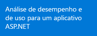</a> | <a href="app-insights-start-monitoring-app-health-usage.md">Adicione o SDK do Application Insights ao seu projeto Web</a>    | <a href="app-insights-start-monitoring-app-health-usage.md">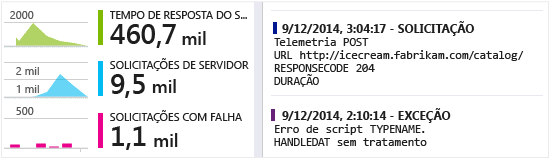</a>
<a href="app-insights-monitor-performance-live-website-now.md">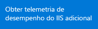</a> <a href="app-insights-monitor-performance-live-website-now.md">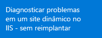</a>|<a href="app-insights-monitor-performance-live-website-now.md">Instalar o Monitor de Status no seu servidor IIS</a>    | <a href="app-insights-monitor-performance-live-website-now.md">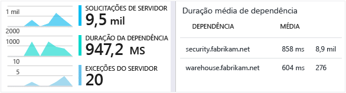</a>
<a href="insights-perf-analytics.md">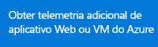</a>|<a href="insights-perf-analytics.md">Habilitar Insights no seu aplicativo Web ou VM do Azure</a>    | 
<a href="app-insights-java-get-started.md">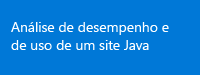</a>|<a href="app-insights-java-get-started.md">Adicionar o SDK ao seu projeto Java</a>  | <a href="app-insights-java-get-started.md">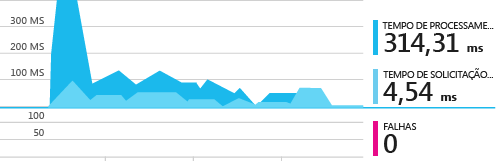</a>
<a href="app-insights-web-track-usage.md">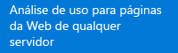</a>|<a href="app-insights-web-track-usage.md">Inserir o script do Application Insights em suas páginas da Web</a>  | <a href="app-insights-web-track-usage.md">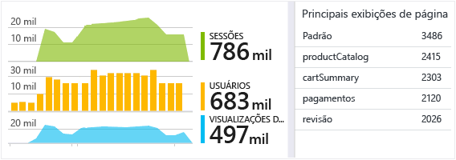</a>
<a href="app-insights-monitor-web-app-availability.md">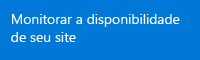</a>|<a href="app-insights-monitor-web-app-availability.md">Criar testes da Web</a>  | <a href="app-insights-monitor-web-app-availability.md">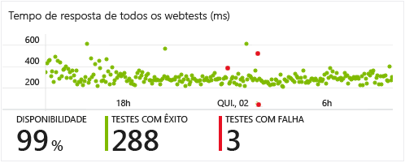</a>
|<a href="app-insights-windows-get-started.md">Adicionar o Application Insights ao seu projeto de aplicativo Windows</a>  | <a href="app-insights-windows-get-started.md">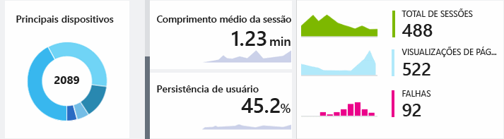</a>
<a href="app-insights-platforms.md">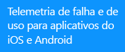</a>|<a href="app-insights-platforms.md">Adicionar o Application Insights ao seu projeto de aplicativo iOS ou Android</a>  | 

## Suporte e comentários

* Perguntas e problemas:
 * [Solucionar problemas][qna]
 * [Fórum do MSDN](https://social.msdn.microsoft.com/Forums/vstudio/pt-BR/home?forum=ApplicationInsights)
 * [StackOverflow](http://stackoverflow.com/questions/tagged/ms-application-insights)
* Bugs:
 * [Conectar-se](https://connect.microsoft.com/VisualStudio/Feedback/LoadSubmitFeedbackForm?FormID=6076)
* Sugestões:
 * [Voz do usuário](http://visualstudio.uservoice.com/forums/121579-visual-studio/category/77108-application-insights)
* Exemplos de código
 * [Exemplos de código](app-insights-code-samples.md)

## Vídeos

> [AZURE.VIDEO 218]

> [AZURE.VIDEO usage-monitoring-application-insights]

> [AZURE.VIDEO performance-monitoring-application-insights]

<!--Link references-->

[qna]: app-insights-troubleshoot-faq.md

<!---HONumber=Oct15_HO3-->