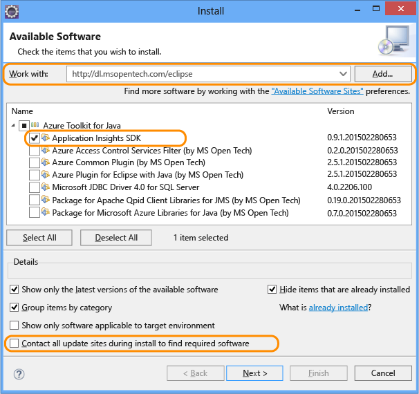

# <a name="get-started-with-application-insights-with-java-in-eclipse"></a>Introdução ao Application Insights com Java no Eclipse
O SDK do Application Insights envia telemetria por meio do seu aplicativo Web Java para que você possa analisar o uso e o desempenho. O plug-in Eclipse para o Application Insights instala automaticamente o SDK em seu projeto para que você obtenha telemetria já pronta, além de uma API que você pode usar para escrever telemetria personalizada.   

## <a name="prerequisites"></a>Pré-requisitos
Atualmente, o plug-in funciona para projetos Maven e projetos dinâmicos da Web no Eclipse.
([Adicione o Application Insights a outros tipos de projeto Java][java].)

Você precisará de:

* Oracle JRE 1.6 ou posterior
* Uma assinatura do [Microsoft Azure](https://azure.microsoft.com/).
* [Um IDE do Eclipse para desenvolvedores do Java EE](http://www.eclipse.org/downloads/), Indigo ou posterior.
* Windows 7 ou posterior, ou Windows Server 2008 ou posterior

## <a name="install-the-sdk-on-eclipse-one-time"></a>Instalar o SDK no Eclipse (uma vez)
Você só precisa fazer isso uma vez por computador. Esta etapa instala um kit de ferramentas que pode então adicionar o SDK para cada projeto Web dinâmico.

1. No Eclipse, clique em Ajuda, depois em Instalar novo Software.

    
2. O SDK está em http://dl.microsoft.com/eclipse, no Kit de Ferramentas do Azure.
3. Desmarque **Contatar todos os sites de atualização...**

    

Siga as etapas restantes para cada projeto Java.

## <a name="create-an-application-insights-resource-in-azure"></a>Criar um recurso do Application Insights no Azure
1. Entre no [Portal do Azure](https://portal.azure.com).
2. Criar um novo recurso do Application Insights Defina o tipo de aplicativo para aplicativo Web Java.  

      

4. Localize a chave de instrumentação do novo recurso. Você precisará colar isto no código de seu projeto em breve.  

      

## <a name="add-application-insights-to-your-project"></a>Adicione o Application Insights ao seu projeto
1. Adicione o Application Insights no menu de contexto do seu projeto Web Java.

    
2. Cole a chave de instrumentação que você obteve no portal do Azure.

    

A chave é enviada junto com todos os itens de telemetria e orienta o Application Insights a exibi-los em seu recurso.

## <a name="run-the-application-and-see-metrics"></a>Executar o aplicativo e ver as métricas
Execute seu aplicativo.

Retorne para seu recurso Application Insights no Microsoft Azure.

Dados de solicitações HTTP aparecerão na folha de visão geral. (Se não estiverem lá, aguarde alguns segundos e, em seguida, clique em Atualizar.)


Clique em qualquer gráfico para ver métricas mais detalhadas.


[Saiba mais sobre métricas.][metrics]

Ao exibir as propriedades de uma solicitação, você pode ver os eventos de telemetria associados a ela, como solicitações e exceções.


## <a name="client-side-telemetry"></a>Telemetria do lado do cliente
Na folha Início Rápido, clique em Obter código para monitorar as minhas páginas da Web:


Insira o trecho de código no título dos arquivos HTML.

#### <a name="view-client-side-data"></a>Exibir dados do lado do cliente
Abra suas páginas da Web atualizadas e use-as. Aguarde um ou dois minutos, retorne ao Application Insights e abra a folha de uso. (Na folha Visão geral, role para baixo e clique em Uso.)

As métricas de sessão, usuário e exibição de página serão exibidas na folha de uso:


[Saiba mais sobre como configurar a telemetria do lado do cliente.][usage]

## <a name="publish-your-application"></a>Publicar seu aplicativo
Agora, publique seu aplicativo no servidor, permita que as pessoas o usem e observe a telemetria mostrada no portal.

* Verifique se o firewall permite que seu aplicativo envie telemetria para estas portas:

  * dc.services.visualstudio.com:443
  * dc.services.visualstudio.com:80
  * f5.services.visualstudio.com:443
  * f5.services.visualstudio.com:80
* Nos servidores Windows, instale:

  * [Microsoft Visual C++ redistribuível](http://www.microsoft.com/download/details.aspx?id=40784)

    (Isso habilita os contadores de desempenho.)

## <a name="exceptions-and-request-failures"></a>Falhas de solicitação e exceções
Exceções sem tratamento são coletadas automaticamente:


Para coletar dados em outras exceções, você tem duas opções:

* [Inserir chamadas a TrackException em seu código](app-insights-api-custom-events-metrics.md#trackexception).
* [Instalar o Agente Java em seu servidor](app-insights-java-agent.md). Especifique os métodos que deseja inspecionar.

## <a name="monitor-method-calls-and-external-dependencies"></a>Monitorar chamadas de método e dependências externas
[Instale o Agente Java](app-insights-java-agent.md) para registrar métodos internos especificados e chamadas feitas por meio de JDBC, com dados de tempo.

## <a name="performance-counters"></a>Contadores de desempenho
Na folha Visão geral, role para baixo e clique no bloco **Servidores**. Você verá uma variedade de contadores de desempenho.


### <a name="customize-performance-counter-collection"></a>Personalizar a coleta do contador de desempenho
Para desabilitar a coleta do conjunto padrão de contadores de desempenho, adicione o seguinte trecho no nó raiz do arquivo ApplicationInsights.xml:

```XML

    <PerformanceCounters>
       <UseBuiltIn>False</UseBuiltIn>
    </PerformanceCounters>
```

### <a name="collect-additional-performance-counters"></a>Coletar contadores de desempenho adicionais
Você pode especificar contadores de desempenho adicionais a serem coletados.

#### <a name="jmx-counters-exposed-by-the-java-virtual-machine"></a>Contadores JMX (expostos pela Máquina Virtual Java)

```XML

    <PerformanceCounters>
      <Jmx>
        <Add objectName="java.lang:type=ClassLoading" attribute="TotalLoadedClassCount" displayName="Loaded Class Count"/>
        <Add objectName="java.lang:type=Memory" attribute="HeapMemoryUsage.used" displayName="Heap Memory Usage-used" type="composite"/>
      </Jmx>
    </PerformanceCounters>
```

* `displayName` – o nome exibido no portal do Application Insights.
* `objectName` – o nome do objeto JMX.
* `attribute` – o atributo do nome do objeto JMX a buscar
* `type` (opcional) - o tipo do atributo do objeto JMX:
  * Padrão: um tipo simples como “int” ou “long”.
  * `composite`: os dados do contador de desempenho estão no formato “Attribute.Data”
  * `tabular`: os dados do contador de desempenho estão no formato de uma linha de tabela

#### <a name="windows-performance-counters"></a>Contadores de desempenho do Windows
Cada [contador de desempenho do Windows](https://msdn.microsoft.com/library/windows/desktop/aa373083.aspx) é membro de uma categoria (do mesmo modo que um campo é um membro de uma classe). Categorias podem ser globais, ou podem ter instâncias numeradas ou nomeadas.

```XML

    <PerformanceCounters>
      <Windows>
        <Add displayName="Process User Time" categoryName="Process" counterName="%User Time" instanceName="__SELF__" />
        <Add displayName="Bytes Printed per Second" categoryName="Print Queue" counterName="Bytes Printed/sec" instanceName="Fax" />
      </Windows>
    </PerformanceCounters>
```

* displayName - o nome exibido no portal do Application Insights.
* categoryName – a categoria de contador de desempenho (objeto de desempenho) a qual este contador de desempenho está associado
* counterName – o nome do contador de desempenho
* instanceName – o nome da instância da categoria do contador de desempenho ou uma cadeia de caracteres vazia (""), se a categoria contém uma única instância. Se categoryName é o processo, e o contador de desempenho que você gostaria de coletar faz parte do processo atual da JVM em que seu aplicativo está sendo executado, especifique `"__SELF__"`.

Seus contadores de desempenho são visíveis como métricas personalizadas em [Metrics Explorer][metrics].


### <a name="unix-performance-counters"></a>Contadores de desempenho do Unix
* [Instale o collectd com o plug-in do Application Insights](app-insights-java-collectd.md) para obter uma ampla variedade de dados de sistema e rede.

## <a name="availability-web-tests"></a>Testes de disponibilidade na Web
O Application Insights pode testar seu site em intervalos regulares para verificar ele está operante e respondendo bem. [Para configurar][availability], role para baixo para clicar em Disponibilidade.


Se seu site ficar inativo, você obterá gráficos de tempos de resposta e também notificações por email.


[Saiba mais sobre testes de disponibilidade via web.][availability]

## <a name="diagnostic-logs"></a>Logs de diagnóstico
Se você estiver usando Logback ou Log4J (v&1;.2 ou&2;.0) para rastreamento, você pode enviar seus logs de rastreamento automaticamente para o Application Insights, no qual você pode explorá-los e pesquisar o conteúdo deles.

[Saiba mais sobre logs de diagnóstico][javalogs]

## <a name="custom-telemetry"></a>Telemetria personalizada
Insira algumas linhas de código em seu aplicativo Web Java para descobrir o que os usuários estão fazendo com ele, ou para ajudar a diagnosticar problemas.

Você pode inserir o código tanto no JavaScript da página da Web quanto no Java do lado do servidor.

[Saiba mais sobre a telemetria personalizada][track]

## <a name="next-steps"></a>Próximas etapas
#### <a name="detect-and-diagnose-issues"></a>Detectar e diagnosticar problemas
* [Adicione telemetria do cliente Web][usage] para obter a telemetria de desempenho do cliente Web.
* [Configure os testes da Web][availability] para certificar-se de manter seu aplicativo operante e responsivo.
* [Pesquise eventos e logs][diagnostic] para ajudar a diagnosticar problemas.
* [Capturar rastreamentos do Log4J ou Logback][javalogs]

#### <a name="track-usage"></a>Acompanhar uso
* [Adicione telemetria do cliente Web][usage] para monitorar modos de exibição de página e métricas de usuário básico.
* [Acompanhe métricas e eventos personalizados][track] para saber mais sobre como o aplicativo é usado, tanto no cliente quanto no servidor.

<!--Link references-->

[availability]: app-insights-monitor-web-app-availability.md
[diagnostic]: app-insights-diagnostic-search.md
[java]: app-insights-java-get-started.md
[javalogs]: app-insights-java-trace-logs.md
[metrics]: app-insights-metrics-explorer.md
[track]: app-insights-api-custom-events-metrics.md
[usage]: app-insights-web-track-usage.md


<!--HONumber=Feb17_HO1-->


