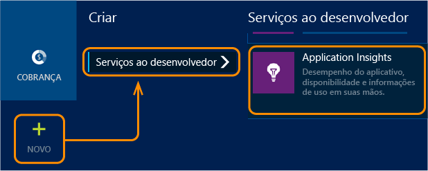
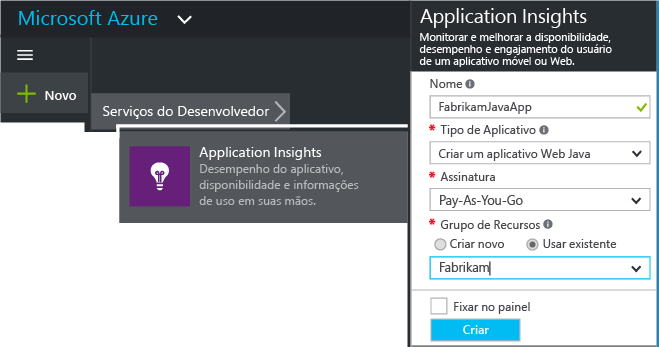
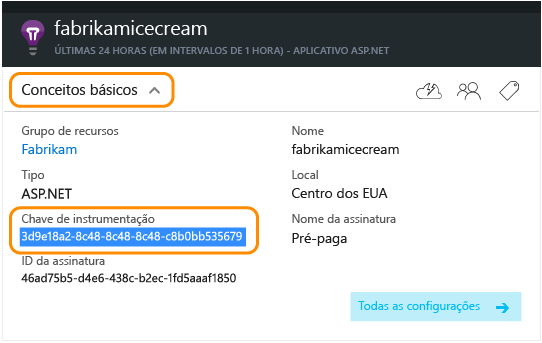
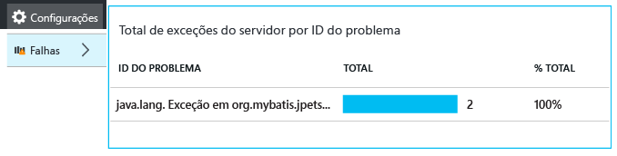
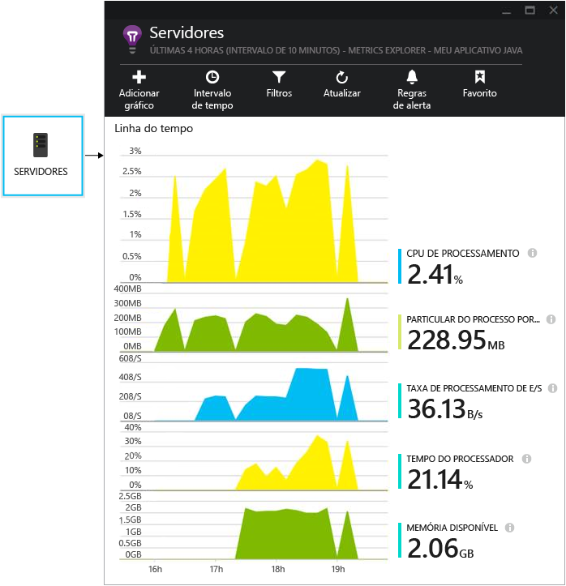
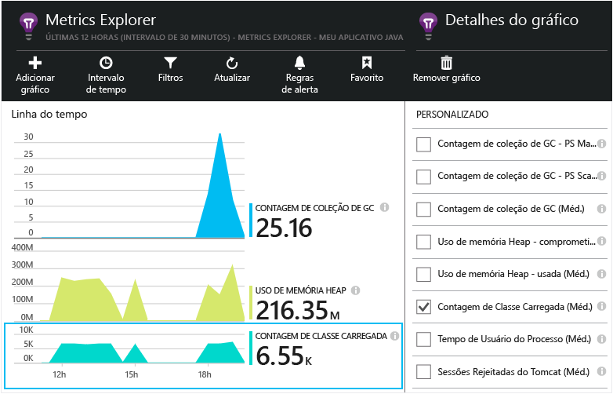

<properties
	pageTitle="Introdução ao Application Insights em um projeto Web Java | Microsoft Azure"
	description="Monitorar o desempenho e o uso de seu site Java com o Application Insights"
	services="application-insights"
    documentationCenter="java"
	authors="alancameronwills"
	manager="douge"/>

<tags
	ms.service="application-insights"
	ms.workload="tbd"
	ms.tgt_pltfrm="ibiza"
	ms.devlang="na"
	ms.topic="get-started-article"
	ms.date="09/09/2015"
	ms.author="awills"/>

# Introdução ao Application Insights em um projeto Web Java

*O Application Insights está em modo de visualização.*

[AZURE.INCLUDE [app-insights-selector-get-started](../../includes/app-insights-selector-get-started.md)]

[Application Insights](https://azure.microsoft.com/services/application-insights/) é um serviço de análise extensível que ajuda você a entender o desempenho e o uso de seu aplicativo em tempo real. Use-o para [detectar e diagnosticar exceções e problemas de desempenho](app-insights-detect-triage-diagnose.md), bem como para [escrever código][api] a fim de rastrear o que os usuários fazem com o aplicativo.

[Testes na Web do Application Insights][availability] monitoram a disponibilidade do aplicativo.

Você precisará de:

* Oracle JRE 1.6 ou posterior, ou então JRE Zulu 1.6 ou posterior
* Uma assinatura do [Microsoft Azure](http://azure.microsoft.com/). (Você pode começar com a [avaliação gratuita](http://azure.microsoft.com/pricing/free-trial/).)

*Se você tiver um aplicativo Web já em uso, siga o procedimento alternativo para [adicionar o SDK em tempo de execução ao servidor Web](app-insights-java-live.md). Essa alternativa evita a recompilação do código, mas você não obtém a opção de escrever código para rastrear a atividade do usuário.*

## 1\. Obter uma chave de instrumentação do Application Insights

1. Entre no [Portal do Microsoft Azure](https://portal.azure.com).
2. Criar um novo recurso do Application Insights

    
3. Defina o tipo de aplicativo para aplicativo Web Java.

    
4. Localize a chave de instrumentação do novo recurso. Você precisará colar isto no código de seu projeto em breve.

    

## 2\. Adicionar o SDK do Application Insights para Java a seu projeto

*Escolha o modo apropriado para seu projeto.*

#### Se você estiver criando um projeto Web dinâmico no Eclipse...

Use o [plug-in SDK do Application Insights para Java][eclipse].

#### Se você estiver usando o Maven...

Se o seu projeto já estiver configurado para usar o Maven para compilação, realize a mesclagem do código a seguir ao seu arquivo pom.xml.

Em seguida, atualize as dependências do projeto para obter os binários baixados.

    <repositories>
       <repository>
          <id>central</id>
          <name>Central</name>
          <url>http://repo1.maven.org/maven2</url>
       </repository>
    </repositories>

    <dependencies>
      <dependency>
        <groupId>com.microsoft.azure</groupId>
        <artifactId>applicationinsights-web</artifactId>
        <!-- or applicationinsights-core for bare API -->
        <version>[1.0,)</version>
      </dependency>
    </dependencies>

* *Erros de validação de soma de verificação ou compilação?* Tente usar uma versão específica, como: `<version>1.0.n</version>`. Você encontrará a versão mais recente nas [notas de versão do SDK](app-insights-release-notes-java.md) ou nos nossos [artefatos Maven](http://search.maven.org/#search%7Cga%7C1%7Capplicationinsights).
* *Precisa atualizar para um novo SDK?* Atualize as dependências do seu projeto.

#### Se você estiver usando o Gradle...

Se o seu projeto já estiver configurado para usar o Gradle para compilação, realize a mesclagem do trecho de código a seguir ao seu arquivo build.gradle.

Em seguida, atualize as dependências do projeto para obter os binários baixados.

    repositories {
      mavenCentral()
    }

    dependencies {
      compile group: 'com.microsoft.azure', name: 'applicationinsights-web', version: '1.+'
      // or applicationinsights-core for bare API
    }

* *Erros de validação de soma de verificação ou compilação? Tente usar uma versão específica, como: * * `version:'1.0.n'`. *Você encontrará a versão mais recente nas [notas de versão do SDK](app-insights-release-notes-java.md).*
* *Para atualizar para um novo SDK*
 * Atualize as dependências do seu projeto.

#### Caso contrário...

Adicione manualmente o SDK:

1. Baixe o [Application Insights SDK para Java](http://dl.windowsazure.com/lib/applicationinsights/javabin/sdk.zip).
2. Extraia os binários do arquivo de zip e adicione-os ao projeto.

### Perguntas...

* *Qual é a relação entre `-core` e os componentes `-web` no zip?*

 * `applicationinsights-core` fornece a API básica. isso é sempre útil.
 * `applicationinsights-web` fornece métricas que rastreiam as contagens de solicitação de HTTP e tempos de resposta. Você pode omitir isso se não quiser que essa telemetria seja coletada automaticamente. Por exemplo, se quiser escrevê-la você mesmo.

* *Para atualizar o SDK ao publicar alterações*
 * Baixe o [Application Insights SDK para Java](http://dl.windowsazure.com/lib/applicationinsights/javabin/sdk.zip) mais recente e substitua os antigos.
 * As alterações descritas nas [notas de versão do SDK](app-insights-release-notes-java.md).

## 3\. Adicione um arquivo xml do Application Insights

Adicione o ApplicationInsights.xml à pasta de recursos em seu projeto; caso contrário, verifique se ele é adicionado ao caminho de classe de implantação do projeto. Copie o XML a seguir nele.

Substitua a chave de instrumentação que você obteve no Portal do Azure.

    <?xml version="1.0" encoding="utf-8"?>
    <ApplicationInsights xmlns="http://schemas.microsoft.com/ApplicationInsights/2013/Settings" schemaVersion="2014-05-30">

      <!-- The key from the portal: -->

      <InstrumentationKey>** Your instrumentation key **</InstrumentationKey>

      <!-- HTTP request component (not required for bare API) -->

      <TelemetryModules>
        <Add type="com.microsoft.applicationinsights.web.extensibility.modules.WebRequestTrackingTelemetryModule"/>
        <Add type="com.microsoft.applicationinsights.web.extensibility.modules.WebSessionTrackingTelemetryModule"/>
        <Add type="com.microsoft.applicationinsights.web.extensibility.modules.WebUserTrackingTelemetryModule"/>
      </TelemetryModules>

      <!-- Events correlation (not required for bare API) -->
      <!-- These initializers add context data to each event -->

      <TelemetryInitializers>
        <Add   type="com.microsoft.applicationinsights.web.extensibility.initializers.WebOperationIdTelemetryInitializer"/>
        <Add type="com.microsoft.applicationinsights.web.extensibility.initializers.WebOperationNameTelemetryInitializer"/>
        <Add type="com.microsoft.applicationinsights.web.extensibility.initializers.WebSessionTelemetryInitializer"/>
        <Add type="com.microsoft.applicationinsights.web.extensibility.initializers.WebUserTelemetryInitializer"/>
        <Add type="com.microsoft.applicationinsights.web.extensibility.initializers.WebUserAgentTelemetryInitializer"/>

      </TelemetryInitializers>
    </ApplicationInsights>

* A chave de instrumentação é enviada junto com todos os itens de telemetria e orienta o Application Insights a exibi-los em seu recurso.
* O componente de solicitação HTTP é opcional. Ele envia automaticamente a telemetria sobre solicitações e tempos de resposta para o portal.
* A correlação de eventos é uma adição ao componente de solicitação HTTP. Ele atribui um identificador a cada solicitação recebida pelo servidor e adiciona isso como uma propriedade para cada item de telemetria, como a propriedade “Operation.Id”. Ele permite que você correlacione a telemetria associada com cada solicitação, definindo um filtro na [pesquisa de diagnóstico][diagnostic].

## 4\. Adicionar um filtro HTTP

A última etapa de configuração permite que o componente de solicitação HTTP registre cada solicitação da Web. (Não obrigatório se você quiser apenas a API vazia.)

Localize e abra o arquivo web.xml em seu projeto. Em seguida, mescle o código a seguir com o nó do aplicativo Web no qual seus filtros de aplicativo estão configurados.

Para obter os resultados mais precisos, o filtro deve ser mapeado antes de todos os outros filtros.

    <filter>
      <filter-name>ApplicationInsightsWebFilter</filter-name>
      <filter-class>
        com.microsoft.applicationinsights.web.internal.WebRequestTrackingFilter
      </filter-class>
    </filter>
    <filter-mapping>
       <filter-name>ApplicationInsightsWebFilter</filter-name>
       <url-pattern>/*</url-pattern>
    </filter-mapping>

#### Se você estiver usando o MVC 3.1 ou posterior

Edite esses elementos para incluir o pacote do Application Insights:

    <context:component-scan base-package=" com.springapp.mvc, com.microsoft.applicationinsights.web.spring"/>

    <mvc:interceptors>
        <mvc:interceptor>
            <mvc:mapping path="/**"/>
            <bean class="com.microsoft.applicationinsights.web.spring.RequestNameHandlerInterceptorAdapter" />
        </mvc:interceptor>
    </mvc:interceptors>

#### Se você estiver usando o Struts 2

Adicione este item ao arquivo de configuração do Struts (geralmente chamado de struts.xml ou struts-default.xml):

     <interceptors>
       <interceptor name="ApplicationInsightsRequestNameInterceptor" class="com.microsoft.applicationinsights.web.struts.RequestNameInterceptor" />
     </interceptors>
     <default-interceptor-ref name="ApplicationInsightsRequestNameInterceptor" />

(Se você tiver interceptores definidos em uma pilha padrão, o interceptador pode simplesmente ser adicionado àquela pilha.)

## 5\. Execute seu aplicativo.

Execute-o no modo de depuração no computador de desenvolvimento ou publique em seu servidor.

## 6\. Exibir sua telemetria no Application Insights

Retorne para seu recurso do Application Insights no [Portal do Microsoft Azure](https://portal.azure.com).

Dados de solicitações HTTP aparecerão na folha de visão geral. (Se não estiverem lá, aguarde alguns segundos e, em seguida, clique em Atualizar.)

Clique em qualquer gráfico para ver métricas mais detalhadas.

Ao exibir as propriedades de uma solicitação, você pode ver os eventos de telemetria associados a ela, como solicitações e exceções.

[Saiba mais sobre métricas.][metrics]

#### Cálculo de nome de endereço inteligente

O Application Insights presume que o formato de solicitações HTTP para aplicativos MVC é: `VERB controller/action`

Por exemplo, `GET Home/Product/f9anuh81`, `GET Home/Product/2dffwrf5` e `GET Home/Product/sdf96vws` serão agrupados em `GET Home/Product`.

Isso permite agregações significativas de solicitações, como o número de solicitações e o tempo médio de execução para solicitações.

## 5\. Instalar aplicativo no servidor

Agora, publique seu aplicativo no servidor, permita que as pessoas o usem e observe a telemetria mostrada no portal.

* Verifique se o firewall permite que seu aplicativo envie telemetria para estas portas:

 * dc.services.visualstudio.com:443
 * dc.services.visualstudio.com:80
 * f5.services.visualstudio.com:443
 * f5.services.visualstudio.com:80

* Nos servidores Windows, instale:

 * [Microsoft Visual C++ redistribuível](http://www.microsoft.com/download/details.aspx?id=40784)

    (Isso habilita os contadores de desempenho.)

## Falhas de solicitação e exceções

Exceções sem tratamento são coletadas automaticamente:

Para coletar dados em outras exceções, você tem duas opções:

* [Inserir chamadas a TrackException em seu código][apiexceptions]. 
* [Instalar o Agente Java em seu servidor](app-insights-java-agent.md). Especifique os métodos que deseja inspecionar.

## Monitorar chamadas de método e dependências externas

[Instale o Agente Java](app-insights-java-agent.md) para registrar métodos internos especificados e chamadas feitas por meio de JDBC, com dados de tempo.

## Contadores de desempenho

Clique no bloco **Servidores** e você verá uma variedade de contadores de desempenho.

### Personalizar a coleta do contador de desempenho

Para desabilitar a coleta do conjunto padrão de contadores de desempenho, adicione o seguinte trecho no nó raiz do arquivo ApplicationInsights.xml:

    <PerformanceCounters>
       <UseBuiltIn>False</UseBuiltIn>
    </PerformanceCounters>

### Coletar contadores de desempenho adicionais

Você pode especificar contadores de desempenho adicionais a serem coletados.

#### Contadores JMX (expostos pela Máquina Virtual Java)

    <PerformanceCounters>
      <Jmx>
        <Add objectName="java.lang:type=ClassLoading" attribute="TotalLoadedClassCount" displayName="Loaded Class Count"/>
        <Add objectName="java.lang:type=Memory" attribute="HeapMemoryUsage.used" displayName="Heap Memory Usage-used" type="composite"/>
      </Jmx>
    </PerformanceCounters>

*	`displayName` – o nome exibido no portal do Application Insights.
*	`objectName` – o nome do objeto JMX.
*	`attribute` – o atributo do nome do objeto JMX a buscar
*	`type` (opcional) - o tipo do atributo do objeto JMX:
 *	Padrão: um tipo simples como “int” ou “long”.
 *	`composite`: os dados do contador de desempenho estão no formato “Attribute.Data”
 *	`tabular`: os dados do contador de desempenho estão no formato de uma linha de tabela

#### Contadores de desempenho do Windows

Cada [contador de desempenho do Windows](https://msdn.microsoft.com/library/windows/desktop/aa373083.aspx) é membro de uma categoria (do mesmo modo que um campo é um membro de uma classe). Categorias podem ser globais, ou podem ter instâncias numeradas ou nomeadas.

    <PerformanceCounters>
      <Windows>
        <Add displayName="Process User Time" categoryName="Process" counterName="%User Time" instanceName="__SELF__" />
        <Add displayName="Bytes Printed per Second" categoryName="Print Queue" counterName="Bytes Printed/sec" instanceName="Fax" />
      </Windows>
    </PerformanceCounters>

*	displayName - o nome exibido no portal do Application Insights.
*	categoryName – a categoria de contador de desempenho (objeto de desempenho) a qual este contador de desempenho está associado
*	counterName – o nome do contador de desempenho
*	instanceName – o nome da instância da categoria do contador de desempenho ou uma cadeia de caracteres vazia (""), se a categoria contém uma única instância. Se categoryName é o processo, e o contador de desempenho que você gostaria de coletar faz parte do processo atual da JVM em que seu aplicativo está sendo executado, especifique `"__SELF__"`.

Seus contadores de desempenho são visíveis como métricas personalizadas em [Metrics Explorer][metrics].

### Contadores de desempenho do Unix

* [Instale o collectd com o plug-in do Application Insights](app-insights-java-collectd.md) para obter uma ampla variedade de dados de sistema e rede.

## Obter dados de usuário e de sessão

OK, você está enviando a telemetria do seu servidor Web. Agora, para ver o panorama completo do seu aplicativo, você pode adicionar um monitoramento mais:

* [Adicione telemetria às suas páginas da Web][usage] para monitorar exibições de página e métricas de usuário.
* [Configure os testes da Web][availability] para certificar-se de manter seu aplicativo operante e responsivo.

## Capturar rastreamentos de log

Você pode usar o Application Insights para fracionar e dividir logs de Log4J, Logback ou outras estruturas de registros. Você pode correlacionar os logs de solicitações HTTP e outras telemetrias. [Saiba como][javalogs].

## Enviar sua própria telemetria

Agora que você instalou o SDK, você pode usar a API para enviar sua próprias telemetrias.

* [Acompanhe eventos personalizados e métricas][api] para saber o que os usuários estão fazendo com seu aplicativo.
* [Pesquise eventos e logs][diagnostic] para ajudar a diagnosticar problemas.

## Testes de disponibilidade na Web

O Application Insights pode testar seu site em intervalos regulares para verificar ele está operante e respondendo bem. Para configurar, clique no gráfico vazio de testes da Web na folha de visão geral e forneça sua URL pública.

Se seu site ficar inativo, você obterá gráficos de tempos de resposta e também notificações por email.

[Saiba mais sobre testes de disponibilidade via web.][availability]

## Perguntas? Problemas?

[Solucionar problemas de Java](app-insights-java-troubleshoot.md)

<!--Link references-->

[api]: app-insights-api-custom-events-metrics.md
[apiexceptions]: app-insights-api-custom-events-metrics.md#track-exception
[availability]: app-insights-monitor-web-app-availability.md
[diagnostic]: app-insights-diagnostic-search.md
[eclipse]: app-insights-java-eclipse.md
[javalogs]: app-insights-java-trace-logs.md
[metrics]: app-insights-metrics-explorer.md
[usage]: app-insights-web-track-usage.md

<!---HONumber=Sept15_HO3-->