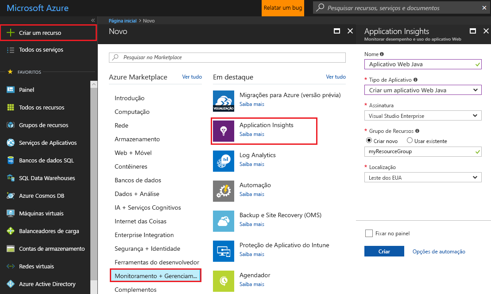
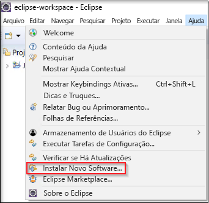
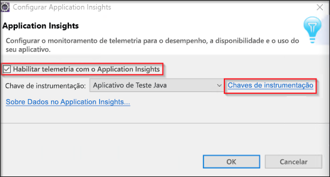
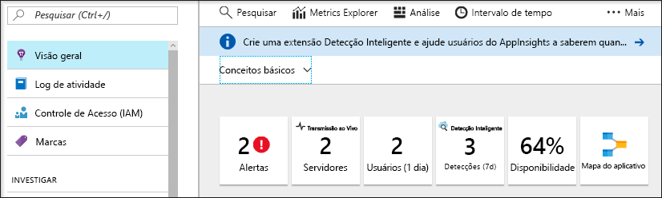
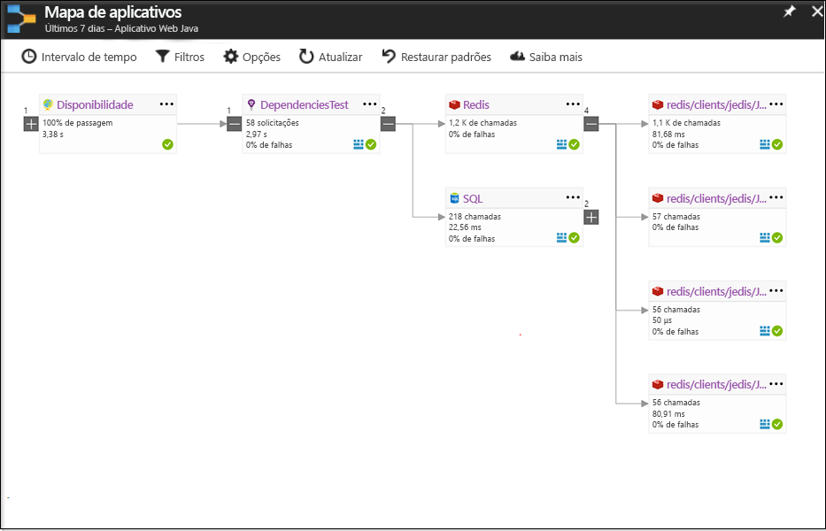
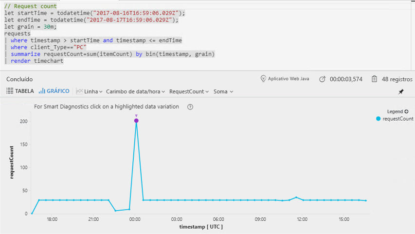
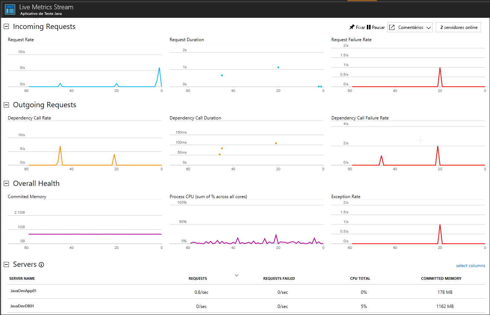

# <a name="start-monitoring-your-java-web-application"></a>Começar a monitorar o aplicativo Web Java

Com o Azure Application Insights, você pode monitorar facilmente o aplicativo Web quanto à sua disponibilidade, desempenho e uso. Você também pode identificar e diagnosticar erros rapidamente em seu aplicativo sem esperar que um usuário os relate. Com o SDK do Java do Application Insights você pode monitorar pacotes comuns de terceiros, incluindo MongoDB, MySQL e Redis.

Este guia de início rápido lhe ajuda a adicionar o SDK do Application Insights para um projeto Web dinâmico Java existente.

## <a name="prerequisites"></a>Pré-requisitos

Para concluir este guia de início rápido:

- Instale o Oracle JRE 1.6 ou posterior ou então o JRE Zulu 1.6 ou posterior
- Instale o [Eclipse IDE para desenvolvedores de Java EE gratuito](http://www.eclipse.org/downloads/). Este guia de início rápido usa Eclipse Oxygen (4.7)
- Você precisará de uma assinatura do Azure e de um projeto Web dinâmico Java existente
 
Se você não tiver um projeto Web dinâmico Java, você poderá criar um com o [guia de início rápido Criar um aplicativo Web Java](https://docs.microsoft.com/en-us/azure/app-service-web/app-service-web-get-started-java).

Se você não tiver uma assinatura do Azure, crie uma conta [gratuita](https://azure.microsoft.com/free/) antes de começar.

## <a name="log-in-to-the-azure-portal"></a>Faça logon no Portal do Azure

Faça logon no [Portal do Azure](https://portal.azure.com/).

## <a name="enable-application-insights"></a>Habilitar o Application Insights

O Application Insights pode coletar dados de telemetria de qualquer aplicativo conectado à Internet, independentemente de ele estar sendo executado localmente ou na nuvem. Use as etapas a seguir para começar a exibir esses dados.

1. Selecione **Novo** > **Monitoramento + Gerenciamento** > **Application Insights**.

   

   Uma caixa de configuração será exibida, use a tabela a seguir para preencher os campos de entrada.

    | Configurações        | Valor           | Descrição  |
   | ------------- |:-------------|:-----|
   | **Nome**      | Valor Globalmente Exclusivo | Nome que identifica o aplicativo que você está monitorando |
   | **Tipo de Aplicativo** | Aplicativo Web Java | O tipo do aplicativo que você está monitorando |
   | **Grupo de recursos**     | myResourceGroup      | Nome para o novo grupo de recursos no qual hospedar dados do Application Insights |
   | **Localidade** | Leste dos EUA | Escolher uma localização perto de você ou perto onde seu aplicativo está hospedado |

2. Clique em **Criar**.

## <a name="install-app-insights-plugin"></a>Instalar o plug-in Application Insights

1. Inicie o **Eclipse** > Clique em **Ajuda** > Selecione **Instalar Novo Software**.

   

2. Copie ```http://dl.microsoft.com/eclipse``` no campo de "Trabalhar Com" > Marque **Kit de Ferramentas do Azure para Java** > Selecione **plug-in Application Insights para Java** > **Desmarque** "Contatar todos os sites de atualização durante a instalação para localizar o software necessário."

3. Depois que a instalação for concluída, você receberá uma solicitação para **Reiniciar o Eclipse**.

## <a name="configure-app-insights-plugin"></a>Configurar o Plugin Application Insights

1. Inicie **Eclipse** > Abra seu **Projeto** > Clique com o botão direito do mouse no nome do projeto no **Explorador de Projeto** > selecione **Azure** > Clique em **Entrar**.

2. Selecione o método de autenticação **Interativo** > Clique em **Entrar** > Quando solicitado, insira as **Credenciais do Azure** > Selecione a **Assinatura do Azure**.

3. Clique com o botão direito do mouse o nome do projeto em **Explorador de Projeto** > Selecione **Azure** > Clique em **Configurar o Application Insights**.

4. Verifique **Habilitar a telemetria com o Application Insights** > selecione o recurso Application Insights e a **Chave de Instrumentação** associada que você deseja vincular ao seu aplicativo Java.

   

> [!NOTE]
> O SDK do Application Insights para Java é capaz de capturar e visualizar as métricas em tempo real, mas quando você habilita coleção de telemetria pela primeira vez, pode levar alguns minutos até que os dados comecem a aparecer no portal. Se esse aplicativo é um aplicativo de teste de baixo tráfego, tenha em mente que a maioria das métricas só são capturadas quando há operações ou solicitações ativas.

## <a name="start-monitoring-in-the-azure-portal"></a>Iniciar o monitoramento no Portal do Azure

1. Agora você pode reabrir a página **Visão Geral** do Application Insights no Portal do Azure, na qual você recuperou sua chave de instrumentação, para exibir detalhes sobre o seu aplicativo em execução atualmente.

   

2. Clique em **Mapa do aplicativo** para obter um layout visual das relações de dependência entre os componentes do aplicativo. Cada componente mostra KPIs como alertas, desempenho, falhas e carregamento.

   

3. Clique no ícone **Análise do Aplicativo** . Isso abre a **Análise do Application Insights**, que fornece uma linguagem de consulta avançada para analisar todos os dados coletados pelo Application Insights. Nesse caso, uma consulta que renderiza a contagem de solicitações como um gráfico é gerada para você. Você pode escrever suas próprias consultas para analisar outros dados.

   

4. Volte para a página **Visão Geral** e examine a **linha do tempo de Visão Geral de Integridade**.  Esse painel fornece estatísticas sobre a integridade do aplicativo, incluindo o número de solicitações de entrada, a duração dessas solicitações e as falhas que ocorrem.

   

   Para habilitar o gráfico **Tempo de Carregamento da Exibição de Página** para popular usando dados de **telemetria do lado do cliente**, adicione esse script a cada página que você desejar acompanhar:

   ```HTML
   <!-- 
   To collect end-user usage analytics about your application, 
   insert the following script into each page you want to track.
   Place this code immediately before the closing </head> tag,
   and before any other scripts. Your first data will appear 
   automatically in just a few seconds.
   -->
   <script type="text/javascript">
     var appInsights=window.appInsights||function(config){
     function i(config){t[config]=function(){var i=arguments;t.queue.push(function(){t[config].apply(t,i)})}}var t={config:config},u=document,e=window,o="script",s="AuthenticatedUserContext",h="start",c="stop",l="Track",a=l+"Event",v=l+"Page",y=u.createElement(o),r,f;y.src=config.url||"https://az416426.vo.msecnd.net/scripts/a/ai.0.js";u.getElementsByTagName(o)[0].parentNode.appendChild(y);try{t.cookie=u.cookie}catch(p){}for(t.queue=[],t.version="1.0",r=["Event","Exception","Metric","PageView","Trace","Dependency"];r.length;)i("track"+r.pop());return i("set"+s),i("clear"+s),i(h+a),i(c+a),i(h+v),i(c+v),i("flush"),config.disableExceptionTracking||(r="onerror",i("_"+r),f=e[r],e[r]=function(config,i,u,e,o){var s=f&&f(config,i,u,e,o);return s!==!0&&t["_"+r](config,i,u,e,o),s}),t
    }({
        instrumentationKey:"<instrumentation key>"
    });

    window.appInsights=appInsights;
    appInsights.trackPageView();
   </script>
    ```

5. Clique em **Live Stream**. Aqui você encontra métricas em tempo real relacionadas ao desempenho do seu aplicativo Web Java. O **Live Metrics Stream** inclui dados relacionados ao número de solicitações de entrada, a duração dessas solicitações e as falhas que ocorrem. Você também pode monitorar as métricas de desempenho críticas, tais como processador e memória em tempo real.

   

Para saber mais sobre como monitorar o Java, confira a [documentação adicional do Java do Application Insights](.\app-insights-java-get-started.md).

## <a name="clean-up-resources"></a>Limpar recursos

Se você pretende continuar trabalhando com guias de início rápido posteriores ou com os tutoriais, não limpe os recursos criados neste guia de início rápido. Caso contrário, siga estas etapas para excluir todos os recursos criados por esse início rápido no Portal do Azure.

1. No menu à esquerda no Portal do Azure, clique em **Grupos de recursos** e clique em **myResourceGroup**.
2. Em sua página de grupo de recursos, clique em **Excluir**, digite **myResourceGroup** na caixa de texto e clique **Excluir**.

## <a name="next-steps"></a>Próximas etapas

> [!div class="nextstepaction"]
> [Localizar e diagnosticar problemas de desempenho](https://docs.microsoft.com/en-us/azure/application-insights/app-insights-analytics)