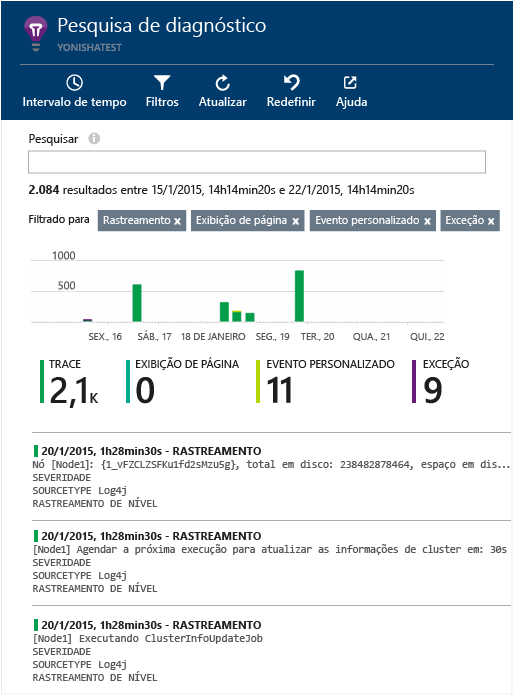

# Explore os logs de rastreamento de Java no Application Insights
Se você estiver usando Logback ou Log4J (v 1.2 ou 2.0) para rastreamento, você pode enviar seus logs de rastreamento automaticamente para o Application Insights, no qual você pode explorá-los e pesquisar o conteúdo deles.

Instale o [SDK do Application Insights para Java][java], se ainda não tiver feito isso.

## Adicionar bibliotecas de log ao seu projeto
*Escolha o modo apropriado para seu projeto.*

#### Se você estiver usando o Maven...
Se o seu projeto já estiver configurado para usar o Maven para compilação, realize a mesclagem de um dos seguintes trechos de código ao seu arquivo pom.xml.

Em seguida, atualize as dependências do projeto para obter os binários baixados.

*Logback*

    <dependencies>
       <dependency>
          <groupId>com.microsoft.azure</groupId>
          <artifactId>applicationinsights-logging-logback</artifactId>
          <version>[1.0,)</version>
       </dependency>
    </dependencies>

*Log4J v2.0*

    <dependencies>
       <dependency>
          <groupId>com.microsoft.azure</groupId>
          <artifactId>applicationinsights-logging-log4j2</artifactId>
          <version>[1.0,)</version>
       </dependency>
    </dependencies>

*Log4J v1.2*

    <dependencies>
       <dependency>
          <groupId>com.microsoft.azure</groupId>
          <artifactId>applicationinsights-logging-log4j1_2</artifactId>
          <version>[1.0,)</version>
       </dependency>
    </dependencies>

#### Se você estiver usando o Gradle...
Se seu projeto já está configurado para usar Gradle para compilação, adicione uma das linhas a seguir para o grupo `dependencies` em seu arquivo build.gradle:

Em seguida, atualize as dependências do projeto para obter os binários baixados.

**Logback**

    compile group: 'com.microsoft.azure', name: 'applicationinsights-logging-logback', version: '1.0.+'

**Log4J v2.0**

    compile group: 'com.microsoft.azure', name: 'applicationinsights-logging-log4j2', version: '1.0.+'

**Log4J v1.2**

    compile group: 'com.microsoft.azure', name: 'applicationinsights-logging-log4j1_2', version: '1.0.+'

#### Caso contrário...
Baixe e extraia o appender apropriado, em seguida adicione a biblioteca apropriada ao seu projeto:

| Agente | Baixar | Biblioteca |
| --- | --- | --- |
| Logback |[SDK com appender de Logback](https://aka.ms/xt62a4) |applicationinsights-logging-logback |
| Log4J v2.0 |[SDK com appender de Log4J v2](https://aka.ms/qypznq) |applicationinsights-logging-log4j2 |
| Log4j v1.2 |[SDK com appender de Log4J v1.2](https://aka.ms/ky9cbo) |applicationinsights-logging-log4j1\_2 |

## Adicionar o appender à sua estrutura de log
Para começar a obter rastreamentos, mescle o trecho de código relevante ao arquivo de configuração Log4J ou Logback:

*Logback*

    <appender name="aiAppender" 
      class="com.microsoft.applicationinsights.logback.ApplicationInsightsAppender">
    </appender>
    <root level="trace">
      <appender-ref ref="aiAppender" />
    </root>

*Log4J v2.0*

    <Configuration packages="com.microsoft.applicationinsights.Log4j">
      <Appenders>
        <ApplicationInsightsAppender name="aiAppender" />
      </Appenders>
      <Loggers>
        <Root level="trace">
          <AppenderRef ref="aiAppender"/>
        </Root>
      </Loggers>
    </Configuration>

*Log4J v1.2*

    <appender name="aiAppender" 
         class="com.microsoft.applicationinsights.log4j.v1_2.ApplicationInsightsAppender">
    </appender>
    <root>
      <priority value ="trace" />
      <appender-ref ref="aiAppender" />
    </root>

Os appenders Application Insights podem ser referenciados por qualquer agente configurado e não necessariamente pelo agente raiz (conforme mostrado nos exemplos de código acima).

## Explorar seus rastreamentos no portal do Application Insights
Agora que você configurou o projeto para enviar os rastreamentos para Application Insights, você pode exibir e pesquisar esses rastreamentos no portal do Application Insights, na folha [Pesquisa][diagnostic].

## Próximas etapas
[Pesquisa de diagnóstico][diagnostic]

<!--Link references-->

[diagnostic]: app-insights-diagnostic-search.md
[java]: app-insights-java-get-started.md

<!---HONumber=AcomDC_0817_2016-->