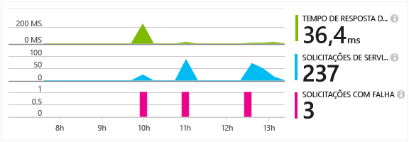
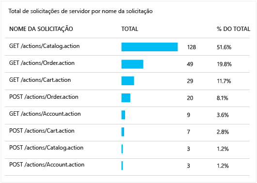
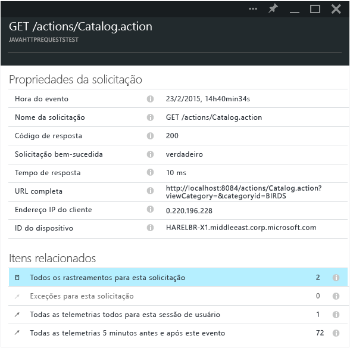

<properties 
	pageTitle="Acompanhar solicitações HTTP em um aplicativo Web Java" 
	description="O Application Insights permite medir o desempenho de seu aplicativo Web Java" 
	services="application-insights" 
    documentationCenter=""
	authors="alancameronwills" 
	manager="keboyd"/>

<tags 
	ms.service="application-insights" 
	ms.workload="tbd" 
	ms.tgt_pltfrm="ibiza" 
	ms.devlang="na" 
	ms.topic="article" 
	ms.date="05/26/2015" 
	ms.author="awills"/>
 
# Acompanhar solicitações HTTP em um aplicativo Web Java

Se você estiver executando um aplicativo Web Java, você pode exibir informações sobre as solicitações HTTP enviadas ao seu aplicativo, como os recursos solicitados, solicitações com falha e tempos de resposta, tudo no portal do Application Insights.

Instale o [SDK do Application Insights para Java][java], se ainda não tiver feito isso.

## Adicionar os binários ao seu projeto

*Escolha o modo apropriado para seu projeto.*

### Se você estiver usando o Maven...

Se o seu projeto já estiver configurado para usar o Maven para compilação, realize a mesclagem do trecho de código a seguir ao seu arquivo pom.xml.

Em seguida, atualize as dependências do projeto para obter os binários baixados.

    <dependencies>
      <dependency>
        <groupId>com.microsoft.azure</groupId>
        <artifactId>applicationinsights-web</artifactId>
        <version>[0.9,)</version>
      </dependency>
    </dependencies>

### Se você estiver usando o Gradle...

Se o seu projeto já estiver configurado para usar o Gradle para compilação, realize a mesclagem do trecho de código a seguir ao seu arquivo build.gradle.

Em seguida, atualize as dependências do projeto para obter os binários baixados.

    dependencies {
      compile group: 'com.microsoft.azure', name: 'applicationinsights-web', version: '0.9.+'
    }

## Adicionar o filtro HTTP do Application Insights a seu projeto

Localize e abra o arquivo web.xml em seu projeto, então mescle o trecho de código a seguir sob o nó do aplicativo Web, no qual seus filtros de aplicativo estão configurados.

Para obter os resultados mais precisos, o filtro deve ser mapeado antes de todos os outros filtros.

    <filter>
      <filter-name>ApplicationInsightsWebFilter</filter-name>
      <filter-class>
        com.microsoft.applicationinsights.web.internal.WebRequestTrackingFilter
      </filter-class>
    </filter>
    <filter-mapping>
       <filter-name>ApplicationInsightsWebFilter</filter-name>
       <url-pattern>/*</url-pattern>
    </filter-mapping>

## Adicionar os módulos HTTP ao seu projeto

Localize e abra o arquivo ApplicationInsights.xml em seu projeto e mescle o trecho de código a seguir sob o elemento <TelemetryModules>.

Se não houver nenhum elemento <TelemetryModules> nesse arquivo, adicione um sob o elemento <ApplicationInsights>.

    <TelemetryModules>
      <Add type="com.microsoft.applicationinsights.web.extensibility.modules.WebRequestTrackingTelemetryModule"/>
      <Add type="com.microsoft.applicationinsights.web.extensibility.modules.WebSessionTrackingTelemetryModule"/>
      <Add type="com.microsoft.applicationinsights.web.extensibility.modules.WebUserTrackingTelemetryModule"/>
    </TelemetryModules>

## Adicionar inicializadores de telemetria para correlação de eventos

Com correlação de eventos, você pode criar associações entre uma solicitação HTTP e todos os eventos de telemetria que foram enviados durante o processamento da solicitação, usando uma propriedade de ID da Operação que é anexada a cada um desses eventos de telemetria. Isso permite explorar uma solicitação HTTP junto com todos os eventos que foram chamados por meio dela, e facilita o diagnóstico e a solução de problemas.

Localize e abra o arquivo ApplicationInsights.xml em seu projeto e mescle o trecho de código a seguir sob o elemento <TelemetryInitializers>.

Se não houver nenhum elemento < TelemetryInitializers> nesse arquivo, adicione um sob o elemento <ApplicationInsights>.

    <TelemetryInitializers>
     <Add  type="com.microsoft.applicationinsights.web.extensibility.initializers.WebOperationIdTelemetryInitializer"/>
     <Add type="com.microsoft.applicationinsights.web.extensibility.initializers.WebOperationNameTelemetryInitializer"/>
     <Add type="com.microsoft.applicationinsights.web.extensibility.initializers.WebSessionTelemetryInitializer"/>
     <Add type="com.microsoft.applicationinsights.web.extensibility.initializers.WebUserTelemetryInitializer"/>
     <Add type="com.microsoft.applicationinsights.web.extensibility.initializers.WebUserAgentTelemetryInitializer"/>
    </TelemetryInitializers>

## Exibir as informações de solicitações no Application Insights

Execute seu aplicativo.

Retorne para seu recurso Application Insights no Microsoft Azure.

Dados de solicitações HTTP aparecerão na folha de visão geral. (Se não estiverem lá, aguarde alguns segundos e, em seguida, clique em Atualizar.)

 

Clique em qualquer gráfico para ver métricas mais detalhadas.

[Saiba mais sobre métricas.][metrics]

 

Ao exibir as propriedades de uma solicitação, você pode ver os eventos de telemetria associados a ela, como solicitações e exceções.
 

## Próximas etapas

* [Pesquise eventos e logs][diagnostic] para ajudar a diagnosticar problemas.
* [Capturar rastreamentos do Log4J ou Logback][javalogs]

<!--Link references-->

[diagnostic]: app-insights-diagnostic-search.md
[java]: app-insights-java-get-started.md
[javalogs]: app-insights-java-trace-logs.md
[metrics]: app-insights-metrics-explorer.md

 

<!---HONumber=July15_HO3-->