<properties
	pageTitle="Application Insights para aplicativos Web JavaScript | Microsoft Azure"
	description="Obter contagens de sessões e exibições de páginas e dados de clientes da Web e acompanhar padrões de uso. Detecte exceções e problemas de desempenho em páginas da Web do JavaScript."
	services="application-insights"
    documentationCenter=""
	authors="alancameronwills"
	manager="douge"/>

<tags
	ms.service="application-insights"
	ms.workload="tbd"
	ms.tgt_pltfrm="ibiza"
	ms.devlang="na"
	ms.topic="get-started-article"
	ms.date="07/10/2015"
	ms.author="awills"/>

# Application Insights para aplicativos Web JavaScript

[AZURE.INCLUDE [app-insights-selector-get-started](../../includes/app-insights-selector-get-started.md)]

Saiba mais sobre o desempenho e o uso de sua página da Web. Adicione o Application Insights do Visual Studio à sua página e você descobrirá quantos usuários tem, com que frequência eles retornam e quais as páginas que eles mais usam. Você também obterá relatórios de tempos de carregamento e quaisquer exceções. Adicione algumas [métricas e eventos personalizados][track] e você poderá analisar detalhadamente os recursos mais populares, os erros mais comuns e ajustar sua página para ter sucesso com os usuários.

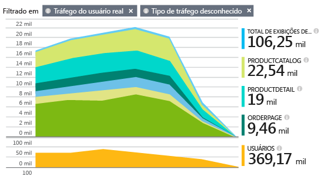

Se já configurou telemetria do servidor para seu aplicativo Web [ASP.NET][greenbrown] ou [Java][java], você obterá a imagem dos ângulos do cliente e servidor. Os dois fluxos serão integrados no portal do Application Insights.

#### Demonstração rápida

Se você não tem uma assinatura do Azure e deseja experimentar o Application Insights em sua página da Web, visite [Experimentar o Application Insights](http://aka.ms/ainow).

## Criar um recurso do Application Insights

O recurso Application Insights é onde os dados sobre o desempenho e o uso da página são exibidos. (Se você já criou um recurso, talvez para coletar dados de seu servidor Web, ignore essa etapa.)

No [portal do Azure](http://portal.azure.com), crie um novo recurso do Application Insights:

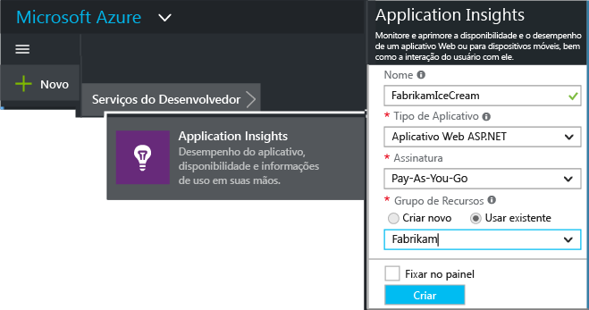

*Tem dúvidas?* [Mais informações sobre a criação de um recurso][new].

## Adicione o script do SDK a seu aplicativo ou às suas páginas da Web

Em Início Rápido, obtenha o script para páginas da Web:

Insira o script antes da marca &lt;/head&gt; de cada página que você deseja acompanhar. Se seu site possui uma página mestra, você poderá colocar o script lá. Por exemplo:

* Em um projeto MVC ASP.NET, você deve colocá-lo em View\\Shared\\_Layout.cshtml
* Em um site do SharePoint, no painel de controle, abra [Configurações do Site/Página Mestra](app-insights-sharepoint.md).

O script contém a chave de instrumentação que direciona os dados para o recurso do Application Insights.

*(Se você estiver usando uma estrutura de página da Web conhecida, procure adaptadores do Application Insights. Por exemplo, há [um módulo AngularJS](http://ngmodules.org/modules/angular-appinsights).)*

## Executar seu aplicativo

Execute seu aplicativo Web, use-o por algum tempo para gerar telemetria e aguarde alguns segundos. Você pode executá-lo usando a tecla **F5** em seu computador de desenvolvimento ou publicá-lo e permitir que os usuários o utilizem.

Se desejar verificar a telemetria que um aplicativo Web está enviando ao Application Insights, use as ferramentas de depuração de seu navegador (**F12** em muitos navegadores). Os dados são enviados a dc.services.visualstudio.com.

## Explorar seus dados

Na folha de visão geral do aplicativo, há um gráfico na parte superior que mostra o tempo médio para carregar páginas no navegador:

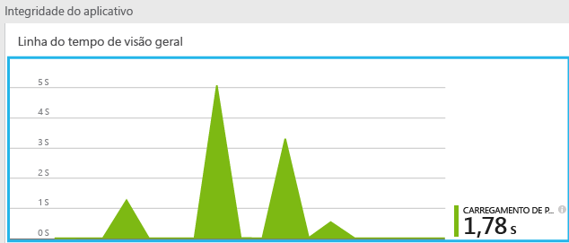

*Não há dados ainda? Clique em **Atualizar** na parte superior da página. Nada mesmo assim? Consulte [Solucionar problemas][qna].*

Clique no gráfico e você obterá uma versão mais detalhada:

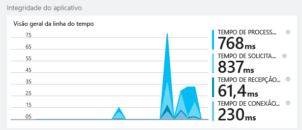

Esse é um gráfico empilhado que divide o tempo de carregamento total da página nos [intervalos padrão definidos pelo W3C](http://www.w3.org/TR/navigation-timing/#processing-model).

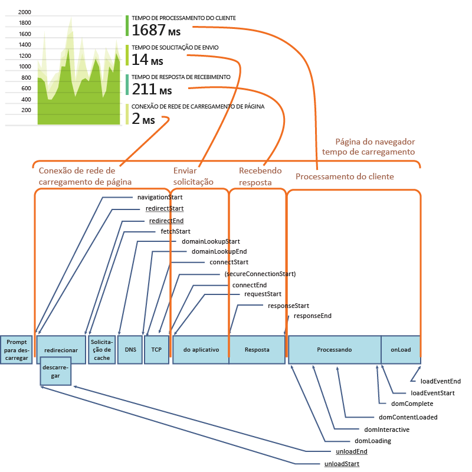

Observe que o tempo de *conexão de rede* é geralmente menor do que o esperado, pois ele é uma média sobre todas as solicitações do navegador para o servidor. Muitas solicitações individuais têm um tempo de conexão igual a 0 porque já existe uma conexão ativa com o servidor.

### Desempenho por página

Mais abaixo na folha de detalhes, há uma grade segmentada por URL de página:

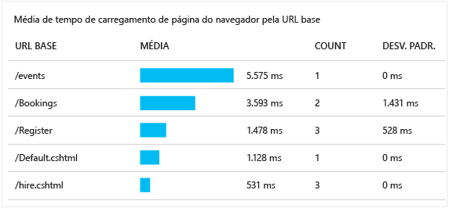

Se desejar ver o desempenho das páginas ao longo do tempo, clique duas vezes na grade e altere o tipo de gráfico:

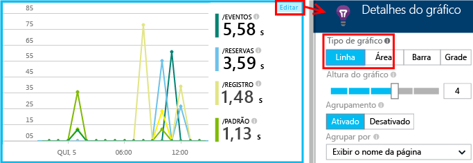

## Visão geral de uso do cliente

Na folha visão geral, clique em **Uso**:

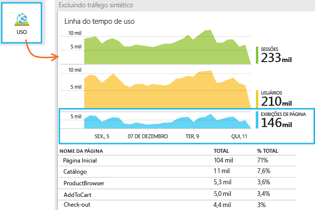

* **Usuários:** a contagem de usuários distintos ao longo do intervalo de tempo do gráfico. (Cookies são usados para identificar usuários que retornam).
* **Sessões:** uma sessão é contada quando um usuário não faz solicitações por 30 minutos.
* **Exibições de página** conta o número de chamadas para trackPageView(), geralmente chamado uma vez em cada página da Web.

### Clique para obter mais detalhes

Clique em qualquer um dos gráficos para ver mais detalhes. Observe que você pode alterar o intervalo de tempo dos gráficos.

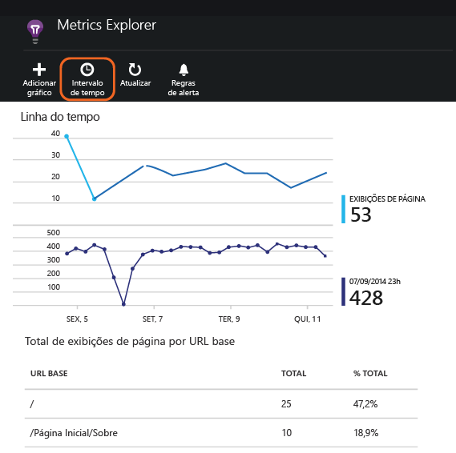

Clique em um gráfico para ver outras medidas que você pode exibir, ou adicionar um novo gráfico e selecione a métrica que ele exibe.

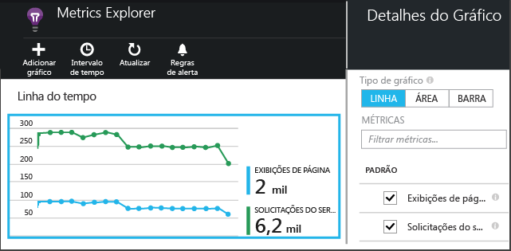

> [AZURE.NOTE]As métricas só podem ser exibidas em algumas combinações. Quando você seleciona uma métrica, aquelas incompatíveis são desabilitadas.

## Contagens da página personalizada

Por padrão, uma contagem de página ocorre todas as vezes que uma nova página carrega no navegador do cliente. Por exemplo, você talvez queira contar visualizações de página adicionais. Por exemplo, uma página pode exibir seu conteúdo em guias e você quer contar uma página quando o usuário muda as guias. Ou o código do JavaScript na página pode carregar novo conteúdo sem mudar a URL do navegador.

Insira uma chamada do JavaScript como essa no ponto apropriado no código do seu cliente:

    appInsights.trackPageView(myPageName);

O nome da página pode conter os mesmos caracteres da URL, mas nada após o "#" ou "?" será ignorado.

## Inspecionar eventos de exibição de páginas individuais

Normalmente a telemetria de exibição da página é analisada pelo Application Insights e você vê somente relatórios cumulativos, calculados sobre todos os seus usuários. Mas para a finalidade de depuração, você também pode olhar para os eventos de exibição da página individua.

Na folha de Pesquisa de Diagnóstico, defina Filtros para Exibição da Página.

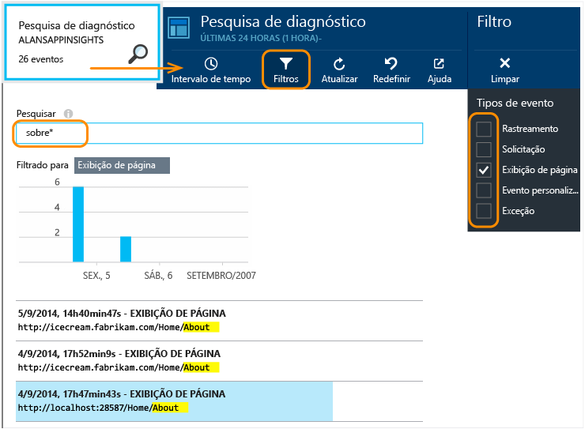

Selecione qualquer evento para ver mais detalhes. Na página de detalhes, clique em "..." para ver mais detalhes.

> [AZURE.NOTE]Se você usar [Pesquisar][diagnostic], observe que precisa fazer a correspondência de palavras inteiras: "Sobr" e "obre" não correspondem a "Sobre", mas "Sobr*" corresponde a ela. E você não pode iniciar um termo de pesquisa com um curinga. Por exemplo, pesquisar por "*obr" não corresponde a "Sobre".

> [Saiba mais sobre pesquisa de diagnóstico][diagnostic]

### Propriedades de exibição de página

* **Duração da exibição de página** &#151; o tempo necessário para carregar a página e iniciar a execução de scripts. Especificamente, o intervalo entre iniciar o carregamento da página e a execução de trackPageView. Se você moveu trackPageView da sua posição normal após a inicialização do script, ele refletirá um valor diferente.

## Rastreamento de uso personalizado

Quer saber o que os usuários fazem com seu aplicativo? Inserindo chamadas em seu código de cliente e servidor, você pode enviar sua própria telemetria ao Application Insights. Por exemplo, você pode descobrir o número de usuários que criam pedidos sem concluí-los ou quais erros de validação ocorrem com mais frequência, ou ainda a pontuação média em um jogo.

* [Saiba mais sobre os eventos personalizados e métricas de API][track].
* [Referência de API](https://github.com/Microsoft/ApplicationInsights-JS/blob/master/API-reference.md)

## Telemetria do servidor

Se ainda não tiver feito isso, você poderá obter percepções de seu servidor e exibir os dados juntamente com os dados do cliente, habilitando-o a avaliar o desempenho no servidor e diagnosticar problemas.

* [Adicionar o Application Insights a um aplicativo ASP.NET][greenbrown]
* [Adicionar o Application Insights a um aplicativo Web Java][java]

##  Vídeo: acompanhando o uso

> [AZURE.VIDEO tracking-usage-with-application-insights]

##  Próximas etapas

[Acompanhar o uso com métricas e eventos personalizados][track]

<!--Link references-->

[diagnostic]: app-insights-diagnostic-search.md
[greenbrown]: app-insights-start-monitoring-app-health-usage.md
[java]: app-insights-java-get-started.md
[new]: app-insights-create-new-resource.md
[qna]: app-insights-troubleshoot-faq.md
[track]: app-insights-api-custom-events-metrics.md

<!---HONumber=Oct15_HO3-->