<properties 
	pageTitle="Explorar métricas no Application Insights" 
	description="Como interpretar os gráficos no gerenciador de métricas e como personalizar as folhas do gerenciador de métricas." 
	services="application-insights" 
    documentationCenter=""
	authors="alancameronwills" 
	manager="douge"/>

<tags 
	ms.service="application-insights" 
	ms.workload="tbd" 
	ms.tgt_pltfrm="ibiza" 
	ms.devlang="na" 
	ms.topic="article" 
	ms.date="11/23/2015" 
	ms.author="awills"/>
 
# Explorar métricas no Application Insights

Métricas no [Application Insights][start] são contagens e valores medidos de eventos enviados em telemetria do seu aplicativo. Eles ajudam você a detectar problemas de desempenho e observar as tendências referentes a como seu aplicativo está sendo usado. Há uma grande variedade de métricas padrão, e você também pode criar suas próprias métricas e eventos personalizados.

Contagens de métricas e eventos são exibidas em gráficos de valores agregados como somas, médias ou contagens.

Aqui está um exemplo do gráfico:

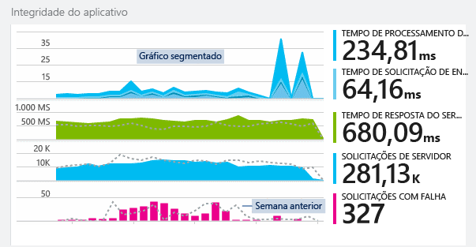

Alguns gráficos são segmentados: a altura total do gráfico em qualquer ponto é a soma das métricas exibidas. A legenda mostra, por padrão, as quantidades maiores.

Linhas pontilhadas mostram o valor da métrica de uma semana atrás.

## Intervalo de tempo

Você pode alterar o intervalo de tempo coberto pelos gráficos ou grades em qualquer folha.

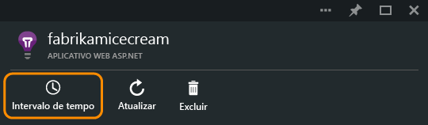

Se você estiver esperando dados que não apareceram ainda, clique em Atualizar. Os gráficos são atualizados em intervalos, mas os intervalos são mais longos para intervalos de tempo maiores. No modo de liberação, pode levar algum tempo para que dados passem pelo pipeline de análise e sejam representados em um gráfico.

Para ampliar uma parte de um gráfico, arraste sobre ele e clique no símbolo de lente de aumento:

## Valores de granularidade e ponto

Passe o mouse sobre o gráfico para exibir os valores das métricas nesse determinado ponto.

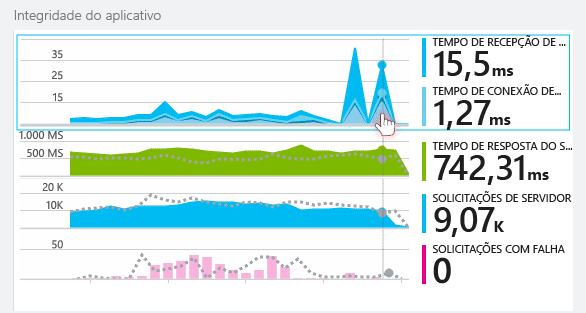

O valor de métrica em um ponto específico é agregado durante o intervalo de amostragem anterior.

O intervalo de amostragem ou "granularidade" é mostrado na parte superior da folha.

Você pode ajustar a granularidade na folha Intervalo de tempo:

As granularidades disponíveis dependem do intervalo de tempo selecionado. As granularidades explícitas são alternativas à granularidade "automática" para o intervalo de tempo.

## Metrics Explorer

Clique em qualquer gráfico na folha visão geral para ver um conjunto mais detalhado de grades e gráficos relacionados. Você pode editar esses gráficos e grades para focar nos detalhes em que você está interessado.

Ou então, basta clicar no botão Metrics Explorer no cabeçalho da folha de visão geral.

Por exemplo, clique no gráfico de Solicitações com falha do aplicativo Web:

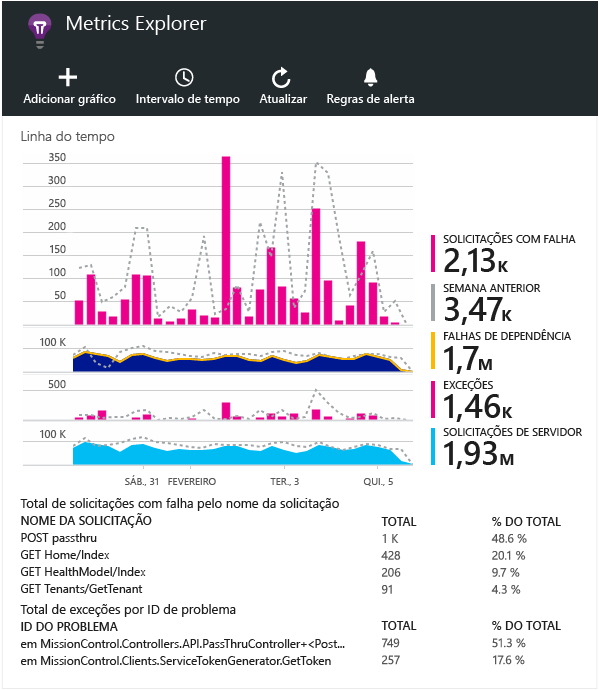

## O que as figuras significam?

A legenda na lateral normalmente mostra, por padrão, o valor agregado durante o período do gráfico. Se você passar o mouse sobre o gráfico, ele mostra o valor nesse ponto.

Cada ponto de dados no gráfico é um acumulado dos valores de dados recebidos no intervalo de amostragem anterior, ou "granularidade". A granularidade é mostrada na parte superior da folha e varia de acordo com a escala de tempo total do gráfico.

Métricas podem ser agregadas de maneiras diferentes:

 * **Soma** adiciona os valores de todos os pontos de dados recebidos no intervalo de amostragem ou no período do gráfico.
 * **Média** divide a Soma pelo número de pontos de dados recebidos durante o intervalo.
 * Contagens **Únicas** são usadas para contagens de usuários e contas. Durante o intervalo de amostragem, ou durante o período do gráfico, a figura mostra a contagem de diferentes usuários vistos no momento.

Você pode alterar o método de agregação:

O método padrão para cada métrica é mostrado quando você cria um novo gráfico:

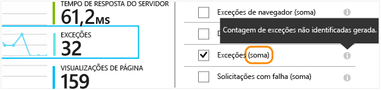

## Edição de gráficos e grades

Para adicionar um novo gráfico à folha:

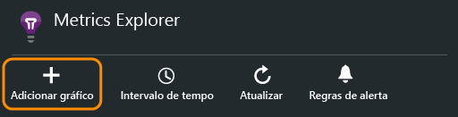

Selecione um gráfico novo ou existente para editar o que ele mostra:

Você pode exibir mais de uma métrica em um gráfico, porém há restrições sobre as combinações que podem ser exibidas em conjunto. Assim que você escolher uma métrica, algumas das outras serão desabilitadas.

Se você codificou [métricas personalizadas][track] em seu aplicativo (chamadas para TrackMetric e TrackEvent), elas serão listados aqui.

## Segmentar os dados

Selecione um gráfico ou uma grade, ative o agrupamento e escolha uma propriedade pela qual agrupar:

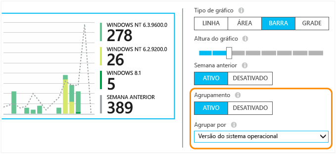

Se você codificou [métricas personalizadas][track] em seu aplicativo e elas incluem valores de propriedade, você poderá selecionar a propriedade na lista.

O gráfico é muito pequeno para dados segmentados? Ajuste sua altura:

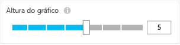

## Filtrar seus dados

Para ver apenas as métricas para um conjunto selecionado de valores de propriedade:

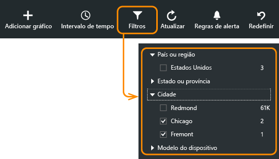

Se você não selecionar nenhum valor para uma determinada propriedade, será o mesmo que selecionar todas elas: não há nenhum filtro para essa propriedade.

Observe as contagens de eventos junto a cada valor da propriedade. Quando você seleciona valores de uma propriedade, as contagens junto a outros valores de propriedade são ajustadas.

### Para adicionar propriedades à lista de filtros

Você deseja filtrar a telemetria em uma categoria de sua escolha? Por exemplo, talvez você divida seus usuários em categorias diferentes e queira segmentar os dados segundo essas categorias.

[Crie sua própria propriedade](app-insights-api-custom-events-metrics.md#properties). Defina-a em um [Inicializador de Telemetria](app-insights-api-custom-events-metrics.md#telemetry-initializers) para que ela apareça em toda a telemetria, incluindo a telemetria padrão enviada por diferentes módulos do SDK.

## Remover o tráfego de testes da Web e de bot

Use o filtro **Tráfego real ou sintético** e marque **Real**.

Você também pode filtrar por **Origem do tráfego sintético**.

## Editar o tipo de gráfico

Em particular, observe que você pode alternar entre gráficos e grades:

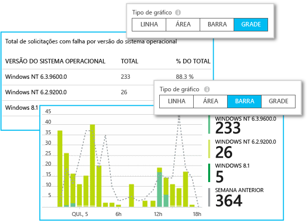

## Salve sua folha de métricas

Quando você tiver criado alguns gráficos, salve-os como favoritos. Se você utiliza uma conta organizacional, você pode escolher entre compartilhá-la ou não com outros membros da equipe.

Para ver a folha novamente, **vá até a folha de visão geral** e abra Favoritos:

Se você escolheu o intervalo de tempo Relativo quando salvou, a folha será atualizada com as métricas mais recentes. Se você escolheu o intervalo de tempo Absoluto, ele mostrará sempre os mesmos dados.

## Redefinir a folha

Se você editar uma folha mas em seguida decidir voltar ao conjunto original salvo, clique em Redefinir.

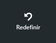

## Definir alertas

Para ser notificado por email sobre valores incomuns de qualquer métrica, adicione um alerta. Você pode escolher para enviar o email para os administradores de conta ou para endereços de email específicos.

[Saiba mais sobre alertas][alerts].

## Exportar para o Excel

Você pode exportar dados da métrica que são exibidos no Gerenciador de Métrica para um arquivo do Excel. Os dados exportados incluem dados de todos os gráficos e tabelas, como visto no portal.

Os dados para cada tabela ou gráfico são exportados para uma planilha separada no arquivo do Excel.

O que você vê é o que é exportado. Altere o intervalo de tempo ou os filtros se quiser alterar o intervalo de dados exportados. Para tabelas, se o comando **carregar mais** estiver visível, você poderá clicar nele antes de clicar em Exportar para exportar mais dados.

*Exportação funciona somente para Internet Explorer e Chrome no momento. Estamos trabalhando para adicionar suporte a outros navegadores.*

### Exportação Contínua

Se desejar que os dados sejam exportados continuamente para que você possa processá-los externamente, considere usar [Exportação contínua](app-insights-export-telemetry.md).

### Power BI

Se desejar obter exibições ainda mais avançadas dos seus dados, você poderá [exportar para o Power BI](http://blogs.msdn.com/b/powerbi/archive/2015/11/04/explore-your-application-insights-data-with-power-bi.aspx).

## Próximas etapas

* [Monitorando o uso com o Application Insights](app-insights-overview-usage.md)
* [Usando a Pesquisa de diagnóstico](app-insights-diagnostic-search.md)

<!--Link references-->

[alerts]: app-insights-alerts.md
[start]: app-insights-overview.md
[track]: app-insights-api-custom-events-metrics.md

 

<!---HONumber=AcomDC_1125_2015-->