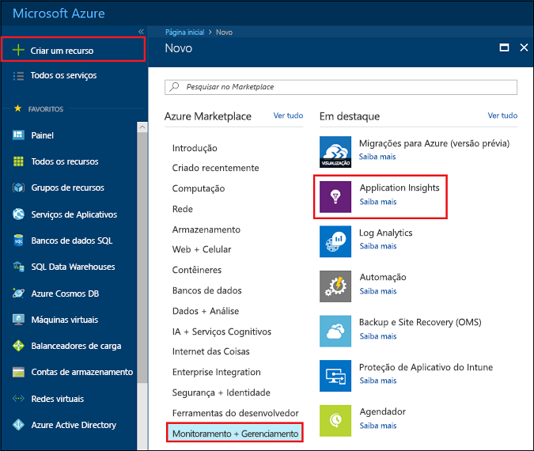
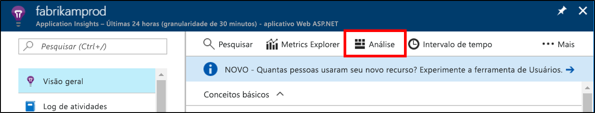
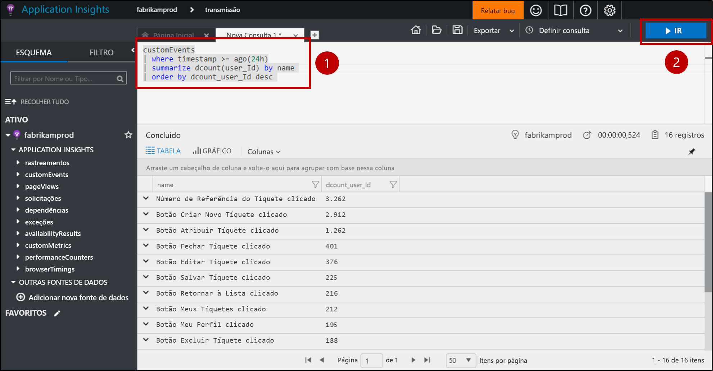
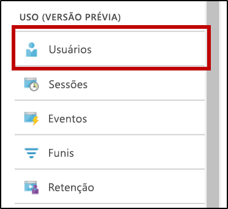
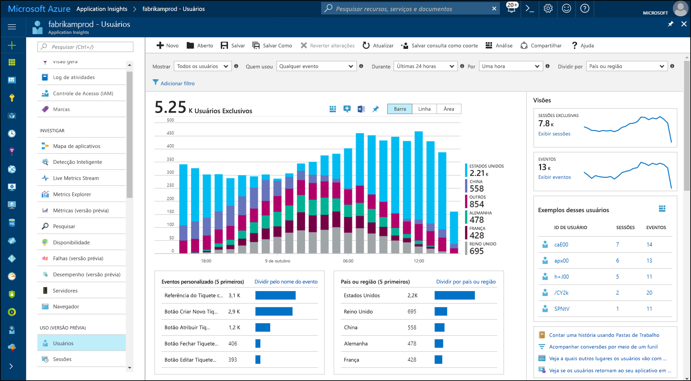
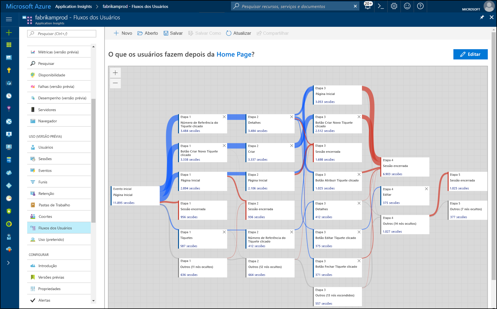

# <a name="start-analyzing-your-mobile-app-with-mobile-center-and-application-insights"></a>Começar a analisar seu aplicativo móvel com o Mobile Center e o Application Insights

Este guia de início rápido percorre as etapas para conectar a instância Mobile Center do seu aplicativo com o Application Insights. Com o Application Insights, você pode consultar, segmentar, filtrar e analisar a telemetria com ferramentas mais avançadas que estão disponíveis no serviço [Análise](https://docs.microsoft.com/mobile-center/analytics/) do Mobile Center.

## <a name="prerequisites"></a>Pré-requisitos

Para concluir este início rápido, você precisa de:

- Uma assinatura do Azure.
- Um aplicativo iOS, Android, Xamarin, Universal do Windows ou React Native.
 
Se você não tiver uma assinatura do Azure, crie uma conta [gratuita](https://azure.microsoft.com/free/) antes de começar.

## <a name="onboard-to-mobile-center"></a>Integrar com o Mobile Center

Antes de usar o Application Insights com seu aplicativo móvel, você precisa integrar o aplicativo com o [Mobile Center](https://docs.microsoft.com/mobile-center/). O Application Insights não recebe telemetria diretamente do aplicativo móvel. Em vez disso, o aplicativo envia telemetria de evento personalizado para o Mobile Center. Em seguida, o Mobile Center exporta cópias desses eventos personalizados continuamente para o Application Insights conforme eles vão sendo recebidos.

Para integrar seu aplicativo, siga o guia de início rápido do Mobile Center para cada plataforma com suporte pelo seu aplicativo. Crie instâncias Mobile Center separadas para cada plataforma:

* [iOS](https://docs.microsoft.com/mobile-center/sdk/getting-started/ios).
* [Android](https://docs.microsoft.com/mobile-center/sdk/getting-started/android).
* [Xamarin](https://docs.microsoft.com/mobile-center/sdk/getting-started/xamarin).
* [Universal do Windows](https://docs.microsoft.com/mobile-center/sdk/getting-started/uwp).
* [React Native](https://docs.microsoft.com/mobile-center/sdk/getting-started/react-native).

## <a name="track-events-in-your-app"></a>Rastrear eventos no aplicativo

Depois que o aplicativo estiver integrado ao Mobile Center, ele precisará ser modificado para enviar telemetria de evento personalizado usando o SDK do Mobile Center. Eventos personalizados são o único tipo de telemetria do Mobile Center que é exportado para o Application Insights.

Para enviar eventos personalizados de aplicativos iOS, use os métodos `trackEvent` ou `trackEvent:withProperties` no SDK do Mobile Center. [Saiba mais sobre o rastreamento de eventos de aplicativos do iOS.](https://docs.microsoft.com/mobile-center/sdk/analytics/ios)

```Swift
MSAnalytics.trackEvent("Video clicked")
```

Para enviar eventos personalizados de aplicativos Android, use os métodos `trackEvent` no SDK do Mobile Center. [Saiba mais sobre o rastreamento de eventos de aplicativos do Android.](https://docs.microsoft.com/mobile-center/sdk/analytics/android)

```Java
Analytics.trackEvent("Video clicked")
```

Para enviar eventos personalizados de outras plataformas de aplicativos, use os métodos `trackEvent` no SDK do Mobile Center.

Para verificar se os eventos personalizados estão sendo recebidos, vá para a guia **Eventos** na seção **Análise** do Mobile Center. Pode levar alguns minutos para que os eventos apareçam quando são enviados do aplicativo.

## <a name="create-an-application-insights-resource"></a>Criar um recurso do Application Insights

Quando o aplicativo estiver enviando eventos personalizados e eles forem recebidos pelo Mobile Center, você precisará criar um recurso do Application Insights do tipo Mobile Center no portal do Azure:

1. Faça logon no [Portal do Azure](https://portal.azure.com/).
2. Selecione **Novo** > **Monitoramento + Gerenciamento** > **Application Insights**.

    

    Será exibida uma caixa de configuração. Use a tabela a seguir para preencher os campos de entrada.

    | Configurações        |  Valor           | Descrição  |
   | ------------- |:-------------|:-----|
   | **Nome**      | Um valor globalmente exclusivo, como "myApp iOS" | Nome que identifica o aplicativo que você está monitorando |
   | **Tipo de Aplicativo** | Aplicativo Mobile Center | O tipo do aplicativo que você está monitorando |
   | **Grupo de recursos**     | Um novo grupo de recursos ou um existente no menu | O grupo de recursos no qual criar o novo recurso do Application Insights |
   | **Localidade** | Um local no menu | Escolher uma localização perto de você ou perto onde seu aplicativo está hospedado |

3. Clique em **Criar**.

Se seu aplicativo dá suporte a várias plataformas (iOS, Android, etc.), é melhor criar recursos do Application Insights separados, um para cada plataforma.

## <a name="export-to-application-insights"></a>Exportar para o Application Insights

Em seu novo recurso do Application Insights na página **Visão geral** na seção **Essentials** na parte superior, copie a chave de instrumentação para esse recurso.

Na instância Mobile Center para o aplicativo:

1. Na página **Configurações**, clique em **Exportar**.
2. Escolha **Nova Exportação**, escolha **Application Insights** e clique em **Personalizar**.
3. Cole a chave de instrumentação do Application Insights na caixa.
4. Autorize o aumento do uso da assinatura do Azure que contém o recurso do Application Insights. Cada recurso do Application Insights é gratuito para o primeiro 1 GB de dados recebidos por mês. [Saiba mais sobre o preço do Application Insights](https://azure.microsoft.com/pricing/details/application-insights/)

Lembre-se de repetir esse processo para cada plataforma com suporte pelo aplicativo.

Quando a [Exportação](https://docs.microsoft.com/mobile-center/analytics/export) estiver definida, cada evento personalizado recebido pelo Mobile Center será copiado no Application Insights. Pode levar vários minutos para que os eventos cheguem ao Application Insights e, portanto, se eles não aparecem imediatamente, aguarde um pouco antes de fazer mais diagnósticos.

Para oferecer mais dados quando você se conecta pela primeira vez, as 48 horas de eventos personalizados mais recentes no Mobile Center são exportadas para o Application Insights automaticamente.

## <a name="start-monitoring-your-app"></a>Iniciar o monitoramento do aplicativo

O Application Insights pode consultar, segmentar, filtrar e analisar a telemetria de evento personalizado de seus aplicativos além das ferramentas de análise que o Mobile Center oferece.

1. **Consulte a telemetria de evento personalizado.** Na página **Visão geral** do Application Insights, escolha **Análise**. 

   

   O portal Análise do Application Insights associado ao recurso do Application Insights será aberto. O portal Análise permite consultar diretamente os dados usando a linguagem de consulta do Log Analytics, para que você possa fazer perguntas arbitrariamente complexas sobre seu aplicativo e seus usuários.
   
   Abra uma nova guia no portal Análise e cole na consulta a seguir. Isso retorna uma contagem de usuários diferentes que enviaram cada evento personalizado do aplicativo nas últimas 24 horas, classificados por essas contagens distintas.

   ```AIQL
   customEvents
   | where timestamp >= ago(24h)
   | summarize dcount(user_Id) by name 
   | order by dcount_user_Id desc 
   ```

   

   1. Selecione a consulta clicando em qualquer lugar na consulta no editor de texto.
   2. Em seguida, clique em **Ir** para executar a consulta. 

   Saiba mais sobre a [Análise do Application Insights](app-insights-analytics.md) e a [linguagem de consulta do Log Analytics](https://docs.loganalytics.io/docs/Language-Reference).


2. **Segmentar e filtrar sua telemetria de evento personalizado.** Na página **Visão geral** do Application Insights, escolha **Usuários** no sumário.

   

   A ferramenta Usuários mostra quantos usuários do seu aplicativo clicaram em determinados botões, visitaram determinadas telas ou executaram outra ação que você esteja rastreando como um evento com o SDK do Mobile Center. Se você tiver procurando uma maneira de segmentar e filtrar seus eventos do Mobile Center, a ferramenta Usuários é uma ótima opção.

    

   Por exemplo, segmente seu uso por área geográfica escolhendo **País ou região** no menu suspenso **Dividido por**.

3. **Analise padrões de conversão, retenção e navegação no aplicativo.** Na página **Visão geral** do Application Insights, escolha **Fluxos de Usuário** no sumário.

   

   A ferramenta Fluxos de usuário visualiza os eventos que os usuários enviaram depois de algum evento inicial. É útil para obter uma visão geral de como os usuários navegam no aplicativo. Ele também pode revelar pontos em que muitos usuários estão cancelando seu aplicativo ou repetindo as mesmas ações sem parar.

   Além de Fluxos de usuário, o Application Insights tem várias outras ferramentas de análise de uso para responder a perguntas específicas:

   * **Funis** para analisar e monitorar as taxas de conversão.
   * **Retenção** para analisar como seu aplicativo retém os usuários ao longo do tempo.
   * **Pastas de trabalho** para combinar visualizações e texto em um relatório que pode ser compartilhado.
   * **Colaboradores** para nomear e salvar grupos de usuários ou eventos específicos para que possam ser facilmente referenciados por outras ferramentas de análise.

## <a name="clean-up-resources"></a>Limpar recursos

Se você não quiser continuar usando o Application Insights com o Mobile Center, desligue a exportação no Mobile Center e exclua o recurso Application Insights. Isso impedirá outras cobranças pelo Application Insights para esse recurso.

Para desligar a exportação no Mobile Center:

1. No Mobile Center, vá para **Configurações** e escolha **Exportar**.
2. Clique na exportação do Application Insights que você deseja excluir, clique em **Excluir exportação** na parte inferior e confirme.

Para excluir o recurso Application Insights:

1. No menu esquerdo do portal do Azure, clique em **Grupos de recursos** e escolha o grupo de recursos no qual o recurso Application Insights foi criado.
2. Abra o recurso Application Insights que deseja excluir. Em seguida, clique em **Excluir** no menu superior do recurso e confirme. Isso excluirá permanentemente a cópia dos dados que foram exportados para o Application Insights.

## <a name="next-steps"></a>Próximas etapas

> [!div class="nextstepaction"]
> [Entender como os clientes estão usando seu aplicativo](app-insights-usage-overview.md)