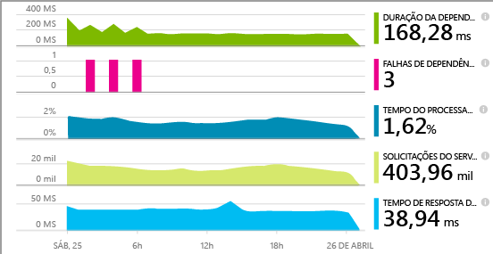
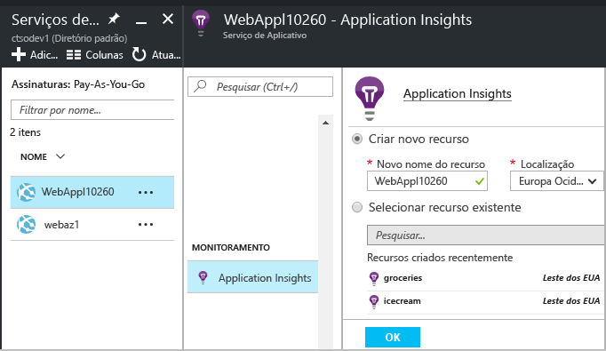
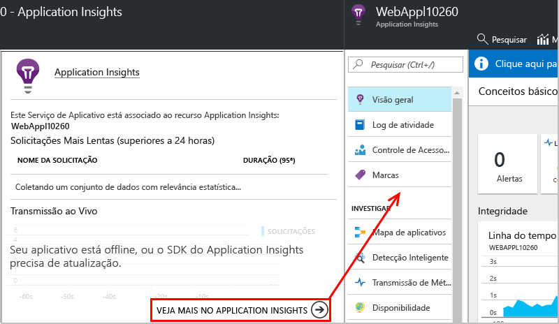
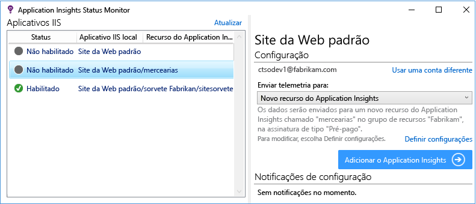
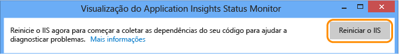
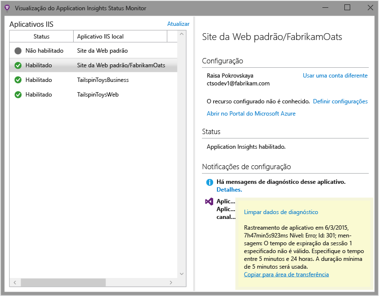

# Instrumentar aplicativos Web no tempo de execução com o Application Insights

Você pode instrumentar um aplicativo Web ativo com o Application Insights do Azure, sem a necessidade de modificar ou reimplantar o código. Se os seus aplicativos forem hospedados por um servidor IIS local, instale o Monitor de Status. Se forem aplicativos Web do Azure ou estiverem sendo executados em uma VM do Azure, ative o monitoramento do Application Insights no painel de controle do Azure. (Também há artigos separados sobre como instrumentar os [aplicativos Web J2EE dinâmicos](app-insights-java-live.md) e os [Serviços de Nuvem do Azure](app-insights-cloudservices.md).) É necessário ter uma assinatura do [Microsoft Azure](http://azure.com) .

Você tem a opção de três rotas para aplicar o Application Insights nos aplicativos Web .NET:

* **Tempo de compilação:** [Adicionar o SDK do Application Insights][greenbrown] ao código do aplicativo Web.
* **Tempo de execução:** instrumente seu aplicativo Web no servidor, conforme descrito abaixo, sem recompilar e reimplantar o código.
* **Ambos:** crie o SDK em seu código de aplicativo Web e também aplique as extensões de tempo de execução. Obtenha o melhor de ambas as opções.

Aqui está um resumo do que você tem com cada rota:

|  | Tempo de compilação | Tempo de execução |
| --- | --- | --- |
| Solicitações e exceções |Sim |Sim |
| [Exceções mais detalhadas](app-insights-asp-net-exceptions.md) | |Sim |
| [Diagnóstico de dependência](app-insights-asp-net-dependencies.md) |No .NET 4.6+, mas menos detalhes |Sim, detalhes completos: códigos de resultado, texto do comando SQL, verbo HTTP|
| [Contadores de desempenho do sistema](app-insights-performance-counters.md) |Sim |Sim |
| [API de telemetria personalizada][api] |Sim | |
| [Integração do log de rastreamento](app-insights-asp-net-trace-logs.md) |Sim | |
| [Exibição da página e dados do usuário](app-insights-javascript.md) |Sim | |
| Não há necessidade de recompilar o código |Não | |

## Monitorar um aplicativo da web ao vivo

Se seu aplicativo for executado como um serviço Web do Azure, veja como ativar o monitoramento:

* Selecione o Application Insights no painel de controle do aplicativo no Azure.

    
* Quando a página de resumo do Application Insights for aberta, clique no link na parte inferior para abrir o recurso Application Insights completo.

    

[Monitoramento de aplicativos de nuvem e a VM](app-insights-azure.md).

### Habilitar o monitoramento do lado do cliente no Azure

Se você tiver habilitado o Application Insights no Azure, você poderá adicionar telemetria de usuário e exibição de página.

1. Selecione Configurações > Configurações do Aplicativo
2.  Em configurações do aplicativo, adicione um novo par de chave/valor: 
   
    Chave: `APPINSIGHTS_JAVASCRIPT_ENABLED` 
    
    Valor: `true`
3. **Salve** as configurações e **Reinicie** seu aplicativo.

O SDK JavaScript do Application Insights agora é injetado em cada página da Web.

## Monitorar um aplicativo de web IIS ao vivo

Se seu aplicativo estiver hospedado em um servidor do IIS, habilite o Application Insights usando o Monitor de Status.

1. No servidor Web IIS, entre com as credenciais de administrador.
2. Se Application Insights Status Monitor ainda não estiver instalado, baixe e execute o [instalador do Status Monitor](http://go.microsoft.com/fwlink/?LinkId=506648) (ou execute o [Web Platform Installer](https://www.microsoft.com/web/downloads/platform.aspx) e procure nele o Application Insights Status Monitor).
3. No Monitor de Status, selecione o aplicativo Web ou o site que você deseja monitorar. Entre com suas credenciais do Azure.

    Configure o recurso onde você deseja ver os resultados no portal do Application Insights. (Normalmente, é melhor criar um novo recurso. Selecione um recurso existente se você já tiver [testes da web][availability] ou [monitoramento de cliente][client] para esse aplicativo). 

    

4. Reinicie o IIS.

    

    O serviço Web é interrompido por um período curto.

## Personalizar opções de monitoramento

Habilitar o Application Insights adiciona DLLs e applicationinsights.config ao seu aplicativo Web. Você pode [editar o arquivo .config](app-insights-configuration-with-applicationinsights-config.md) para alterar algumas opções.

## Quando você publicar novamente seu aplicativo, habilite novamente o Application Insights

Antes de publicar novamente seu aplicativo, considere [adicionar Application Insights ao código no Visual Studio][greenbrown]. Você obterá uma telemetria mais detalhada e a capacidade de escrever telemetria personalizada.

Se você deseja publicar novamente sem adicionar Application Insights no código, lembre-se de que o processo de implantação pode excluir as DLLs e applicationinsights.config do site publicado. Portanto:

1. Se você tiver editado applicationinsights.config, faça uma cópia dele antes de publicar seu aplicativo novamente.
2. Republique seu aplicativo.
3. Habilite novamente o monitoramento do Application Insights. (Use o método apropriado: o painel de controle do aplicativo Web do Azure ou o Monitor de Status em um host do IIS).
4. Reaplique as edições realizadas no arquivo .config.

## Solução de problemas de configuração de tempo de execução do Application Insights

### Não consegue se conectar? Sem telemetria?

* Abra [as portas de saída necessárias](app-insights-ip-addresses.md#outgoing-ports) no firewall de seu servidor para permitir o funcionamento do Status Monitor.

* Abra o Monitor de Status e selecione seu aplicativo no painel esquerdo. Verifique se há mensagens de diagnóstico para este aplicativo na seção "Configuração de notificações":

  
* No servidor, se você encontrar uma mensagem sobre "permissões insuficientes", tente fazer o seguinte:
  * No Gerenciador do IIS, selecione o pool de aplicativos, abra **Configurações Avançadas** e no **Modelo de Processo**, anote a identidade.
  * No painel de controle de gerenciamento do computador, adicione essa identidade ao grupo Usuários do Monitor de Desempenho.
* Se você tiver o MMA/SCOM (Systems Center Operations Manager) instalado em seu servidor, algumas versões poderão entrar em conflito. Desinstale o SCOM e o Monitor de Status e reinstale as versões mais recentes.
* Consulte [Solução de problemas][qna].

## Requisitos do Sistema
Suporte de sistema operacional para Application Insights Status Monitor no servidor:

* Windows Server 2008
* Windows Server 2008 R2
* Windows Server 2012
* Windows Server 2012 R2
* Windows Server 2016

com o SP mais recente e o .NET Framework 4.5

No lado do cliente, Windows 7, 8, 8.1 e 10, novamente com o .NET Framework 4.5

Suporte ao IIS: IIS 7, 7,5, 8 e 8.5 (o IIS é obrigatório)

## Automação com o PowerShell
Você pode iniciar e interromper o monitoramento usando o PowerShell no servidor IIS.

Primeiro, importe o módulo do Application Insights:

`Import-Module 'C:\Program Files\Microsoft Application Insights\Status Monitor\PowerShell\Microsoft.Diagnostics.Agent.StatusMonitor.PowerShell.dll'`

Saiba quais aplicativos estão sendo monitorados:

`Get-ApplicationInsightsMonitoringStatus [-Name appName]`

* `-Name` (Opcional) O nome de um aplicativo Web.
* Exibe o status de monitoramento do Application Insights para cada aplicativo Web (ou o aplicativo nomeado) nesse servidor IIS.
* Retorna `ApplicationInsightsApplication` para cada aplicativo:

  * `SdkState==EnabledAfterDeployment`: o aplicativo está sendo monitorado e foi instrumentado em tempo de execução, pela ferramenta Monitor de Status ou pelo `Start-ApplicationInsightsMonitoring`.
  * `SdkState==Disabled`: o aplicativo não é instrumentado para o Application Insights. Ele nunca foi instrumentado ou o monitoramento em tempo de execução foi desabilitado com a ferramenta Monitor de Status ou com o `Stop-ApplicationInsightsMonitoring`.
  * `SdkState==EnabledByCodeInstrumentation`: o aplicativo foi instrumentado por meio da adição do SDK ao código-fonte. Seu SDK não pode ser atualizado ou interrompido.
  * `SdkVersion` mostra a versão em uso para o monitoramento do aplicativo.
  * `LatestAvailableSdkVersion`mostra a versão atualmente disponível na galeria do NuGet. Para atualizar o aplicativo para esta versão, use `Update-ApplicationInsightsMonitoring`.

`Start-ApplicationInsightsMonitoring -Name appName -InstrumentationKey 00000000-000-000-000-0000000`

* `-Name` O nome do aplicativo no IIS
* `-InstrumentationKey` O ikey do recurso Application Insights em que você deseja que os resultados sejam exibidos.
* Este cmdlet afeta apenas os aplicativos que ainda não estão instrumentados - ou seja, SdkState==NotInstrumented.

    O cmdlet não afeta um aplicativo que já é instrumentado. Não importa se o aplicativo tiver sido instrumentado no momento da compilação por meio da adição do SDK ao código, ou em tempo de execução por meio de um uso anterior desse cmdlet.

    A versão do SDK usada para instrumentar o aplicativo é a versão baixada mais recentemente para este servidor.

    Para baixar a versão mais recente, use Update-ApplicationInsightsVersion.
* Retorna `ApplicationInsightsApplication` se há êxito. Se ele falhar, registrará em log um rastreamento para stderr.

          Name                      : Default Web Site/WebApp1
          InstrumentationKey        : 00000000-0000-0000-0000-000000000000
          ProfilerState             : ApplicationInsights
          SdkState                  : EnabledAfterDeployment
          SdkVersion                : 1.2.1
          LatestAvailableSdkVersion : 1.2.3

`Stop-ApplicationInsightsMonitoring [-Name appName | -All]`

* `-Name` O nome de um aplicativo no IIS
* `-All` Para o monitoramento de todos os aplicativos desse servidor IIS para o qual `SdkState==EnabledAfterDeployment`
* Para o monitoramento de aplicativos especificados e remove a instrumentação. Ele só funciona para aplicativos que foram instrumentados em tempo de execução usando a ferramenta Monitoramento de Status ou Start-ApplicationInsightsApplication. (`SdkState==EnabledAfterDeployment`)
* Retorna ApplicationInsightsApplication.

`Update-ApplicationInsightsMonitoring -Name appName [-InstrumentationKey "0000000-0000-000-000-0000"`]

* `-Name`: o nome de um aplicativo Web no IIS.
* `-InstrumentationKey` (Opcional.) Use isso para alterar o recurso para o qual a telemetria do aplicativo é enviada.
* Este cmdlet:
  * Atualiza o aplicativo nomeado para a versão do SDK baixado mais recentemente para esta máquina. (Só funciona se `SdkState==EnabledAfterDeployment`)
  * Se você fornecer uma chave de instrumentação, o aplicativo nomeado será reconfigurado para enviar telemetria para o recurso com essa chave. (Funciona se `SdkState != Disabled`)

`Update-ApplicationInsightsVersion`

* Baixa o SDK mais recente do Application Insights para o servidor.

## Perguntas sobre o Status Monitor

### O que é o Status Monitor?

Um aplicativo de desktop instalado no servidor web IIS. Ele ajuda você instrumentar e configurar aplicativos web. 

### Quando eu devo usar o Status Monitor?

* Para instrumentar qualquer aplicativo web em execução no servidor IIS - mesmo se ele já esteja em execução.
* Para habilitar a telemetria adicional para aplicativos web que foram [compilados com o SDK do Application Insights](app-insights-asp-net.md). 

### Eu posso fechá-lo depois de ser executado?

Sim. Depois dele instrumentar os sites selecionados, você pode fechá-lo.

Ele não coleta telemetria por si só. Ele apenas configura os aplicativos web e define algumas permissões.

### O que o Status Monitor faz?

Quando você seleciona um aplicativo web para o Status Monitor para instrumentar:

* Baixa e coloca os assemblies do Application Insights e o arquivo .config na pasta de binários do aplicativo web.
* Modifica `web.config` para adicionar o módulo de rastreamento de HTTP do Application Insights.
* Permite a criação de perfil do CLR para coletar chamadas de dependência.

### É necessário executar o Status Monitor sempre que eu atualizar o aplicativo?

Não ocorre se você reimplantar incrementalmente. 

Se você selecionar a opção "Excluir arquivos existentes" no processo de publicação, você precisará executar novamente o Status Monitor para configurar o Application Insights.

### Qual telemetria é coletada?

Para aplicativos que você instrumenta apenas em tempo de execução usando o Status Monitor:

* Solicitações HTTP
* Chamadas para dependências
* Exceções
* Contadores de desempenho

Para aplicativos já instrumentados em tempo de compilação:

 * Contadores de processo.
 * Chamadas de dependência (.NET 4.5); valores de retorno em chamadas de dependência (.NET 4.6).
 * Exceção dos valores do rastreamento de pilha.

[Saiba mais](http://apmtips.com/blog/2016/11/18/how-application-insights-status-monitor-not-monitors-dependencies/)

## Vídeo

> [!VIDEO https://channel9.msdn.com/events/Connect/2016/100/player]

## Próximas etapas

Exiba sua telemetria:

* [Explore as métricas](app-insights-metrics-explorer.md) para monitorar o desempenho e o uso
* [Pesquise eventos e logs][diagnostic] para diagnosticar problemas
* [Analise](app-insights-analytics.md) para obter mais consultas avançadas
* [Crie painéis](app-insights-dashboards.md)

Adicione mais telemetria:

* [Crie testes na Web][availability] para ter a certeza de que seu site continua ativo.
* [Adicione telemetria de cliente Web][usage] para ver exceções de código de página Web e permitir que você insira rastreamento de chamadas.
* [Adicione SDK do Application Insights ao seu código][greenbrown] para que você possa inserir o rastreamento de chamadas de log

<!--Link references-->

[api]: app-insights-api-custom-events-metrics.md
[availability]: app-insights-monitor-web-app-availability.md
[client]: app-insights-javascript.md
[diagnostic]: app-insights-diagnostic-search.md
[greenbrown]: app-insights-asp-net.md
[qna]: app-insights-troubleshoot-faq.md
[roles]: app-insights-resources-roles-access-control.md
[usage]: app-insights-javascript.md

