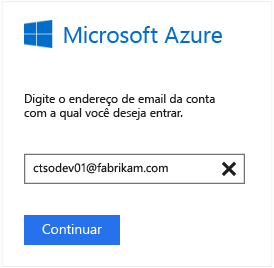
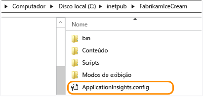
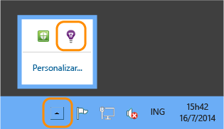
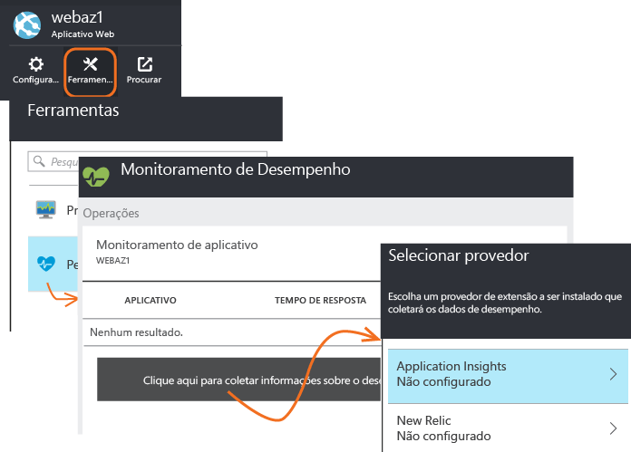
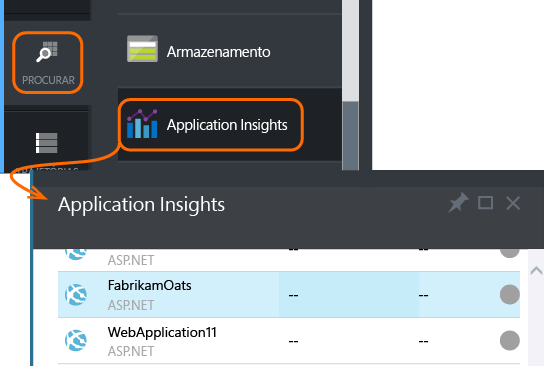
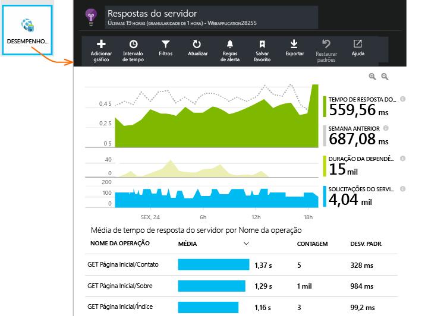
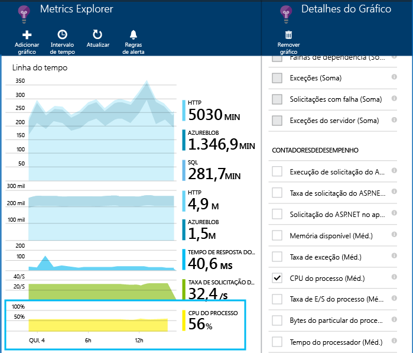
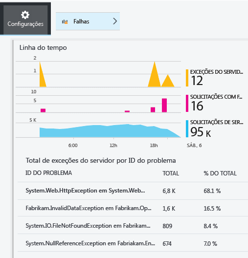

<properties
	pageTitle="Diagnosticar problemas de desempenho em um site IIS em execução | Microsoft Azure"
	description="Monitore o desempenho do site sem implantá-lo novamente. Use um autônomo ou o SDK do Application Insights para obter a telemetria de dependência."
	services="application-insights"
    documentationCenter=".net"
	authors="alancameronwills"
	manager="douge"/>

<tags
	ms.service="application-insights"
	ms.workload="tbd"
	ms.tgt_pltfrm="ibiza"
	ms.devlang="na"
	ms.topic="get-started-article"
	ms.date="03/09/2016"
	ms.author="awills"/>

# Instalar o Monitor de Status do Aplicativo Insights para monitorar o desempenho do site

*O Application Insights está em modo de visualização.*

O Status do Monitor do Application Insights para Visual Studio permite diagnosticar exceções e problemas de desempenho em aplicativos ASP.NET.

> [AZURE.TIP] Há artigos sobre como instrumentar [aplicativos Web J2EE online](app-insights-java-live.md) e [Serviços de Nuvem do Azure](app-insights-cloudservices.md).

Você tem três maneiras de aplicar o Application Insights em seus aplicativos Web do IIS:

* **Tempo de compilação:** [Adicionar o SDK do Application Insights][greenbrown] ao código do aplicativo Web. Isso fornece:
 * Um intervalo de telemetria de uso e de diagnóstico padrão.
 * A [API do Application Insights][api] permite escrever sua própria telemetria para monitorar o uso detalhadamente ou diagnosticar problemas.
* **Tempo de execução:** use o Monitor de Status para instrumentar seu aplicativo Web no servidor.
 * Monitorar aplicativos Web que já estão em execução: não é necessário recriá-los ou republicá-los.
 * Um intervalo de telemetria de uso e de diagnóstico padrão.
 * Diagnóstico de dependência &#151; localizar falhas ou baixo desempenho onde seu aplicativo usa outros componentes, como bancos de dados, APIs REST ou outros serviços.
 * Solucionar qualquer problema com telemetria.
* **Ambos:** compile o SDK em seu código de aplicativo Web e execute o Monitor de Status em seu servidor Web. O melhor dos dois mundos:
 * telemetria de uso e de diagnóstico padrão.
 * Diagnóstico de dependência.
 * A API permite escrever telemetria personalizada.
 * Solucione qualquer problema com o SDK e telemetria.

## Instale o Application Insights Status Monitor

É necessário ter uma assinatura do [Microsoft Azure](http://azure.com).

### Se seu aplicativo for executado em seu servidor IIS

1. No servidor Web IIS, faça logon com as credenciais de administrador.
2. Baixe e execute o [instalador do Monitor de Status](http://go.microsoft.com/fwlink/?LinkId=506648).
4. No assistente de instalação, entre no Microsoft Azure.

    

    *Erros de conexão? Consulte [Solucionar problemas](#troubleshooting).*

5. Selecione o aplicativo Web ou o site que deseja monitorar e configure o recurso no qual você deseja ver os resultados no Portal do Application Insights.

    

    Normalmente, você opta por configurar um novo recurso e [grupo de recursos][roles].

    Caso contrário, use um recurso existente se você já configurou [testes da Web][availability] para seu site ou o [monitoramento de clientes Web][client].

6. Reinicie o IIS.

    

    O serviço Web será interrompido por um período curto.

6. Observe que ApplicationInsights.config foi inserido nos sites que você deseja monitorar.

    

   Há também algumas mudanças em web.config.

#### Deseja (re)configurar mais tarde?

Após concluir o assistente, você pode reconfigurar o agente quando desejar. É possível também usá-lo se você instalou o agente, mas ocorreu algum problema na configuração inicial.

### Se seu aplicativo for executado como um Aplicativo Web do Azure

No painel de controle do Aplicativo Web do Azure, adicione a extensão do Application Insights.

### Se ele for um projeto de serviços de nuvem do Azure

[Adicionar scripts a funções da Web e de trabalho](app-insights-cloudservices.md).

## Exibir desempenho de telemetria

Entre no [portal do Azure](https://portal.azure.com), procure o Application Insights e abra o recurso que você criou.

Abra a folha de Desempenho para ver as solicitações, tempos de resposta, dependências e outros dados.

Clique para ajustar os detalhes do que é exibido ou adicionar um novo gráfico.

## Dependências

O gráfico de Duração da Dependência mostra o tempo gasto por chamadas do seu aplicativo para componentes externos, como bancos de dados, APIs REST ou Armazenamento de Blob do Azure.

Para segmentar o gráfico por chamadas para dependências diferentes, selecione o gráfico, ative o Agrupamento e escolha a Dependência, o Tipo de Dependência ou o Desempenho de Dependência.

Você também pode filtrar o gráfico para examinar um bloco específico de dependência, tipo ou desempenho. Clique em Filtros.

## Contadores de desempenho

(Não vale para aplicativos Web do Azure.) Clique em Servidores na folha de visão geral para ver gráficos de contadores de desempenho do servidor, como uso de memória e ocupação da CPU.

Adicione um novo gráfico ou clique em qualquer gráfico para alterar o que ele mostra.

Você também pode [alterar o conjunto de contadores de desempenho que são relatados pelo SDK](app-insights-configuration-with-applicationinsights-config.md#nuget-package-3).

## Exceções

Você pode fazer busca detalhada até exceções específicas (dos últimos sete dias) e obter rastreamentos de pilha e dados de contexto.

## Amostragem

Se o aplicativo enviar muitos dados e se você estiver usando o SDK do Application Insights para o ASP.NET versão 2.0.0-beta3 ou posterior, o recurso de amostragem adaptável poderá operar e enviar apenas uma porcentagem de sua telemetria. [Saiba mais sobre amostragem.](app-insights-sampling.md)

## Solucionar problemas

### Erros de conexão

Você precisa abrir [algumas portas de saída](app-insights-ip-addresses.md#outgoing-ports) no firewall do servidor para permitir que o Monitor de Status funcione.

### Sem telemetria?

  * Use seu site para gerar alguns dados.
  * Aguarde alguns minutos até que os dados cheguem e clique em **Atualizar**.
  * Abrir a Pesquisa de Diagnóstico (o bloco de Pesquisa) para ver os eventos individuais. Eventos geralmente são visíveis na Pesquisa de Diagnóstico antes de os dados agregados aparecem nos gráficos.
  * Abra o Monitor de Status e selecione seu aplicativo no painel esquerdo. Verifique se há mensagens de diagnóstico para este aplicativo na seção "Configuração de notificações":

  

  * Verifique se o firewall do servidor permite o tráfego de saída nas portas listadas acima.
  * No servidor, se você encontrar uma mensagem sobre "permissões insuficientes", tente fazer o seguinte:
    * No Gerenciador do IIS, selecione o pool de aplicativos, abra as **Configurações Avançadas** e, em **Modelo de Processo**, observe a identidade.
    * No painel de controle de gerenciamento do computador, adicione essa identidade ao grupo Usuários do Monitor de Desempenho.
  * Se você tiver o MMA/SCOM instalado em seu servidor, algumas versões poderão entrar em conflito. Desinstale o SCOM e o Monitor de Status e reinstale as versões mais recentes.
  * Consulte [Solucionar problemas][qna].

## Requisitos do Sistema

Suporte de sistema operacional para Application Insights Status Monitor no servidor:

- Windows Server 2008
- Windows Server 2008 R2
- Windows Server 2012
- Windows Server 2012 R2

com o SP mais recente e .NET Framework 4.0 e 4.5

No lado do cliente, Windows 7, 8 e 8.1, novamente com o .NET Framework 4.0 e 4.5

Suporte ao IIS: IIS 7, 7,5, 8 e 8.5 (o IIS é obrigatório)

## Automação com o PowerShell

Você pode iniciar e interromper o monitoramento usando o PowerShell.

Primeiro, importe o módulo do Application Insights:

`Import-Module 'C:\Program Files\Microsoft Application Insights\Status Monitor\PowerShell\Microsoft.Diagnostics.Agent.StatusMonitor.PowerShell.dll'`

Saiba quais aplicativos estão sendo monitorados:

`Get-ApplicationInsightsMonitoringStatus [-Name appName]`

* `-Name` (Opcional) O nome de um aplicativo Web.
* Exibe o status de monitoramento do Application Insights para cada aplicativo Web (ou o aplicativo nomeado) nesse servidor IIS.

* Retorna `ApplicationInsightsApplication` para cada aplicativo:
 * `SdkState==EnabledAfterDeployment`: o aplicativo está sendo monitorado e foi instrumentado em tempo de execução, pela ferramenta Monitor de Status ou pelo `Start-ApplicationInsightsMonitoring`.
 * `SdkState==Disabled`: o aplicativo não é instrumentado para o Application Insights. Ele nunca foi instrumentado ou o monitoramento em tempo de execução foi desabilitado com a ferramenta Monitor de Status ou com o `Stop-ApplicationInsightsMonitoring`.
 * `SdkState==EnabledByCodeInstrumentation`: o aplicativo foi instrumentado por meio da adição do SDK ao código-fonte. Seu SDK não pode ser atualizado ou interrompido.
 * `SdkVersion` mostra a versão em uso para o monitoramento do aplicativo.
 * `LatestAvailableSdkVersion`mostra a versão atualmente disponível na galeria do NuGet. Para atualizar o aplicativo para esta versão, use `Update-ApplicationInsightsMonitoring`.

`Start-ApplicationInsightsMonitoring -Name appName -InstrumentationKey 00000000-000-000-000-0000000`

* `-Name` O nome do aplicativo no IIS
* `-InstrumentationKey` O ikey do recurso Application Insights em que você deseja que os resultados sejam exibidos.

* Este cmdlet afeta apenas os aplicativos que ainda não estão instrumentados - ou seja, SdkState==NotInstrumented.

    O cmdlet não afeta um aplicativo que já esteja instrumentado, em tempo de compilação por meio da adição do SDK ao código, ou em tempo de execução por meio de um uso anterior desse cmdlet.

    A versão do SDK usada para instrumentar o aplicativo é a versão baixada mais recentemente para este servidor.

    Para baixar a versão mais recente, use Update-ApplicationInsightsVersion.

* Retorna `ApplicationInsightsApplication` se há êxito. Se ele falhar, registrará em log um rastreamento para stderr.

    
          Name                      : Default Web Site/WebApp1
          InstrumentationKey        : 00000000-0000-0000-0000-000000000000
          ProfilerState             : ApplicationInsights
          SdkState                  : EnabledAfterDeployment
          SdkVersion                : 1.2.1
          LatestAvailableSdkVersion : 1.2.3

`Stop-ApplicationInsightsMonitoring [-Name appName | -All]`

* `-Name` O nome de um aplicativo no IIS
* `-All` Para o monitoramento de todos os aplicativos desse servidor IIS para o qual `SdkState==EnabledAfterDeployment`

* Para o monitoramento de aplicativos especificados e remove a instrumentação. Ele só funciona para aplicativos que foram instrumentados em tempo de execução usando a ferramenta Monitoramento de Status ou Start-ApplicationInsightsApplication. (`SdkState==EnabledAfterDeployment`)

* Retorna ApplicationInsightsApplication.

`Update-ApplicationInsightsMonitoring -Name appName [-InstrumentationKey "0000000-0000-000-000-0000"`]

* `-Name`: o nome de um aplicativo Web no IIS.
* `-InstrumentationKey` (Opcional.) Use isso para alterar o recurso para o qual a telemetria do aplicativo é enviada.
* Este cmdlet:
 * Atualiza o aplicativo nomeado para a versão do SDK baixado mais recentemente para esta máquina. (Só funciona se `SdkState==EnabledAfterDeployment`)
 * Se você fornecer uma chave de instrumentação, o aplicativo nomeado será reconfigurado para enviar telemetria para o recurso com essa chave. (Funciona se `SdkState != Disabled`)

`Update-ApplicationInsightsVersion`

* Baixa o SDK mais recente do Application Insights para o servidor.

## Modelo do Azure

Se o aplicativo Web estiver no Azure e se você criar os recursos usando um modelo do Azure Resource Manager, poderá configurar o Application Insights adicionando isto ao nó de recursos:

    {
      resources: [
        /* Create Application Insights resource */
        {
          "apiVersion": "2015-05-01",
          "type": "microsoft.insights/components",
          "name": "nameOfAIAppResource",
          "location": "centralus",
          "kind": "web",
          "properties": { "ApplicationId": "nameOfAIAppResource" },
          "dependsOn": [
            "[concat('Microsoft.Web/sites/', myWebAppName)]"
          ]
        }
       ]
     } 

* `nameOfAIAppResource` - um nome para o recurso do Application Insights
* `myWebAppName` - a id do aplicativo Web

## Próximas etapas

* [Criar testes da Web][availability] para assegurar seu site permaneça ativo.
* [Pesquise eventos e logs][diagnostic] para ajudar a diagnosticar problemas.
* [Adicionar telemetria do cliente Web][usage] para ver as exceções no código da página da Web e permitir que você insira chamadas de rastreamento.
* [Adicionar SDK do Application Insights ao seu código de serviço Web][greenbrown] para que você possa inserir o rastreamento e chamadas de log no código do servidor.

## Vídeo

#### Monitoramento de desempenho

[AZURE.VIDEO app-insights-performance-monitoring]

<!--Link references-->

[api]: app-insights-api-custom-events-metrics.md
[availability]: app-insights-monitor-web-app-availability.md
[client]: app-insights-javascript.md
[diagnostic]: app-insights-diagnostic-search.md
[greenbrown]: app-insights-asp-net.md
[qna]: app-insights-troubleshoot-faq.md
[roles]: app-insights-resources-roles-access-control.md
[usage]: app-insights-web-track-usage.md

<!---HONumber=AcomDC_0713_2016-->