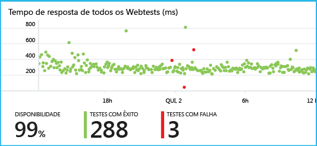
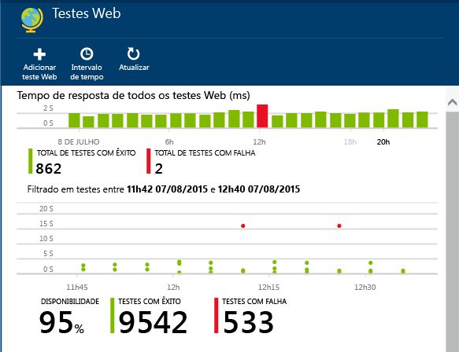
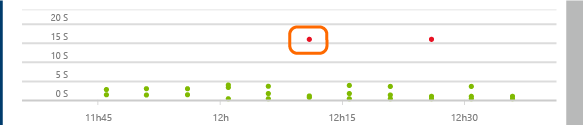
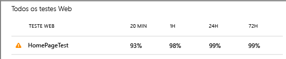
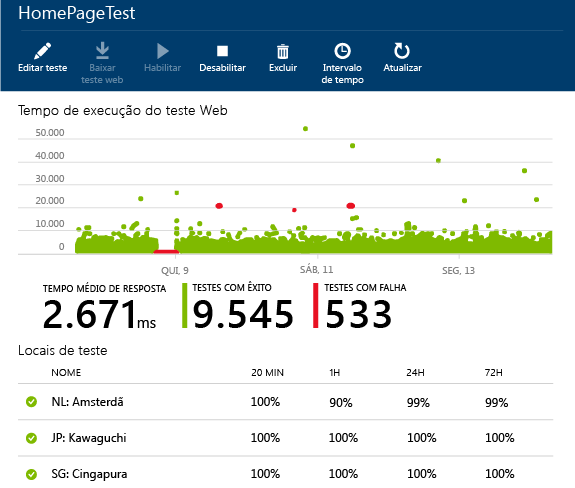
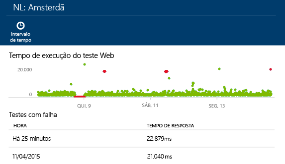
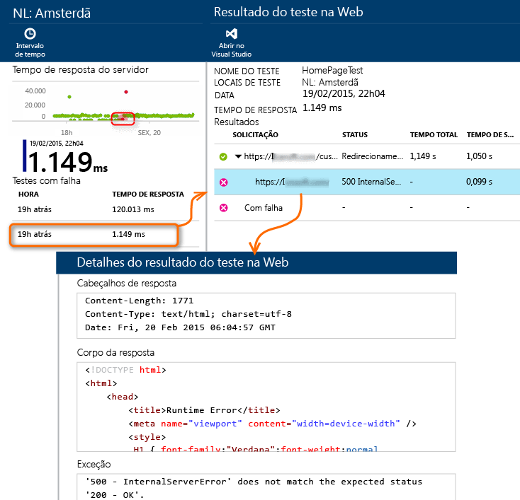
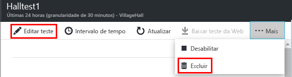

<properties
	pageTitle="Monitorar a disponibilidade e a capacidade de resposta de qualquer site da Web | Microsoft Azure"
	description="Configure testes da web no Application Insights. Obtenha alertas se um site fica indisponível ou responde lentamente."
	services="application-insights"
    documentationCenter=""
	authors="alancameronwills"
	manager="douge"/>

<tags
	ms.service="application-insights"
	ms.workload="tbd"
	ms.tgt_pltfrm="ibiza"
	ms.devlang="na"
	ms.topic="get-started-article"
	ms.date="05/20/2016"
	ms.author="awills"/>

# Monitorar a disponibilidade e a capacidade de resposta de qualquer site


[AZURE.INCLUDE [app-insights-selector-get-started-dotnet](../../includes/app-insights-selector-get-started-dotnet.md)]

Após ter implantado seu aplicativo Web, você pode configurar testes na Web para monitorar sua disponibilidade e capacidade de resposta. O Application Insights envia solicitações em intervalos regulares por meio de pontos no mundo inteiro, e pode alertá-lo se o seu aplicativo responder lentamente ou simplesmente não responder.



Você pode configurar testes na Web para qualquer ponto de extremidade HTTP ou HTTPS que for acessível da Internet pública.

Há dois tipos de teste da Web:

* [Teste de ping de URL](#set-up-a-url-ping-test): um teste simples que você pode criar no Portal do Azure.
* [Teste da web de várias etapas](#multi-step-web-tests): criado no Visual Studio Ultimate ou Visual Studio Enterprise e carregado no portal.

Você pode criar até 10 testes na Web por recurso de aplicativo.


## Configurar um teste de ping de URL

### <a name="create"></a>1. Criar um novo recurso?

Pule esta etapa se você já [configurou um recurso do Application Insights][start] para este aplicativo e deseja ver os dados de disponibilidade no mesmo local.

Inscreva-se no [Microsoft Azure](http://azure.com), vá para o [Portal do Azure](https://portal.azure.com) e crie um novo recurso do Application Insights.


A folha de Visão Geral para o novo recurso será aberta. Para encontrá-los a qualquer momento no [Portal do Azure](https://portal.azure.com), clique em **Procurar**.

### <a name="setup"></a>2. Crie um teste na Web

Em seu recurso do Application Insights, procure o bloco de Disponibilidade. Clique para abrir a folha de testes da Web para seu aplicativo e adicione um teste da Web.


- **A URL** deve estar visível na Internet pública. Ela pode incluir uma cadeia de caracteres de consulta&#151. Por exemplo, você pode utilizar um pouco seu banco de dados. Se a URL for resolvida para um redirecionamento nós a seguiremos, até um máximo de 10 redirecionamentos.
- **Analisar solicitações dependentes**: imagens, scripts, arquivos de estilo e outros recursos da página são solicitados como parte do teste. O teste falhará se todos esses recursos não puderem ser baixados com êxito dentro do tempo limite para o teste inteiro.
- **Habilitar tentativas**: quando o teste falha, ele é repetido após um breve intervalo. Uma falha só será relatada se três tentativas sucessivas falharem. Testes subsequentes são então executados com a frequência de teste normal. A repetição é suspensa temporariamente até o próximo sucesso. Essa regra é aplicada independentemente em cada local de teste. (Recomendamos essa configuração. Em média, aproximadamente 80% das falhas desaparecem na repetição.)
- **Frequência de teste**: define a frequência com que o teste é executado em cada local de teste. Com uma frequência de cinco minutos e cinco locais de teste, seu site será testado em média a cada minuto.
- Os **locais de teste** são os locais por meio dos quais nossos servidores enviam solicitações da Web para sua URL. Escolha dois ou três para que você possa diferenciar problemas no site de problemas da rede. Você pode selecionar até 16 locais.

- **Critérios de sucesso**:

    **Tempo limite do teste**: reduza-o para ser alertado sobre respostas lentas. O teste é considerado uma falha se as respostas de seu site não são recebidas dentro desse período. Se você tiver selecionado **Analisar solicitações dependentes**, todas as imagens, arquivos de estilo, scripts e outros recursos dependentes devem ter sido recebidos dentro desse período.

    **Resposta HTTP**: o código de status retornado que é contado como êxito. 200 é o código que indica que uma página da Web normal foi retornada.

    **Correspondência de conteúdo**: uma cadeia de caracteres como "Bem-vindo!" Faremos o teste para comprovar se ela ocorre em todas as respostas. É necessário que seja uma cadeia de caracteres simples, sem curingas. Lembre-se de que se o conteúdo de sua página for alterado, talvez seja necessário atualizá-lo.


- **Alertas** serão, por padrão, enviados a você se houver falhas em três locais em cinco minutos. Uma falha em um único local provavelmente é um problema de rede, não um problema com seu site. Porém, você pode alterar o limite para ser mais ou menos sensível e também pode alterar a quem os emails devem ser enviados.

    Você pode configurar um [webhook](../azure-portal/insights-webhooks-alerts.md), que é chamado quando um alerta é gerado.

#### Testar mais URLs

Adicione mais testes. Por exemplo, além de testar a página inicial, você pode verificar se o banco de dados está sendo executado testando a URL para uma pesquisa.


### <a name="monitor"></a>3. Exibir relatórios de disponibilidade

Depois de 1 ou 2 minutos, clique em **Atualizar** na folha de testes de disponibilidade/Web. (Ele não atualiza automaticamente.)



Clique em qualquer barra no gráfico de resumo, na parte superior, para uma exibição mais detalhada do período de tempo.

Esses gráficos combinam os resultados de todos os testes da Web desse aplicativo.

#### Componentes da sua página da Web

Imagens, scripts e folhas de estilos, assim como outros componentes estáticos da página da Web que você está testando são solicitados como parte do teste.

O tempo de resposta gravado é o tempo transcorrido até que o carregamento de todos os componentes tenha sido concluído.

Se algum componente não for carregado, o teste será marcado com falha.

## <a name="failures"></a>Se você encontrar falhas...

Clique em um ponto vermelho.



Ou role para baixo e clique em um teste onde você pode ver menos de 100% de êxito.



Isso mostrará os resultados do teste em questão.



O teste é executado em vários locais&#151. Escolha um local em que os resultados são menores que 100%.




Role para baixo até **Testes com falha** e selecione um resultado.

Clique no resultado para avaliá-lo no portal e ver o motivo da falha.




Outra opção é baixar o arquivo de resultado e inspecioná-lo no Visual Studio.


*Parece correto, mas é relatado como uma falha?* Verifique todas as imagens, scripts, folhas de estilos e outros arquivos carregados pela página. Se qualquer um deles falhar, o teste será ser relatado como falha, mesmo se a página html principal carregar com êxito.


## Testes na Web com diversas etapas

Você pode monitorar um cenário que envolve uma sequência de URLs. Por exemplo, se estiver monitorando um site de vendas, você poderá testar se adicionar itens ao carrinho de compras funciona corretamente.

Para criar um teste de várias etapas, grave o cenário usando o Visual Studio e, em seguida, carregue a gravação no Application Insights. O Application Insights reproduzirá o cenário em intervalos e verificará as respostas.

Observe que você não pode usar funções codificadas em seus testes: as etapas do cenário devem estar contidas como um script no arquivo .webtest.

#### 1\. Registrar um cenário

Use o Visual Studio Enterprise ou Ultimate para registrar uma sessão da Web.

1. Crie um projeto de teste de desempenho na Web.

    

2. Abra o arquivo .webtest e inicie a gravação.

    

3. Siga as ações do usuário que você deseja simular em seu teste: abra seu site, adicione um produto ao carrinho e assim por diante. Em seguida, interrompa seu teste.

    

    Não crie um cenário longo. Há um limite de 100 etapas e 2 minutos.

4. Edite o teste para:
 - Adicionar validações para verificar o texto recebido e os códigos de resposta.
 - Remover todas as interações supérfluas. Você também pode remover solicitações dependentes de imagens, ou de sites de anúncio ou rastreamento.

    Lembre-se de que você só pode editar o script de teste — não é possível adicionar código personalizado ou chamar outros testes da web. Não insira loops no teste. Você pode usar plug-ins de teste da Web padrão.

5. Execute o teste no Visual Studio para confirmar que ele funciona.

    O executor do teste na Web abre um navegador da Web e repete as ações gravadas por você. Verifique se ele funciona conforme o esperado.

    


#### 2\. Carregar o teste na Web para o Application Insights

1. No portal do Application Insights, crie um novo teste na Web.

    

2. Selecione o teste com várias etapas e carregue o arquivo .webtest.

    

    Defina os locais de teste, a frequência e os parâmetros de alerta da mesma forma que para testes de ping.

Exiba seus resultados de teste quaisquer eventuais falhas do mesmo modo que faria para testes de url única.

Uma razão comum para falha é executar o teste por um período excessivamente longo. Ele não deve ser executado por mais de dois minutos.

Não se esqueça de que todos os recursos de uma página devem carregar corretamente para o teste ter êxito, incluindo scripts, folhas de estilos, imagens e assim por diante.

Observe que o teste na Web deve estar totalmente contido no arquivo .webtest: não é possível usar funções codificadas no teste.


### Conectando a hora e números aleatórios em seu teste de várias etapas

Suponha que você está testando uma ferramenta que obtém dados dependentes de tempo, como estoques de um feed externo. Quando grava seu teste na Web você deve usar horários específicos, definindo-os, todavia, como parâmetros do teste, StartTime e EndTime.


Quando você executa o teste, o ideal é que EndTime seja sempre a hora atual e StartTime seja o horário de 15 minutos atrás.

Plug-ins de teste na Web fornecem uma maneira de fazer isso.

1. Adicione um plug-in de teste na Web para cada valor de parâmetro variável desejado. Na barra de ferramentas de teste da Web, escolha **Adicionar Plug-in de Teste na Web**.

    

    Neste exemplo, vamos usar duas instâncias do plug-in de Data e Hora. É uma instância de "15 minutos atrás" e outra de "agora".

2. Abra as propriedades de cada plug-in. Atribua um nome e configure-o para usar a hora atual. Para um deles, defina Add Minutes = -15.

    

3. Nos parâmetros de teste na Web, use {{nome do plug-in}} para fazer referência a um nome de plug-in.

    

Agora, carregue seu teste no portal. Ele usará os valores dinâmicos em todas as execuções do teste.

## Lidando com a entrada

Se os usuários entrarem em seu aplicativo, você terá várias opções para simular entradas para poder testar as páginas por trás da entrada. A abordagem usada dependerá do tipo de segurança fornecida pelo aplicativo.

Em todos os casos, você deverá criar uma conta somente para fins de teste. Se possível, restrinja suas permissões para que ela seja somente leitura.

* Nome de usuário e senha mais simples: basta registrar um teste na Web da maneira usual. Exclua os cookies primeiro.
* Autenticação SAML. Para isso, você pode usar o plug-in SAML que está disponível para testes na Web.
* Segredo do cliente: se seu aplicativo tiver uma rota de entrada que envolva um segredo do cliente, use-o. O Active Directory do Azure o fornece. 
* Autenticação Aberta - por exemplo, entrar com sua conta da Microsoft ou do Google. Muitos aplicativos que usam OAuth oferecem a alternativa do segredo do cliente e, portanto, a primeira tática é investigar isso. Se o teste tiver de entrar usando OAuth, a abordagem geral será:
 * Use uma ferramenta como o Fiddler para examinar o tráfego entre o navegador da web, o site de autenticação e seu aplicativo. 
 * Executar duas ou mais entradas usando computadores ou navegadores diferentes ou em longos intervalos (para permitir que os tokens expirem).
 * Ao comparar sessões diferentes, identifique o token passado de volta ao site de autenticação, que será então passado para o servidor de aplicativos após a entrada. 
 * Registre um teste na Web usando o Visual Studio. 
 * Parametrize os tokens, definindo o parâmetro quando o token for retornado do autenticador e usando-o na consulta ao site. (O Visual Studio tentará parametrizar o teste, mas não parametrizará corretamente os tokens).


## <a name="edit"></a> Editar ou desabilitar um teste

Abra um teste individual para editá-lo ou desabilitá-lo.



Talvez você deseje desabilitar testes na Web quando estiver fazendo a manutenção de seu serviço.

## Automação

* [Use os scripts do PowerShell para configurar um teste na Web](https://azure.microsoft.com/blog/creating-a-web-test-alert-programmatically-with-application-insights/) automaticamente. 
* Configure um [webhook](../azure-portal/insights-webhooks-alerts.md), que é chamado quando um alerta é gerado.

## Perguntas? Problemas?

* *Posso chamar o código através do meu teste na Web?*

    Não. As etapas do teste devem estar no arquivo .webtest. E não é possível chamar outros testes da Web nem usar loops. Mas há uma série de plug-ins que você pode achar úteis.

* *Há suporte para HTTPS?*

    No momento, oferecemos suporte ao SSL 3.0 e ao TLS 1.0.

* *Há diferença entre "testes na Web" e "testes de disponibilidade"?*

    Usamos os dois termos de forma intercambiável.

* *Eu gostaria de usar testes de disponibilidade em nosso servidor interno que é executado por trás de um firewall.*

    Configure o firewall para permitir solicitações de endereços IP na lista no fim deste artigo.

* *Falha de carregamento de um teste na Web de várias etapas*

    Há um limite de tamanho de 300 K.

    Não há suporte para loops.

    Não há suporte para referências a outros testes na Web.

    Não há suporte para fontes de dados.

    
* *O teste de várias etapas não foi concluído*

    Há um limite de 100 solicitações por teste.

    O teste será interrompido se for executado por mais de dois minutos.

* *Como executar um teste com certificados de cliente*

    Não há suporte para isso, infelizmente.


## <a name="video"></a>Vídeo

> [AZURE.VIDEO monitoring-availability-with-application-insights]

## <a name="next"></a>Próximas etapas

[Pesquisar logs de diagnóstico][diagnostic]

[Solucionar problemas][qna]


## Endereços IP de testes na Web

Se você precisar abrir um firewall para permitir testes na Web, veja a lista atual de endereços IP. Ela pode mudar de tempos em tempos.

Abra as portas 80 (http) e 443 (https).

```

213.199.178.54
213.199.178.55
213.199.178.56
213.199.178.61
213.199.178.57
213.199.178.58
213.199.178.59
213.199.178.60
213.199.178.63
213.199.178.64
207.46.98.158
207.46.98.159
207.46.98.160
207.46.98.157
207.46.98.152
207.46.98.153
207.46.98.156
207.46.98.162
207.46.98.171
207.46.98.172
65.55.244.40
65.55.244.17
65.55.244.42
65.55.244.37
65.55.244.15
65.55.244.16
65.55.244.44
65.55.244.18
65.55.244.46
65.55.244.47
207.46.14.60
207.46.14.61
207.46.14.62
207.46.14.55
207.46.14.63
207.46.14.64
207.46.14.51
207.46.14.52
207.46.14.56
207.46.14.65
157.55.14.60
157.55.14.61
157.55.14.62
157.55.14.47
157.55.14.64
157.55.14.65
157.55.14.43
157.55.14.44
157.55.14.49
157.55.14.50
65.54.66.56
65.54.66.57
65.54.66.58
65.54.66.61
207.46.71.54
207.46.71.52
207.46.71.55
207.46.71.38
207.46.71.51
207.46.71.57
207.46.71.58
207.46.71.37
202.89.228.67
202.89.228.68
202.89.228.69
202.89.228.57
65.54.78.49
65.54.78.50
65.54.78.51
65.54.78.54
94.245.82.32
94.245.82.33
94.245.82.37
94.245.82.38
94.245.72.44
94.245.72.45
94.245.72.46
94.245.72.49
207.46.56.57
207.46.56.58
207.46.56.59
207.46.56.67
207.46.56.61
207.46.56.62
207.46.56.63
207.46.56.64
65.55.82.84
65.55.82.85
65.55.82.86
65.55.82.81
65.55.82.87
65.55.82.88
65.55.82.89
65.55.82.90
65.55.82.91
65.55.82.92
94.245.78.40
94.245.78.41
94.245.78.42
94.245.78.45
70.37.147.43
70.37.147.44
70.37.147.45
70.37.147.48
94.245.66.43
94.245.66.44
94.245.66.45
94.245.66.48

```


<!--Link references-->

[azure-availability]: ../insights-create-web-tests.md
[diagnostic]: app-insights-diagnostic-search.md
[qna]: app-insights-troubleshoot-faq.md
[start]: app-insights-overview.md

<!---HONumber=AcomDC_0525_2016-->