 ;--- title: Monitorar disponibilidade e resposta de qualquer site | Descrição do Microsoft Docs: Configure testes da Web no Application Insights. Obtenha alertas se um site fica indisponível ou responde lentamente.
services: application-insights documentationcenter: '' author: SoubhagyaDash manager: carmonm

ms.assetid: 46dc13b4-eb2e-4142-a21c-94a156f760ee ms.service: application-insights ms.workload: tbd ms.tgt_pltfrm: ibiza ms.devlang: na ms.topic: get-started-article ms.date: 02/09/2018 ms.author: sdash ; mbullwin

---
# Monitorar a disponibilidade e a capacidade de resposta de qualquer site
Após implantar o aplicativo Web ou site em qualquer servidor, você pode configurar testes para monitorar sua disponibilidade e capacidade de resposta. [Application Insights do Azure](app-insights-overview.md) envia solicitações da Web ao aplicativo em intervalos regulares de pontos no mundo todo. Ele o alertará se o aplicativo não responder ou responder lentamente.

Você pode configurar testes de disponibilidade para qualquer ponto de extremidade HTTP ou HTTPS que for acessível da Internet pública. Não é necessário adicionar qualquer coisa ao site que você está testando. Ele nem precisa ser o seu site: você pode testar um serviço de API REST do qual você depende.

Há dois tipos de testes de disponibilidade:

* [Teste de ping de URL](#create): um teste simples que você pode criar no Portal do Azure.
* [Teste na Web de várias etapas](#multi-step-web-tests): criado no Visual Studio Enterprise e carregado no portal.

Você pode criar até 100 testes de disponibilidade por recurso de aplicativo.

> [!NOTE] 
> * Os locais do teste de disponibilidade foram movidos recentemente para datacenters do Azure. Essa mudança nos permite adicionar locais com a rede em expansão dos data centers do Azure.  
> * Você não precisa atualizar testes. Todos os testes foram migrados e estão em execução nos novos locais. 
>* Consulte [atualização de serviço](https://blogs.msdn.microsoft.com/applicationinsights-status/2018/01/24/application-insights-availability-monitoring-test-locations-updated/) para saber mais.

## Abrir um recurso para os seus relatórios de teste de disponibilidade

**Se você já configurou o Application Insights** para seu aplicativo web, abra o recurso Application Insights no [portal do Azure](https://portal.azure.com).

**Ou, se preferir ver os relatórios em um novo recurso,** vá ao [Portal do Azure](https://portal.azure.com)e crie um recurso do Application Insights.

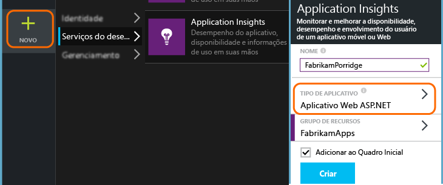

Clique em **Todos os recursos** para abrir a folha de Visão geral do novo recurso.

## Criar um teste de ping de URL
Abra a folha Disponibilidade e adicione um teste.

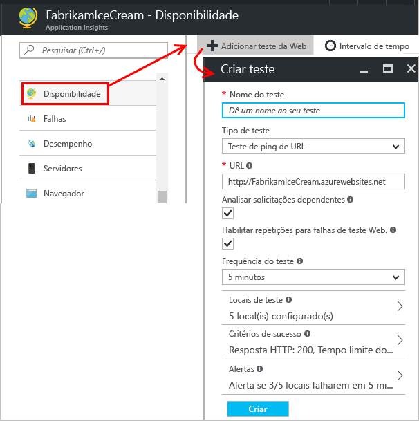

* **A URL** pode ser qualquer página da web que você deseja testar, mas ela deve estar visível na Internet pública. A URL pode incluir uma cadeia de consulta. Por exemplo, você pode utilizar um pouco seu banco de dados. Se a URL for resolvida para um redirecionamento, nós a seguiremos, até um máximo de 10 redirecionamentos.
* **Analisar as solicitações dependentes**: se esta opção estiver marcada, o teste solicitará imagens, scripts, arquivos de estilo e outros arquivos que fazem parte da página da Web em teste. O tempo de resposta gravado inclui o tempo necessário para obter esses arquivos. O teste falhará se todos esses recursos não puderem ser baixados com êxito dentro do tempo limite para o teste inteiro. 

    Se a opção não estiver marcada, o teste solicitará apenas o arquivo na URL especificada.

* **Habilitar tentativas novas**: se esta opção estiver marcada, quando o teste falhar, ele será repetido após um breve intervalo. Uma falha só será relatada se três tentativas sucessivas falharem. Testes subsequentes são então executados com a frequência de teste normal. A repetição é suspensa temporariamente até o próximo sucesso. Essa regra é aplicada independentemente em cada local de teste. Recomendamos essa opção. Em média, aproximadamente 80% das falhas desaparecem na repetição.

* **Frequência de teste**: define a frequência com que o teste é executado em cada local de teste. Com uma frequência padrão de cinco minutos e cinco locais de teste, seu site é testado em média a cada minuto.

* **locais de teste** são os locais por meio dos quais nossos servidores enviam solicitações da Web para sua URL. Escolha dois ou três para que você possa diferenciar problemas no site de problemas da rede. Você pode selecionar até 16 locais.

* **Critérios de sucesso**:

    **Tempo limite do teste**: reduza esse valor para ser alertado sobre respostas lentas. O teste é considerado uma falha se as respostas de seu site não são recebidas dentro desse período. Se você tiver selecionado **Analisar solicitações dependentes**, todas as imagens, arquivos de estilo, scripts e outros recursos dependentes devem ter sido recebidos dentro desse período.

    **Resposta HTTP**: o código de status retornado que é contado como êxito. 200 é o código que indica que uma página da Web normal foi retornada.

    **Correspondência de conteúdo**: uma cadeia de caracteres como "Bem-vindo!" Faremos o teste que uma correspondência exata de maiúsculas e minúsculas ocorre em todas as respostas. É necessário que seja uma cadeia de caracteres simples, sem curingas. Lembre-se de que se o conteúdo de sua página for alterado, talvez seja necessário atualizá-lo.
* **Alertas** serão, por padrão, enviados a você se houver falhas em três locais em cinco minutos. Uma falha em um único local provavelmente é um problema de rede, não um problema com seu site. Porém, você pode alterar o limite para ser mais ou menos sensível e também pode alterar a quem os emails devem ser enviados.

    Você pode configurar um [webhook](../monitoring-and-diagnostics/insights-webhooks-alerts.md) , que é chamado quando um alerta é gerado. (Mas observe que, no momento, os parâmetros de consulta não são passados como Propriedades.)

### Testar mais URLs
Adicione mais testes. Por exemplo, além de testar a página inicial, você pode verificar se o banco de dados está sendo executado testando a URL para uma pesquisa.

## Ver os resultados do teste de disponibilidade

Após alguns minutos, clique em **Atualizar** para ver os resultados de teste. 

O gráfico de dispersão mostra exemplos dos resultados de teste que têm detalhes de etapas do teste de diagnóstico. O mecanismo de teste armazena detalhes de diagnóstico para testes com falhas. Para testes bem-sucedidos, detalhes de diagnóstico são armazenados para um subconjunto das execuções. Passe o mouse sobre qualquer um dos pontos verde/vermelho para ver o carimbo de data/hora, duração, localização e nome do teste. Clique em qualquer ponto no gráfico de dispersão para ver os detalhes do resultado do teste.  

Selecione um teste específico e uma localização, ou reduza o período de tempo para ver mais resultados em todo o período de tempo de interesse. Use o Search Explorer para ver os resultados de todas as execuções ou usar consultas de análise para executar relatórios personalizados sobre esses dados.

Além dos resultados brutos, existem duas métricas de disponibilidade no Metrics Explorer: 

1. Disponibilidade: percentual dos testes que foram bem-sucedidos, em todas as execuções de teste. 
2. Duração do teste: duração média em todas as execuções de teste.

Você pode aplicar filtros de localização e nome de teste para analisar tendências de um teste e/ou localização específica.

## Como inspecionar e editar testes

Na página Resumo, selecione um teste específico. Lá, você pode ver seus resultados específicos e editar ou desabilitá-los temporariamente.

Você talvez queira desabilitar testes de disponibilidade ou as regras de alerta associadas a eles, enquanto você estiver fazendo a manutenção de seu serviço. 

## Se você encontrar falhas
Clique em um ponto vermelho.

De um resultado do teste de disponibilidade, você pode:

* Inspecionar a resposta recebida do servidor.
* Diagnosticar falha com a telemetria do lado do servidor coletada durante o processamento da instância de solicitação com falha.
* Registrar um problema ou um item de trabalho no Git ou no VSTS para controlar o problema. O bug conterá um link para este evento.
* Abrir o resultado do teste na Web no Visual Studio.

*Parece correto, mas é relatado como uma falha?* Consulte [Perguntas frequentes](#qna) para conhecer maneiras de reduzir o ruído.

> [!TIP]
> É recomendável testar a partir de pelo menos dois locais para ter um monitoramento confiável.
>

## Testes na Web com diversas etapas
Você pode monitorar um cenário que envolve uma sequência de URLs. Por exemplo, se estiver monitorando um site de vendas, você poderá testar se adicionar itens ao carrinho de compras funciona corretamente.

> [!NOTE] 
> Há uma cobrança para testes na Web de várias etapas. [Esquema de preços](http://azure.microsoft.com/pricing/details/application-insights/).
> 

Para criar um teste com várias etapas, grave o cenário usando o Visual Studio Enterprise e carregue a gravação no Application Insights. O Application Insights reproduz o cenário em intervalos e verifica as respostas.

> [!NOTE]
> * Não é possível usar funções codificadas nem loops nos seus testes. O teste deve estar completamente incluso no script. webtest. No entanto, você pode usar plug-ins-padrão.
> * Somente os caracteres em inglês têm suporte nos testes da Web de várias etapas. Se você usar o Visual Studio em outros idiomas, atualize o arquivo de definição de teste da Web para traduzir/excluir caracteres que não são inglês.
>

#### 1. Registrar um cenário
Use o Visual Studio Enterprise para registrar uma sessão da Web.

1. Crie um projeto de teste de desempenho na Web.

    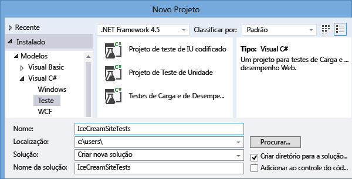

 * *Não consegue ver o modelo de Teste de carga e desempenho na Web?* - Feche o Visual Studio Enterprise. Abra o **Instalador do Visual Studio** para modificar a instalação do Visual Studio Enterprise. Em **Componentes Individuais**, selecione **Ferramentas de teste de carga e desempenho na Web**.

2. Abra o arquivo .webtest e inicie a gravação.

    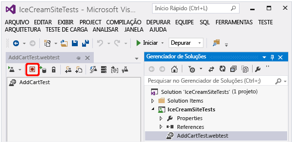
3. Siga as ações do usuário que você deseja simular em seu teste: abra seu site, adicione um produto ao carrinho e assim por diante. Em seguida, interrompa seu teste.

    

    Não crie um cenário longo. Há um limite de 100 etapas e 2 minutos.
4. Edite o teste para:

   * Adicionar validações para verificar o texto recebido e os códigos de resposta.
   * Remover todas as interações supérfluas. Você também pode remover solicitações dependentes de imagens, ou de sites de anúncio ou rastreamento.

     Lembre-se de que você só pode editar o script de teste — não é possível adicionar código personalizado ou chamar outros testes da web. Não insira loops no teste. Você pode usar plug-ins de teste da Web padrão.
5. Execute o teste no Visual Studio para confirmar que ele funciona.

    O executor do teste na Web abre um navegador da Web e repete as ações gravadas por você. Verifique se ele funciona conforme o esperado.

    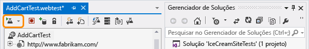

#### 2. Carregar o teste na Web para o Application Insights
1. No portal do Application Insights, crie um teste na Web.

    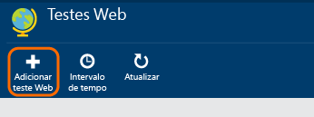
2. Selecione o teste com várias etapas e carregue o arquivo .webtest.

    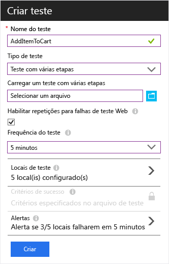

    Defina os locais de teste, a frequência e os parâmetros de alerta da mesma forma que para testes de ping.

#### 3. Confira os resultados

Exiba seus resultados de testes e falhas da mesma maneira que exibiria testes de url únicas.

Além disso, você pode baixar os resultados do teste para exibi-los no Visual Studio.

#### Muitas falhas?

* Uma razão comum para falha é executar o teste por um período excessivamente longo. Ele não deve ser executado por mais de dois minutos.

* Não se esqueça de que todos os recursos de uma página devem carregar corretamente para o teste ter êxito, incluindo scripts, folhas de estilos, imagens e assim por diante.

* O teste na Web deve estar totalmente incluso no script .webtest: não use funções codificadas.

### Conectando a hora e números aleatórios em seu teste de várias etapas
Suponha que você está testando uma ferramenta que obtém dados dependentes de tempo, como estoques de um feed externo. Quando grava seu teste na Web você deve usar horários específicos, definindo-os, todavia, como parâmetros do teste, StartTime e EndTime.

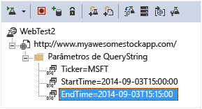

Quando você executa o teste, o ideal é que EndTime seja sempre a hora atual e StartTime seja o horário de 15 minutos atrás.

Plug-ins de teste da Web fornecem uma maneira de gerar tempos parametrizados.

1. Adicione um plug-in de teste na Web para cada valor de parâmetro variável desejado. Na barra de ferramentas de teste da Web, escolha **Adicionar Plug-in de Teste na Web**.

    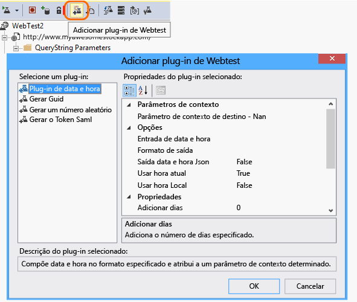

    Neste exemplo, usamos duas instâncias do plug-in de Data e Hora. É uma instância de "15 minutos atrás" e outra de "agora".
2. Abra as propriedades de cada plug-in. Atribua um nome e configure-o para usar a hora atual. Para um deles, defina Add Minutes = -15.

    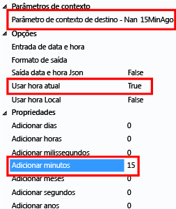
3. Nos parâmetros de teste na Web, use {{nome do plug-in}} para fazer referência a um nome de plug-in.

    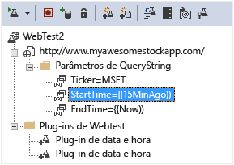

Agora, carregue seu teste no portal. Ele usa os valores dinâmicos em todas as execuções do teste.

## Lidando com a entrada
Se os usuários entrarem em seu aplicativo, você terá várias opções para simular entradas para poder testar as páginas por trás da entrada. A abordagem usada dependerá do tipo de segurança fornecida pelo aplicativo.

Em todos os casos, você deve criar uma conta no aplicativo apenas para fins de teste. Se possível, restrinja as permissões da conta de teste para que não haja possibilidade de que os testes na Web afetem usuários reais.

### Senha e nome de usuário simples
Grave um teste na Web da maneira usual. Exclua os cookies primeiro.

### Autenticação de SAML
Use o plug-in do SAML que está disponível para testes na Web.

### Segredo do cliente
Se seu aplicativo tiver uma rota de entrada que envolva um segredo do cliente, use-a. O AAD (Azure Active Directory) é um exemplo de um serviço que fornece uma entrada de segredo do cliente. No AAD, o segredo do cliente é a Chave do Aplicativo.

Aqui está um teste na Web de exemplo de um aplicativo Web que usa uma chave de aplicativo:

1. Obtenha o token do AAD usando o segredo do cliente (AppKey).
2. Extraia o token de portador da resposta.
3. Chame a API usando o token de portador no cabeçalho de autorização.

Verifique se o teste na Web é um cliente real, ou seja, se ele tem seu próprio aplicativo no AAD, e use seu clientId + appkey. O serviço que está sendo testado também tem seu próprio aplicativo no AAD: o URI appID desse aplicativo é refletido no teste na Web no campo "recurso".

### Autenticação Aberta
Um exemplo de autenticação aberta é entrar com sua conta da Microsoft ou do Google. Muitos aplicativos que usam OAuth fornecem a alternativa de segredo do cliente. Portanto, sua primeira tática deve ser investigar essa possibilidade.

Se o teste tiver de entrar usando OAuth, a abordagem geral será:

* Use uma ferramenta como o Fiddler para examinar o tráfego entre o navegador da web, o site de autenticação e seu aplicativo.
* Executar duas ou mais entradas usando computadores ou navegadores diferentes ou em longos intervalos (para permitir que os tokens expirem).
* Ao comparar sessões diferentes, identifique o token passado de volta ao site de autenticação, que será então passado para o servidor de aplicativos após a entrada.
* Registre um teste na Web usando o Visual Studio.
* Parametrize os tokens, definindo o parâmetro quando o token for retornado do autenticador e usando-o na consulta ao site.
  (O Visual Studio tenta parametrizar o teste, mas não parametriza os tokens corretamente.)

## Testes de desempenho
Você pode executar um teste de carga em seu site. Como o teste de disponibilidade, você pode enviar solicitações simples ou solicitações de várias etapas de nossos pontos em todo o mundo. Diferentemente de um teste de disponibilidade, muitas solicitações são enviadas, simulando vários usuários simultâneos.

Na folha de Visão geral, abra **Configurações**, **Testes de Desempenho**. Ao criar um teste, você é convidado a se conectar a ou criar uma conta do Visual Studio Team Services.

Quando o teste for concluído, você verá os tempos de resposta e as taxas de êxito.

> [!TIP]
> Para observar os efeitos de um teste de desempenho, use [Fluxo ao vivo](app-insights-live-stream.md) e [Criador de perfil](app-insights-profiler.md).
>

## Automação
* [Use os scripts do PowerShell para configurar um teste de disponibilidade](app-insights-powershell.md#add-an-availability-test) automaticamente.
* Configure um [webhook](../monitoring-and-diagnostics/insights-webhooks-alerts.md) , que é chamado quando um alerta é gerado.

## Dúvidas? Problemas?
* *Falha de teste intermitente com um erro de violação do protocolo?*

    O erro ("violação de protocolo... CR deve ser seguido por LF"), indica um problema com o servidor (ou dependências). Isso acontece quando cabeçalhos malformados são definidos na resposta. Pode ser causado por balanceadores de carga ou CDNs. Especificamente, talvez alguns cabeçalhos não estejam usando CRLF para indicar o fim da linha, o que viola a especificação de HTTP e, portanto, causa falha na validação do nível de WebRequest .NET. Inspecione a resposta para encontrar cabeçalhos que possam estar em violação.
    
    Observação: a URL pode não falhar em navegadores que têm uma validação reduzida dos cabeçalhos HTTP. Consulte esta postagem de blog para obter uma explicação detalhada do problema: http://mehdi.me/a-tale-of-debugging-the-linkedin-api-net-and-http-protocol-violations/  
* *Site parece certo, mas vejo falhas de teste?*

    * Verifique todas as imagens, scripts, folhas de estilos e outros arquivos carregados pela página. Se qualquer um deles falhar, o teste será relatado como falha, mesmo se a página html principal carregar com êxito. Para dessensibilizar o teste para essas falhas de recurso, simplesmente desmarque "Analisar Solicitações Dependentes" da configuração do teste. 

    * Para reduzir a probabilidade de ruído de blips de rede transitória etc., verifique se a configuração "Habilitar novas tentativas para falhas de teste" está marcada. Você também pode testar em mais locais e gerenciar adequadamente o limite de regra de alerta para evitar problemas específicos de local que estão causando alertas desnecessários.
    
* *Não vejo qualquer telemetria do lado servidor relacionado a falhas no teste de diagnóstico?*
    
    Se você o Application Insights está configurado para seu aplicativo do lado do servidor, talvez seja porque a [amostragem](app-insights-sampling.md) está em operação.
* *Posso chamar o código através do meu teste na Web?*

    Nº As etapas do teste devem estar no arquivo .webtest. E não é possível chamar outros testes da Web nem usar loops. Porém, há vários plug-ins que podem ser úteis.
* *Há suporte para HTTPS?*

    Damos suporte a TLS 1.1 e TLS 1.2.
* *Há diferença entre "testes na Web" e "testes de disponibilidade"?*

    Os dois termos podem ser consultados de modo intercambiável. Testes de disponibilidade é um termo mais genérico que inclui os testes de ping de URL individuais, além dos testes na Web de várias etapas.
* *Eu gostaria de usar testes de disponibilidade em nosso servidor interno que é executado por trás de um firewall.*

    Há duas soluções possíveis:
    
    * Configure o firewall para permitir as solicitações de entrada dos [endereços IP de nossos agentes de teste da Web](app-insights-ip-addresses.md).
    * Escreva seu próprio código para testar periodicamente o servidor interno. Execute o código como um processo em segundo plano em um servidor de teste por trás do firewall. O processo de teste pode enviar seus resultados para o Application Insights usando a API [TrackAvailability()](https://docs.microsoft.com/dotnet/api/microsoft.applicationinsights.telemetryclient.trackavailability) no pacote SDK principal. Isso requer que o servidor de teste tenha acesso de saída para o ponto de extremidade de ingestão do Application Insights, mas é um risco de segurança muito menor do que a alternativa de permitir as solicitações de entrada. Os resultados não serão exibidos nas folhas de testes na Web de disponibilidade, mas aparecerão como resultados de disponibilidade no Gerenciador de Análise, Pesquisa e Métrica.
* *Falha de carregamento de um teste na Web de várias etapas*

    Há um limite de tamanho de 300 K.

    Não há suporte para loops.

    Não há suporte para referências a outros testes na Web.

    Não há suporte para fontes de dados.
* *O teste de várias etapas não foi concluído*

    Há um limite de 100 solicitações por teste.

    O teste será interrompido se for executado por mais de dois minutos.
* *Como executar um teste com certificados de cliente*

    Não há suporte para isso, infelizmente.

## Próximas etapas
[Pesquisar logs de diagnóstico][diagnostic]

[Solução de problemas][qna]

[Endereços IP de agentes de teste Web](app-insights-ip-addresses.md)

<!--Link references-->

[azure-availability]: ../insights-create-web-tests.md
[diagnostic]: app-insights-diagnostic-search.md
[qna]: app-insights-troubleshoot-faq.md
[start]: app-insights-overview.md
