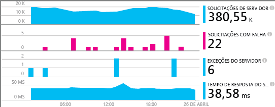
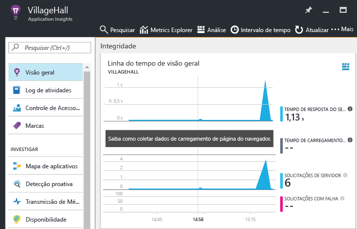

# <a name="monitor-your-nodejs-services-and-apps-with-application-insights"></a>Como monitorar seus serviços do Node.js e aplicativos com o Application Insights

O [Application Insights do Azure](app-insights-overview.md) monitora seus componentes e serviços de back-end depois de implantá-los para ajudá-lo a [detectar e diagnosticar rapidamente problemas de desempenho, entre outros](app-insights-detect-triage-diagnose.md). Use-o nos serviços do Node.js hospedado em qualquer lugar: seu datacenter, VMs do Azure, aplicativos Web e até mesmo em outras nuvens públicas.

Para receber, armazenar e explorar os dados de monitoramento, siga as instruções a seguir para incluir um agente em seu código e configurar um recurso do Application Insights correspondente no Azure. O agente envia dados a esse recurso para análise posterior e exploração.

O agente do Node.js pode monitorar automaticamente as solicitações HTTP de entrada e saída, várias métricas de sistema e exceções. A partir da v0.20, ele também pode monitorar alguns pacotes de terceiros comuns como `mongodb`, `mysql` e `redis`. Todos os eventos relacionados a uma solicitação HTTP de entrada são correlacionados para solução de problemas mais rápida.

Você pode monitorar outros aspectos do seu aplicativo e do sistema pela instrumentação manual usando a API do agente descrito posteriormente.



## <a name="getting-started"></a>Introdução

Vamos estudar a configuração de monitoramento para um serviço ou aplicativo.

### <a name="resource"></a>Configuração de um recurso do Application Insights

**Antes de iniciar**, verifique se você tem uma assinatura do Azure ou [obtenha uma gratuitamente][azure-free-offer]. Se sua organização já tiver uma assinatura do Azure, um administrador pode seguir [estas instruções][add-aad-user] para adicioná-lo a ela.

[azure-free-offer]: https://azure.microsoft.com/en-us/free/
[add-aad-user]: https://docs.microsoft.com/en-us/azure/active-directory/active-directory-users-create-azure-portal

Faça logon no [portal do Azure][portal] e crie um recurso no Application Insights, conforme ilustrado a seguir - clique em "Novo" > "Ferramentas do desenvolvedor" > "Application Insights". O recurso inclui um ponto de extremidade para receber dados de telemetria, armazenamento para esses dados, painéis e relatórios salvos, configurações de alerta e regra e muito mais.


Na página de criação de recursos, selecione "Aplicativo do Node.js" a partir do menu suspenso Tipo de aplicativo. O tipo de aplicativo determina o conjunto-padrão de painéis e relatórios criados para você. Na verdade, não há com que se preocupar, qualquer recurso do Application Insights pode coletar dados de qualquer idioma e plataforma.


### <a name="agent"></a>Configuração do agente do Node.js

Agora é hora de incluir o agente em seu aplicativo para que ele possa coletar dados.
Para começar, copie a chave de instrumentação do recurso (doravante referidos como seu `ikey`) do portal, conforme mostrado abaixo. O sistema do Application Insights usa essa chave para mapear dados para os seus recursos do Azure, por isso você precisa especificá-lo em uma variável de ambiente ou seu código para que o agente o use.  


Em seguida, adicione a biblioteca de agente do Node.js para as dependências do seu aplicativo por meio do package.json. Na pasta raiz do seu aplicativo, execute:

```bash
npm install applicationinsights --save
```

Agora você precisa carregar explicitamente a biblioteca em seu código. Como o agente injeta instrumentação em muitas outras bibliotecas, você deve carregá-lo o mais cedo possível, mesmo antes de outras instruções `require`. Para começar, na parte superior do seu primeiro arquivo .js, adicione:

```javascript
const appInsights = require("applicationinsights");
appInsights.setup("<instrumentation_key>");
appInsights.start();
```

O método `setup` configura a chave de instrumentação (e, portanto, os recursos do Azure) a ser usada por padrão para todos os itens rastreados. Chame `start` após a conclusão da configuração para começar a coletar e enviar os dados de telemetria.

Você também pode fornecer um ikey por meio da variável de ambiente APPINSIGHTS\_INSTRUMENTATIONKEY em vez de transmiti-lo manualmente ao `setup()` ou `getClient()`. Essa prática permite manter ikeys fora do código-fonte comprometido e especificar ikeys diferentes para ambientes diferentes.

As opções de configuração adicionais estão documentadas a seguir.

Você pode tentar o agente sem enviar telemetria definindo a chave de instrumentação para qualquer cadeia de caracteres não vazia.

### <a name="monitor"></a>Monitore o seu aplicativo

O agente reúne automaticamente a telemetria sobre o tempo de execução do Node.js e alguns módulos de terceiros comuns. Use o aplicativo agora para gerar alguns desses dados.

Em seguida, no [portal do Azure][portal], navegue até o recurso Application Insights que você criou anteriormente e procure alguns dos seus primeiros pontos de dados na linha do tempo da visão geral, como mostra a imagem seguinte. Clique nos gráficos para obter mais detalhes.



Clique no botão de mapa de aplicativo para exibir a topologia de descoberta para seu aplicativo, como mostra a imagem seguinte. Clique em componentes no mapa para obter mais detalhes.


Saiba mais sobre seu aplicativo e como solucionar problemas usando as exibições disponíveis na seção "Investigar".


#### <a name="no-data"></a>Não há dados?

Como o agente envia lotes de dados, pode haver um atraso antes de os itens serem exibidos no portal. Se você não visualizar os dados em seu recurso tente algumas das seguintes correções:

* Use mais o aplicativo; execute mais ações para gerar mais telemetria.
* Clique em **Atualizar** no modo de exibição de recursos do portal. Periodicamente, os gráficos se atualizam automaticamente, mas se quiser atualizá-los imediatamente, clique em atualizar.
* Verifique se [as portas de saídas necessárias](app-insights-ip-addresses.md) estão abertas.
* Abra o bloco [Pesquisar](app-insights-diagnostic-search.md) e procure eventos individuais.
* Leia as [Perguntas Frequentes][].


## <a name="agent-configuration"></a>Configuração do Agente

A seguir estão os métodos de configuração do agente e seus valores-padrão.

Para correlacionar totalmente eventos em um serviço, você deve definir `.setAutoDependencyCorrelation(true)`. Isso permite que o agente controle o contexto em retornos de chamada assíncronas no Node.js.

```javascript
const appInsights = require("applicationinsights");
appInsights.setup("<instrumentation_key>")
    .setAutoDependencyCorrelation(false)
    .setAutoCollectRequests(true)
    .setAutoCollectPerformance(true)
    .setAutoCollectExceptions(true)
    .setAutoCollectDependencies(true)
    .start();
```

## <a name="agent-api"></a>API de agente

<!-- TODO: Fully document agent API. -->

Confira a descrição completa sobre a API do agente .NET [aqui](app-insights-api-custom-events-metrics.md).

Você pode acompanhar qualquer solicitação, evento, métrica ou exceção usando o cliente do Node.js do Application Insights. O exemplo a seguir demonstra algumas das APIs disponíveis.

```javascript
let appInsights = require("applicationinsights");
appInsights.setup().start(); // assuming ikey in env var
let client = appInsights.getClient();

client.trackEvent("my custom event", {customProperty: "custom property value"});
client.trackException(new Error("handled exceptions can be logged with this method"));
client.trackMetric("custom metric", 3);
client.trackTrace("trace message");

let http = require("http");
http.createServer( (req, res) => {
  client.trackRequest(req, res); // Place at the beginning of your request handler
});
```

### <a name="track-your-dependencies"></a>Acompanhamento das suas dependências

```javascript
let appInsights = require("applicationinsights");
let client = appInsights.getClient();

var success = false;
let startTime = Date.now();
// execute dependency call here....
let duration = Date.now() - startTime;
success = true;

client.trackDependency("dependency name", "command name", duration, success);
```

### <a name="add-a-custom-property-to-all-events"></a>Adição de uma propriedade personalizada para todos os eventos

```javascript
appInsights.client.commonProperties = {
    environment: process.env.SOME_ENV_VARIABLE
};
```

### <a name="track-http-get-requests"></a>Acompanhamento das solicitações GET HTTP

```javascript
var server = http.createServer((req, res) => {
    if ( req.method === "GET" ) {
            appInsights.client.trackRequest(req, res);
    }
    // other work here....
    res.end();
});
```

### <a name="track-server-startup-time"></a>Tempo de inicialização do servidor de acompanhamento

```javascript
let start = Date.now();
server.on("listening", () => {
    let duration = Date.now() - start;
    appInsights.client.trackMetric("server startup time", duration);
});
```

## <a name="more-resources"></a>Mais recursos

* [Monitorar sua telemetria no portal](app-insights-dashboards.md)
* [Escrever consultas de análise sobre a telemetria](app-insights-analytics-tour.md)

<!--references-->

[portal]: https://portal.azure.com/
[Perguntas Frequentes]: app-insights-troubleshoot-faq.md

