<properties
	pageTitle="Análise de uso com o Application Insights"
	description="Visão geral da análise de uso com o Application Insights"
	services="application-insights"
    documentationCenter=""
	authors="alancameronwills"
	manager="douge"/>

<tags
	ms.service="application-insights"
	ms.workload="tbd"
	ms.tgt_pltfrm="ibiza"
	ms.devlang="multiple"
	ms.topic="article" 
	ms.date="08/06/2015"
	ms.author="awills"/>

# Análise de uso com o Application Insights

Saber como as pessoas usam seu aplicativo permite a você concentrar o trabalho de desenvolvimento nos cenários que são mais importantes para elas, além de adquirir percepção sobre quais objetivos elas têm maior ou menor dificuldade para atingir.

O Application Insights pode fornecer uma visão clara do uso do seu aplicativo, ajudando a melhorar sua experiência de usuário e atingir suas metas comerciais.

O Application Insights funciona tanto para aplicativos autônomos (no iOS, Android e Windows) quanto para aplicativos web (hospedados no .NET ou J2EE)

## Adicione o Application Insights ao seu projeto

Para começar, você precisa de uma assinatura do [Microsoft Azure](https://azure.com). (Há uma avaliação gratuita e após o período de avaliação, você pode continuar com a camada gratuita do serviço).

No [Portal do Azure](https://portal.azure.com), crie um recurso do Application Insights. É aqui onde verá seu uso e dados de performance sobre seu aplicativo.

**Se seu aplicativo for um aplicativo de dispositivo,**, adicione o SDK do Application Insights ao projeto. O procedimento exato varia dependendo de sua [IDE e plataforma](app-insights-platforms.md). Para aplicativos do Windows, clique com o botão direito do mouse no Visual Studio e selecione “Adicionar Application Insights”.

**Se for um aplicativo web,**abrir a folha de início rápido e obter o trecho de código para adicionar a páginas da web. Publicá-los novamente com este trecho de código.

Você também pode adicionar o Application Insights ao seu código de servidor [ASP.NET](app-insights-start-monitoring-app-health-usage.md)ou[J2EE](app-insights-java-get-started.md) para combinar telemetria a partir do cliente e servidor.

### Execute seu projeto e veja os primeiros resultados

Execute seu projeto no modo de depuração por alguns minutos e, em seguida, vá para o[portal do Azure](http://portal.azure.com)e vá para o recurso de projeto no Application Insights.

Publique seu aplicativo para obter mais telemetria e descubra o que os usuários estão fazendo com seu aplicativo.

## Análise imediata

Clique no bloco de visualizações de página para ver os detalhes de uso.

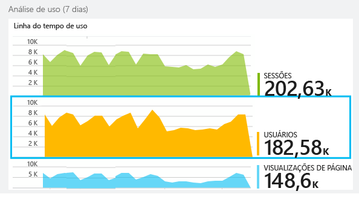

Passe o mouse na parte em branco acima de um gráfico para ver as contagens em um ponto específico. Caso contrário, os números mostram o valor acumulado ao longo do período, como uma média, um total ou uma contagem de usuários distintos.

Em aplicativos da Web, os usuários são contados usando cookies. Uma pessoa que usa vários navegadores, que limpa os cookies ou usa o recurso de privacidade será contada várias vezes.

Uma sessão da Web é contada após 30 minutos de inatividade. Uma sessão por meio de um telefone ou outro dispositivo é contada quando o aplicativo é suspenso por mais de alguns segundos.

Clique em qualquer gráfico para ver mais detalhes. Por exemplo:

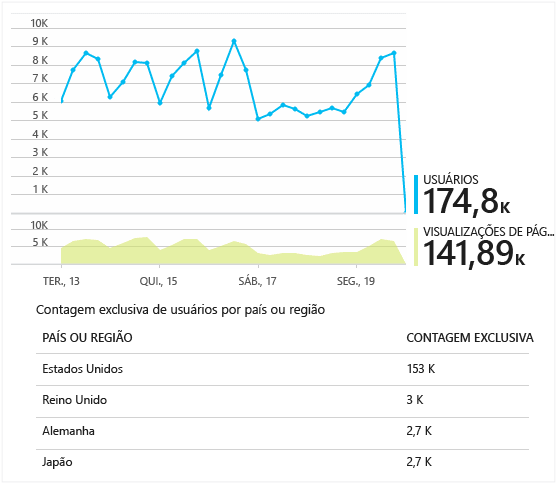

(Este exemplo é de um site, mas os gráficos parecem semelhantes para aplicativos executados em dispositivos.)

Compare com a semana anterior para ver se as coisas estão mudando:

Compare duas métricas, por exemplo, usuários e novos usuários:

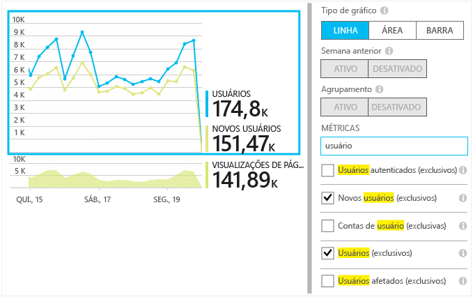

Dados de grupo (segmento) segundo uma propriedade, como Navegador, Sistema Operacional ou Cidade:

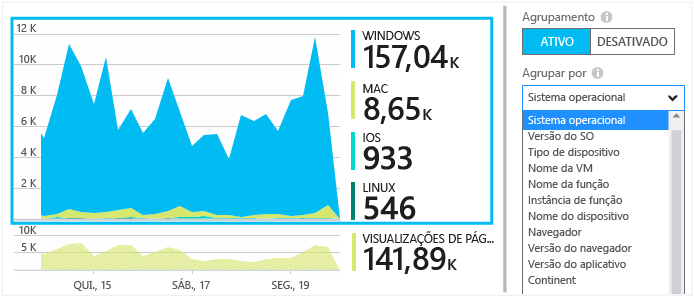

## Uso da página

Clique no bloco de visualizações de página para obter uma análise das suas páginas mais populares:

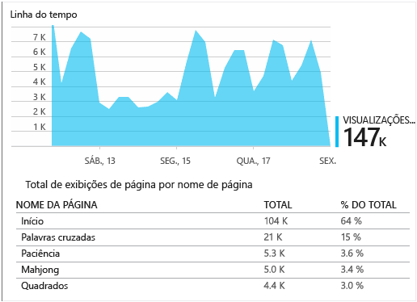

O exemplo acima é de um site de jogos. Nele, podemos ver instantaneamente:

* O uso não melhorou na última semana. Talvez devamos pensar em otimização do mecanismo de pesquisa?
* O número de pessoas que consultam as páginas de jogos é muito menor do que aquelas que consultam a home page. Por que nossa página inicial não estimula as pessoas a jogar?
* “Palavras Cruzadas” é o jogo mais popular. Lá, devemos dar prioridade a novas ideias e aprimoramentos.

## Acompanhamento personalizado

Vamos supor que, em vez de implementar cada jogo em uma página da Web separada, você decida refatorá-los todos no mesmo aplicativo de página única, com a maioria das funcionalidades codificadas como Javascript na página da Web. Isso permite que o usuário alterne rapidamente entre um jogo e outro, ou até mesmo entre vários jogos em uma única página.

Mas você ainda gostaria que o Application Insights registrasse o número de vezes que cada jogo é aberto, exatamente do mesmo modo que fazia quando elas estavam em páginas da Web separadas. Isso é fácil: basta inserir uma chamada para o módulo de telemetria em seu JavaScript no qual você deseja registrar que uma nova “página” foi aberta:

	telemetryClient.trackPageView(game.Name);

## Eventos personalizados

Você pode usar a telemetria de várias maneiras para entender como o seu aplicativo está sendo usado. Mas você não deseja sempre misturar as mensagens com modos de exibição de página. Em vez disso, use eventos personalizados. Você pode enviá-los por meio de aplicativos de dispositivos, páginas da Web ou um servidor Web:

(JavaScript)

    telemetryClient.trackEvent("GameEnd");

(C#)

    var tc = new Microsoft.ApplicationInsights.TelemetryClient();
    tc.TrackEvent("GameEnd");

(VB)

    Dim tc = New Microsoft.ApplicationInsights.TelemetryClient()
    tc.TrackEvent("GameEnd")

Os eventos personalizados mais frequentes são listados na folha visão geral.

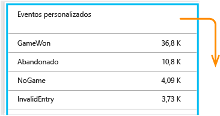

Clique no cabeçalho da tabela para ver o número total de eventos. Você pode segmentar o gráfico por diversos atributos, como o nome do evento:

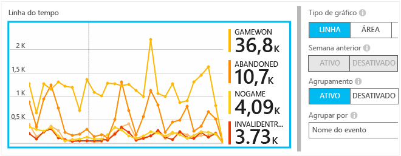

O recurso particularmente útil encontrado nas linhas do tempo é que você pode correlacionar alterações com outras métricas e eventos. Por exemplo, nos momentos em que mais jogos são executados, você esperaria ver um aumento também nos jogos abandonados. Mas o aumento nos jogos abandonados é desproporcional, e você gostaria de saber se a carga elevada está causando problemas que os usuários consideram inaceitáveis.

## Analisar eventos específicos

Para obter um melhor entendimento de como uma sessão típica decorre, convém concentrar-se na sessão de um usuário específico que contenha um determinado tipo de evento.

Neste exemplo, codificamos um evento personalizado "NoGame", que é chamado se o usuário faz logoff sem chegar realmente a iniciar um jogo. Por que um usuário faria isso? Talvez, se analisarmos detalhadamente algumas ocorrências específicas, obteremos uma pista.

Os eventos personalizados recebidos do aplicativo são listados por nome na folha visão geral:

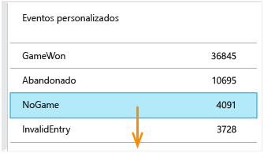

Clique nos eventos de interesse e selecione uma ocorrência específica recente:

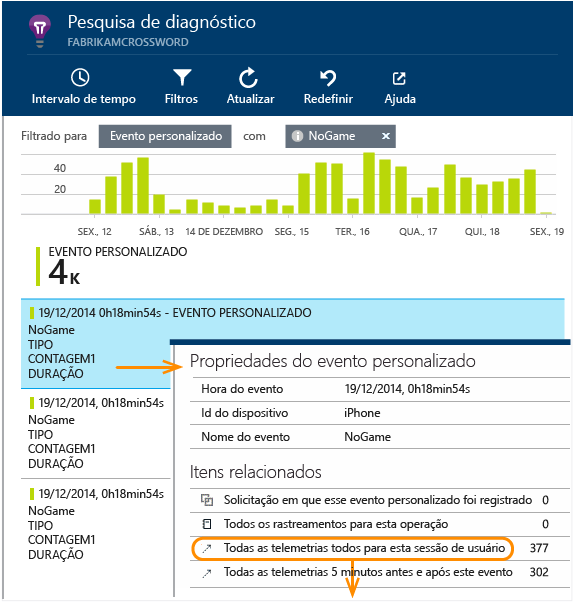

Vamos examinar todas a telemetria para a sessão na qual o evento NoGame ocorreu.

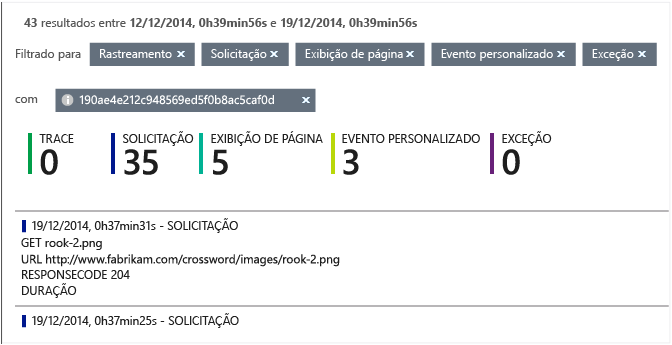

Não havia nenhuma exceção, portanto, o usuário não foi impedido de jogar devido a alguma falha.

É possível filtrar todos os tipos de telemetria exceto visualizações de página para esta sessão:

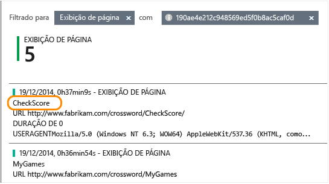

E agora podemos ver que este usuário fez logon simplesmente para verificar os resultados mais recentes. Talvez devamos pensar em desenvolver uma história de usuário que torne isso mais fácil de fazer. (E devemos implementar um evento personalizado ao relatório quando essa história específica ocorrer.)

## Filtre, pesquise e segmente seus dados com propriedades
Você pode anexar marcas arbitrárias e valores numéricos aos eventos.

JavaScript no cliente

    appInsights.trackEvent("WinGame",
        // String properties:
        {Game: currentGame.name, Difficulty: currentGame.difficulty},
        // Numeric measurements:
        {Score: currentGame.score, Opponents: currentGame.opponentCount}
    );

C# no servidor

    // Set up some properties:
    var properties = new Dictionary <string, string>
        {{"game", currentGame.Name}, {"difficulty", currentGame.Difficulty}};
    var measurements = new Dictionary <string, double>
        {{"Score", currentGame.Score}, {"Opponents", currentGame.OpponentCount}};

    // Send the event:
    telemetry.TrackEvent("WinGame", properties, measurements);

VB no servidor

    ' Set up some properties:
    Dim properties = New Dictionary (Of String, String)
    properties.Add("game", currentGame.Name)
    properties.Add("difficulty", currentGame.Difficulty)

    Dim measurements = New Dictionary (Of String, Double)
    measurements.Add("Score", currentGame.Score)
    measurements.Add("Opponents", currentGame.OpponentCount)

    ' Send the event:
    telemetry.TrackEvent("WinGame", properties, measurements)

Anexe propriedades a visualizações de página do mesmo modo:

JavaScript no cliente

    appInsights.trackPageView("Win",
        {Game: currentGame.Name},
        {Score: currentGame.Score});

Na Pesquisa de Diagnóstico, exiba as propriedades clicando por uma ocorrência individual de um evento.

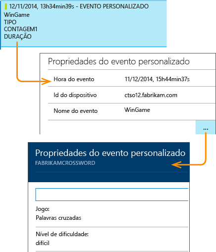

Use o campo Pesquisa para ver as ocorrências de eventos com um valor da propriedade específico.

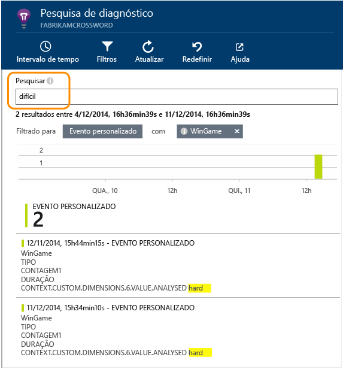

## Testando A | B

Se você não souber qual variante de um recurso terá mais êxito, libere ambas, tornando cada uma acessível para diferentes usuários. Avalie o sucesso de cada uma e então parta para uma versão unificada.

Para essa técnica, você pode anexar marcas distintas a todas as telemetrias enviadas por cada versão do seu aplicativo. Você pode fazer isso definindo propriedades no TelemetryContext ativo. Essas propriedades padrão são adicionadas a todas as mensagens de telemetria que o aplicativo envia - não apenas a suas mensagens personalizadas, mas também à telemetria padrão.

No portal do Application Insights, você então poderá filtrar e agrupar (segmentar) seus dados nas marcas, para comparar as diferentes versões.

C# no servidor

    using Microsoft.ApplicationInsights.DataContracts;

    var context = new TelemetryContext();
    context.Properties["Game"] = currentGame.Name;
    var telemetry = new TelemetryClient(context);
    // Now all telemetry will automatically be sent with the context property:
    telemetry.TrackEvent("WinGame");

VB no servidor

    Dim context = New TelemetryContext
    context.Properties("Game") = currentGame.Name
    Dim telemetry = New TelemetryClient(context)
    ' Now all telemetry will automatically be sent with the context property:
    telemetry.TrackEvent("WinGame")

A telemetria individual pode substituir os valores padrão.

Você pode configurar um inicializador universal para que todos os novos clientes de telemetria usem automaticamente seu contexto.

    // Telemetry initializer class
    public class MyTelemetryInitializer : IContextInitializer
    {
        public void Initialize (TelemetryContext context)
        {
            context.Properties["AppVersion"] = "v2.1";
        }
    }

No inicializador de aplicativo como Global.asax.cs:

    protected void Application_Start()
    {
        // ...
        TelemetryConfiguration.Active.ContextInitializers
        .Add(new MyTelemetryInitializer());
    }

## Compilar - Medir - Aprender

Quando você usa análise, ela se torna parte integrante de seu ciclo de desenvolvimento, não apenas algo a respeito do que você pensa para ajudar a resolver problemas. Aqui estão algumas dicas:

* Determine a métrica principal do seu aplicativo. Você deseja a maior quantidade de usuários possível ou prefere um conjunto pequeno de usuários muito contentes? Você deseja maximizar visitas ou vendas?
* Planeje medir cada história. Quando você faz o esboço de um novo recurso ou história de usuário, ou quando planeja atualizar um existente, pense sempre em como você medirá o sucesso da alteração. Antes da codificação começar, pergunte "Que efeito isso terá em nossas métricas, se funcionar? Devemos acompanhar quaisquer novos eventos?" E é claro, quando o recurso estiver ativo, certifique-se de examinar as análises e agir segundo os resultados.
* Relacione outras métricas à métrica principal. Por exemplo, se você adicionar um recurso "Favoritos", você gostaria de saber com que frequência os usuários adicionam Favoritos. Mas talvez é mais interessante saber com que frequência eles retornam aos seus Favoritos. E o mais importante, os clientes que usam Favoritos compram mais produtos?
* Teste de canário. Configure um comutador de recurso que permita a você tornar um novo recurso visível apenas para alguns usuários. Use o Application Insights para ver se o novo recurso está sendo usado do modo que você previu. Faça ajustes, então libere-o para um público maior.
* Fale com seus usuários! A análise não é suficiente por si só, mas sim complementar de se manter um bom relacionamento com o cliente.

## Saiba mais

* [Detecte, realize triagem e diagnostique as falhas e problemas de desempenho em seu aplicativo](app-insights-detect-triage-diagnose.md)
* [Introdução ao Application Insights em várias plataformas](app-insights-detect-triage-diagnose.md).

## Vídeo

> [AZURE.VIDEO usage-monitoring-application-insights]

<!--Link references-->

[start]: app-insights-overview.md
 

<!---HONumber=Oct15_HO3-->