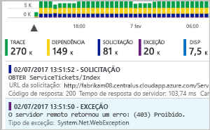
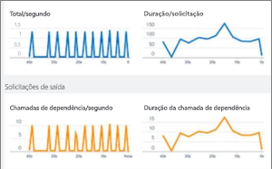
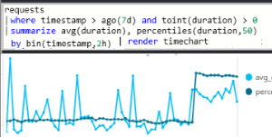
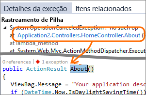
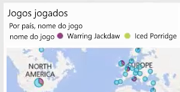
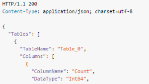

# O que é o Application Insights?
O Application Insights é um serviço de gerenciamento de desempenho de aplicativo (APM) extensível para desenvolvedores da Web em várias plataformas. Use-o para monitorar seu aplicativo Web online. Ele detectará anomalias de desempenho automaticamente. Ele inclui ferramentas de análise avançadas para ajudar você a diagnosticar problemas e entender o que os usuários realmente fazem com seu aplicativo.  Ele foi projetado para ajudar você a aprimorar continuamente o desempenho e a usabilidade do seu aplicativo. Ele funciona com aplicativos em uma ampla variedade de plataformas incluindo .NET e J2EE, hospedados localmente ou na nuvem. Ele se integra ao seu processo devOps e oferece pontos de conexão para uma ampla variedade de ferramentas de desenvolvimento.

[Confira a animação de introdução](https://www.youtube.com/watch?v=fX2NtGrh-Y0).

## Como funciona o Application Insights?
Você instala um pacote de instrumentação pequeno em seu aplicativo e configura um recurso Application Insights no portal do Microsoft Azure. A instrumentação monitora seu aplicativo e envia os dados de telemetria ao portal. (O aplicativo pode ser executado em qualquer lugar — ele não precisa ser hospedado no Azure.)

Você pode instrumentar não apenas o aplicativo de serviço web, mas também todos os componentes em segundo plano e o JavaScript nas próprias páginas da web. 

Além disso, você pode efetuar pull de telemetria dos ambientes de host, como contadores de desempenho, diagnóstico do Azure, ou logs de Docker. Você também pode configurar testes da web que enviam periodicamente solicitações sintéticas para o serviço web.

Todos esses fluxos de telemetria estão integrados no portal do Azure, onde é possível aplicar ferramentas de pesquisa e analíticas poderosas para os dados brutos.

### Qual é a sobrecarga?
O impacto sobre o desempenho do aplicativo é muito pequeno. As chamadas de acompanhamento não são bloqueadas, além de serem colocadas em lote e enviadas em um thread separado.

## O que o Application Insights monitora?

O Application Insights é indicado para a equipe de desenvolvimento, para ajudá-lo a compreender como está o desempenho de seu aplicativo e como ele está sendo usado. Ele monitora:

* **Taxas de solicitação, tempos de resposta e taxas de falha** - descubra quais páginas estão mais populares, em que momentos do dia, e onde os usuários estão. Confira as páginas que têm melhor desempenho. Se as taxas de falha e os tempos de resposta ficam altos quando há mais solicitações, possivelmente você tem um problema de alocação de recursos. 
* **Taxas de dependência, tempos de resposta e taxas de falha** - descubra se os serviços externos estão atrasando você.
* **Exceções** - analisar estatísticas agregadas ou selecionar instâncias específicas e analisar o rastreamento de pilha e as solicitações relacionadas. A maioria das exceções de navegador e servidor são relatadas.
* **Exibições de página e o desempenho de carregamento** - relatados por navegadores dos usuários.
* **Chamadas AJAX** de páginas da web - taxas, tempos de resposta e taxas de falha.
* **Contagens de seção e usuários**.
* **Contadores de desempenho** de suas máquinas de servidor Linux ou Windows server, como CPU, memória e uso da rede. 
* **Diagnósticos de host** do Docker ou do Azure. 
* **Logs de rastreamento de diagnóstico** do seu aplicativo - para que você possa correlacionar eventos de rastreamento com solicitações.
* **Métricas e eventos personalizados** que você escreve em código de cliente ou servidor, para acompanhar os eventos de negócios, como itens vendidos ou vitórias.

## Onde posso encontrar minha telemetria?

Há várias maneiras de explorar seus dados. Confira estes artigos:

|  |  |
| --- | --- |
| [**Mapa do aplicativo**](app-insights-app-map.md) Os componentes de seu aplicativo, com as principais métricas e alertas. |  |
| [**Pesquisa de diagnóstico para dados da instância**](app-insights-diagnostic-search.md) pesquise e filtre eventos como solicitações, exceções, chamadas de dependência, rastreamentos de log e exibições de página.  | |
| [**Metrics Explorer para os dados agregados**](app-insights-metrics-explorer.md) explore, filtre e segmente dados agregados, como taxas de solicitações, falhas e exceções; tempos de resposta e tempos de carregamento de página. | |
| [**Painéis**](app-insights-dashboards.md#dashboards) faça um mashup de dados de vários recursos e compartilhe com outras pessoas. Excelente para aplicativos com vários componentes e para exibição contínua no ambiente de equipe. | |
| [**Live Metrics Stream**](app-insights-live-stream.md) quando implantar um novo build, acompanhe esses indicadores de desempenho quase em tempo real para verificar se tudo está funcionando conforme esperado. | |
| [**Analytics**](app-insights-analytics.md) responda perguntas difíceis sobre o desempenho e o uso do seu aplicativo usando essa poderosa linguagem de consulta. | |
| [**Alertas automáticos e manuais**](app-insights-alerts.md) alertas automáticos se adaptam aos padrões normais de telemetria do seu aplicativo e são disparados quando há algo fora do padrão normal. Você também pode definir alertas em níveis específicos de métricas padrão ou personalizadas. | |
| [**Visual Studio**](app-insights-visual-studio.md) Veja dados de desempenho no código. Vá até o código dos rastreamentos de pilha.| |
| [**Power BI**](app-insights-export-power-bi.md) Integre as métricas de uso com outro business intelligence.| |
| [**REST API**](https://dev.applicationinsights.io/) Escreva o código para executar consultas em suas métricas e dados brutos.|  |
| [**Exportação contínua**](app-insights-export-telemetry.md) Exportação em massa de dados brutos para armazenamento assim que eles chegam. | |

## Como usar o Application Insights?

### Monitoramento
Instale o Application Insights no seu aplicativo, configure os [testes de disponibilidade da web](app-insights-monitor-web-app-availability.md) e:

* Configure um [painel](app-insights-dashboards.md) para sua sala da equipe para ficar atento à carga, à capacidade de resposta e ao desempenho de suas dependências, aos carregamentos de página e ás chamadas AJAX.
* Descubra quais são as solicitações mais lentas e com mais falhas.
* Assista ao [Live Stream](app-insights-live-stream.md) quando implantar uma nova versão, para identificar imediatamente uma degradação.

### Detectar, diagnosticar
Quando você recebe um alerta ou descobre um problema:

* Avalie quantos usuários são afetados.
* Correlacione falhas a exceções, a chamadas de dependência e a rastreamentos.
* Examine os logs de rastreamento e despejos de pilha.

### Compilar, medir, aprender
Meça a eficácia de cada novo recurso que você implanta.

* Planeje medir como os clientes usam a nova experiência do usuário ou as funcionalidades de negócios.
* Escreva a telemetria personalizada em seu código.
* Baseie o próximo ciclo de desenvolvimento em evidências da telemetria.

## Introdução
Application Insights é um dos muitos serviços hospedados no Microsoft Azure e a telemetria é enviada para ele para análise e apresentação. Portanto, antes de fazer qualquer outra coisa, você precisará de uma assinatura do [Microsoft Azure](http://azure.com). A inscrição é gratuita, e se você optar pelo [plano de preços](https://azure.microsoft.com/pricing/details/application-insights/) básico do Application Insights, não haverá cobrança até que seu aplicativo apresente uso substancial. Se sua organização já tiver uma assinatura, sua conta da Microsoft poderá ser adicionada a ela.

Existem várias maneiras de começar. Comece com o que funciona melhor para você. Você pode adicionar outras posteriormente.

* **Em tempo de execução: instrumente seu aplicativo Web no servidor.** Evita qualquer atualização no código. Você precisa de acesso de administrador para seu servidor.
  * [**IIS local ou em uma VM**](app-insights-monitor-performance-live-website-now.md)
  * [**Aplicativo Web ou VM do Azure**](app-insights-monitor-performance-live-website-now.md)
  * [**J2EE**](app-insights-java-live.md)
* **Em tempo de desenvolvimento: adicione o Application Insights ao seu código.** Permite que você escreva telemetria personalizada e instrumente aplicativos de back-end e de área de trabalho.
  * [Visual Studio](app-insights-asp-net.md) 2013 atualização 2 ou posterior.
  * Java no [Eclipse](app-insights-java-eclipse.md) ou em [outras ferramentas](app-insights-java-get-started.md)
  * [Node.js](app-insights-nodejs.md)
  * [Outras plataformas](app-insights-platforms.md)
* **[Instrumentar suas páginas da Web](app-insights-javascript.md)** para exibição de página, AJAX e outras telemetrias do lado do cliente.
* **[Testes de disponibilidade](app-insights-monitor-web-app-availability.md)** - execute o ping de seu site regularmente de nossos servidores.

## Próximas etapas
Introdução ao tempo de execução com:

* [Servidor IIS](app-insights-monitor-performance-live-website-now.md)
* [Servidor J2EE](app-insights-java-live.md)

Introdução ao tempo de desenvolvimento com:

* [ASP.NET](app-insights-asp-net.md)
* [Java](app-insights-java-get-started.md)
* [Node.js](app-insights-nodejs.md)

## Suporte e comentários
* Perguntas e problemas:
  * [Solução de problemas][qna]
  * [Fórum do MSDN](https://social.msdn.microsoft.com/Forums/vstudio/home?forum=ApplicationInsights)
  * [StackOverflow](http://stackoverflow.com/questions/tagged/ms-application-insights)
  * [Obter suporte do desenvolvedor](app-insights-get-dev-support.md)
* Suas sugestões:
  * [UserVoice](https://visualstudio.uservoice.com/forums/357324)
* Blog:
  * [Blog do Application Insights](https://azure.microsoft.com/blog/tag/application-insights)

## Vídeos

> [!VIDEO https://channel9.msdn.com/events/Connect/2016/100/player] 

<!--Link references-->

[android]: https://github.com/Microsoft/ApplicationInsights-Android
[azure]: ../insights-perf-analytics.md
[client]: app-insights-javascript.md
[desktop]: app-insights-windows-desktop.md
[detect]: app-insights-detect-triage-diagnose.md
[greenbrown]: app-insights-asp-net.md
[ios]: https://github.com/Microsoft/ApplicationInsights-iOS
[java]: app-insights-java-get-started.md
[knowUsers]: app-insights-overview-usage.md
[platforms]: app-insights-platforms.md
[portal]: http://portal.azure.com/
[qna]: app-insights-troubleshoot-faq.md
[redfield]: app-insights-monitor-performance-live-website-now.md

