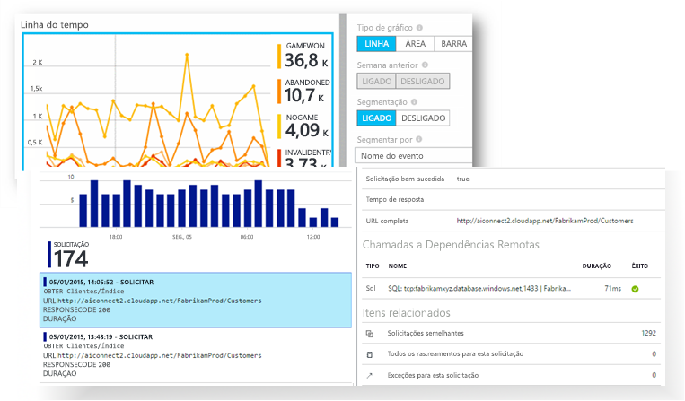
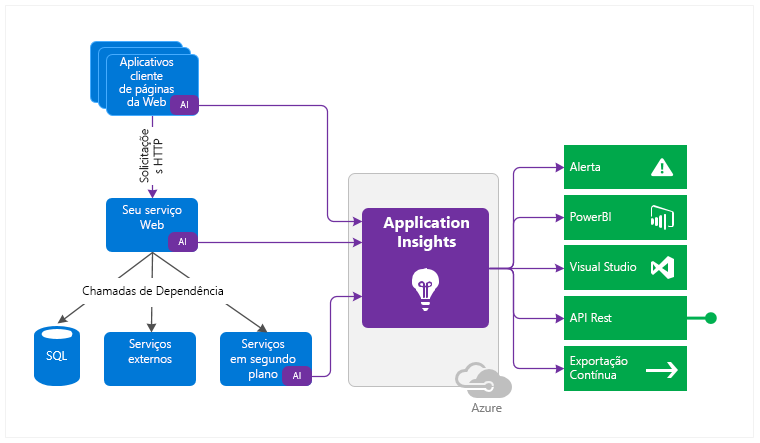

<properties 
	pageTitle="O que é o Application Insights?" 
	description="Acompanhe o uso e o desempenho do seu aplicativo Web ou de dispositivo ativo. Detecte, faça triagem e diagnostique problemas. Monitore e melhore continuamente o sucesso com seus usuários." 
	services="application-insights" 
    documentationCenter=""
	authors="alancameronwills" 
	manager="douge"/>

<tags 
	ms.service="application-insights" 
	ms.workload="tbd" 
	ms.tgt_pltfrm="ibiza" 
	ms.devlang="na" 
	ms.topic="article" 
	ms.date="08/04/2015" 
	ms.author="awills"/>
 
# O que é o Application Insights?

Application Insights é um serviço de análise extensível que ajuda você a entender o desempenho e o uso de seu aplicativo em tempo real. Ele foi projetado para desenvolvedores, a fim de ajudar a aprimorar continuamente o desempenho e a usabilidade do seu aplicativo.

Ele funciona com aplicativos Web e autônomos em uma ampla variedade de plataformas: .NET ou J2EE, hospedados no local ou na nuvem; aplicativos de dispositivo no Windows, iOS, Android, OSX e outras plataformas.

O recurso visa a equipe de desenvolvimento. Com ele, você pode:

* [Analisar padrões de uso][knowUsers] para melhor compreender seus usuários e aprimorar continuamente o aplicativo. 
 * Contagens de exibição de página, usuários novos e antigos, localização geográfica, plataformas e outras estatísticas de uso principal
 * Rastreamento de caminhos de uso para avaliar o sucesso de cada recurso.
* [Detecte, faça a triagem e diagnostique][detect] problemas de desempenho e corrija-os antes que a maioria dos usuários os perceba.
 *  Alertas sobre alterações de desempenho ou falhas.
 *  Métricas para ajudar a diagnosticar problemas de desempenho, como tempos de resposta, uso da CPU e rastreamento de dependências.
 *  Testes de disponibilidade para aplicativos Web.
 *  Alertas e relatórios de falhas e exceções
 *  Pesquisa de log de diagnóstico poderosa (incluindo rastreamentos de log de suas estruturas de logs favoritas).

O SDK de cada plataforma inclui uma variedade de módulos que monitoram o aplicativo instantaneamente. Além disso, você pode codificar sua própria telemetria para fazer uma análise mais detalhada e personalizada.

Os dados de telemetria coletados do aplicativo são armazenados e analisados no Portal do Azure, onde há exibições intuitivas e ferramentas avançadas para agilidade de diagnóstico e análise.

Deseja uma análise ainda mais profunda? [Exporte](app-insights-export-telemetry.md) seus dados [para o SQL](app-insights-code-sample-export-telemetry-sql-database.md), [para o Power BI](app-insights-export-power-bi.md) ou para suas próprias ferramentas.

## Plataformas e idiomas

Há SDKs para uma variedade cada vez maior de plataformas. Atualmente, a lista inclui:

 * [Servidores ASP.NET][greenbrown] no Azure ou servidor IIS
 * [Serviços de nuvem do Azure](app-insights-cloudservices.md)
 * [Servidores J2EE][java]
 * [Páginas da Web][client]\: HTML+JavaScript
 * [Windows Phone, Windows Store, aplicativos universais do Windows 10 e integração direta com o portal do desenvolvedor do Windows 10][windows]
 * [Área de trabalho do Windows][desktop]
 * [iOS][ios]
 * [Android][android]
 * [Outras plataformas][platforms]\: Node.js, PHP, Python, Ruby, Joomla, SharePoint, WordPress

O Application Insights também pode obter telemetria de aplicativos Web existentes do ASP.NET no IIS sem recriá-los.

Se seu aplicativo tiver cliente, servidor e outros componentes, é possível instrumentar todos eles. Os dados serão integrados no portal do Application Insights para que você possa, por exemplo, correlacionar eventos no cliente com eventos no servidor.

## Como ele funciona

Você instala um pequeno SDK em seu aplicativo e configura uma conta no portal do Application Insights. O SDK monitora seu aplicativo e envia os dados de telemetria ao portal. O portal mostra gráficos estatísticos e fornece ferramentas de pesquisa poderosas para ajudá-lo a diagnosticar quaisquer problemas.

O SDK tem vários módulos que coletam telemetria, por exemplo, para contar sessões, usuários e desempenho. Você também pode escrever seu próprio código personalizado para enviar dados de telemetria ao portal. A telemetria personalizada é particularmente útil para acompanhar histórias de usuários: você pode contar eventos, como cliques de botão, realização de metas específicas ou erros do usuário.

Para servidores ASP.NET e aplicativos Web do Azure, você também pode instalar o [Status Monitor][redfield], que tem dois usos. Ele permite que você:

* Monitore um aplicativo Web sem recriá-lo ou reinstalá-lo.
* Acompanhe chamadas para módulos dependentes.

### Qual é a sobrecarga?

O impacto sobre o desempenho é muito pequeno. As chamadas de rastreamento não são bloqueadas, além de serem colocadas em lote e enviadas em um thread separado.

## Introdução

1. Você precisará de uma assinatura do [Microsoft Azure](http://azure.com). A inscrição é gratuita e você pode optar pela [camada de preços](https://azure.microsoft.com/pricing/details/application-insights/) gratuita do Application Insights.

2. Entre no [Portal de Visualização do Azure](http://portal.azure.com)
3. Crie um recurso Application Insights. É onde você verá dados do seu aplicativo.

    

    Escolha o tipo de aplicativo.

4. Abra o novo recurso e o guia de Início Rápido.
    
    

    Isso explica como instalar o SDK no aplicativo. Se for um aplicativo Web, você também descobrirá como adicionar o SDK a páginas da Web e como configurar testes de disponibilidade.

Para obter mais detalhes, escolha o tipo de aplicativo em Introdução na barra de navegação à esquerda desta página.

## Exemplos

[Exemplos e explicações passo a passo](app-insights-code-samples.md)

## Suporte e comentários

* Perguntas e problemas:
 * [Solucionar problemas][qna]
 * [Fórum do MSDN](https://social.msdn.microsoft.com/Forums/vstudio/en-US/home?forum=ApplicationInsights)
 * [StackOverflow](http://stackoverflow.com/questions/tagged/ms-application-insights)
* Bugs:
 * [Conectar-se](https://connect.microsoft.com/VisualStudio/Feedback/LoadSubmitFeedbackForm?FormID=6076)
* Sugestões:
 * [Voz do usuário](http://visualstudio.uservoice.com/forums/121579-visual-studio/category/77108-application-insights)

## Vídeos

> [AZURE.VIDEO 218]

> [AZURE.VIDEO usage-monitoring-application-insights]

> [AZURE.VIDEO performance-monitoring-application-insights]

<!--Link references-->

[android]: app-insights-android.md
[azure]: ../insights-perf-analytics.md
[client]: app-insights-javascript.md
[desktop]: app-insights-windows-desktop.md
[detect]: app-insights-detect-triage-diagnose.md
[greenbrown]: app-insights-start-monitoring-app-health-usage.md
[ios]: app-insights-ios.md
[java]: app-insights-java-get-started.md
[knowUsers]: app-insights-overview-usage.md
[platforms]: app-insights-platforms.md
[portal]: http://portal.azure.com/
[qna]: app-insights-troubleshoot-faq.md
[redfield]: app-insights-monitor-performance-live-website-now.md
[windows]: app-insights-windows-get-started.md

 

<!---HONumber=06-->