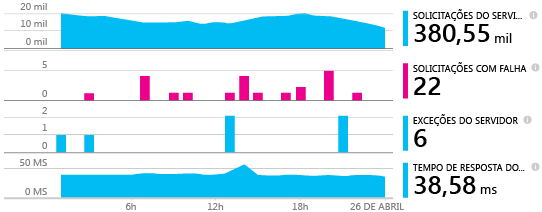
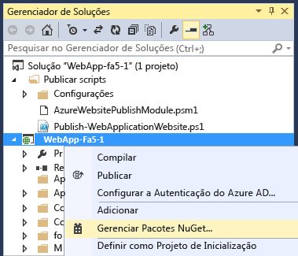
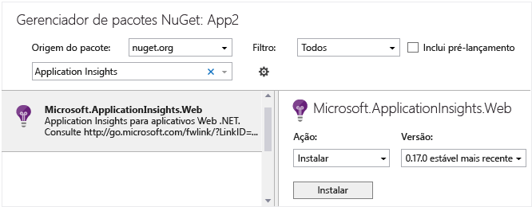
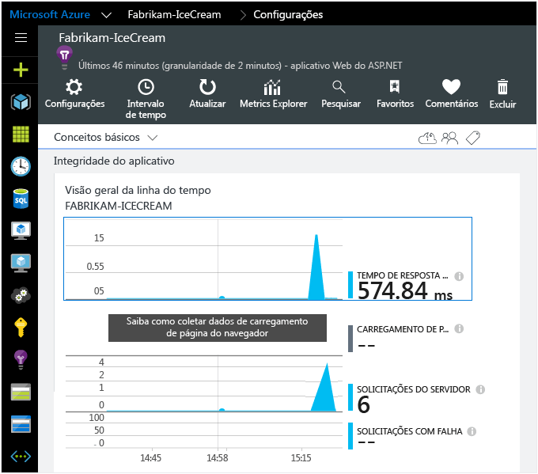
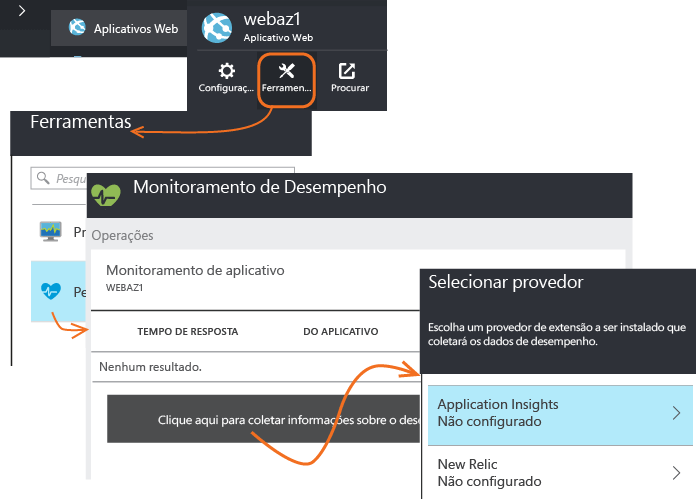

<properties 
	pageTitle="Adicionar SDK do Application Insights para monitorar seu aplicativo ASP.NET" 
	description="Analise o uso, disponibilidade e desempenho de seu local ou um aplicativo Web do Microsoft Azure com o Application Insights." 
	services="application-insights" 
    documentationCenter=".net"
	authors="alancameronwills" 
	manager="douge"/>

<tags 
	ms.service="application-insights" 
	ms.workload="tbd" 
	ms.tgt_pltfrm="ibiza" 
	ms.devlang="na" 
	ms.topic="get-started-article" 
	ms.date="08/05/2015" 
	ms.author="awills"/>

# Adicionar SDK do Application Insights para monitorar seu aplicativo ASP.NET

*O Application Insights está em modo de visualização.*

[AZURE.INCLUDE [app-insights-selector-get-started](../../includes/app-insights-selector-get-started.md)]

O Application Insights do Visual Studio monitora seus aplicativos em tempo real para ajudá-lo a [detectar e diagnosticar problemas de desempenho e exceções][detect], e [descobrir como seu aplicativo é usado][knowUsers]. Ele pode ser usado com uma ampla variedade de tipos de aplicativos. Ele funciona para aplicativos hospedados em seus próprios servidores IIS locais ou em máquinas virtuais do Azure, bem como aplicativos Web do Azure.

*Consulte também:*

* [ASP.NET 5](app-insights-asp-net-five.md)
* [Aplicativos de dispositivos e servidores Java][platforms]

#### Antes de começar

Para muitos tipos de aplicativo, o [Visual Studio pode adicionar o Application Insights ao seu aplicativo](#ide) praticamente sem que você perceba. Mas como você está lendo este artigo para obter uma compreensão melhor do que está acontecendo, guiaremos você pelas etapas manualmente.

Você precisa de:

* Uma assinatura do [Microsoft Azure](http://azure.com). Se sua equipe ou organização tem uma assinatura do Azure, o proprietário pode adicioná-lo a ela, usando sua [Conta da Microsoft](http://live.com).
* Visual Studio 2013 ou posterior.

##  1. Criar um recurso do Application Insights

Entre no [Portal do Azure][portal] e crie um novo recurso do Application Insights. Escolha ASP.NET como o tipo de aplicativo.

Um [recurso][roles] no Azure é uma instância de um serviço. Este recurso é o local no qual a telemetria enviada do seu aplicativo será analisada e apresentada a você.

A escolha do tipo de aplicativo define o conteúdo de padrão de folhas de recursos e as propriedades visíveis no [Metrics Explorer][metrics].

####  Faça uma cópia da chave de instrumentação.

A chave identifica o recurso, e você a instalará em breve no SDK para direcionar os dados ao recurso.

As etapas que acabou de fazer para criar um novo recurso são uma boa maneira de iniciar o monitoramento de qualquer aplicativo. Agora você pode enviar dados para o recurso.

##  2. Instale o SDK em seu aplicativo

Instalando e configurando o Application Insights SDK varia dependendo da plataforma em que você está trabalhando. Para aplicativos ASP.NET, é fácil.

1. No Visual Studio, edite os pacotes do NuGet do seu projeto de aplicativo de área de trabalho.

    

2. Instale o SDK do Application Insights para aplicativos Web.

    

3. Edite o ApplicationInsights.config (que foi adicionado pela instalação do NuGet). Insira isto logo antes da marca de fechamento:

    `<InstrumentationKey>` *a chave de instrumentação que você copiou* `</InstrumentationKey>`

    (Você pode, alternativamente, [definir a chave escrevendo um código][apikey] em seu aplicativo.)

#### Como atualizar para versões futuras do SDK

Lançamos uma nova versão do SDK de tempos em tempos.

Para atualizar para uma [nova versão do SDK](app-insights-release-notes-dotnet.md), abra o Gerenciador de pacotes do NuGet e filtre os pacotes instalados. Selecione Microsoft.ApplicationInsights.Web e escolha Atualizar.

Se você fez todas as personalizações no ApplicationInsights.config, salve uma cópia dele antes de atualizar e, depois, mescle suas alterações para a nova versão.

##  3. Execute seu projeto

Execute seu aplicativo com F5 e experimente: abra páginas diferentes para gerar alguma telemetria.

No Visual Studio, você verá uma contagem dos eventos que foram recebidos.

##  4. Exibir sua telemetria

Volte para o [Portal do Azure][portal] e navegue até o seu recurso do Application Insights.

Procure dados nos gráficos de Visão Geral. Primeiro, você apenas verá um ou dois pontos. Por exemplo:

Clique em qualquer gráfico para ver métricas mais detalhadas. [Saiba mais sobre métricas.][perf]

Agora implante seu aplicativo e assista a acumulação dos dados.

Quando você executa no modo de depuração, a telemetria é expressa através da pipeline, de modo que voc\~e deve ver dados aparecendo dentro de segundos. Quando você implanta seu aplicativo, os dados acumulam mais lentamente.

#### Não há dados?

* Abra o bloco [Pesquisar][diagnostic] para ver eventos individuais.
* Use o aplicativo abrindo páginas diferentes, para que ele gere alguma telemetria.
* Aguarde alguns segundos e clique em Atualizar. Os gráficos se atualizam periodicamente, mas você pode atualizá-los manualmente se estiver aguardando para alguns dados serem exibidos.
* Consulte [Solucionar problemas][qna].

#### Problemas no servidor de compilação?

Consulte [este item de solução de problemas](app-insights-troubleshoot-faq.md#NuGetBuild).

## Adicionar rastreamento de dependência

O SDK precisa de um pouco de ajuda para obter acesso a alguns dados. Especificamente, você precisará dessa etapa adicional para avaliar automaticamente as chamadas do seu aplicativo para bancos de dados, APIs REST e outros componentes externos. Essas métricas de dependência podem ser inestimáveis no diagnóstico de problemas de desempenho.

#### Se seu aplicativo for executado em seu servidor IIS

Faça logon no servidor com direitos de administrador e instale o [Application Insights Status Monitor](http://go.microsoft.com/fwlink/?LinkId=506648).

(Você também pode usar o Status Monitor para [instrumentar um aplicativo que já esteja em execução](app-insights-monitor-performance-live-website-now.md), mesmo que não tenha sido criado com o SDK.)

#### Se seu aplicativo for um Aplicativo Web do Azure

No painel de controle do Aplicativo Web do Azure, adicione a extensão do Application Insights.

(A extensão apenas ajuda um aplicativo que foi criado com o SDK. Ao contrário do Status Monitor, ela não pode instrumentar um aplicativo existente.)

## Adicionar monitoramento do lado do cliente

Você instalou o SDK que envia dados de telemetria da extremidade do servidor (back-end) do seu aplicativo. Agora, você pode adicionar o monitoramento do lado do cliente. Isso fornece dados sobre usuários, sessões, exibições de página e qualquer exceção ou falha que ocorre no cliente.

Você também poderá escrever seu próprio código para rastrear como os usuários trabalham com seu aplicativo, até o nível detalhado de cliques e pressionamentos de teclas.

#### Se seus clientes forem navegadores da Web

Se seu aplicativo exibir páginas da Web, adicione um trecho de JavaScript a cada página. Obtenha o código do recurso Application Insights:

Observe que o código contém a chave de instrumentação que identifica o recurso de aplicativo.

[Saiba mais sobre rastreamento de página da Web.](app-insights-web-track-usage.md)

#### Se seus clientes forem aplicativos de dispositivo

Se seu aplicativo estiver atendendo a clientes, como telefones ou outros dispositivos, adicione o [SDK apropriado](app-insights-platforms.md) ao aplicativo do dispositivo.

Se você configurar o SDK do cliente com a mesma chave de instrumentação do SDK do servidor, os dois fluxos serão integrados para que seja possível vê-los juntos.

## Conclua a instalação.

Para obter a visão de 360 graus completa de seu aplicativo, há mais algumas tarefas que você pode realizar:

* [Configure os testes da Web][availability] para certificar-se de manter seu aplicativo operante e responsivo.
* [Capturar rastreamentos de log][netlogs] da sua estrutura de registros favorita
* [Acompanhe métricas e eventos personalizados][api] no cliente, no servidor ou em ambos, para saber mais sobre como seu aplicativo é usado.

##  A maneira automatizada

Dissemos no início deste artigo que iriamos mostrar a forma manual de criar um recurso do Application Insights e, em seguida, instalar o SDK. Acreditamos que é bom entender as duas partes do procedimento. Mas há uma forma automatizada ainda mais rápida para os aplicativos em ASP.NET (e muitos outros).

Você precisará do [Visual Studio](http://go.microsoft.com/fwlink/?linkid=397827&clcid=0x409) (2013 atualização 3 ou posterior) e de uma conta no [Microsoft Azure](http://azure.com).

#### Se é um novo projeto...

Quando criar um novo projeto no Visual Studio, certifique-se de que o Application Insights está selecionado.

O Visual Studio cria um recurso no Application Insights, adiciona o SDK ao seu projeto e coloca a chave no arquivo `.config`.

Se o projeto tem páginas da Web, ele também adiciona o [SDK do JavaScript][client] à página da Web principal.

#### ...ou então, se é um projeto existente

Clique com o botão direito do mouse no projeto no Gerenciador de Soluções, e selecione Adicionar Application Insights.

O Visual Studio cria um recurso no Application Insights, adiciona o SDK ao seu projeto e coloca a chave no arquivo `.config`.

Nesse caso, ele não adiciona o [SDK do JavaScript][client] a suas páginas da Web - recomendamos fazer isso na próxima etapa.

#### Opções de configuração

Se esta é sua primeira vez, você será solicitado a fazer logon ou se inscrever na visualização do Microsoft Azure. (ela é separada de sua conta do Visual Studio Online.)

Se esse aplicativo é parte de um aplicativo maior, você talvez queira usar **Definir configurações** e colocá-lo no mesmo grupo de recursos que os outros componentes.

*Sem opção de Application Insights? Verifique se você está usando o Visual Studio 2013 Atualização 3 ou posterior, se as Ferramentas do Application Insights estão habilitadas nas Extensões e Atualizações.*

#### Abrir Application Insights do seu projeto.

## Vídeo

> [AZURE.VIDEO getting-started-with-application-insights]

<!--Link references-->

[api]: app-insights-api-custom-events-metrics.md
[apikey]: app-insights-api-custom-events-metrics.md#ikey
[availability]: app-insights-monitor-web-app-availability.md
[azure]: ../insights-perf-analytics.md
[client]: app-insights-javascript.md
[detect]: app-insights-detect-triage-diagnose.md
[diagnostic]: app-insights-diagnostic-search.md
[knowUsers]: app-insights-overview-usage.md
[metrics]: app-insights-metrics-explorer.md
[netlogs]: app-insights-asp-net-trace-logs.md
[perf]: app-insights-web-monitor-performance.md
[platforms]: app-insights-platforms.md
[portal]: http://portal.azure.com/
[qna]: app-insights-troubleshoot-faq.md
[redfield]: app-insights-monitor-performance-live-website-now.md
[roles]: app-insights-resources-roles-access-control.md
[start]: app-insights-get-started.md

 

<!---HONumber=August15_HO7-->