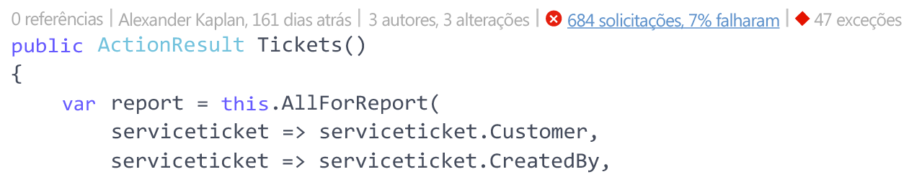
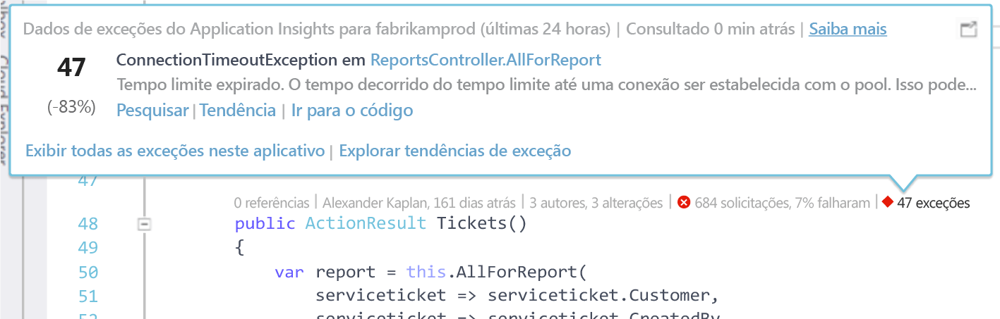
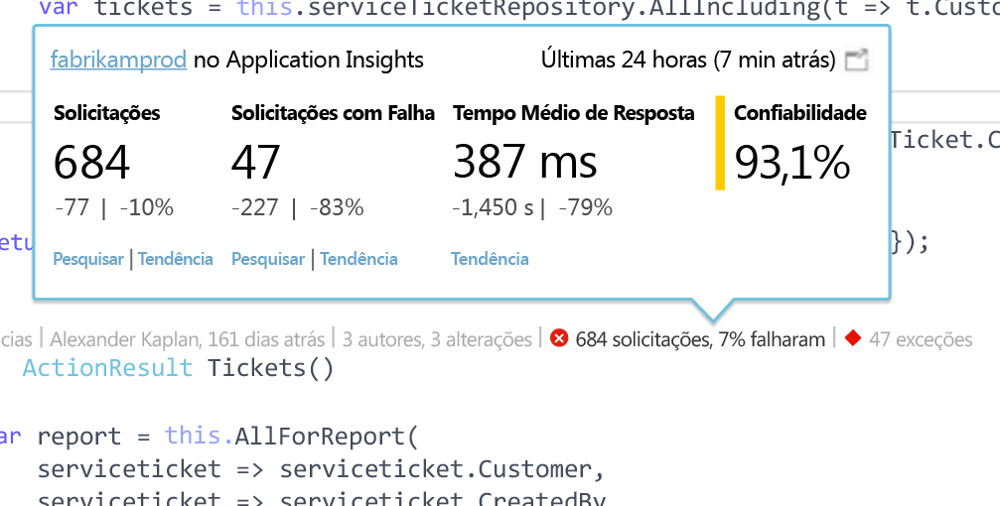

# Telemetria do Application Insights no Visual Studio CodeLens
Métodos no código de seu aplicativo Web podem ser anotados com telemetria sobre exceções de tempo de execução e tempos de resposta de solicitação. Se você instalar o [Application Insights do Azure](app-insights-overview.md) em seu aplicativo, a telemetria aparecerá no Visual Studio [CodeLens](https://msdn.microsoft.com/library/dn269218.aspx) -as anotações na parte superior de cada função em que você está acostumado a ver informações úteis, como o número de casas em que a função é referenciada ou a última pessoa que o editou.

> [!NOTE]
> O Application Insights no CodeLens está disponível no Visual Studio 2015 Atualização 3 e posterior ou com a versão mais recente da [extensão de Ferramentas de Análise de Desenvolvedor](https://visualstudiogallery.msdn.microsoft.com/82367b81-3f97-4de1-bbf1-eaf52ddc635a). O CodeLens está disponível nas edições Enterprise e Professional do Visual Studio.
> 
> 

## Onde localizar os dados do Application Insights
Procure a telemetria do Application Insights nos indicadores do CodeLens dos métodos públicos de solicitação do aplicativo Web. Os indicadores do CodeLens são mostrados acima do método e outras declarações no código do C# e do Visual Basic. Se os dados do Application Insights estiverem disponíveis para um método, você verá indicadores para solicitações e exceções, como "100 solicitações, falha de 1%" ou "10 exceções". Clique em um indicador do CodeLens para obter mais detalhes. 

> [!TIP]
> Os indicadores de solicitação e exceção do Application Insights podem levar alguns segundos extras para serem carregados após outros indicadores do CodeLens aparecerem.
> 
> 

## Exceções em CodeLens

O indicador de exceção do CodeLens mostra o número de exceções que ocorreram nas últimas 24 horas das 15 exceções mais frequentes no aplicativo durante esse período, enquanto processa a solicitação fornecida pelo método.

Para obter mais detalhes, clique no indicador de exceções do CodeLens:

* A alteração de porcentagem no número de exceções das últimas 24 horas em relação às 24 horas anteriores
* Escolha **Ir para código** para navegar até o código-fonte da função que está lançando a exceção
* Escolha **Pesquisar** para consultar todas as instâncias dessa exceção que ocorreram nas últimas 24 horas
* Escolha **Tendência** para exibir uma visualização de tendência das ocorrências dessa exceção nas últimas 24 horas
* Escolha **Exibir todas as exceções neste aplicativo** para consultar todas as exceções que ocorreram nas últimas 24 horas
* Escolha **Explorar tendências de exceção** para exibir uma visualização de tendências de todas as exceções que ocorreram nas últimas 24 horas. 

> [!TIP]
> Se você vir "0 exceções" no CodeLens, mas souber que deve haver exceções, verifique se o recurso do Application Insights correto está selecionado no CodeLens. Para selecionar outro recurso, clique no projeto no Gerenciador de Soluções e escolha **Application Insights > Escolher Fonte de Telemetria**. O CodeLens só é exibido para as 15 exceções que ocorreram com mais frequência no aplicativo nas últimas 24 horas. Assim, se uma exceção for a 16ª mais frequente ou menos, você verá "0 exceções". Exceções de exibições do ASP.NET podem não aparecer nos métodos de controlador que geraram essas exibições.
> 
> [!TIP]
> Se vir "? exceções"no CodeLens, você precisará associar sua conta do Azure ao Visual Studio, ou suas credenciais de conta do Azure podem ter expirado. Em ambos os casos, clique em "? exceções"e escolha **Adicionar uma conta...** para inserir suas credenciais.
> 
> 

## Solicitações no CodeLens

A solicitação de indicador do CodeLens mostra o número de solicitações HTTP que foram atendidas por um método nas últimas 24 horas, mais a porcentagem de solicitações que falharam.

Para obter mais detalhes, clique nas solicitações no indicador do CodeLens:

* As alterações absolutas e percentuais no número de solicitações, solicitações com falha e tempos de resposta médios nas últimas 24 horas em comparação com as 24 horas anteriores
* A confiabilidade do método, calculada como a porcentagem de solicitações que não falharam nas últimas 24 horas
* Escolha **Pesquisar** para solicitações ou solicitações com falha para consultar todas as solicitações (com falha) que ocorreram nas últimas 24 horas
* Escolha **Tendência** para exibir uma visualização de tendências de solicitações, solicitações com falha ou tempos de resposta médios nas últimas 24 horas.
* Escolha o nome do recurso do Application Insights no canto superior esquerdo da exibição de detalhes do CodeLens para alterar o recurso que é a fonte de dados do CodeLens.

## Próximas etapas
|  |  |
| --- | --- |
| **[Trabalhando com o Application Insights no Visual Studio](app-insights-visual-studio.md)** Pesquisar telemetria, ver dados em CodeLens e configurar o Application Insights. Tudo no Visual Studio. | |
| **[Adicionar mais dados](app-insights-asp-net-more.md)** Monitorar o uso, a disponibilidade, as dependências e as exceções. Integrar rastreamentos de estruturas de logs. Escrever telemetria personalizada. | |
| **[Trabalhando com o portal do Application Insights](app-insights-dashboards.md)** Painéis, poderosas ferramentas de diagnóstico e análise, alertas, um mapa de dependências em tempo real de seu aplicativo e a exportação de telemetria. | |

<!--HONumber=Nov16_HO3-->

