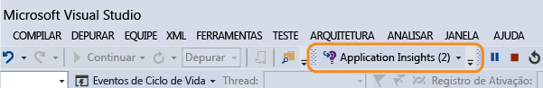

# Trabalhar com o Application Insights no Visual Studio
No Visual Studio (2015 e posterior), você pode analisar o desempenho e diagnosticar problemas na depuração e na produção usando a telemetria do [Application Insights do Visual Studio](app-insights-overview.md).

Se você ainda não [instalou o Application Insights em seu aplicativo](app-insights-asp-net.md), faça isso agora.

##  Depurar seu projeto
Execute seu aplicativo com F5 e experimente: abra páginas diferentes para gerar alguma telemetria.

No Visual Studio, você verá uma contagem dos eventos que foram registrados.

Clique neste botão para abrir a pesquisa de diagnóstico.

## Pesquisa de diagnóstico
A janela Pesquisa mostra eventos que foram registrados. (Se tiver entrado no Azure ao configurar o Application Insights, você poderá pesquisar os mesmos eventos no portal.)

A pesquisa de texto livre funciona em todos os campos dos eventos. Por exemplo, pesquise por parte da URL de uma página; ou pelo valor de uma propriedade, como cidade do cliente; ou por palavras específicas em um log de rastreamento.

Clique em qualquer evento para ver suas propriedades detalhadas.

Você também pode abrir a guia Itens Relacionados para ajudar a diagnosticar as solicitações com falha ou as exceções.

## Hub de diagnósticos
O Hub de diagnósticos (no Visual Studio 2015 ou posterior) mostra a telemetria do servidor do Application Insights à medida que ela é gerada. Isso funciona mesmo se você optou por instalar apenas o SDK, sem conectar-se a um recurso no Portal do Azure.

## Exceções
Se você [configurar o monitoramento de exceção](app-insights-asp-net-exceptions.md), relatórios de exceção serão mostrados na janela Pesquisar.

Clique em uma exceção para obter um rastreamento de pilha. Se o código do aplicativo for aberto no Visual Studio, você poderá clicar desde o rastreamento de pilha até a linha relevante no código.

Além disso, na linha de Código Lens acima de cada método, você verá uma contagem das exceções registradas pelo Application Insights nas últimas 24 horas.

## Monitoramento local
(Do Visual Studio 2015 Atualização 2) Se você não tiver configurado o SDK para enviar telemetria ao portal do Application Insights (de modo que não haja nenhuma chave de instrumentação em ApplicationInsights.config), então a janela de diagnóstico exibirá a telemetria da sua sessão de depuração mais recente.

Isso será desejável se você já tiver publicado uma versão anterior do seu aplicativo. Você não deseja que a telemetria de suas sessões de depuração se misturem à telemetria no portal do Application Insights do aplicativo publicado.

Também será particularmente útil se você tiver [telemetria personalizada](app-insights-api-custom-events-metrics.md) que queira depurar antes de enviar a telemetria ao portal.

* *Primeiro, configurei totalmente o Application Insights para enviar a telemetria ao portal. Mas agora eu quero ver a telemetria apenas no Visual Studio.*
  
  * Nas Configurações da janela Pesquisar, há uma opção para pesquisar o diagnóstico local, mesmo se o seu aplicativo enviar telemetria para o portal.
  * Para que a telemetria deixe de ser enviada ao portal, comente a linha `<instrumentationkey>...` de ApplicationInsights.config. Quando estiver pronto para enviar novamente a telemetria ao portal, remova os comentários.

## Tendências
Tendências é uma ferramenta para visualizar como o seu aplicativo se comporta ao longo do tempo.

Escolha **Explorar Tendências de Telemetria** no botão de barra de ferramentas do Application Insights ou da janela Pesquisa do Application Insights. Escolha uma das cinco consultas comuns para começar. Você pode analisar conjuntos de dados diferentes com base em tipos de telemetria, intervalos de tempo e outras propriedades.

Para encontrar anomalias em seus dados, escolha uma das opções de anomalias na lista suspensa "Tipo de Exibição". As opções de filtragem na parte inferior da janela facilitam o aprimoramento de subconjuntos específicos de sua telemetria.

[Mais sobre tendências](app-insights-visual-studio-trends.md).

## O que vem a seguir?
|  |  |
| --- | --- |
| **[Adicionar mais dados](app-insights-asp-net-more.md)** Monitorar o uso, a disponibilidade, as dependências e as exceções. Integrar rastreamentos de estruturas de logs. Escrever telemetria personalizada. | |
| **[Trabalhar com o portal do Application Insights](app-insights-dashboards.md)** Painéis, poderosas ferramentas de diagnóstico e análise, alertas, um mapa de dependências em tempo real de seu aplicativo e a exportação de telemetria. | |

<!---HONumber=AcomDC_0810_2016-->