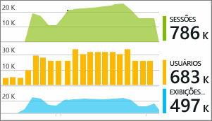

# Trabalhar com o Azure Application Insights no Visual Studio
No Visual Studio (2015 e posterior), você pode analisar o desempenho e diagnosticar problemas em seu aplicativo Web ASP.NET na depuração e na produção usando a telemetria do [Application Insights do Azure](app-insights-overview.md).

Se você criou seu aplicativo Web ASP.NET usando o Visual Studio 2017 ou posterior, ele já terá o SDK do Application Insights. Caso contrário, se ainda tiver feito isso, [adicione o Application Insights ao seu aplicativo](app-insights-asp-net.md).

Para monitorar seu aplicativo quando ele está em produção, você normalmente exibe o Application Insights Telemetry no [Portal do Azure](https://portal.azure.com), onde você pode definir alertas e aplicar ferramentas de monitoramento avançadas. Mas, para depuração, também é possível pesquisar e analisar a telemetria no Visual Studio. Use o Visual Studio para analisar a telemetria de seu site de produção e de execuções de depuração em sua máquina de desenvolvimento. No último caso, você pode analisar execuções de depuração mesmo se ainda não tiver configurado o SDK para enviar telemetria ao Portal do Azure. 

##  Depurar seu projeto
Execute seu aplicativo Web no modo de depuração local usando F5. Abra páginas diferentes para gerar alguma telemetria.

No Visual Studio, você verá uma contagem dos eventos registrados pelo módulo do Application Insights em seu projeto.

Clique neste botão para pesquisar na telemetria. 

## Pesquisa do Application Insights
A Janela de pesquisa do Application Insights mostra eventos que foram registrados. (Se tiver entrado no Azure ao configurar o Application Insights, poderá pesquisar os mesmos eventos no Portal do Azure.)

> [!NOTE] 
> Depois de marcar ou desmarcar filtros, clique no botão Pesquisar no final do campo de pesquisa de texto.
>

A pesquisa de texto livre funciona em todos os campos dos eventos. Por exemplo, pesquise por parte da URL de uma página; ou pelo valor de uma propriedade, como cidade do cliente; ou por palavras específicas em um log de rastreamento.

Clique em qualquer evento para ver suas propriedades detalhadas.

Para solicitações ao seu aplicativo Web, clique até chegar ao código.

Você também pode abrir itens relacionados para ajudar a diagnosticar as solicitações com falha ou as exceções.

## Exceções e solicitações com falha
Os relatórios de exceção aparecem na Janela de pesquisa. (Em alguns tipos mais antigos do aplicativo ASP.NET, você precisa [configurar o monitoramento de exceção](app-insights-asp-net-exceptions.md) para ver as exceções manipuladas pela estrutura.)

Clique em uma exceção para obter um rastreamento de pilha. Se o código do aplicativo for aberto no Visual Studio, você poderá clicar desde o rastreamento de pilha até a linha relevante no código.

## Resumos de solicitação e exceção no código
Na linha de CodeLens acima de cada método de manipulação, você verá uma contagem das solicitações e exceções registradas pelo Application Insights nas últimas 24 horas.

> [!NOTE] 
> O CodeLens mostrará dados do Application Insights somente se você tiver [configurado seu aplicativo para enviar telemetria ao portal do Application Insights](app-insights-asp-net.md).
>

[Saiba mais sobre o Application Insights no CodeLens](app-insights-visual-studio-codelens.md)

## Tendências
Tendências é uma ferramenta para visualizar como o seu aplicativo se comporta ao longo do tempo. 

Escolha **Explorar Tendências de Telemetria** no botão de barra de ferramentas do Application Insights ou da janela Pesquisa do Application Insights. Escolha uma das cinco consultas comuns para começar. Você pode analisar conjuntos de dados diferentes com base em tipos de telemetria, intervalos de tempo e outras propriedades. 

Para encontrar anomalias em seus dados, escolha uma das opções de anomalias na lista suspensa "Tipo de Exibição". As opções de filtragem na parte inferior da janela facilitam o aprimoramento de subconjuntos específicos de sua telemetria.

[Mais sobre tendências](app-insights-visual-studio-trends.md).

## Monitoramento local
(Do Visual Studio 2015 Atualização 2) Se você não tiver configurado o SDK para enviar telemetria ao portal do Application Insights (de modo que não haja nenhuma chave de instrumentação em ApplicationInsights.config), então a janela de diagnóstico exibirá a telemetria da sua sessão de depuração mais recente. 

Isso será desejável se você já tiver publicado uma versão anterior do seu aplicativo. Você não deseja que a telemetria de suas sessões de depuração se misturem à telemetria no portal do Application Insights do aplicativo publicado.

Também será particularmente útil se você tiver [telemetria personalizada](app-insights-api-custom-events-metrics.md) que queira depurar antes de enviar a telemetria ao portal.

* *Primeiro, configurei totalmente o Application Insights para enviar a telemetria ao portal. Mas agora eu quero ver a telemetria apenas no Visual Studio.*
  
  * Nas Configurações da janela Pesquisar, há uma opção para pesquisar o diagnóstico local, mesmo se o seu aplicativo enviar telemetria para o portal.
  * Para que a telemetria deixe de ser enviada ao portal, comente a linha `<instrumentationkey>...` de ApplicationInsights.config. Quando estiver pronto para enviar novamente a telemetria ao portal, remova os comentários.

## O que vem a seguir?
|  |  |
| --- | --- |
| **[Adicionar mais dados](app-insights-asp-net-more.md)** Monitorar o uso, a disponibilidade, as dependências e as exceções. Integrar rastreamentos de estruturas de logs. Escrever telemetria personalizada. | |
| **[Trabalhando com o portal do Application Insights](app-insights-dashboards.md)** Painéis, poderosas ferramentas de diagnóstico e análise, alertas, um mapa de dependências em tempo real de seu aplicativo e a exportação de telemetria. | |

