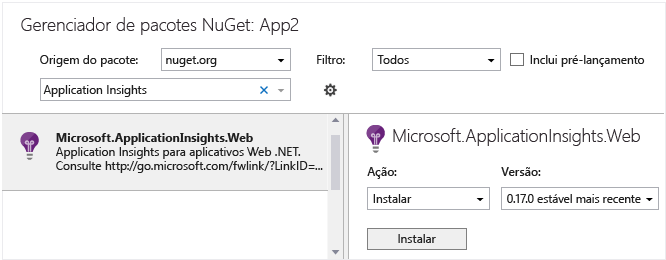

<properties 
	pageTitle="Application Insights para serviços e aplicativos da Área de Trabalho do Windows" 
	description="Analise a utilização e o desempenho do aplicativo da área de trabalho do Windows com o Application Insights." 
	services="application-insights" 
    documentationCenter="windows"
	authors="alancameronwills" 
	manager="douge"/>

<tags 
	ms.service="application-insights" 
	ms.workload="tbd" 
	ms.tgt_pltfrm="ibiza" 
	ms.devlang="na" 
	ms.topic="article" 
	ms.date="01/15/2016" 
	ms.author="awills"/>

# Application Insights em serviços e funções de trabalho da Área de Trabalho do Windows

*O Application Insights está em modo de visualização.*

[AZURE.INCLUDE [app-insights-selector-get-started](../../includes/app-insights-selector-get-started.md)]

O Application Insights permite que você monitore seu aplicativo implantado quanto à utilização e ao desempenho.

Todos os aplicativos do Windows, incluindo aplicativos de área de trabalho, serviços em segundo plano e funções de trabalho, podem usar o SDK do Application Insights para enviar telemetria ao Application Insights. Você também pode adicionar o SDK do Application Insights a um projeto de biblioteca de classes.

Você pode escolher quais coletores de dados padrão deseja usar (por exemplo para contadores de desempenho do monitor ou chamadas de dependência) ou usar apenas a API principal e escrever sua própria telemetria.


## <a name="add"></a> Criar um recurso do Application Insights


1.  No [Portal do Azure][portal], crie um novo recurso do Application Insights. Para o tipo de aplicativo, escolha aplicativo da Windows Store. 

    

    (Sua escolha do tipo de aplicativo define o conteúdo da folha Visão Geral e as propriedades disponíveis no [Metrics Explorer][metrics].)

2.  Faça uma cópia da chave de instrumentação. Localize a chave no menu suspenso Essentials do novo recurso que você acabou de criar.

    

## <a name="sdk"></a>Instalar o SDK no seu aplicativo


1. No Visual Studio, edite os pacotes do NuGet do seu projeto de aplicativo de área de trabalho.

    

2. Instale o pacote do Application Insights Windows Server: Microsoft.ApplicationInsights.WindowsServer

    

    *É possível usar outros pacotes?*

    Sim. Escolha a API principal (applicationinsights) se desejar usar a API para enviar sua próprias telemetria. O pacote do Windows Server inclui automaticamente a API principal mais um número de outros pacotes, como coleta do contador de desempenho e monitoramento de dependência.

    (Mas não use o Microsoft.ApplicationInsights.Windows, pois é destinado a aplicativos da Windows Store.)

3. Defina sua InstrumentationKey.

    * Se você instalou somente o pacote de API principal Microsoft.ApplicationInsights, deve definir a chave no código, por exemplo, em main(): 

    `TelemetryConfiguration.Active.InstrumentationKey = "` *sua chave* `";`

    Se você instalou um dos outros pacotes, pode definir a chave usando código ou defini-la em ApplicationInsights.config:
 
    `<InstrumentationKey>`*sua chave*`</InstrumentationKey>`

    Se você usar ApplicationInsights.config, verifique se suas propriedades no Gerenciador de Soluções estão definidas como **Ação de Compilação = Conteúdo, Copiar para Diretório de Saída = Copiar**.

## <a name="telemetry"></a>Inserir chamadas de telemetria

Crie uma instância `TelemetryClient` e, em seguida, [use-a para enviar telemetria][api].


Por exemplo, em um Aplicativo Windows Forms, você poderia escrever:

```C#

    public partial class Form1 : Form
    {
        private TelemetryClient tc = new TelemetryClient();
        ...
        private void Form1_Load(object sender, EventArgs e)
        {
            // Alternative to setting ikey in config file:
            tc.InstrumentationKey = "key copied from portal";

            // Set session data:
            tc.Context.User.Id = Environment.GetUserName();
            tc.Context.Session.Id = Guid.NewGuid().ToString();
            tc.Context.Device.OperatingSystem = Environment.OSVersion.ToString();

            // Log a page view:
            tc.TrackPageView("Form1");
            ...
        }

        protected override void OnClosing(CancelEventArgs e)
        {
            stop = true;
            if (tc != null)
            {
                tc.Flush(); // only for desktop apps

                // Allow time for flushing:
                System.Threading.Thread.Sleep(1000);
            }
            base.OnClosing(e);
        }

```

Use qualquer uma das [APIs do Application Insights][api] para enviar telemetria. Se você estiver usando a API principal, nenhuma telemetria é enviada automaticamente. Normalmente você utilizaria:

* `TrackPageView(pageName)` ao alternar formulários, páginas ou guias
* `TrackEvent(eventName)` para outras ações de usuário
* `TrackMetric(name, value)` em uma tarefa em segundo plano para enviar relatórios regulares de métricas não anexadas a eventos específicos.
* `TrackTrace(logEvent)` para [log de diagnóstico][diagnostic]
* `TrackException(exception)` em cláusulas catch
* `Flush()` para verificar se toda a telemetria foi enviada antes de fechar o aplicativo. Use isso somente se você estiver usando a API principal (Microsoft.ApplicationInsights) sozinha. Os SDKs da plataforma implementam esse comportamento automaticamente. (Se o seu aplicativo for executado em contextos em que a Internet não esteja sempre disponível, confira também [Canal de persistência](#persistence-channel).)


#### Inicializadores de contexto

Para ver as contagens de usuários e sessões, você pode definir os valores em cada instância `TelemetryClient`. Como alternativa, você pode usar um inicializador de contexto para executar essa adição para todos os clientes:

```C#

    class UserSessionInitializer: IContextInitializer
    {
        public void Initialize(TelemetryContext context)
        {
            context.User.Id = Environment.UserName;
            context.Session.Id = Guid.NewGuid().ToString();
        }
    }

    static class Program
    {
        ...
        static void Main()
        {
            TelemetryConfiguration.Active.ContextInitializers.Add(
                new UserSessionInitializer());
            ...

```


## <a name="run"></a>Executar seu projeto

[Execute o aplicativo com F5](http://msdn.microsoft.com/library/windows/apps/bg161304.aspx) e use-o para gerar alguma telemetria.

No Visual Studio, você verá uma contagem dos eventos que foram recebidos.


## <a name="monitor"></a>Ver dados de monitoramento

Retorne para a folha de seu aplicativo no portal do Azure.

Os primeiros eventos aparecerão na [Pesquisa de Diagnóstico](app-insights-diagnostic-search.md).

Se você estiver esperando mais dados, clique em Atualizar depois de alguns segundos.

Se você usou o TrackMetric ou o parâmetro de medidas do TrackEvent, abra o [Metric Explorer][metrics] e abra a folha Filtros. Você deve ver suas métricas lá, mas eles às vezes podem demorar um pouco para passar pelo pipeline. Por isso, talvez seja melhor fechar a folha Filtros, aguardar um pouco e atualizar.


## Canal de persistência 

Se seu aplicativo for executado onde não houver conexão à Internet sempre disponível ou for lenta, considere usar o canal de persistência em vez do canal de memória padrão.

O canal de memória padrão perde qualquer telemetria que não tenha sido enviada no momento em que o aplicativo foi fechado. Embora você possa usar `Flush()` para tentar enviar os dados restantes no buffer, ele ainda perderá os dados se não houver uma conexão com a Internet ou se o aplicativo for desativado antes da conclusão da transmissão.

Por outro lado, o canal de persistência armazena a telemetria em buffer em um arquivo antes de enviá-la ao portal. O `Flush()` garante que os dados sejam armazenados no arquivo. Se os dados não são enviados quando o aplicativo é fechado, ele permanece no arquivo. Quando o aplicativo for reiniciado, os dados serão enviados se houver conexão com a Internet. Os dados ficarão acumulados no arquivo ou pelo tempo que for necessário até que uma conexão fique disponível.

### Para usar o canal de persistência

1. Importe o pacote NuGet [Microsoft.ApplicationInsights.PersistenceChannel](https://www.nuget.org/packages/Microsoft.ApplicationInsights.PersistenceChannel).
2. Inclua esse código em seu aplicativo, em um local de inicialização adequado:
 
    ```C# 

      using Microsoft.ApplicationInsights.Channel;
      using Microsoft.ApplicationInsights.Extensibility;
      ...

      // Set up 
      TelemetryConfiguration.Active.InstrumentationKey = "YOUR INSTRUMENTATION KEY";
 
      TelemetryConfiguration.Active.TelemetryChannel = new PersistenceChannel();
    
    ``` 
3. Use `telemetryClient.Flush()` antes de fechar seu aplicativo para garantir que os dados sejam enviados para o portal ou salvos no arquivo.

    Observe que Flush() é síncrono para o canal de persistência, mas assíncrono para outros canais.

 
O canal de persistência é otimizado para cenários de dispositivos, onde o número de eventos gerados pelo aplicativo é relativamente pequeno e a conexão geralmente não é confiável. Esse canal gravará eventos para o disco em um armazenamento confiável primeiro e depois tentará enviá-los.

#### Exemplo

Digamos que você deseja monitorar exceções sem tratamento. Você assina o evento `UnhandledException`. No retorno de chamada, você deve incluir uma chamada para Liberar para garantir que a telemetria será persistida.
 
```C# 

AppDomain.CurrentDomain.UnhandledException += CurrentDomain_UnhandledException; 
 
... 
 
private void CurrentDomain_UnhandledException(object sender, UnhandledExceptionEventArgs e) 
{ 
    ExceptionTelemetry excTelemetry = new ExceptionTelemetry((Exception)e.ExceptionObject); 
    excTelemetry.SeverityLevel = SeverityLevel.Critical; 
    excTelemetry.HandledAt = ExceptionHandledAt.Unhandled; 
 
    telemetryClient.TrackException(excTelemetry); 
 
    telemetryClient.Flush(); 
} 

``` 

Quando o aplicativo for desligado, você verá um arquivo em `%LocalAppData%\Microsoft\ApplicationInsights`, que contém os eventos compactados.
 
Na próxima vez em que você iniciar este aplicativo, o canal irá pegar esse arquivo e entregar a telemetria ao Application Insights se conseguir.

#### Exemplo de teste

```C#

using Microsoft.ApplicationInsights;
using Microsoft.ApplicationInsights.Channel;
using Microsoft.ApplicationInsights.Extensibility;

namespace ConsoleApplication1
{
    class Program
    {
        static void Main(string[] args)
        {
            // Send data from the last time the app ran
            System.Threading.Thread.Sleep(5 * 1000);

            // Set up persistence channel

            TelemetryConfiguration.Active.InstrumentationKey = "YOUR KEY";
            TelemetryConfiguration.Active.TelemetryChannel = new PersistenceChannel();

            // Send some data

            var telemetry = new TelemetryClient();

            for (var i = 0; i < 100; i++)
            {
                var e1 = new Microsoft.ApplicationInsights.DataContracts.EventTelemetry("persistenceTest");
                e1.Properties["i"] = "" + i;
                telemetry.TrackEvent(e1);
            }

            // Make sure it's persisted before we close
            telemetry.Flush();
        }
    }
}

```


O código do canal de persistência está no [GitHub](https://github.com/Microsoft/ApplicationInsights-dotnet/tree/master/src/TelemetryChannels/PersistenceChannel).


## <a name="usage"></a>Próximas etapas

[Acompanhar o uso do seu aplicativo][knowUsers]

[Capturar logs de diagnóstico e pesquisar neles][diagnostic]

[Solucionar problemas][qna]


<!--Link references-->

[diagnostic]: app-insights-diagnostic-search.md
[metrics]: app-insights-metrics-explorer.md
[portal]: http://portal.azure.com/
[qna]: app-insights-troubleshoot-faq.md
[knowUsers]: app-insights-overview-usage.md
[api]: app-insights-api-custom-events-metrics.md
[CoreNuGet]: https://www.nuget.org/packages/Microsoft.ApplicationInsights
 

<!---HONumber=AcomDC_0121_2016-->