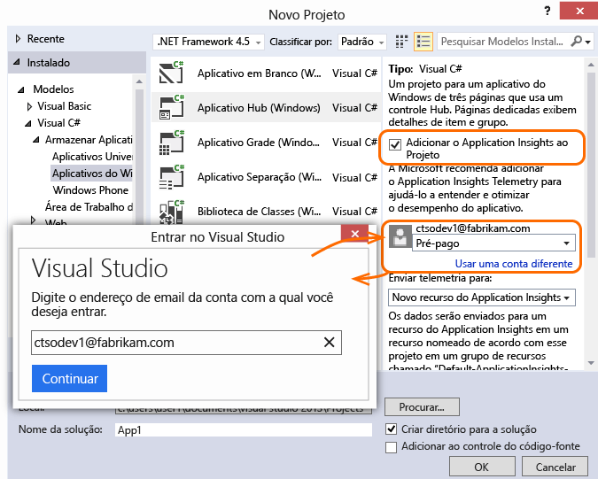
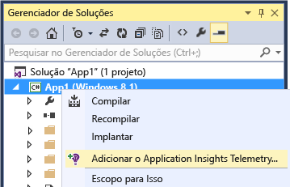

<properties 
	pageTitle="Application Insights para aplicativos da Windows Store e Windows Phone" 
	description="Analise utilização e desempenho de seu aplicativo de dispositivo do Windows com o Application Insights." 
	services="application-insights" 
    documentationCenter="windows"
	authors="alancameronwills" 
	manager="douge"/>

<tags 
	ms.service="application-insights" 
	ms.workload="tbd" 
	ms.tgt_pltfrm="ibiza" 
	ms.devlang="na" 
	ms.topic="article" 
	ms.date="06/16/2015" 
	ms.author="awills"/>

# Application Insights para aplicativos da Windows Store e Windows Phone

*O Application Insights está em modo de visualização.*

[AZURE.INCLUDE [app-insights-selector-get-started](../../includes/app-insights-selector-get-started.md)]

O Application Insights do Visual Studio permite que você monitore seu aplicativo publicado quanto a:

* [**Uso**][windowsUsage] - saiba quantos usuários você tem e o que eles estão fazendo com seu aplicativo.
* [**Falhas**][windowsCrash] - obtenha relatórios de diagnóstico de falhas e entenda seu impacto sobre os usuários.


Para muitos tipos de aplicativo, o [Visual Studio pode adicionar o Application Insights ao seu aplicativo](#ide) praticamente sem que você perceba. Mas como você está lendo este artigo para obter uma compreensão melhor do que está acontecendo, guiaremos você pelas etapas manualmente.

Você precisará de:

* Uma assinatura do [Microsoft Azure][azure].
* Visual Studio 2013 ou posterior.

## 1\. Criar um recurso do Application Insights 

No [Portal do Azure][portal], crie um novo recurso do Application Insights.


Um [recurso][roles] no Azure é uma instância de um serviço. Este recurso é o local no qual a telemetria enviada do seu aplicativo será analisada e apresentada a você.

#### Copiar a chave de instrumentação

A chave identifica o recurso. Você precisará dela em breve, para configurar o SDK para enviar os dados para o recurso.


## 2\. Adicionar o SDK do Application Insights aos seus aplicativos

No Visual Studio, adicione o SDK adequado ao seu projeto.

Se for um aplicativo Windows Universal, repita as etapas tanto para o projeto do Windows Phone quanto para o projeto do Windows.

1. Clique com o botão direito do mouse no projeto no Gerenciador de Soluções e escolha **Gerenciar Pacotes NuGet**.

    

2. Pesquise “Application Insights”.

    

3. Escolha **Application Insights para Aplicativos do Windows**

4. Adicione um arquivo ApplicationInsights.config à raiz da sua solução e insira a chave de instrumentação copiada acima. Veja abaixo um exemplo de xml para esse arquivo de configuração. **Não se esqueça de marcar Ação de Compilação do arquivo ApplicationInsights.config como “Conteúdo” e Copiar no Diretório de Saída como “Copiar sempre”**.

	```xml
		<?xml version="1.0" encoding="utf-8" ?>
		<ApplicationInsights>
			<InstrumentationKey>YOUR COPIED KEY FROM ABOVE</InstrumentationKey>
		</ApplicationInsights>
	```
	
	

5. Adicione o código de inicialização a seguir. É recomendável adicionar este código ao construtor `App()`. Se essa inicialização não foi feita no construtor do aplicativo, você poderá perder a coleta automática inicial das exibições de página.

```C#
	public App()
	{
	   // Add this initilization line. 
	   WindowsAppInitializer.InitializeAsync();
	
	   this.InitializeComponent();
	   this.Suspending += OnSuspending;
	}  
```

**Aplicativos Universais do Windows**: repita as etapas para o projeto Phone e Store. [Exemplo de um aplicativo Universal do Windows 8.1](https://github.com/Microsoft/ApplicationInsights-Home/tree/master/Samples/Windows%208.1%20Universal).

## <a name="network"></a>3. Habilitar o acesso à rede para seu aplicativo

Se seu aplicativo ainda não [solicitou acesso de rede de saída](https://msdn.microsoft.com/library/windows/apps/hh452752.aspx), você precisará adicioná-lo ao seu manifesto como uma [capacidade necessária](https://msdn.microsoft.com/library/windows/apps/br211477.aspx).

## <a name="run"></a>4. Execute seu projeto

[Execute o aplicativo com F5](http://msdn.microsoft.com/library/windows/apps/bg161304.aspx) e use-o para gerar alguma telemetria.

No Visual Studio, você verá uma contagem de eventos que foram recebidas.


No modo Depurar, a telemetria é enviada logo que é gerada. No modo Liberar, a telemetria é armazenada no dispositivo e enviada apenas quando a execução do aplicativo é retomada.


## <a name="monitor"></a>5. Veja os dados de monitoramento

Abrir Application Insights do seu projeto.


Primeiro, você apenas verá um ou dois pontos. Por exemplo:


Se você estiver esperando mais dados, clique em Atualizar depois de alguns segundos.

Clique em qualquer gráfico para ver mais detalhes.


## <a name="deploy"></a>5. Publicar seu aplicativo na Store

[Publique seu aplicativo](http://dev.windows.com/publish) e veja os dados se acumularem conforme os usuários o baixam e utilizam.

## Personalizar sua telemetria

#### Escolhendo os coletores

O SDK do Application Insights inclui vários coletores, que coletam tipos diferentes de dados do seu aplicativo automaticamente. Por padrão, eles estão todos ativos. Mas você pode escolher quais coletores inicializar no construtor do aplicativo:

    WindowsAppInitializer.InitializeAsync( "00000000-0000-0000-0000-000000000000",
       WindowsCollectors.Metadata
       | WindowsCollectors.PageView
       | WindowsCollectors.Session 
       | WindowsCollectors.UnhandledException);

#### Enviar seus próprios dados de telemetria

Use a [API][api] para enviar dados de eventos, métricas e diagnóstico ao Application Insights. Em resumo:

```C#

 var tc = new TelemetryClient(); // Call once per thread

 // Send a user action or goal:
 tc.TrackEvent("Win Game");

 // Send a metric:
 tc.TrackMetric("Queue Length", q.Length);

 // Provide properties by which you can filter events:
 var properties = new Dictionary{"game", game.Name};

 // Provide metrics associated with an event:
 var measurements = new Dictionary{"score", game.score};

 tc.TrackEvent("Win Game", properties, measurements);

```

Para obter mais detalhes, consulte [Métricas e eventos personalizados][api].

## O que vem a seguir?

* [Detectar e diagnosticar falhas em seu aplicativo][windowsCrash]
* [Saiba mais sobre métricas][metrics]
* [Saber mais sobre a Pesquisa de Diagnóstico][diagnostic]


## <a name="ide"></a>Configuração automatizada

Se você preferir permitir que o Visual Studio execute as etapas de configuração, você pode fazer isso com Windows Phone, Windows Store e muitos outros tipos de aplicativos.

###<a name="new"></a> Se você estiver criando um novo projeto de aplicativo do Windows...

Na caixa de diálogo Novo Projeto, selecione Application Insights.

Se for solicitado que você faça logon, use as credenciais da conta do Azure (que é separada da sua conta do Visual Studio Online).




###<a name="existing"></a> Ou então, se é um projeto existente...

Adicione o Application Insights por meio do Gerenciador de Soluções.




## Para atualizar para uma nova versão do SDK

Quando uma [nova versão do SDK é lançada](app-insights-release-notes-windows.md): * clique com o botão direito no seu projeto e escolha Gerenciar pacotes NuGet. * Selecione os pacotes instalados do Application Insights e escolha Ação: Atualizar.


## <a name="usage"></a>Próximas etapas


[Detectar e diagnosticar falhas em seu aplicativo][windowsCrash]

[Capturar logs de diagnóstico e pesquisar neles][diagnostic]


[Acompanhar o uso do seu aplicativo][windowsUsage]

[Usar a API para enviar telemetria personalizada][api]

[Solucionar problemas][qna]


<!--Link references-->

[api]: app-insights-api-custom-events-metrics.md
[azure]: ../insights-perf-analytics.md
[diagnostic]: app-insights-diagnostic-search.md
[metrics]: app-insights-metrics-explorer.md
[portal]: http://portal.azure.com/
[qna]: app-insights-troubleshoot-faq.md
[roles]: app-insights-resources-roles-access-control.md
[windowsCrash]: app-insights-windows-crashes.md
[windowsUsage]: app-insights-windows-usage.md

 

<!---HONumber=July15_HO3-->