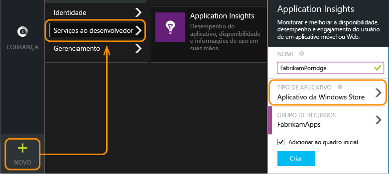
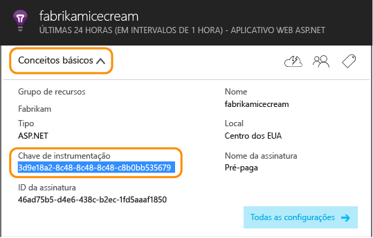
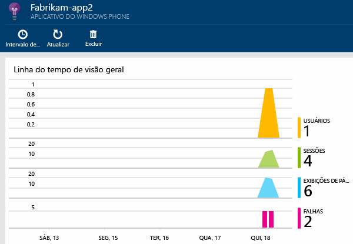

<properties
	pageTitle="Análise de aplicativos do Windows Phone e da Windows Store | Microsoft Azure"
	description="Analise o uso e o desempenho de seu aplicativo de dispositivo do Windows."
	services="application-insights"
    documentationCenter="windows"
	authors="alancameronwills"
	manager="douge"/>

<tags
	ms.service="application-insights"
	ms.workload="tbd"
	ms.tgt_pltfrm="ibiza"
	ms.devlang="na"
	ms.topic="get-started-article"
	ms.date="02/03/2016"
	ms.author="awills"/>

# Análise de aplicativos do Windows Phone e da Windows Store

A Microsoft fornece duas soluções para devOps de dispositivo: [HockeyApp](http://hockeyapp.net/) para análise do cliente e [Application Insights](app-insights-overview.md) para o servidor.

O [HockeyApp](http://hockeyapp.net/) é a nossa solução de DevOps Móvel para aplicativos de dispositivos iOS, OS X, Android ou Windows, bem como aplicativos de plataforma cruzada baseados no Xamarin, no Cordova e no Unity. Com ele, você pode distribuir compilações para testadores beta, coletar dados de falha e obter métricas e comentários dos usuários. Ele é integrado ao Visual Studio Team Services, permitindo a compilação fácil de implantações e a integração de itens de trabalho.

Acesse:

* [HockeyApp](http://support.hockeyapp.net/kb)
* [Blog do HockeyApp](http://hockeyapp.net/blog/)
* Ingresse em [Hockeyapp Preseason](http://hockeyapp.net/preseason/) para obter versões anteriores.

Se seu aplicativo tiver um lado servidor, use o [Application Insights](app-insights-overview.md) para monitorar o lado do servidor Web de seu aplicativo em [ASP.NET](app-insights-asp-net.md) ou em [J2EE](app-insights-java-get-started.md).

## SDK do Application Insights para seus dispositivos Windows

Apesar de recomendarmos o HockeyApp, também há uma versão mais antiga do SDK do Application Insights que você pode usar para monitorar as [falhas][windowsCrash] e o [uso][windowsUsage] em seus aplicativos de dispositivos Windows.

Observe que o suporte para o SDK do dispositivo mais antigo será desativado.


Para instalar o SDK mais antigo, você precisará:

* Uma assinatura do [Microsoft Azure][azure].
* Visual Studio 2013 ou posterior.


### 1\. Obter um recurso do Application Insights 

No [Portal do Azure][portal], crie um recurso do Application Insights.

Criar um novo recurso:



Um [recurso][roles] no Azure é uma instância de um serviço. Este recurso é o local no qual a telemetria enviada do seu aplicativo será analisada e apresentada a você.

#### Copiar a chave de instrumentação

A chave identifica o recurso. Você precisará dela em breve, para configurar o SDK para enviar os dados para o recurso.




### 2\. Adicionar o SDK do Application Insights aos seus aplicativos

No Visual Studio, adicione o SDK adequado ao seu projeto.


* Se for um aplicativo em C++, use o [SDK do C++](https://github.com/Microsoft/ApplicationInsights-CPP) em vez do pacote do NuGet ilustrado abaixo.

Se for um aplicativo Universal do Windows, repita as etapas abaixo para o projeto do Windows Phone e para o projeto do Windows.

1. Clique com o botão direito do mouse no projeto no Gerenciador de Soluções e escolha **Gerenciar Pacotes NuGet**.

    

2. Pesquise “Application Insights”.

    

3. Escolha **Application Insights para Aplicativos do Windows**

4. Adicione um arquivo ApplicationInsights.config à raiz do seu projeto e insira a chave de instrumentação copiada do portal. Veja abaixo um exemplo de xml para esse arquivo de configuração.

	```xml
		<?xml version="1.0" encoding="utf-8" ?>
		<ApplicationInsights>
			<InstrumentationKey>YOUR COPIED INSTRUMENTATION KEY</InstrumentationKey>
		</ApplicationInsights>
	```

    Defina as propriedades do arquivo ApplicationInsights.config: **Ação de Compilação** == **Conteúdo** e **Copiar para o Diretório de Saída** == **Copiar sempre**.
	
	

5. Adicione o código de inicialização a seguir. É melhor adicionar este código ao construtor `App()`. Se você fizer isso em outro lugar, poderá perder coleta automática das primeiras exibições de página.

```C#
	public App()
	{
	   // Add this initilization line. 
	   WindowsAppInitializer.InitializeAsync();
	
	   this.InitializeComponent();
	   this.Suspending += OnSuspending;
	}  
```

**Aplicativos Universais do Windows**: repita as etapas para os projetos Phone e Store. [Exemplo de um aplicativo Universal do Windows 8.1](https://github.com/Microsoft/ApplicationInsights-Home/tree/master/Samples/Windows%208.1%20Universal).

### <a name="network"></a>3. Habilitar o acesso à rede para seu aplicativo

Se seu aplicativo ainda não [solicitou acesso de rede de saída](https://msdn.microsoft.com/library/windows/apps/hh452752.aspx), você precisará adicioná-lo ao seu manifesto como uma [capacidade necessária](https://msdn.microsoft.com/library/windows/apps/br211477.aspx).

### <a name="run"></a>4. Execute seu projeto

[Execute o aplicativo com F5](http://msdn.microsoft.com/library/windows/apps/bg161304.aspx) e use-o para gerar alguma telemetria.

No Visual Studio, você verá uma contagem de eventos que foram recebidas.


No modo Depurar, a telemetria é enviada logo que é gerada. No modo Liberar, a telemetria é armazenada no dispositivo e enviada apenas quando a execução do aplicativo é retomada.


### <a name="monitor"></a>5. Veja os dados de monitoramento

Abrir Application Insights do seu projeto.


Primeiro, você apenas verá um ou dois pontos. Por exemplo:



Se você estiver esperando mais dados, clique em Atualizar depois de alguns segundos.

Clique em qualquer gráfico para ver mais detalhes.


### <a name="deploy"></a>5. Publicar seu aplicativo na Store

[Publique seu aplicativo](http://dev.windows.com/publish) e veja os dados se acumularem conforme os usuários o baixam e utilizam.

### Personalizar sua telemetria

#### Escolhendo os coletores

O SDK do Application Insights inclui vários coletores, que coletam tipos diferentes de dados do seu aplicativo automaticamente. Por padrão, eles estão todos ativos. Mas você pode escolher quais coletores inicializar no construtor do aplicativo:

    WindowsAppInitializer.InitializeAsync( "00000000-0000-0000-0000-000000000000",
       WindowsCollectors.Metadata
       | WindowsCollectors.PageView
       | WindowsCollectors.Session 
       | WindowsCollectors.UnhandledException);

#### Enviar seus próprios dados de telemetria

Use a [API][api] para enviar dados de eventos, de métricas e de diagnóstico para o Application Insights. Em resumo:

```C#

 var tc = new TelemetryClient(); // Call once per thread

 // Send a user action or goal:
 tc.TrackEvent("Win Game");

 // Send a metric:
 tc.TrackMetric("Queue Length", q.Length);

 // Provide properties by which you can filter events:
 var properties = new Dictionary{"game", game.Name};

 // Provide metrics associated with an event:
 var measurements = new Dictionary{"score", game.score};

 tc.TrackEvent("Win Game", properties, measurements);

```

Para obter mais detalhes, consulte [Métricas e eventos personalizados][api].

## O que vem a seguir?

* [Detectar e diagnosticar falhas em seu aplicativo][windowsCrash]
* [Saiba mais sobre métricas][metrics]
* [Saber mais sobre a Pesquisa de Diagnóstico][diagnostic]
* [Acompanhar o uso do seu aplicativo][windowsUsage]
* [Usar a API para enviar telemetria personalizada][api]
* [Solucionar problemas][qna]

* [Usar HockeyApp para análise de falhas, distribuição beta e comentários sobre seu aplicativo](http://hockeyapp.net/)


<!--Link references-->

[api]: app-insights-api-custom-events-metrics.md
[azure]: ../insights-perf-analytics.md
[diagnostic]: app-insights-diagnostic-search.md
[metrics]: app-insights-metrics-explorer.md
[portal]: http://portal.azure.com/
[qna]: app-insights-troubleshoot-faq.md
[roles]: app-insights-resources-roles-access-control.md
[windowsCrash]: app-insights-windows-crashes.md
[windowsUsage]: app-insights-windows-usage.md

<!---HONumber=AcomDC_0211_2016-->