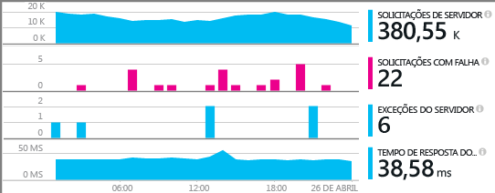
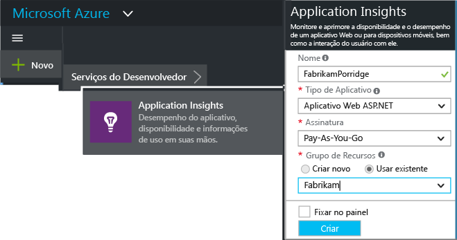
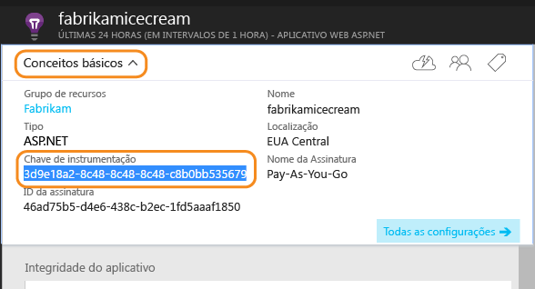
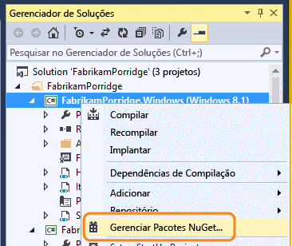
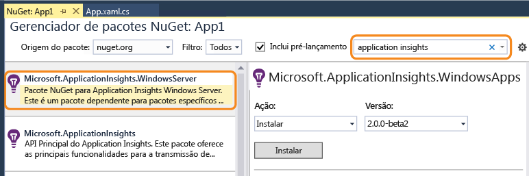
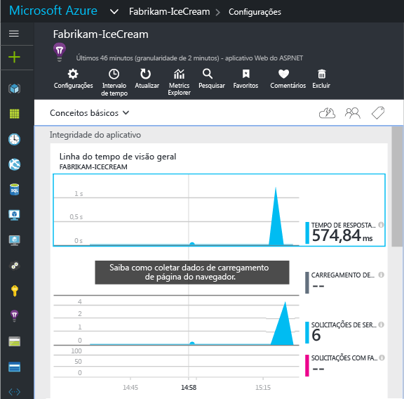
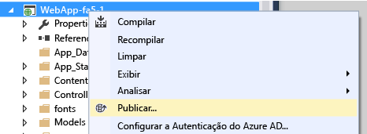

<properties
	pageTitle="Application Insights para serviços do Windows e funções de trabalho | Microsoft Azure"
	description="Adicione manualmente o SDK do Application Insights ao aplicativo ASP.NET para analisar o uso, a disponibilidade e o desempenho."
	services="application-insights"
    documentationCenter=".net"
	authors="alancameronwills"
	manager="douge"/>

<tags
	ms.service="application-insights"
	ms.workload="tbd"
	ms.tgt_pltfrm="ibiza"
	ms.devlang="na"
	ms.topic="get-started-article"
	ms.date="08/30/2016"
	ms.author="awills"/>

# Configurar manualmente o Application Insights para aplicativos ASP.NET 4

*O Application Insights está em modo de visualização.*

[AZURE.INCLUDE [app-insights-selector-get-started](../../includes/app-insights-selector-get-started.md)]

Você pode configurar manualmente o [Visual Studio Application Insights](app-insights-overview.md) para monitorar serviços do Windows, funções de trabalho e outros aplicativos ASP.NET. Para aplicativos Web, a configuração manual é uma alternativa para a [configuração automática](app-insights-asp-net.md) oferecida pelo Visual Studio.

O Application Insights ajuda a diagnosticar problemas e monitorar desempenho e uso em seu aplicativo ativo.

#### Antes de começar

Você precisa de:

* Uma assinatura do [Microsoft Azure](http://azure.com). Se sua equipe ou organização tem uma assinatura do Azure, o proprietário pode adicioná-lo a ela, usando sua [Conta da Microsoft](http://live.com).
* Visual Studio 2013 ou posterior.

## 1. Criar um recurso do Application Insights

Entre no [Portal do Azure](https://portal.azure.com/) e crie um novo recurso do Application Insights. Escolha ASP.NET como o tipo de aplicativo.

Um [recurso](app-insights-resources-roles-access-control.md) no Azure é uma instância de um serviço. Este recurso é o local no qual a telemetria enviada do seu aplicativo será analisada e apresentada a você.

A escolha do tipo de aplicativo define o conteúdo de padrão de folhas de recursos e as propriedades visíveis no [Metrics Explorer](app-insights-metrics-explorer.md).

#### Copiar a chave de instrumentação

A chave identifica o recurso, e você a instalará em breve no SDK para direcionar os dados ao recurso.

As etapas que acabou de fazer para criar um novo recurso são uma boa maneira de iniciar o monitoramento de qualquer aplicativo. Agora você pode enviar dados para o recurso.

## 2. Instale o SDK em seu aplicativo

Instalando e configurando o Application Insights SDK varia dependendo da plataforma em que você está trabalhando. Para aplicativos ASP.NET, é fácil.

1. No Visual Studio, edite os pacotes NuGet de seu projeto de aplicativo Web.

    

2. Instale o SDK do Application Insights para aplicativos Web.

    

    *É possível usar outros pacotes?*

    Sim. Escolha a API principal (applicationinsights) se desejar usar a API para enviar sua próprias telemetria. O pacote do Windows Server inclui automaticamente a API principal mais um número de outros pacotes, como coleta do contador de desempenho e monitoramento de dependência.

#### Como atualizar para versões futuras do SDK

Lançamos uma nova versão do SDK de tempos em tempos.

Para atualizar para uma [nova versão do SDK](https://github.com/Microsoft/ApplicationInsights-dotnet-server/releases/), abra o Gerenciador de pacotes do NuGet e filtre os pacotes instalados. Selecione **Microsoft.ApplicationInsights.Web** e escolha **Atualizar**.

Se você fez todas as personalizações no ApplicationInsights.config, salve uma cópia antes de atualizar e, depois, mescle suas alterações à nova versão.

## 3\. Enviar telemetria

**Se você instalou apenas o pacote de API principal:**

* Defina a chave de instrumentação no código, por exemplo, em `main()`:

    `TelemetryConfiguration.Active.InstrumentationKey = "` *sua chave* `";`

* [Escreva sua própria telemetria usando a API](app-insights-api-custom-events-metrics.md#ikey).

**Se tiver instalado outros pacotes do Application Insights,** se preferir, você poderá usar o arquivo .config para definir a chave de instrumentação:

* Edite o ApplicationInsights.config (que foi adicionado pela instalação do NuGet). Insira isto logo antes da marca de fechamento:

    `<InstrumentationKey>` *a chave de instrumentação que você copiou* `</InstrumentationKey>`

* Verifique se as propriedades de ApplicationInsights.config no Gerenciador de Soluções estão definidas como **Ação de Compilação = Conteúdo, Copiar para Diretório de Saída = Copiar**.

##  Execute seu projeto

Use a tecla **F5** para executar o aplicativo e experimente: abrir páginas diferentes para gerar telemetria.

No Visual Studio, você verá uma contagem dos eventos que foram recebidos.

##  Exibir sua telemetria

Volte para o [Portal do Azure](https://portal.azure.com/) e navegue até o seu recurso do Application Insights.

Procure dados nos gráficos de Visão Geral. Primeiro, você apenas verá um ou dois pontos. Por exemplo:

Clique em qualquer gráfico para ver métricas mais detalhadas. [Saiba mais sobre métricas.](app-insights-web-monitor-performance.md)

#### Não há dados?

* Use o aplicativo abrindo páginas diferentes, para que ele gere alguma telemetria.
* Abra o bloco [Pesquisar](app-insights-diagnostic-search.md) para ver eventos individuais. Às vezes, os eventos demoram um pouco mais para passar pelo pipeline de métricas.
* Aguarde alguns segundos e clique em **Atualizar**. Os gráficos se atualizam periodicamente, mas você pode atualizá-los manualmente se estiver aguardando para alguns dados serem exibidos.
* Consulte [Solucionar problemas](app-insights-troubleshoot-faq.md).

## Publicar seu aplicativo

Agora, implante o aplicativo em seu servidor ou no Azure e veja os dados se acumularem.

Quando você executa no modo de depuração, a telemetria é expressa através da pipeline, de modo que voc~e deve ver dados aparecendo dentro de segundos. Quando você implanta seu aplicativo na configuração de Versão, os dados acumulam mais lentamente.

#### Nenhum dado depois de publicar no servidor?

Abra estas portas para tráfego de saída no firewall do servidor:

+ `dc.services.visualstudio.com:443`
+ `f5.services.visualstudio.com:443`

#### Problemas no servidor de compilação?

Consulte [este item de solução de problemas](app-insights-asp-net-troubleshoot-no-data.md#NuGetBuild).

> [AZURE.NOTE] Se o seu aplicativo gerar muita telemetria (e você estiver usando o SDK do ASP.NET versão 2.0.0-beta3 ou posterior), o módulo de amostragem adaptável reduzirá automaticamente o volume enviado ao portal, enviando apenas uma fração representativa de eventos. No entanto, os eventos relacionados à mesma solicitação serão selecionadas ou desmarcadas como um grupo, para que você possa navegar entre os eventos relacionados. [Saiba mais sobre amostragem](app-insights-sampling.md).

## Próximas etapas

* [Adicione mais telemetria](app-insights-asp-net-more.md) para obter uma visão de 360 graus completa de seu aplicativo.

<!---HONumber=AcomDC_0907_2016-->