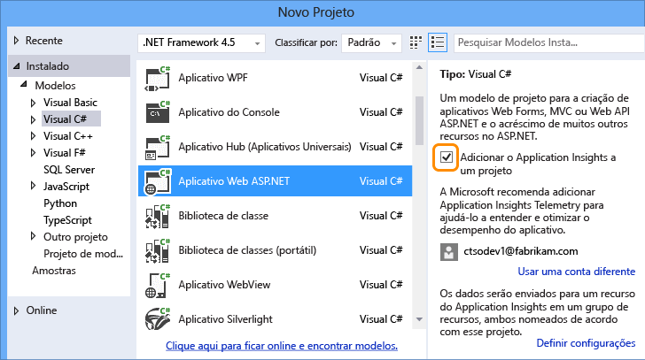
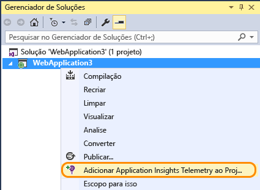
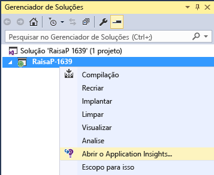
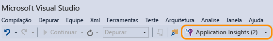

<properties 
	pageTitle="Monitorar o desempenho e a utilização do aplicativo com o Application Insights" 
	description="Analise o uso, disponibilidade e desempenho de seu local ou um aplicativo Web do Microsoft Azure com o Application Insights." 
	services="application-insights" 
    documentationCenter=""
	authors="alancameronwills" 
	manager="ronmart"/>

<tags 
	ms.service="application-insights" 
	ms.workload="tbd" 
	ms.tgt_pltfrm="ibiza" 
	ms.devlang="na" 
	ms.topic="article" 
	ms.date="04/26/2015" 
	ms.author="awills"/>

# Monitorar o desempenho e a utilização do aplicativo com o Application Insights

*O Application Insights está em modo de visualização*

O Application Insights do Visual Studio monitora seus aplicativos em tempo real para ajudá-lo a [detectar e diagnosticar problemas de desempenho e exceções][detect], e [descobrir como seu aplicativo é usado][knowUsers]. Ele pode ser usado com uma grande variedade de tipos de aplicativos: aplicativos Web Java e ASP.NET; aplicativos para dispositivos iOS, Android, Windows e outros; aplicativos HTML+JavaScript.

Neste artigo, nos concentraremos nos tipos de aplicativo que são desenvolvidos no Visual Studio. Também existem extensões do Application Insights para outros IDEs.

Você precisará do [Visual Studio 2013 Atualização 3](http://go.microsoft.com/fwlink/?linkid=397827&clcid=0x409) ou posterior e de uma conta no [Microsoft Azure](http://azure.com).

##  Adicionar o Application Insights ao seu projeto

#### Se é um novo projeto...

Quando criar um novo projeto no Visual Studio, certifique-se de que o Application Insights está selecionado.

O Visual Studio cria um recurso no Application Insights, adiciona o SDK ao seu projeto e coloca a chave no arquivo `.config`.

Se o projeto tem páginas da Web, ele também adiciona o [SDK do JavaScript][client] à página da Web principal.

#### ...ou então, se é um projeto existente

Clique com o botão direito do mouse no projeto no Gerenciador de Soluções, e selecione Adicionar Application Insights.

O Visual Studio cria um recurso no Application Insights, adiciona o SDK ao seu projeto e coloca a chave no arquivo `.config`.

Nesse caso, ele não adiciona o [SDK do JavaScript][client] a suas páginas da Web - recomendamos fazer isso na próxima etapa.

#### Opções de configuração

Se esta é sua primeira vez, você será solicitado a fazer logon ou se inscrever na visualização do Microsoft Azure. (ela é separada de sua conta do Visual Studio Online.)

Se esse aplicativo é parte de um aplicativo maior, você talvez queira usar **Definir configurações** e colocá-lo no mesmo grupo de recursos que os outros componentes.

*Sem opção de Application Insights? Para alguns tipos de projeto, você pode usar o Application Insights [adicionando o SDK manualmente][windows].*

#### Abrir Application Insights do seu projeto.

##  3. Execute seu projeto

Execute seu aplicativo com F5 e experimente: abra páginas diferentes para gerar alguma telemetria.

No Visual Studio, você verá uma contagem dos eventos que foram recebidos.

##  4. Exibir sua telemetria

Volte para o [Portal do Azure][portal] e navegue até o seu recurso do Application Insights.

Procure dados nos gráficos de Visão Geral. Primeiro, você apenas verá um ou dois pontos. Por exemplo:

Clique em qualquer gráfico para ver métricas mais detalhadas. [Saiba mais sobre métricas.][perf]

Agora implante seu aplicativo e assista a acumulação dos dados.

Quando você executa no modo de depuração, a telemetria é expressa através da pipeline, de modo que voc~e deve ver dados aparecendo dentro de segundos. Quando você implanta seu aplicativo, os dados acumulam mais lentamente.

#### Não há dados?

* Abra o bloco [Pesquisa de Diagnóstico][diagnostic] para ver os eventos individuais.
* Use o aplicativo abrindo páginas diferentes, para que ele gere alguma telemetria.
* Aguarde alguns segundos e clique em Atualizar.
* Consulte [Solucionar problemas][qna].

## Próximas etapas

Agora que você está enviando dados do lado do servidor do seu aplicativo, aqui estão algumas etapas para obter uma exibição mais parecida com 360 graus:

* [Configure os testes da Web][availability] para certificar-se de manter seu aplicativo operante e responsivo.
* [Adicione o SDK do JavaScript a suas páginas da Web][client] para obter a telemetria baseada em navegador, como contagens de exibição de página, tempos de carregamento de página, exceções de script e para permitir que você escreva telemetria personalizada em seus scripts de página.
* Adicionar o acompanhamento de dependência para diagnosticar problemas causados por bancos de dados ou outros componentes usados pelo seu aplicativo 
 * [Adicionar acompanhamento de dependência em seu servidor IIS][redfield]
 * [Adicionar acompanhamento de dependência em seu aplicativo Web do Azure][azure]
* [Capturar rastreamentos de log][netlogs] da sua estrutura de registros favorita
* [Acompanhe métricas e eventos personalizados][api] no cliente, no servidor ou em ambos, para saber mais sobre como seu aplicativo é usado.

<!--Link references-->

[api]: app-insights-api-custom-events-metrics.md
[availability]: app-insights-monitor-web-app-availability.md
[azure]: ../insights-perf-analytics.md
[client]: app-insights-javascript.md
[detect]: app-insights-detect-triage-diagnose.md
[diagnostic]: app-insights-diagnostic-search.md
[knowUsers]: app-insights-overview-usage.md
[netlogs]: app-insights-asp-net-trace-logs.md
[perf]: app-insights-web-monitor-performance.md
[portal]: http://portal.azure.com/
[qna]: app-insights-troubleshoot-faq.md
[redfield]: app-insights-monitor-performance-live-website-now.md
[windows]: app-insights-windows-get-started.md

 

<!---HONumber=July15_HO3-->