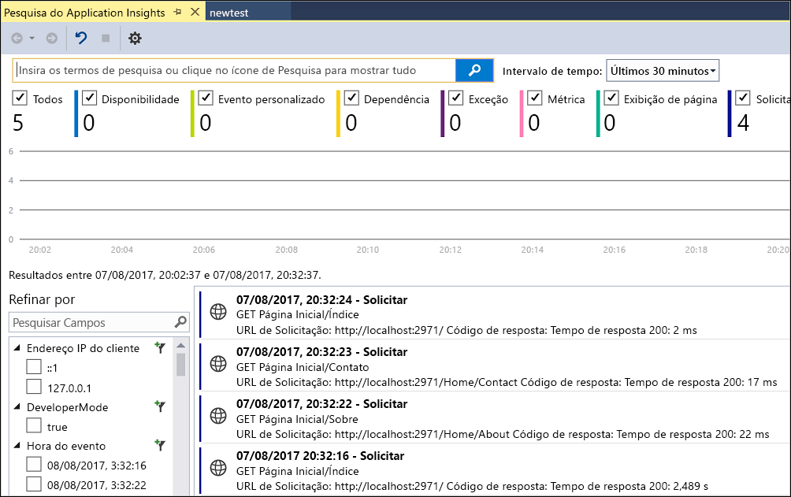
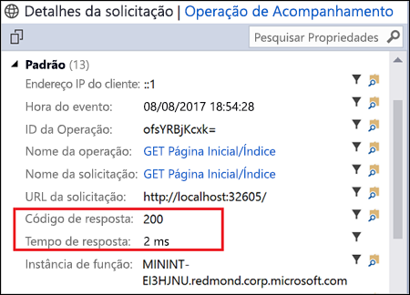
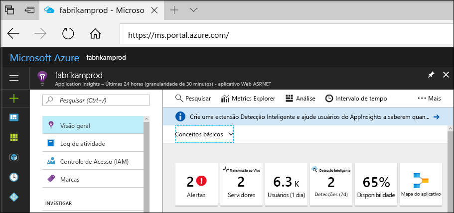
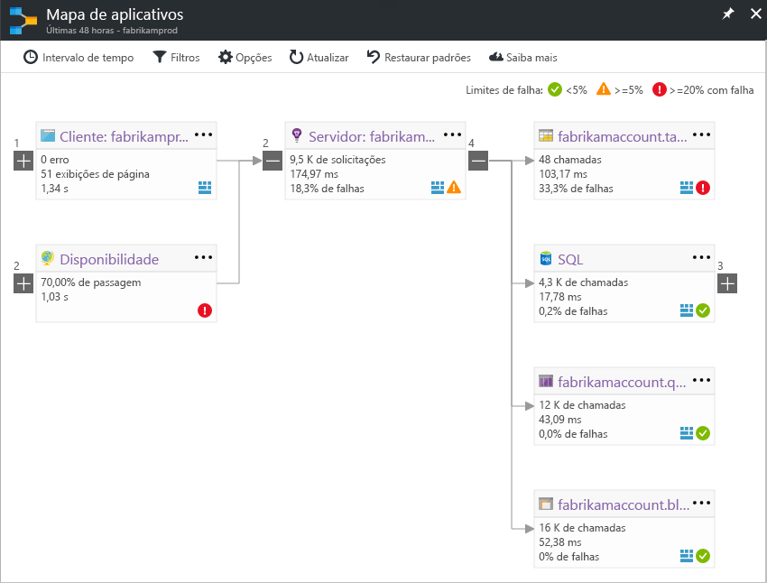
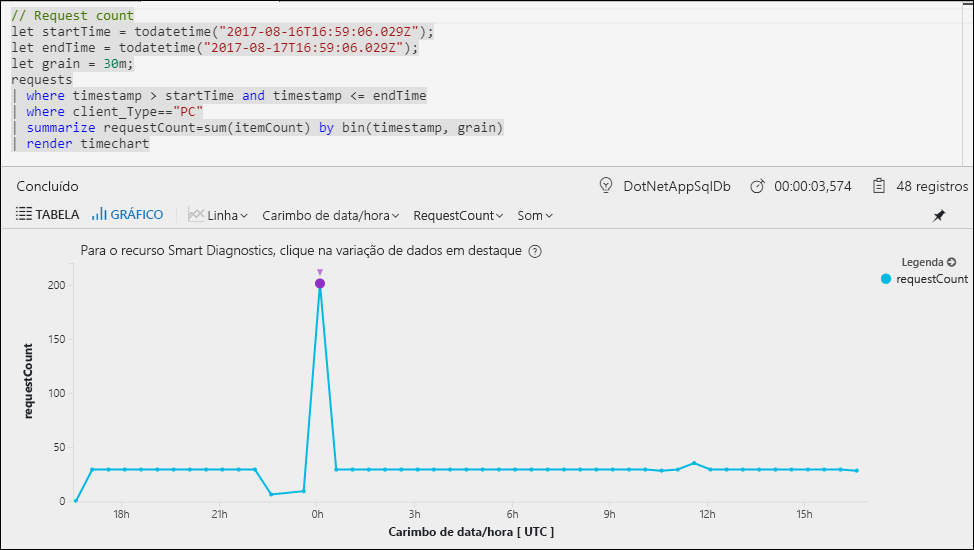
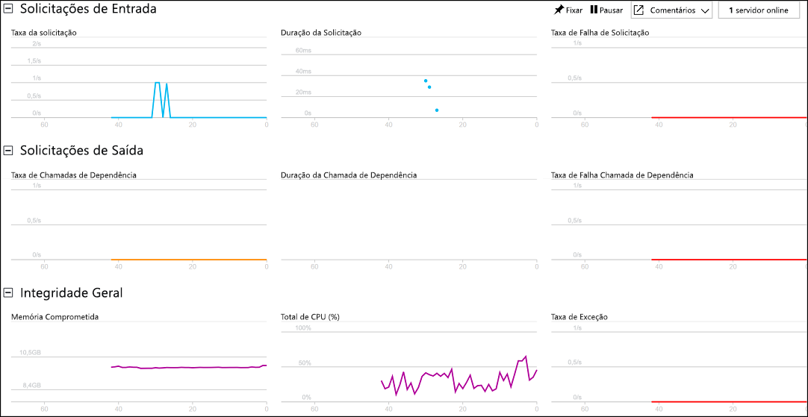

# Começar a monitorar o aplicativo Web ASP.NET

Com o Azure Application Insights, você pode monitorar facilmente o aplicativo Web quanto à sua disponibilidade, desempenho e uso.  Você também pode identificar e diagnosticar erros rapidamente em seu aplicativo sem esperar que um usuário os relate.  Com as informações coletadas do Application Insights sobre o desempenho e a eficiência do seu aplicativo, você pode fazer escolhas informadas para manter e aprimorar seu aplicativo.

Este guia de início rápido mostra como adicionar o Application Insights a um aplicativo Web ASP.NET existente e começar a analisar as estatísticas em tempo real, que é apenas um dos vários métodos que você pode usar para analisar o aplicativo. Se você não tiver um aplicativo Web ASP.NET, você poderá criar um seguindo o [guia de início rápido Criar um aplicativo Web ASP.NET](../app-service-web/app-service-web-get-started-dotnet.md).

## Pré-requisitos
Para concluir este guia de início rápido:

- Instale o [Visual Studio 2017](https://www.visualstudio.com/downloads/) com as cargas de trabalho a seguir:
    - Desenvolvimento Web e ASP.NET
    - Desenvolvimento do Azure

Se você não tiver uma assinatura do Azure, crie uma conta [gratuita](https://azure.microsoft.com/free/) antes de começar.

## Habilitar o Application Insights

1. Abra o projeto no Visual Studio 2017.
2. Selecione **Configurar o Application Insights** no menu Projeto. O Visual Studio adiciona o SDK do Application Insights ao aplicativo.
3. Clique em **Começar com Gratuito**, selecione o plano de cobrança preferencial e clique em **Registrar**.

    

4. Execute o aplicativo selecionando **Iniciar Depuração** do menu **Depurar** ou pressionando a tecla F5.

## Confirmar configuração do aplicativo

O Application Insights coleta dados de telemetria para seu aplicativo, independentemente do local em que ele está sendo executado. Use as etapas a seguir para começar a exibir esses dados.

1. Abra o Application Insights clicando em **Projeto** -> **Application Insights** -> **Pesquisar Telemetria da Sessão de Depuração**.  Você pode ver a telemetria da sessão atual.  

2. Clique na primeira solicitação na lista (GET Home/Index neste exemplo) para ver os detalhes da solicitação. Observe que o tempo de resposta e o código de status são ambos incluídos, juntamente com outras informações importantes sobre a solicitação.  

## Iniciar o monitoramento no Portal do Azure

Agora você pode abrir o Application Insights no Portal do Azure para exibir vários detalhes sobre o aplicativo em execução.

1. Clique com o botão direito do mouse na pasta **Connected Services Application Insights** no Gerenciador de Soluções e clique em **Abrir Portal do Application Insights**.  Você pode ver algumas informações sobre seu aplicativo e uma variedade de opções.

    

2. Clique em **Mapa do aplicativo** para obter um layout visual das relações de dependência entre os componentes do aplicativo.  Cada componente mostra KPIs como alertas, desempenho, falhas e carregamento.

    

3. Clique no ícone **Análise do Aplicativo**  em um dos componentes do aplicativo.  Isso abre a **Análise do Application Insights**, que fornece uma linguagem de consulta avançada para analisar todos os dados coletados pelo Application Insights.  Nesse caso, uma consulta que renderiza a contagem de solicitações como um gráfico é gerada para você.  Você pode escrever suas próprias consultas para analisar outros dados.

    

4. Volte para a página **Visão geral** e clique em **Live Stream**.  Isso mostra estatísticas em tempo real sobre o seu aplicativo conforme ele é executado.  Isso inclui informações como o número de solicitações de entrada, a duração dessas solicitações e eventuais falhas que ocorram.  Você também pode inspecionar as métricas de desempenho críticas, tais como processador e memória.

    

Se você está pronto para hospedar seu aplicativo no Azure, você pode publicá-lo agora. Siga as etapas descritas no [Guia de início rápido criar um aplicativo Web ASP.NET](../app-service/app-service-web-get-started-dotnet.md#update-the-app-and-redeploy).

## Próximas etapas
Nesse guia de início rápido, você habilitou o seu aplicativo para monitoramento pelo Azure Application Insights.  Continue para os tutoriais para aprender a usá-lo para monitorar as estatísticas e detectar problemas em seu aplicativo.

> [!div class="nextstepaction"]
> [Tutoriais do Azure Application Insights](app-insights-tutorial-runtime-exceptions.md)
