<properties
	pageTitle="Introdução à Automação do Azure | Microsoft Azure"
	description="Saiba como importar e executar uma tarefa de automação no Azure."
	services="automation"
	documentationCenter=""
	authors="bwren"
	manager="stevenka"
	editor=""/>

<tags
	ms.service="automation"
	ms.workload="tbd"
	ms.tgt_pltfrm="na"
	ms.devlang="na"
	ms.topic="hero-article" 
	ms.date="09/08/2015"
	ms.author="bwren"/>

# Introdução à Automação do Azure

## O que é Automação do Azure?

A Automação do Microsoft Azure fornece uma maneira para os usuários automatizarem tarefas manuais, longas, sujeitas a erros e repetidas com frequência que normalmente são executadas em um ambiente de nuvem. Você pode criar, monitorar, gerenciar e implantar recursos em seu ambiente do Azure usando runbooks, que são baseados em fluxos de trabalho do Windows PowerShell. Neste artigo, você passará por um tutorial para a execução de um runbook de exemplo simples. Em seguida, você encontrará recursos para explorar as funcionalidades mais avançadas do serviço.

## Tutorial
Este tutorial orienta você pela criação de uma conta de automação, importação de um runbook "Hello World" de exemplo na Automação do Azure, execução desse runbook e, em seguida, pela visualização de sua saída.

Para concluir este tutorial, você precisará de uma assinatura do Azure. Se ainda não tiver uma, você poderá [ativar os benefícios de assinante do MSDN](../pricing/member-offers/msdn-benefits-details/) ou [inscrever-se para uma avaliação gratuita](../pricing/free-trial.md)</a>.

[AZURE.INCLUDE [automation-note-authentication](../../includes/automation-note-authentication.md)]

## Passo a passo em vídeo

Aqui está um passo a passo deste tutorial.

[AZURE.VIDEO get-started-with-azure-automation]

## Criar uma conta de automação

Uma conta de automação é um contêiner para os seus recursos de Automação do Azure. Ele fornece uma maneira de separar seus ambientes ou organizar ainda mais seus fluxos de trabalho. Para obter mais informações, confira [Contas de Automação](http://aka.ms/runbookauthor/azure/automationaccounts) na Biblioteca de Automação. Se você já tiver criado uma conta de automação, pode ignorar essa etapa.

1.	Faça logon no [Portal do Azure](http://manage.windowsazure.com).

2.	No portal do Azure, clique em **Criar uma Conta de Automação**.

	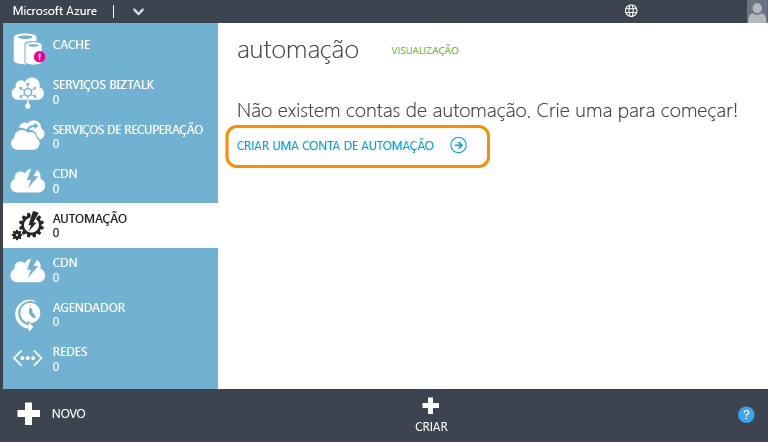

3.	Na página **Adicionar uma Nova Conta de Automação**, digite um nome e selecione uma região para a conta. A região especifica onde os recursos de Automação na conta serão armazenados. Isso não afeta a funcionalidade da sua conta, mas seus runbooks podem ser executados mais rapidamente se a região da conta estiver próxima de onde os outros recursos do Azure estão armazenados. Quando estiver pronto, clique na marca de seleção.

	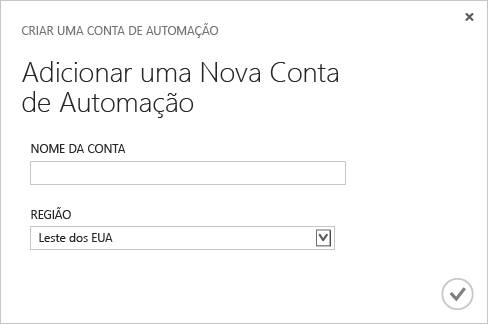

## Importar runbook da Galeria de Runbooks

O [Galeria de Runbooks](http://aka.ms/runbookgallery) inclui runbooks de exemplo que podem ser importados diretamente em uma conta de Automação do Azure, permitindo que você aproveite o trabalho de outros usuários de Automação do Azure e do PowerShell. Nesta etapa, você usará a galeria de importar o runbook de exemplo "Hello World".

4.	Na página **Automação**, clique na nova conta que você acabou de criar.

	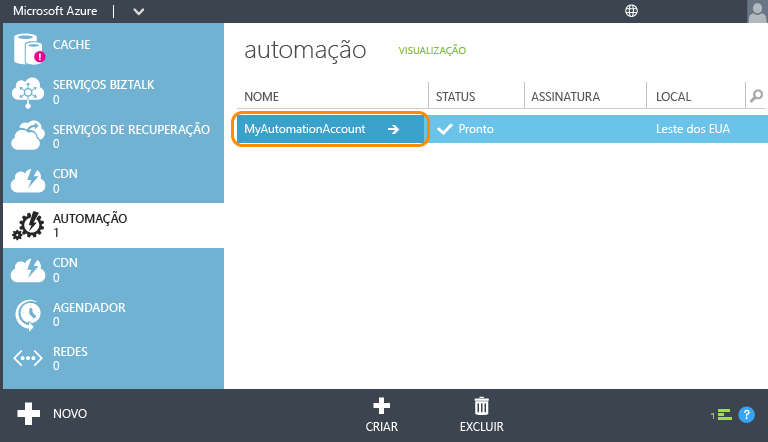

5.	Clique em **RUNBOOKS**.

	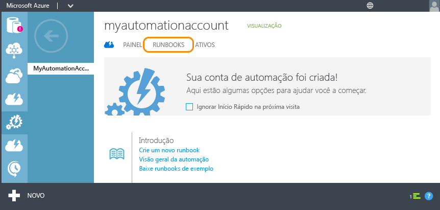

6.	Clique em **Novo** > **Runbook** > **Da Galeria**.

	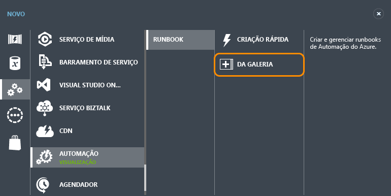

7.  Selecione a categoria **Tutorial** e depois **Hello World para Automatização do Azure**. Clique no botão com a seta para a direita.

	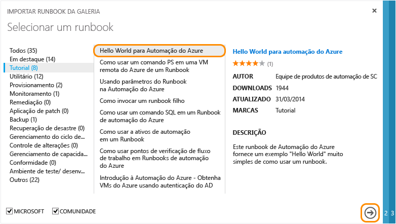

8.  Revise o conteúdo do runbook e clique no botão com a seta para a direita.

	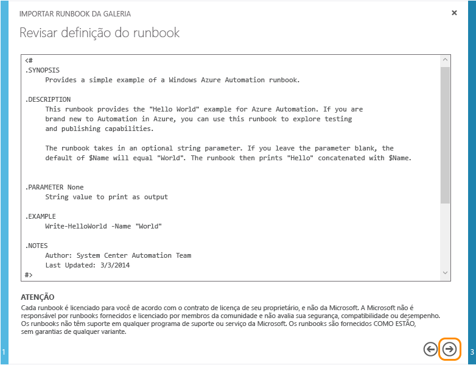

8.	Revise os detalhes do runbook e clique no botão com a marca de seleção.

	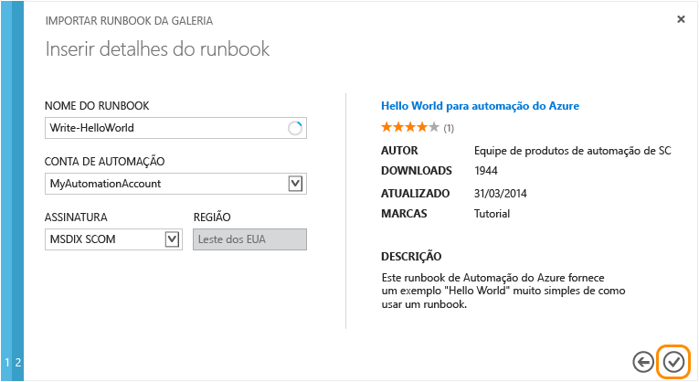

## Publicar runbook

O runbook primeiro é importado no modo Rascunho. Isso significa que você pode continuar a trabalhar nele antes de autorizá-lo como uma nova versão pode ser executada. Uma vez que esse runbook de exemplo não requer configuração adicional, você vai publicá-lo agora como está. Para obter mais informações, consulte [Publicando um runbook](http://aka.ms/runbookauthor/azure/publishrunbook).

9.	Quando a importação do runbook estiver concluída, clique em **Write-HelloWorld**.

	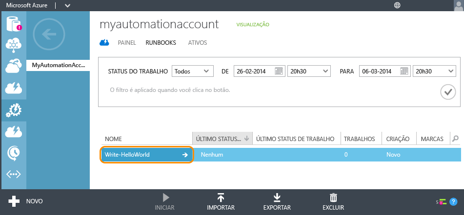

9.	Clique em **AUTOR** e, em seguida, clique em **RASCUNHO**.

	Você pode modificar o conteúdo de um runbook no modo de Rascunho. Para este runbook, você não precisa fazer nenhuma modificação.

	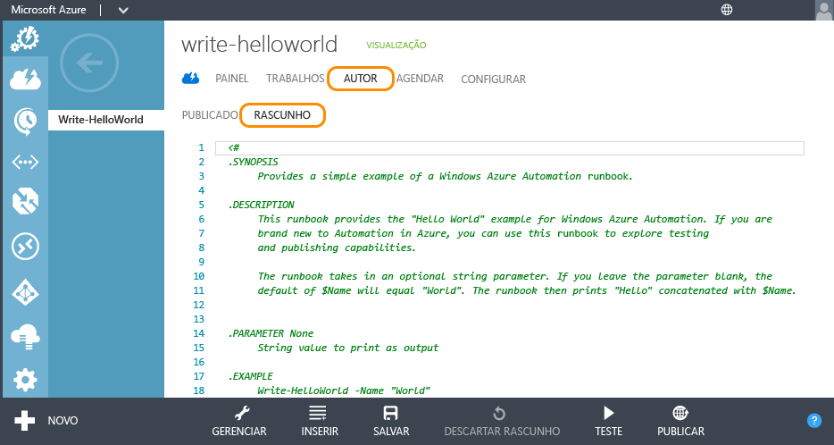

10.	Clique em **PUBLICAR** para promover o runbook, marcando-o como pronto para uso em produção.

	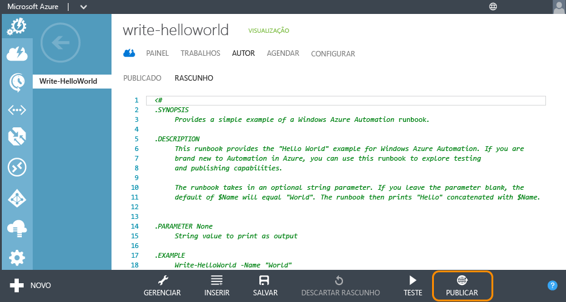

11.	Quando a confirmação for solicitada, clique em **Sim**.

	

## Iniciar Runbook

Com o runbook importado e publicado, agora você pode executá-lo e, em seguida, inspecionar a saída. Para obter mais informações, consulte [Iniciando um runbook](http://aka.ms/runbookauthor/azure/startrunbook) e [Mensagens e saída do runbook](http://aka.ms/runbookauthor/azure/runbookoutput).

12.	Com o runbook **Write-HelloWorld** aberto, clique em **INICIAR**.

	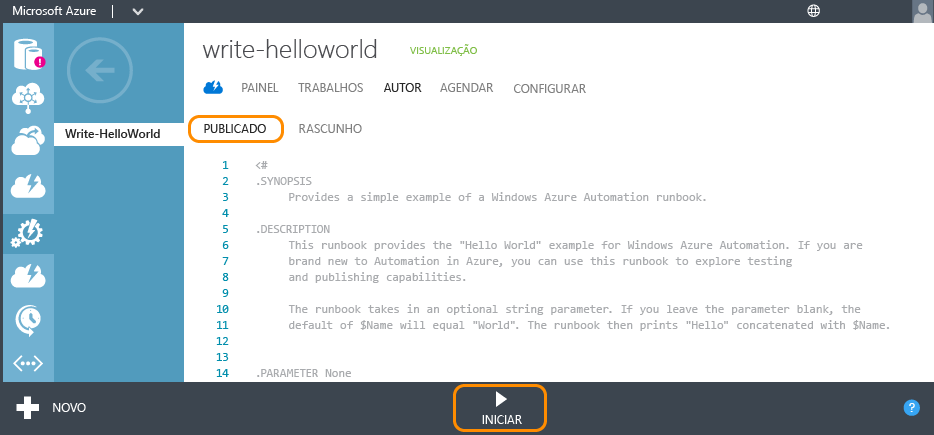

13.	Na página **Especificar valores de parâmetros de Runbook**, digite um **Nome** que será usado como um parâmetro de entrada para o script de Write-HelloWorld.ps1 e, em seguida, clique na marca de seleção.

	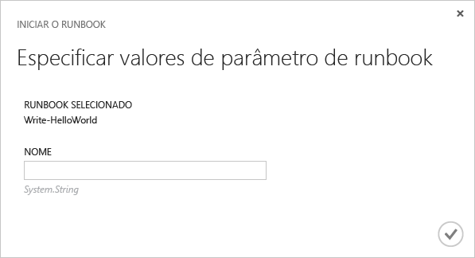

14.	Clique em **TRABALHOS** para verificar o status do trabalho do runbook que você iniciou e, em seguida, clique no carimbo de data/hora na coluna **INÍCIO DO TRABALHO** para exibir o resumo do trabalho.

	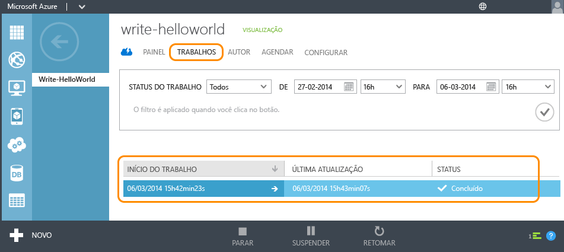

15.	Na página **RESUMO**, você pode ver o resumo, os parâmetros de entrada e a saída do trabalho.

	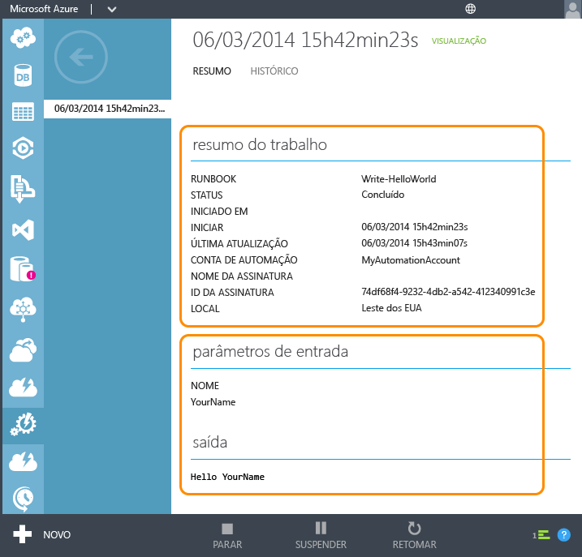

Parabéns! Você concluiu o tutorial.

## Próximas etapas
1. O runbook simples neste tutorial *não gerencia serviços do Azure*. A maioria dos runbooks usará o [cmdlets do Azure](http://msdn.microsoft.com/library/jj156055.aspx) para fazer isso, o que requer autenticação para sua assinatura do Azure. Siga as instruções em [Configurando o Azure para gerenciamento por runbooks](http://aka.ms/azureautomationauthentication) para configurar sua assinatura do Azure para trabalhar com esses cmdlets.  
2. Consulte os [Recursos](#resources) listados abaixo para obter mais informações sobre os recursos de Automação do Azure.
3. Assine o [Blog de Automação do Azure](http://azure.microsoft.com/blog/tag/azure-automation) para se manter atualizado com o que há de mais recente da equipe de Automação do Azure.

## Recursos

Uma variedade de outros recursos estão disponíveis para você aprender mais sobre a Automação do Azure e criar seus próprios runbooks.

- [Biblioteca de Automação do Azure](http://go.microsoft.com/fwlink/p/?LinkId=392860) fornece a documentação completa sobre a configuração e administração da Automação do Azure e para a criação de seus próprios runbooks.
- [Cmdlets do Azure PowerShell](http://msdn.microsoft.com/library/jj156055.aspx) fornece informações para a automatização de operações do Azure usando o Windows PowerShell. Os runbooks usam esses cmdlets para trabalhar com recursos do Azure.
- [Blog de Automação do Azure](http://azure.microsoft.com/blog/tag/azure-automation) fornece as informações mais recentes sobre a Automação do Azure da Microsoft.
- [Fórum de automação](http://go.microsoft.com/fwlink/p/?LinkId=390561) permite que você poste dúvidas sobre a Automação do Azure a serem resolvidas pela Microsoft e pela comunidade de automação.

## Exemplos e runbooks utilitários

A Microsoft e a comunidade da Automação do Azure fornecem runbooks de exemplo, que pode ajudá-lo a começar a criar suas próprias soluções, e runbooks utilitários, que você pode usar como blocos de construção para tarefas de automação maiores. Você pode baixar esses runbooks do [Script Center](http://azure.microsoft.com/documentation/scripts/) ou importá-los diretamente para a Automação do Azure usando a [Galeria de Runbooks](http://aka.ms/runbookgallery).

## Comentários

**Fornecer comentários** Se você estiver procurando por uma solução de runbook de Automação do Azure ou por um módulo de integração, poste uma Solicitação de script no Script Center. Se você tiver comentários ou solicitações de recurso para a Automação do Azure, poste-os em [User Voice](http://feedback.windowsazure.com/forums/34192--general-feedback). Obrigado!

<!---HONumber=Oct15_HO3-->