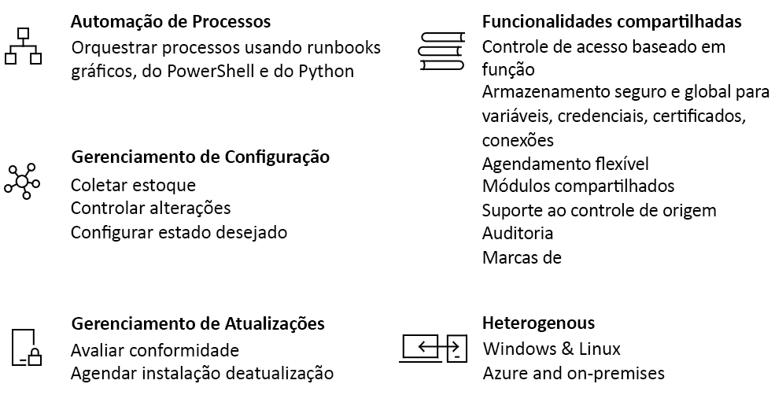

# Uma introdução à Automação do Azure

A Automação do Azure oferece um serviço de configuração e de automação baseado em nuvem que fornece gerenciamento consistente em seus ambientes Azure e não Azure. Ele é composto por automação de processos, gerenciamento de atualizações e recursos de configuração. A Automação do Azure fornece controle total durante a implantação, operações e encerramento de cargas de trabalho e de recursos.
Este artigo fornece uma visão geral da Automação do Azure e responde algumas perguntas comuns. Para obter mais informações sobre os diferentes recursos, acesse os links em toda esta visão geral.

## Recursos da Automação do Azure

### Automação de processos

A Automação do Azure fornece a capacidade de automatizar tarefas de gerenciamento de nuvem frequentes, demoradas e propensas a erros. Esta automação ajuda você a focar em trabalhos que agregam valor. Ao reduzir erros e melhorar a eficiência, também ajuda a diminuir os custos operacionais. É possível integrar os serviços do Azure e outros sistemas públicos necessários na implantação, configuração e gerenciamento de seus processos de ponta a ponta. O serviço permite [criar runbooks](automation-runbook-types.md) graficamente, no PowerShell ou no Python. Usando um Hybrid Runbook Worker, é possível unificar o gerenciamento por meio da orquestração entre ambientes locais. [Webhooks](automation-webhooks.md) fornecem uma forma de atender a solicitações e garantir a entrega e operações contínuas disparando automação do ITSM, DevOps e sistemas de monitoramento.

### Gerenciamento de configuração

A [configuração de estado desejado](automation-dsc-overview.md) da Automação do Azure é uma solução baseada em nuvem para DSC do PowerShell que fornece serviços necessários para ambientes corporativos. Gerencie recursos de DSC na Automação do Azure e aplique as configurações a máquinas virtuais ou físicas de um Servidor de Recepção de DSC na nuvem do Azure. Ele oferece relatórios avançados que informam sobre eventos importantes como quando nós desviaram de sua configuração atribuída. É possível monitorar e atualizar automaticamente a configuração do computador em máquinas virtuais e físicas, no Windows ou Linux, na nuvem ou local.

É possível obter inventário sobre recursos no convidado para visibilidade sobre aplicativos instalados e outros itens de configuração. Funcionalidades avançadas de relatório e de pesquisa estão disponíveis para encontrar rapidamente informações detalhadas a fim de ajudar a entender o que foi configurado dentro do sistema operacional. É possível controlar as alterações entre serviços, daemons, software, Registro e arquivos para identificar rapidamente o que pode estar causando problemas. Além disso, o DSC pode ajudar a diagnosticar e alertar quando ocorrem alterações indesejadas em seu ambiente.

### Gerenciamento de atualizações

Atualize os sistemas Windows e Linux em ambientes híbridos na Automação do Azure. Obtenha visibilidade da conformidade de atualização no Azure, nuvens locais e outras nuvens. É possível criar implantações de agendamento para orquestrar a instalação de atualizações em uma janela de manutenção definida. Caso uma atualização não deva ser instalada em um computador, é possível excluir essas atualizações de uma implantação.

### Recursos compartilhados

A Automação do Azure é composta por um conjunto de recursos compartilhados que facilitam a automatização e configurar seu ambiente em escala.

* **[Agendas](automation-schedules.md)** – Usado no serviço para disparar automação em horários predefinidos.
* **[Módulos](automation-integration-modules.md)** – são usados para gerenciar o Azure e outros sistemas. Importe para a Conta de Automação da Microsoft, de terceiros, da comunidade ou cmdlets definidos personalizados e recursos de DSC.
* **[Galeria de módulos](automation-runbook-gallery.md)** – integração nativa na Galeria do PowerShell para exibir runbooks e importá-los para a Conta de Automação.
* **[Pacotes do Python 2](python-packages.md)** – adicione pacotes do Python 2 à sua conta de automação para usar em seus runbooks do Python.
* **[Credenciais](automation-credentials.md)** – Armazene seguramente informações confidenciais que podem ser usadas por runbooks e configurações em tempo de execução.
* **[Conexões](automation-connections.md)** – Armazenar um par de informação nome/valor que contém informações comuns ao se conectar a sistemas em recursos de conexão. As conexões são definidas pelo autor do módulo para uso em tempo de execução nas configurações e runbooks.
* **[Certificados](automation-certificates.md)** – Armazene e disponibilize em tempo de execução para que eles possam ser usados para autenticação e proteção de recursos implantados.
* **[Variáveis](automation-variables.md)** – Forneça uma maneira de manter o conteúdo que pode ser usado em runbooks e configurações. É possível alterar valores sem ter que modificar nenhum runbook e configurações que os referenciam.

### Integração de controle do código-fonte

A Automação do Azure tem a capacidade de [integrar-se ao controle do código-fonte](source-control-integration.md) que promove configuração como código em é possível realizar o check-in de runbooks ou configurações em um sistema de controle do código-fonte.

### Controle de acesso baseado em função

A Automação do Azure dá suporte a Controle de Acesso Baseado em Função para controlar o acesso à Conta de Automação e seus recursos. Para saber mais sobre a configuração de RBAC na sua Conta de Automação, runbooks e trabalhos, confira [Controle de acesso baseado em função para Automação do Azure](automation-role-based-access-control.md).

### Windows e Linux

A Automação do Azure foi criada para funcionar em seu ambiente de nuvem híbrida e também para Windows e Linux. Ela oferece uma maneira consistente de automatizar e configurar cargas de trabalho implantadas e o sistema operacional no qual elas estão sendo executadas.

### Galeria da comunidade

Procure na [galeria de Automação](automation-runbook-gallery.md) runbooks e módulos para começar rapidamente a integrar e criar seus processos da galeria do PowerShell e do Microsoft Script Center.

## Cenários comuns de Automação

A Automação do Azure é gerenciada em todo o ciclo de vida da infraestrutura e de aplicativos. Transfira conhecimento para o sistema sobre como a organização oferece e mantém as cargas de trabalho. Crie em linguagens comuns como PowerShell, configuração de estado desejado, Python e runbooks gráficos. Obtenha um inventário completo de recursos implantados para direcionamento, relatórios e conformidade. Identifique alterações que podem causar erros de configuração e melhore a conformidade operacional.

* **Compilar/implantar recursos** – Implante VMs em um ambiente híbrido usando modelos de Runbooks e do Azure Resource Manager. Integre-se a ferramentas de desenvolvimento como Jenkins e Azure DevOps.
* **Configurar VMs** – Avalie e configure computadores Windows e Linux com a configuração desejada para a infraestrutura e o aplicativo.
* **Monitorar** – Identifique alterações nos computadores que estão causando problemas e corrija ou escalone para sistemas de gerenciamento.
* **Proteger** – Coloque a VM em quarentena se forem gerados alertas de segurança. Defina requisitos no convidado.
* **Reger** – Configure controle de acesso baseado em função para equipes. Recupere recursos não utilizados.

## Preço da Automação

É possível examinar o preço da Automação do Azure na página [preços](https://azure.microsoft.com/pricing/details/automation/).

## Próximas etapas

> [!div class="nextstepaction"]
> [Criar uma conta de Automação](automation-quickstart-create-account.md)
