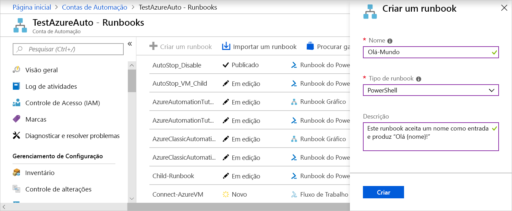
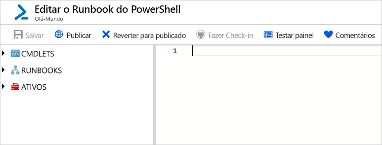
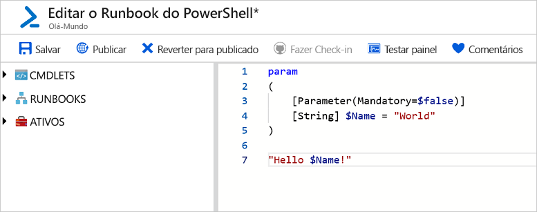
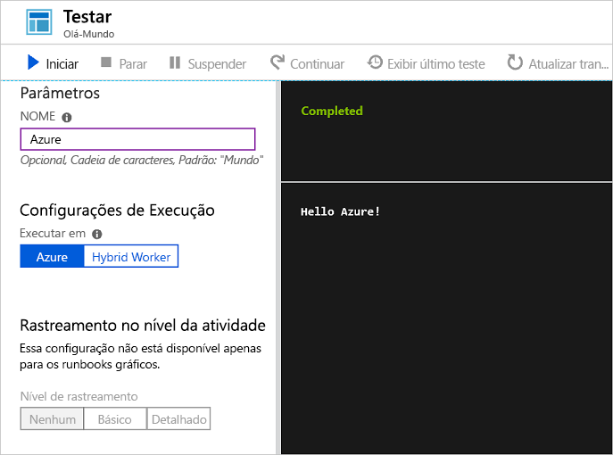
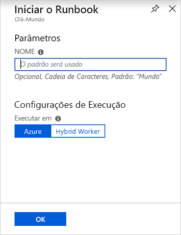
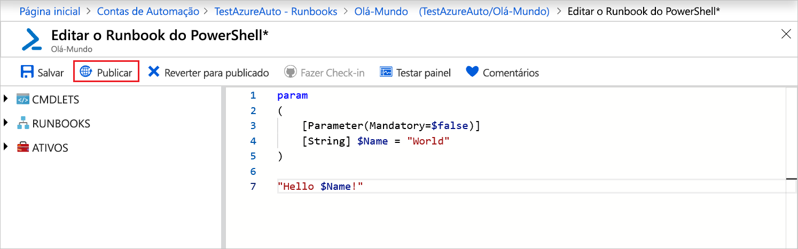
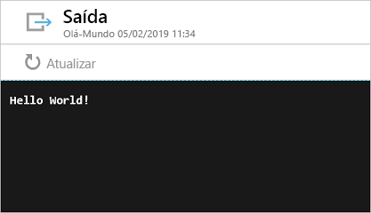

# <a name="create-an-azure-automation-runbook"></a>Criar um runbook de Automação do Azure

Os runbooks de Automação do Azure podem ser criados por meio do Azure. Esse método fornece uma interface do usuário baseada em navegador para criar runbooks de Automação. Neste Guia de Início Rápido, você passa pela criação, edição, teste e publicação de um runbook PowerShell de Automação.

Caso você não tenha uma assinatura do Azure, crie uma [conta gratuita do Azure](https://azure.microsoft.com/free/?WT.mc_id=A261C142F) antes de começar.

## <a name="log-in-to-azure"></a>Fazer logon no Azure

Faça logon no Azure em https://portal.azure.com

## <a name="create-runbook"></a>Criar runbook

Primeiro, crie um runbook. O runbook de exemplo criado neste guia de início rápido exibe `Hello World` por padrão.

1. Abra sua conta da Automação.

1. Clique em **Runbooks** em **AUTOMAÇÃO DE PROCESSO**. A lista de runbooks é exibida.

1. Clique np botão **Adicionar um runbook** encontrado na parte superior da lista. Na página **Adicionar Runbook**, selecione **Criação Rápida**.

1. Insira "Hello-World" como **Name** do runbook e selecione **PowerShell** para **Tipo de Runbook**. Clique em **Criar**.

   

1. O runbook é criado e a página **Editar Runbook do PowerShell** se abre.

    

1. Digite ou copie e cole o seguinte código no painel de edição. Ele cria um parâmetro de entrada opcional chamado "Name" com um valor padrão de "World" e gera uma cadeia de caracteres que usa este valor de entrada:
   
   ```powershell-interactive
   param
   (
       [Parameter(Mandatory=$false)]
       [String] $Name = "World"
   )

   "Hello $Name!"
   ```

1. Clique em **Salvar**, para salvar uma cópia rascunho do runbook.

    

## <a name="test-the-runbook"></a>Testar o runbook

Depois de criar o runbook, teste-o para validar se funciona.

1. Clique em **Painel de teste** para abrir a página de **Teste**.

1. Insira um valor para **Name**, e clique em **Iniciar**. O trabalho de teste começa e o status do trabalho e a saída são exibidos.

    

1. Feche a página de **Teste** clicando em **X** no canto superior direito. Selecione **OK** no pop up exibido.

1. Na página **Editar Runbook do PowerShell** clique em **Publicar** para publicar o runbook como a versão oficial do runbook na conta.

   

## <a name="run-the-runbook"></a>Executar o runbook

Quando o runbook é publicado, a página de visão geral é exibida.

1. Na página de visão geral do runbook, clique em **Iniciar** para abrir a página de configuração **Iniciar Runbook**.

   

1. Deixe **Name** em branco, para que o valor padrão seja usado e clique em **OK**. O trabalho do runbook é enviado e a página do trabalho é exibida.

   

1. Quando o **Status do trabalho** for **Em execução** ou **Concluído**, clique em **Saída** para abrir o painel **Saída** e exibir a saída do runbook.

    

## <a name="clean-up-resources"></a>Limpar recursos

Quando não for mais necessário, exclua o runbook. Para isso, selecione o runbook na lista e clique em **Excluir**.

## <a name="next-steps"></a>Próximas etapas

Neste guia de início rápido, você criou, editou, testou e publicou um runbook e iniciou um trabalho de runbook. Para saber mais sobre runbooks de automação, continue com o artigo sobre diferentes tipos de runbook que você pode criar e usar na Automação.

> [!div class="nextstepaction"]
> [Procedimentos de Automação – Tipos de Runbook](./automation-runbook-types.md)
