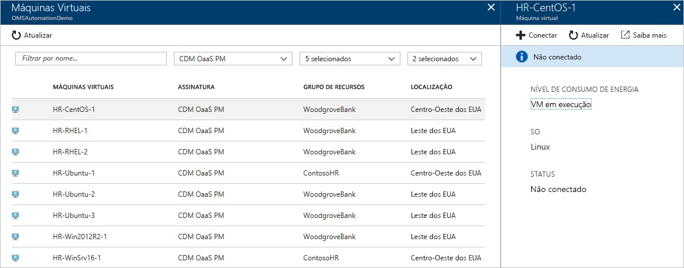
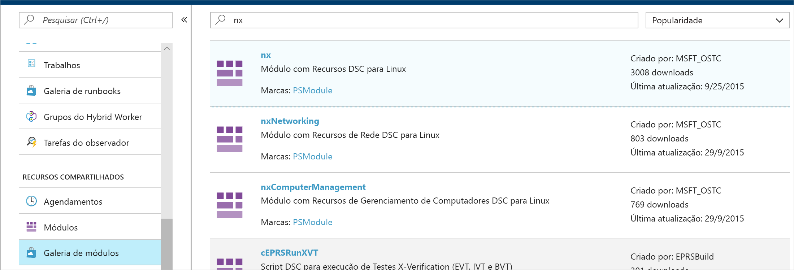
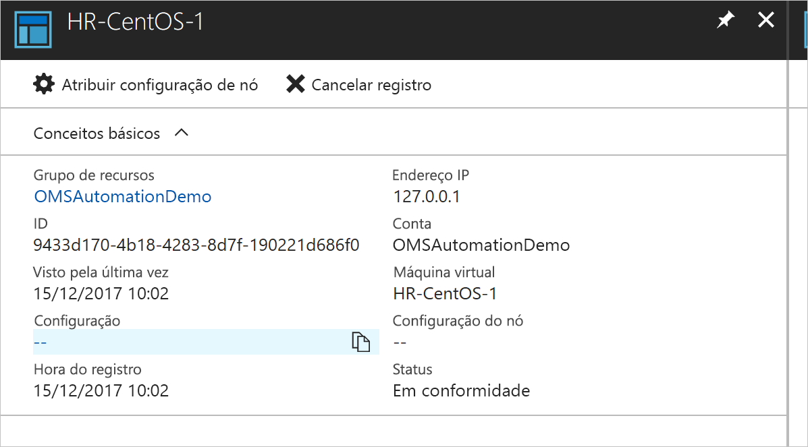
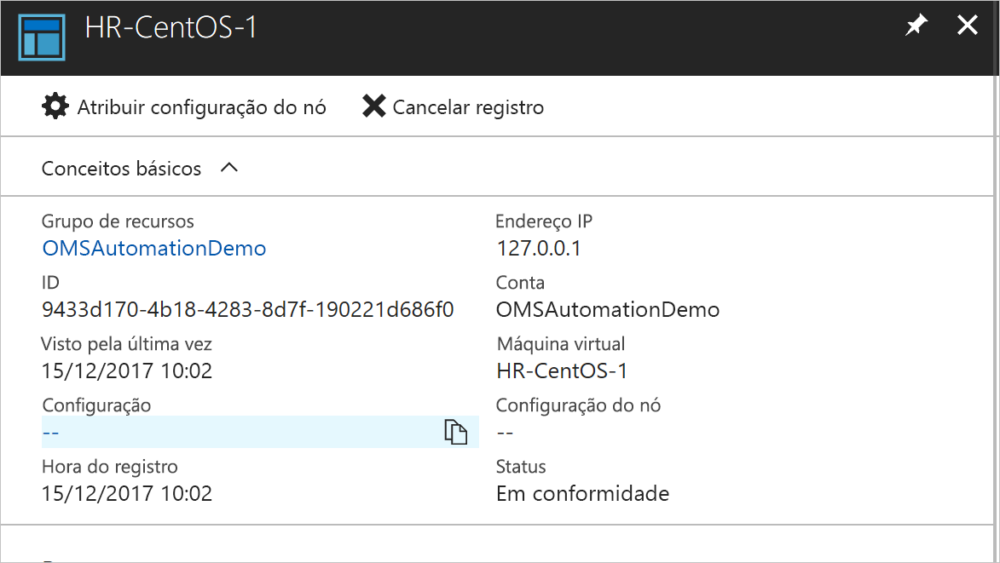
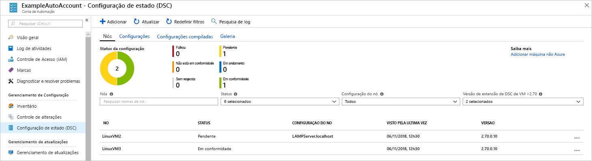

# <a name="configure-a-linux-virtual-machine-with-desired-state-configuration"></a>Configurar uma máquina virtual Linux com Desired State Configuration

Ao habilitar o DSC (Desired State Configuration), é possível gerenciar e monitorar as configurações de seus servidores Windows e Linux. Configurações com descompasso da configuração desejada podem ser identificadas ou corrigidas automaticamente. Este início rápido percorre a integração de uma VM Linux e a implantação de uma pilha LAMP com o DSC.

## <a name="prerequisites"></a>pré-requisitos

Para concluir este início rápido, você precisa de:

* Uma assinatura do Azure. Se você não tiver uma assinatura do Azure, [crie uma conta gratuita](https://azure.microsoft.com/free/).
* Uma conta de Automação do Azure. Para obter instruções sobre como criar uma conta Executar Como de Automação do Azure, consulte [Conta Executar Como do Azure](automation-sec-configure-azure-runas-account.md).
* Uma VM do Azure Resource Manager (não clássico) executando o Red Hat Enterprise Linux, CentOS e Oracle Linux. Para obter instruções sobre a criação de uma VM, consulte [Criar sua primeira máquina virtual do Linux no portal do Azure](../virtual-machines/linux/quick-create-portal.md)

## <a name="log-in-to-azure"></a>Fazer logon no Azure
Faça logon no Azure em https://portal.azure.com

## <a name="onboard-a-virtual-machine"></a>Carregar uma máquina virtual
Há vários métodos diferentes para integrar um computador e habilitar o Desired State Configuration. Este guia de início rápido abrange a integração por meio de uma conta de Automação. É possível saber mais sobre diferentes métodos para carregar seus computadores para o Desired State Configuration lendo o artigo de [integração](https://docs.microsoft.com/azure/automation/automation-dsc-onboarding).

1. No painel esquerdo do Portal do Azure, selecione **contas de Automação**. Se não estiver visível no painel esquerdo, clique em **Todos os serviços** e pesquise-o no modo de exibição resultante.
1. Na lista, selecione uma conta de Automação.
1. No painel esquerdo da conta de Automação, selecione **Nós DSC**.
1. Clique na opção de menu para **Adicionar VM do Azure**
1. Localize a máquina virtual para a qual você deseja habilitar o DSC. É possível usar as opções de campo e filtro de pesquisa para encontrar uma máquina virtual específica.
1. Clique na máquina virtual e, em seguida, selecione **Conectar**
1. Selecione as configurações de DSC adequadas para a máquina virtual. Se você já preparou uma configuração, é possível especificá-lo como *Nome da Configuração do Nó*. É possível definir o [modo de configuração](https://docs.microsoft.com/powershell/dsc/metaconfig) para controlar o comportamento de configuração do computador.
1. Clique em **OK**



Embora a extensão do Desired State Configuration seja implantada na máquina virtual, ela mostra *Conectando-se.*

## <a name="import-modules"></a>Importar módulos

Os módulos contêm recursos DSC e muitos podem ser encontrados na [Galeria do PowerShell](https://www.powershellgallery.com). Os recursos usados em suas configurações devem ser importados para a Conta de Automação antes da compilação. Para este tutorial, o módulo chamado **nx** é necessário.

1. No painel esquerdo da conta de Automação, selecione **Galeria de módulos** (em Recursos compartilhados).
1. Pesquise o módulo que você deseja importar digitando parte de seu nome: *nx*
1. Clique no módulo que você gostaria de importar
1. Clique em **Importar**



## <a name="import-the-configuration"></a>Importar a configuração

Este guia de início rápido usa uma configuração DSC que configura o Apache HTTP Server, o MySQL e o PHP no computador.

Para obter informações sobre as configurações DSC, consulte [Configurações DSC](https://docs.microsoft.com/powershell/dsc/configurations).

Em um editor de texto, digite o seguinte e salve localmente como `LAMPServer.ps1`.

```powershell-interactive
configuration LAMPServer {
   Import-DSCResource -module "nx"

   Node localhost {

        $requiredPackages = @("httpd","mod_ssl","php","php-mysql","mariadb","mariadb-server")
        $enabledServices = @("httpd","mariadb")

        #Ensure packages are installed
        ForEach ($package in $requiredPackages){
            nxPackage $Package{
                Ensure = "Present"
                Name = $Package
                PackageManager = "yum"
            }
        }

        #Ensure daemons are enabled
        ForEach ($service in $enabledServices){
            nxService $service{
                Enabled = $true
                Name = $service
                Controller = "SystemD"
                State = "running"
            }
        }
   }
}
```

Para importar a configuração:

1. No painel esquerdo da conta de Automação, selecione **Configurações DSC**.
1. Clique na opção de menu para **Adicionar uma configuração**
1. Selecione o *arquivo de configuração* que você salvou na etapa anterior
1. Clique em **OK**

## <a name="compile-a-configuration"></a>Compilar uma configuração

As configurações de DSC devem ser compiladas em uma Configuração de Nó (documento MOF) antes de serem atribuídas a um nó. A compilação valida a configuração e permite a entrada de valores de parâmetro. Para saber mais sobre como compilar uma configuração, consulte: [Compilando configurações no DSC de Automação do Azure](https://docs.microsoft.com/azure/automation/automation-dsc-compile)

Para compilar a configuração:

1. No painel esquerdo da conta de Automação, selecione **Configurações DSC**.
1. Selecione a configuração importada em uma etapa anterior, "LAMPServer"
1. Nas opções de menu, clique em **Compilar** e, em seguida, em **Sim**
1. Na exibição Configuração, você verá um novo *Trabalho de compilação* enfileirado. Quando o trabalho for concluído com êxito, você estará pronto para passar para a próxima etapa. Se houver falhas, será possível clicar no Trabalho de compilação para obter detalhes.



## <a name="assign-a-node-configuration"></a>Atribuir uma configuração de nó

Uma *Configuração de Nó* compilada pode ser atribuída a Nós DSC. A atribuição aplica a configuração ao computador e monitora (ou corrige automaticamente) qualquer descompasso dessa configuração.

1. No painel esquerdo da conta de Automação, selecione **Nós DSC**
1. Selecione o nó ao qual você gostaria de atribuir uma configuração
1. Clique em **Atribuir Configuração de Nó**
1. Selecione *Configuração de Nó* - **LAMPServer.localhost** – para atribuir e clique em **OK**
1. Agora a configuração compilada deve ser atribuída ao nó, e o status do nó é alterado para *Pendente*. Na próxima verificação periódica, o nó recupera a configuração, a aplica e informa o status de volta. Pode levar até 30 minutos para o nó recuperar a configuração, dependendo das configurações dele. Para forçar uma verificação imediata, é possível executar o seguinte comando localmente na máquina virtual Linux: `sudo /opt/microsoft/dsc/Scripts/PerformRequiredConfigurationChecks.py`



## <a name="viewing-node-status"></a>Exibindo o status do nó

O status de todos os nós gerenciados pode ser encontrado na exibição **Nós DSC** da conta de Automação. É possível filtrar a exibição por status, configuração de nó ou pesquisa de nome. 



## <a name="next-steps"></a>Próximas etapas

Neste guia de início rápido, você carregou uma VM Linux para o DSC, criou uma configuração para uma pilha LAMP e implantou-a na VM. Para saber como é possível usar o DSC de Automação para habilitar a implantação contínua, passe para o artigo:

> [!div class="nextstepaction"]
> [Implantação contínua em uma VM usando DSC e Chocolatey](./automation-dsc-cd-chocolatey.md)

* Para saber mais sobre o Desired State Configuration do PowerShell, consulte [PowerShell Desired State Configuration Overview](https://docs.microsoft.com/powershell/dsc/overview) (Visão geral do Desired State Configuration do PowerShell).
* Para saber mais sobre como gerenciar o DSC de Automação do PowerShell, consulte [Azure PowerShell](https://docs.microsoft.com/powershell/module/azurerm.automation/?view=azurermps-5.0.0)
* Para saber como encaminhar relatórios de DSC para o Log Analytics para relatórios e alertas, consulte [Forwarding DSC Reporting to Log Analytics](https://docs.microsoft.com/azure/automation/automation-dsc-diagnostics) (Encaminhando Relatórios de DSC para o Log Analytics) 
