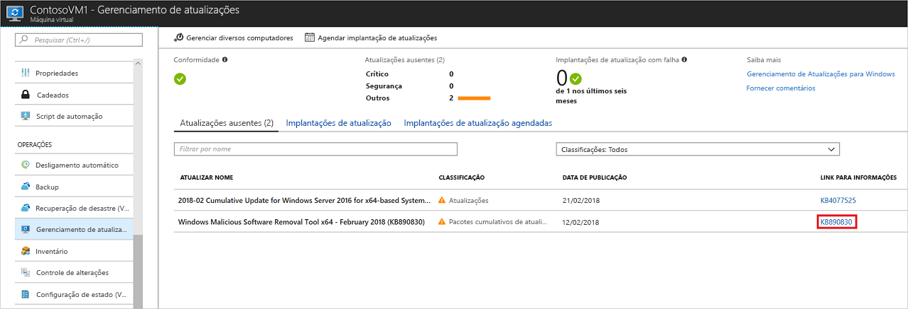
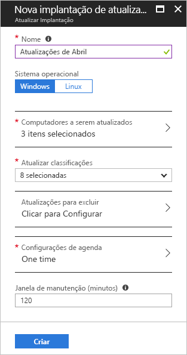
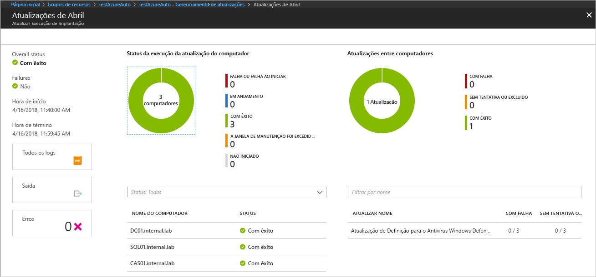

# Gerenciar atualizações do Windows com Automação do Azure

O gerenciamento de atualizações permite que você gerencie atualizações e patches para suas máquinas virtuais.
Neste tutorial, você aprende a avaliar rapidamente o status das atualizações disponíveis, a agendar a instalação das atualizações necessárias e revisar os resultados da implantação para verificar se as atualizações foram aplicadas com sucesso.

Para obter informações sobre preços, consulte [Preços de automação de Gerenciamento de Atualizações](https://azure.microsoft.com/pricing/details/automation/)

Neste tutorial, você aprenderá como:

> [!div class="checklist"]
> * Carregar VM para gerenciamento de atualizações
> * Exibir uma avaliação de atualização
> * Agendar uma implantação de atualização
> * Exibir os resultados de uma implantação

## pré-requisitos

Para concluir este tutorial, você precisará:

* Uma assinatura do Azure. Se você ainda não tiver uma, poderá [ativar os benefícios de assinante do MSDN](https://azure.microsoft.com/pricing/member-offers/msdn-benefits-details/) ou inscrever-se em uma [conta gratuita](https://azure.microsoft.com/free/?WT.mc_id=A261C142F).
* Uma [conta de Automação](automation-offering-get-started.md) para manter os runbooks inspetor e de ação e a tarefa do observador.
* Uma [máquina virtual](../virtual-machines/windows/quick-create-portal.md) a ser carregada.

## Fazer logon no Azure

Faça logon no Portal do Azure em http://portal.azure.com.

## Habilitar Gerenciamento de Atualizações

Primeiro, você precisa habilitar o Gerenciamento de atualizações da VM para este tutorial. Se você já habilitou outra solução de automação para uma VM, esta etapa não é necessária.

1. No menu à esquerda, selecione **Máquinas virtuais** e selecione uma VM na lista
2. No menu à esquerda, na seção **Operações**, clique em **Gerenciamento de atualizações**. A janela **Habilitar Gerenciamento de Atualizações** é exibida.

Uma validação é executada para determinar se o Gerenciamento de Atualizações está habilitado para essa VM.
A validação inclui verificar se há um espaço de trabalho do Log Analytics e uma conta de automação vinculada e se a solução está no espaço de trabalho.

Um espaço de trabalho do [Log Analytics](../log-analytics/log-analytics-overview.md?toc=%2fazure%2fautomation%2ftoc.json) é usado para coletar dados gerados por recursos e serviços, como o Gerenciamento de Atualizações.
O espaço de trabalho fornece um único local para examinar e analisar dados de várias fontes.
Para executar ações adicionais em máquinas virtuais que requerem atualizações, a Automação do Azure permite que você execute runbooks em VMs, como download e aplicação de atualizações.

O processo de validação também verifica se a VM é provisionada com o MMA (Microsoft Monitoring Agent) e o Hybrid Worker.
Esse agente é usado para comunicar-se com a VM e obter informações sobre o status de atualização.
O processo de validação também verifica se a VM é provisionada com o MMA (Microsoft Monitoring Agent) e o Hybrid Runbook Worker da Automação.

Se esses pré-requisitos não forem atendidos, será exibida uma faixa oferecendo a opção para habilitar a solução.

Para habilitar a solução, clique na faixa.
Se algum dos seguintes pré-requisitos estiver ausente após a validação, ele será adicionado automaticamente:

* Espaço de trabalho do [Log Analytics](../log-analytics/log-analytics-overview.md?toc=%2fazure%2fautomation%2ftoc.json)
* [Automação](./automation-offering-get-started.md)
* Uma [Hybrid Runbook Worker](./automation-hybrid-runbook-worker.md) está habilitada na VM

A tela **Gerenciamento de Atualizações** é exibida. Configure o local, o espaço de trabalho de Log analytics e a conta de Automação a serem usados e clique em **Habilitar**. Caso os campos estejam esmaecidos, isso significa que outra solução de automação está habilitada para a VM e o mesmo espaço de trabalho e conta de Automação devem ser usados.

A habilitação da solução pode levar até 15 minutos. Durante esse tempo, não feche a janela do navegador.
Depois que a solução for habilitada, as informações sobre atualizações ausentes na VM fluirão para o Log Analytics.
Pode levar entre 30 minutos e 6 horas para que os dados fiquem disponíveis para análise.

## Exibir avaliação de atualização

Depois que o **Gerenciamento de Atualizações** for habilitado, a tela **Gerenciamento de Atualizações** será exibida.
Se alguma atualização estiver faltando, você verá uma lista de atualizações ausentes na guia **Atualizações ausentes**.

Selecione **INFORMATION LINK** na atualização para abrir o artigo de suporte para atualização em uma nova janela. Aqui você pode saber informações importantes sobre a atualização.

Se você clicar em qualquer lugar na atualização, a janela **Pesquisa de Log** é exibida para a atualização selecionada. A consulta da pesquisa de log é predefinida para essa atualização específica. Modifique ou crie sua própria consulta para exibir informações detalhadas sobre as atualizações implantadas ou ausentes no ambiente.

## Agendar uma implantação de atualização

Agora você sabe que faltam atualizações em sua VM. Para instalar atualizações, agende uma implantação que siga o agendamento de versão e o período de serviço.
Você pode escolher quais tipos de atualização deseja incluir na implantação.
Por exemplo, você pode incluir atualizações críticas ou de segurança e excluir pacotes cumulativos de atualizações.

> [!WARNING]
> Para atualizações que exigem uma reinicialização, a VM é reiniciada automaticamente.

Agende uma nova implantação de atualização para a VM, navegando de volta para **Gerenciamento de Atualizações** e marcando **Agendar implantação de atualização** na parte superior da tela.

Na tela **Nova implantação de atualização**, especifique as seguintes informações:

* **Nome**: forneça um nome exclusivo para a implantação da atualização.
* **Classificação de atualização** – selecione os tipos de software que a implantação de atualização incluiu na implantação. Para este tutorial, deixe todos os tipos selecionados.

  Os tipos de classificação são:

  * Atualizações críticas
  * Atualizações de segurança
  * Pacotes cumulativos de atualização
  * Feature packs
  * Service packs
  * Atualizações de definição
  * Ferramentas
  * Atualizações

* **Configurações de agendamento** – Defina o tempo para 5 minutos no futuro. Você também pode aceitar o padrão, que é 30 minutos após a hora atual.
Você também pode especificar se a implantação ocorre uma única vez ou configurar um agendamento recorrente.
Selecione **Recorrente** e **Recorrência**. Deixe o padrão como 1 dia e clique em **OK**. Isso configura um agendamento recorrente.

* **Janela de manutenção (minutos)** – Deixe esse valor no valor padrão. Especifique o período de tempo em que deseja que a implantação da atualização ocorra. Essa configuração ajuda a garantir que as alterações sejam executadas dentro das janelas de serviço definidas.

Depois de concluir a configuração do agendamento, clique no botão **Criar**. Você é retornado ao painel de status. Selecione **Implantações de atualização agendadas** para mostrar a agenda de implantação que você criou.

## Exibir resultados de uma implantação de atualização

Após o início da implantação agendada, você pode ver o status dessa implantação na guia **Implantações de atualização** na tela **Gerenciamento de Atualizações**.
O status é exibido como **Em andamento** quando está em execução.
Após a conclusão, em caso de êxito, ele será alterado para **Êxito**.
Se houver falha em uma ou mais atualizações na implantação, o status será **Falha Parcial**.
Clique na implantação de atualização concluída para ver o painel dessa implantação de atualização.

No bloco **Resultados da atualização** há um resumo do número total de atualizações e resultados de implantação na VM.
A tabela à direita mostra uma análise detalhada de cada atualização e os resultados da instalação.
A lista a seguir mostra os valores disponíveis:

* **Não foi tentada** – a atualização não foi instalada devido a tempo suficiente disponível com base na duração da janela de manutenção definida.
* **Êxito** – a atualização foi bem-sucedida
* **Falha** – Falha na atualização

Clique em **Todos os logs** para ver todas as entradas de log que a implantação criou.

Clique no bloco **Saída** para ver o fluxo de trabalho do runbook responsável por gerenciar a implantação de atualização na VM de destino.

Clique em **Erros** para ver informações detalhadas sobre os erros da implantação.

## Próximas etapas

Neste tutorial, você aprendeu como:

> [!div class="checklist"]
> * Carregar VM para gerenciamento de atualizações
> * Exibir uma avaliação de atualização
> * Agendar uma implantação de atualização
> * Exibir os resultados de uma implantação

Prossiga para a visão geral da solução de Gerenciamento de Atualizações.

> [!div class="nextstepaction"]
> [Solução Gerenciamento de Atualizações](../operations-management-suite/oms-solution-update-management.md?toc=%2fazure%2fautomation%2ftoc.json)