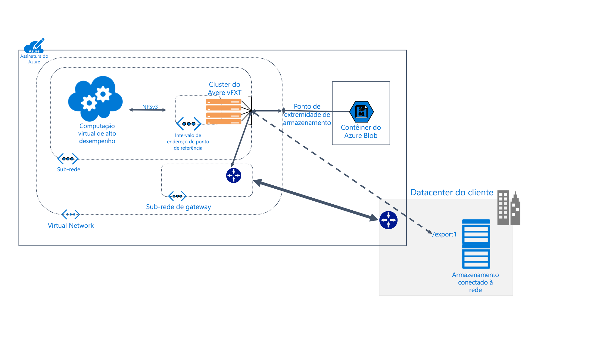

# O que é o Avere vFXT para Azure? 

O Avere vFXT para o Azure é um solução de cache de sistema de arquivos para tarefas de HPC (computação de alto desempenho) com muitos dados. Ele permite que você tire proveito da escalabilidade da computação em nuvem para disponibilizar os dados quando e onde forem necessários, até mesmo dados armazenados em seu próprio hardware local.

O Avere vFXT dá suporte a estes cenários comuns de computação: 

* Arquitetura de nuvem híbrida: o Avere vFXT para Azure pode trabalhar com um sistema de armazenamento de hardware, que oferece o benefício da computação em nuvem sem precisar mover arquivos. 
* Intermitência de nuvem: o Avere vFXT para Azure pode ajudá-lo a mover seus dados para a nuvem para um único projeto, ou "preparar e mover" todo o fluxo de trabalho permanentemente. 

O Avere vFXT para Azure é mais adequado para estas situações: 

* Operações de leitura intensa para cargas de trabalho de HPC
* Aplicativos que usam o protocolo NFS comum
* Farms de computação com 1.000 a 40.000 núcleos de CPU
* Integração com o NAS de hardware local, o Armazenamento de Blobs do Azure ou ambos

Para obter mais informações, visite <https://azure.microsoft.com/services/storage/avere-vfxt/>

## Quem usa o Avere vFXT para Azure? 

O Avere vFXT pode ajudar em todos os tipos de tarefas de computação de leitura intensa:

### Renderização de efeitos visuais 

Em mídia e entretenimento, o cluster do Avere vFXT pode acelerar o acesso a dados em projetos de renderização com limitações de tempo. Como você pode adicionar mais espaço de cache e mais nós de computação no Azure, tem a flexibilidade de lidar com projetos grandes eficientemente. 

### Ciências da vida 

O Avere vFXT pode permitir que os pesquisadores executem seus fluxos de trabalho de análise secundária na Computação do Azure e acessem dados de genoma independentemente de sua localização.

Na pesquisa farmacêutica, clusters do Avere vFXT podem ser usados para agilizar a descoberta de medicamentos, ajudando os pesquisadores prever as interações entre o medicamento e os usuários e analisar dados de pesquisa.

### Análise de serviços financeiros

Um cluster do Avere vFXT pode ajudar a acelerar cálculos de análise quantitativa, o que fornece às empresas de serviços financeiros informações melhores para a tomada de decisões estratégicas. 

## Recursos e especificações

O sistema Avere vFXT é composto por três ou mais nós arquivistas de borda, configurados em um cluster. Ele pode estar situado perto dos computadores cliente, o que monta o cluster em vez de montar o armazenamento diretamente. 

O cluster do Avere vFXT armazena arquivos em cache conforme vai recebendo solicitações. Solicitações repetidas podem ser recuperadas do cache mais de 80% das vezes.

### Compatibilidade 

* Compatível com sistemas NAS de hardware do NetApp ou do Dell EMC Isilon
* Compatível com Blobs do Azure
* Usa o protocolo NFS V3 ou SMB2

O Avere vFXT usa os seguintes recursos do Azure: 

|Componente do Azure|   |
|----------|-----------|
|Máquinas virtuais|Três ou mais D16s_v3 ou E32s_v3|
|Armazenamento SSD Premium|Espaço do sistema operacional de 200 GB, além de 1 a 4 TB de espaço do cache por nó |
|Conta de armazenamento (opcional) |v2|
|Armazenamento de back-end de dados (opcional) | Um contêiner de blobs de LRS vazio |

## Próximas etapas

Aqui estão alguns links para começar a criar sua própria implantação do Avere vFXT. 

* [Planejando seu sistema](avere-vfxt-deploy-plan.md)
* [Visão geral da implantação](avere-vfxt-deploy-overview.md)
* [Criar o vFXT](avere-vfxt-deploy.md)
