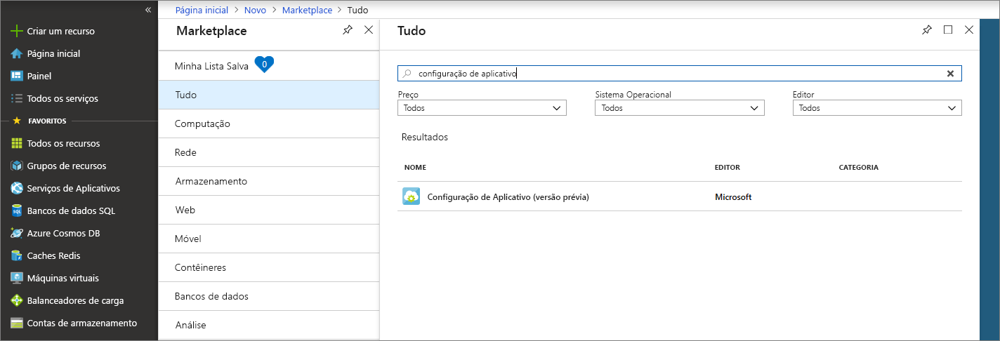
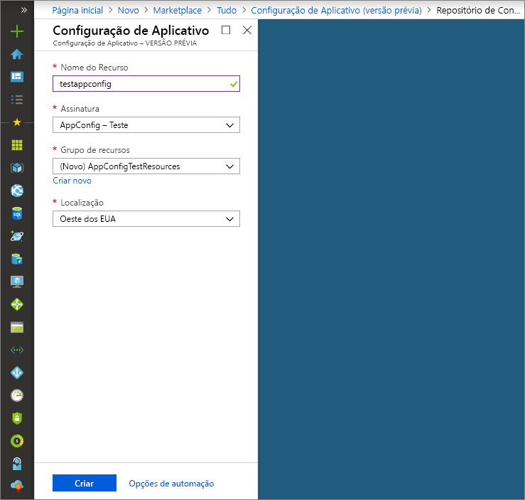

# <a name="quickstart-create-a-java-spring-app-with-app-configuration"></a>Início Rápido: Criar um aplicativo Java Spring com a Configuração de Aplicativo

A Configuração de Aplicativo do Azure é um serviço de configuração gerenciada no Azure. É possível utilizá-lo para armazenar e gerenciar facilmente todas as configurações de aplicativo em um local separado do código. Este Início Rápido mostra como incorporar o serviço em um aplicativo Java Spring.

Você pode usar qualquer editor de código para executar as etapas deste início rápido. O [Visual Studio Code](https://code.visualstudio.com/) é uma excelente opção disponível nas plataformas Windows, macOS e Linux.

## <a name="prerequisites"></a>Pré-requisitos

Para realizar este início rápido, instale um [JDK (Java Development Kit)](https://aka.ms/azure-jdks) com a versão 8 e [Apache Maven](https://maven.apache.org/) com a versão 3.0 ou superior.

[!INCLUDE [quickstarts-free-trial-note](../../includes/quickstarts-free-trial-note.md)]

## <a name="create-an-app-configuration-store"></a>Criar um repositório de configurações de aplicativo

1. Para criar um novo repositório de configurações de aplicativo, entre no [portal do Azure](https://aka.ms/azconfig/portal). No canto superior esquerdo da página, selecione **+ Criar um recurso**. Na caixa **Pesquisar no Marketplace**, insira **Configuração de Aplicativo** e pressione Enter.

    

2. Selecione **Configuração de Aplicativo** nos resultados da pesquisa e, em seguida, selecione **Criar**.

3. Na página **Configuração de Aplicativo** > **Criar**, insira as configurações a seguir.

    | Configuração | Valor sugerido | DESCRIÇÃO |
    |---|---|---|
    | **Nome do recurso** | Nome globalmente exclusivo | Insira um nome exclusivo do recurso a ser usado para o recurso do repositório de configurações de aplicativo. O nome deve ser uma cadeia de caracteres com 1 a 63 caracteres e deve conter somente números, letras e o caractere `-`. O nome não pode iniciar ou terminar com o caractere `-` e caracteres `-` consecutivos não são válidos.  |
    | **Assinatura** | Sua assinatura | Selecione a assinatura do Azure que deseja usar para testar a Configuração de Aplicativo. Se a conta tiver apenas uma assinatura, ela será selecionada automaticamente e a lista suspensa **Assinatura** não será exibida. |
    | **Grupo de recursos** | *AppConfigTestResources* | Selecione ou crie um grupo de recursos para o recurso do repositório de configurações de aplicativo. Esse grupo é útil para organizar vários recursos que você pode querer excluir ao mesmo tempo, excluindo o grupo de recursos. Para saber mais, veja [Usar os grupos de recursos para gerenciar seus recursos do Azure](https://docs.microsoft.com/azure/azure-resource-manager/resource-group-overview). |
    | **Local padrão** | *Centro dos EUA* | Use **Local** para especificar a localização geográfica em que o recurso do SignalR está hospedado. Para obter o melhor desempenho, crie o recurso na mesma região que outros componentes do aplicativo. |

    

4. Selecione **Criar**. A implantação pode levar alguns minutos para ser concluída.

5. Após a conclusão da implantação, selecione **Configurações** > **Chaves de acesso**. Anote a cadeia de conexão de chave de leitura/gravação primária ou somente leitura primária. Você usará essa cadeia de conexão posteriormente para configurar o aplicativo a comunicar-se com o repositório de configurações do aplicativo que você criou.

6. Selecione **Explorador de Chave/Valor** > **+ Criar** para adicionar os pares chave-valor a seguir:

    | Chave | Valor |
    |---|---|
    | /application/config.message | Olá |

    Deixe **Rótulo** e **Tipo de Conteúdo** vazios por enquanto.

## <a name="create-a-spring-boot-app"></a>Criar um aplicativo Spring Boot

Você usa o [Spring Initializr](https://start.spring.io/) para criar um novo projeto Spring Boot.

1. Navegue até <https://start.spring.io/>.

2. Especifique as seguintes opções:

   * Gere um projeto **Maven** com **Java**.
   * Especifique uma versão do **Spring Boot** igual ou maior que 2.0.
   * Especifique os nomes de **Grupo** e **Artefato** do aplicativo.
   * Adicione a dependência da **Web**.

3. Após especificar as opções anteriores, selecione **Gerar Projeto**. Quando solicitado, baixe o projeto para um caminho no computador local.

## <a name="connect-to-an-app-configuration-store"></a>Conectar um repositório de configurações de aplicativo

1. Após extrair os arquivos no sistema local, o aplicativo Spring Boot simples estará pronto para edição. Localize o arquivo *pom.xml* no diretório raiz do aplicativo.

2. Abra o arquivo *pom.xml* em um editor de texto e adicione o iniciador da Configuração do Azure do Spring Cloud à lista de `<dependencies>`:

    ```xml
    <dependency>
        <groupId>com.microsoft.azure</groupId>
        <artifactId>spring-cloud-starter-azure-appconfiguration-config</artifactId>
        <version>1.1.0.M3</version>
    </dependency>
    ```

3. Crie um arquivo Java chamado *MessageProperties.java* no diretório do pacote do aplicativo. Adicione as linhas a seguir:

    ```java
    @ConfigurationProperties(prefix = "config")
    public class MessageProperties {
        private String message;

        public String getMessage() {
            return message;
        }

        public void setMessage(String message) {
            this.message = message;
        }
    }
    ```

4. Crie um arquivo Java chamado *HelloController.java* no diretório do pacote do aplicativo. Adicione as linhas a seguir:

    ```java
    @RestController
    public class HelloController {
        private final MessageProperties properties;

        public HelloController(MessageProperties properties) {
            this.properties = properties;
        }

        @GetMapping
        public String getMessage() {
            return "Message: " + properties.getMessage();
        }
    }
    ```

5. Abra o arquivo Java do aplicativo principal e adicione `@EnableConfigurationProperties` para habilitar esse recurso.

    ```java
    @SpringBootApplication
    @EnableConfigurationProperties(MessageProperties.class)
    public class AzureConfigApplication {
        public static void main(String[] args) {
            SpringApplication.run(AzureConfigApplication.class, args);
        }
    }
    ```

6. Crie um novo arquivo nomeado `bootstrap.properties` no diretório de recursos do aplicativo e adicione as seguintes linhas ao arquivo. Substitua os valores de exemplo pelas propriedades apropriadas para o armazenamento de configuração do aplicativo.

    ```properties
    spring.cloud.azure.appconfiguration.stores[0].connection-string=[your-connection-string]
    ```

## <a name="build-and-run-the-app-locally"></a>Compilar e executar o aplicativo localmente

1. Compile o aplicativo Spring Boot com Maven e execute-o, por exemplo:

    ```shell
    mvn clean package
    mvn spring-boot:run
    ```
2. Depois que o aplicativo estiver em execução, use *curl* para testar o aplicativo, por exemplo:

      ```shell
      curl -X GET http://localhost:8080/
      ```
    Você verá a mensagem inserida no repositório de configurações de aplicativo.

## <a name="clean-up-resources"></a>Limpar recursos

[!INCLUDE [azure-app-configuration-cleanup](../../includes/azure-app-configuration-cleanup.md)]

## <a name="next-steps"></a>Próximas etapas

Neste início rápido, você criou um novo repositório de configurações de aplicativo e utilizou com um aplicativo Java Spring. Para obter mais informações, consulte [Spring no Azure](https://docs.microsoft.com/java/azure/spring-framework/).

Para saber mais sobre como usar a Configuração de Aplicativo, vá para o próximo tutorial que demonstra a autenticação.

> [!div class="nextstepaction"]
> [Identidades gerenciadas para a integração de recursos do Azure](./integrate-azure-managed-service-identity.md)
