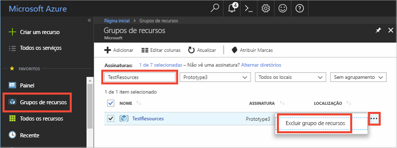

# <a name="quickstart-use-azure-cache-for-redis-with-a-net-core-app"></a>Início Rápido: Usar o Cache do Azure para Redis com um aplicativo .NET Core


Este início rápido mostra como começar a usar o Cache do Microsoft Azure para Redis com .NET Core. O Cache do Microsoft Azure para Redis baseia-se no popular Cache do Azure para Redis de software livre. Ele fornece acesso a um Cache do Azure para Redis seguro e dedicado, gerenciado pela Microsoft. Um cache criado usando o Cache do Azure para Redis é acessível de qualquer aplicativo do Microsoft Azure.

Neste guia de início rápido, você usará o cliente [StackExchange.Redis](https://github.com/StackExchange/StackExchange.Redis) com o código C\# em um aplicativo de console .NET Core. Você irá criar um cache e configurar o aplicativo de cliente .NET Core. Em seguida, você adicionará e atualizará objetos no cache. 

Você pode usar qualquer editor de código para concluir as etapas deste início rápido. No entanto, o [Visual Studio Code](https://code.visualstudio.com/) é uma opção excelente nas plataformas Windows, macOS e Linux.


[!INCLUDE [quickstarts-free-trial-note](../../includes/quickstarts-free-trial-note.md)]

## <a name="prerequisites"></a>Pré-requisitos

* [.NET SDK 2.0](https://www.microsoft.com/net/learn/get-started/windows) ou posterior.
* O cliente StackExchange.Redis requer o [.NET Framework 4 ou posterior](https://www.microsoft.com/net/download/dotnet-framework-runtime).

## <a name="create-a-cache"></a>Criar um cache
[!INCLUDE [redis-cache-create](../../includes/redis-cache-create.md)]

[!INCLUDE [redis-cache-access-keys](../../includes/redis-cache-access-keys.md)]

Anote o **NOME DE HOST** e a chave de acesso **primária**. Você usará esses valores posteriormente para construir o segredo *CacheConnection*.


## <a name="create-a-console-app"></a>Criar um aplicativo de console

Abra uma nova janela de comando e execute o seguinte comando para criar um novo aplicativo de console .NET Core:

```
dotnet new console -o Redistest
```

Na janela de comando, altere para o novo diretório do projeto *Redistest*.


## <a name="add-secret-manager-to-the-project"></a>Adicionar o Gerenciador de Segredos ao projeto

Nesta seção, você adicionará a [ferramenta Gerenciador de Segredos](https://docs.microsoft.com/aspnet/core/security/app-secrets) ao seu projeto. A ferramenta Gerenciador de Segredos armazena dados confidenciais para o trabalho de desenvolvimento fora da árvore do seu projeto. Essa abordagem ajuda a impedir o compartilhamento acidental de segredos do aplicativo no código-fonte.

Abra o arquivo *Redistest.csproj*. Adicione um elemento `DotNetCliToolReference` para incluir *Microsoft.Extensions.SecretManager.Tools*. Adicione também um elemento `UserSecretsId`, conforme mostrado abaixo e salve o arquivo.

```xml
<Project Sdk="Microsoft.NET.Sdk">

  <PropertyGroup>
    <OutputType>Exe</OutputType>
    <TargetFramework>netcoreapp2.0</TargetFramework>
    <UserSecretsId>Redistest</UserSecretsId>
  </PropertyGroup>
  <ItemGroup>
    <DotNetCliToolReference Include="Microsoft.Extensions.SecretManager.Tools" Version="2.0.0" />
  </ItemGroup>
</Project>
```

Execute o seguinte comando para adicionar o pacote *Microsoft.Extensions.Configuration.UserSecrets* ao projeto:

```
dotnet add package Microsoft.Extensions.Configuration.UserSecrets
```

Execute o seguinte comando para restaurar seus pacotes:

```
dotnet restore
```

Na janela de comando, execute o seguinte comando para armazenar um novo segredo denominado *CacheConnection*, depois de substituir os espaços reservados (incluindo colchetes) para o nome do cache e a chave de acesso primária:

```
dotnet user-secrets set CacheConnection "<cache name>.redis.cache.windows.net,abortConnect=false,ssl=true,password=<primary-access-key>"
```

Adicione a seguinte instrução `using` a *Program.cs*:

```csharp
using Microsoft.Extensions.Configuration;
```

Adicione os seguintes membros à classe `Program` em *Program.cs*. Esse código inicializa uma configuração para acessar o segredo do usuário para a cadeia de conexão de Cache do Azure para Redis.

```csharp
        private static IConfigurationRoot Configuration { get; set; }
        const string SecretName = "CacheConnection";

        private static void InitializeConfiguration()
        {
            var builder = new ConfigurationBuilder()
                .AddUserSecrets<Program>();

            Configuration = builder.Build();
        }
```

## <a name="configure-the-cache-client"></a>Configurar o cliente de cache

Nesta seção, você irá configurar o aplicativo de console para usar o ciente [StackExchange.Redis](https://github.com/StackExchange/StackExchange.Redis) para .NET.

Na janela de comando, execute o seguinte comando no diretório do projeto *Redistest*:

```
dotnet add package StackExchange.Redis
```

Depois que a instalação for concluída, o cliente de cache *StackExchange.Redis* está disponível para uso com o seu projeto.


## <a name="connect-to-the-cache"></a>Conectar-se ao cache

Adicione a seguinte instrução `using` a *Program.cs*:

```csharp
using StackExchange.Redis;
```

A conexão com o Cache do Azure para Redis é gerenciada pela classe `ConnectionMultiplexer`. Essa classe deve ser compartilhada e reutilizada em todo o seu aplicativo cliente. Não crie uma nova conexão para cada operação. 

Em *Program.cs*, adicione os seguintes membros à classe `Program` do seu aplicativo de console:

```csharp
        private static Lazy<ConnectionMultiplexer> lazyConnection = new Lazy<ConnectionMultiplexer>(() =>
        {
            string cacheConnection = Configuration[SecretName];
            return ConnectionMultiplexer.Connect(cacheConnection);
        });

        public static ConnectionMultiplexer Connection
        {
            get
            {
                return lazyConnection.Value;
            }
        }
```

Uma abordagem para compartilhar uma instância do `ConnectionMultiplexer` em seu aplicativo usa uma propriedade estática que retorna uma instância conectada. O código oferece uma maneira segura ao thread de inicializar somente uma única instância conectada do `ConnectionMultiplexer`. `abortConnect` é definido como false, o que significa que a chamada é bem-sucedida mesmo que não seja possível estabelecer uma conexão com o Cache do Azure para Redis. Um recurso chave do `ConnectionMultiplexer` é que ele restaura automaticamente a conectividade com o cache assim que o problema de rede ou outras causas sejam resolvidos.

O valor do segredo *CacheConnection* é acessado usando o provedor de configuração do Gerenciador de Segredos e usado como o parâmetro de senha.

## <a name="executing-cache-commands"></a>Executar comandos de cache

No *Program.cs*, adicione o seguinte código para o procedimento `Main` com a classe `Program` para seu aplicativo de console:

```csharp
        static void Main(string[] args)
        {
            InitializeConfiguration();

            // Connection refers to a property that returns a ConnectionMultiplexer
            // as shown in the previous example.
            IDatabase cache = lazyConnection.Value.GetDatabase();

            // Perform cache operations using the cache object...

            // Simple PING command
            string cacheCommand = "PING";
            Console.WriteLine("\nCache command  : " + cacheCommand);
            Console.WriteLine("Cache response : " + cache.Execute(cacheCommand).ToString());

            // Simple get and put of integral data types into the cache
            cacheCommand = "GET Message";
            Console.WriteLine("\nCache command  : " + cacheCommand + " or StringGet()");
            Console.WriteLine("Cache response : " + cache.StringGet("Message").ToString());

            cacheCommand = "SET Message \"Hello! The cache is working from a .NET Core console app!\"";
            Console.WriteLine("\nCache command  : " + cacheCommand + " or StringSet()");
            Console.WriteLine("Cache response : " + cache.StringSet("Message", "Hello! The cache is working from a .NET Core console app!").ToString());

            // Demonstrate "SET Message" executed as expected...
            cacheCommand = "GET Message";
            Console.WriteLine("\nCache command  : " + cacheCommand + " or StringGet()");
            Console.WriteLine("Cache response : " + cache.StringGet("Message").ToString());

            // Get the client list, useful to see if connection list is growing...
            cacheCommand = "CLIENT LIST";
            Console.WriteLine("\nCache command  : " + cacheCommand);
            Console.WriteLine("Cache response : \n" + cache.Execute("CLIENT", "LIST").ToString().Replace("id=", "id="));

            lazyConnection.Value.Dispose();
        }
```

Salve o *Program.cs*.

O Cache Redis do Azure tem um número configurável de bancos de dados (padrão de 16) que podem ser usados para separar logicamente os dados em um Cache Redis do Azure. O código se conecta ao banco de dados padrão, DB 0. Para saber mais, veja [O que são os bancos de dados do Redis?](cache-faq.md#what-are-redis-databases) e [Configuração padrão do servidor Redis](cache-configure.md#default-redis-server-configuration).

Os itens de cache podem ser armazenados e recuperados usando os métodos `StringSet` e `StringGet`.

O Redis armazena mais dados como cadeias de caracteres Redis, mas essas cadeias de caracteres podem conter muitos tipos de dados, incluindo dados binários serializados, que podem ser usados ao armazenar objetos .NET no cache.

Execute o seguinte comando na janela de comando para compilar o aplicativo:

```
dotnet build
```

Em seguida, execute o aplicativo com o seguinte comando:

```
dotnet run
```

No exemplo abaixo, você pode ver que a chave `Message` já tinha um valor armazenado em cache, que foi definido por meio do Console do Redis no portal do Azure. O aplicativo atualizou esse valor armazenado em cache. O aplicativo também executou os comandos `PING` e `CLIENT LIST`.


## <a name="work-with-net-objects-in-the-cache"></a>Trabalhar com objetos .NET no cache

O Cache do Azure para Redis pode armazenar objetos .NET e tipos de dados primitivos em cache, mas antes que um objeto .NET seja armazenado em cache, ele deve ser serializado. Essa serialização de objetos .NET é de responsabilidade do desenvolvedor do aplicativo e proporciona ao desenvolvedor a flexibilidade na escolha do serializador.

Uma maneira simples de serializar objetos é usar os métodos de serialização do `JsonConvert` no [Newtonsoft.Json](https://www.nuget.org/packages/Newtonsoft.Json/) e serializar para e do JSON. Nesta seção, você adicionará um objeto .NET ao cache.

Execute o seguinte comando para adicionar o pacote *Newtonsoft.json* ao aplicativo:

```
dotnet add package Newtonsoft.json
```

Adicione a seguinte instrução `using` à parte superior do *Program.cs*:

```csharp
using Newtonsoft.Json;
```

Adicione a seguinte definição de classe `Employee` ao *Program.cs*:

```csharp
        class Employee
        {
            public string Id { get; set; }
            public string Name { get; set; }
            public int Age { get; set; }

            public Employee(string EmployeeId, string Name, int Age)
            {
                this.Id = EmployeeId;
                this.Name = Name;
                this.Age = Age;
            }
        }
```

Na parte inferior do procedimento `Main()` no *Program.cs* e antes da chamada para `Dispose()`, adicione as seguintes linhas de código para o cache e recupere um objeto serializado do .NET:

```csharp
            // Store .NET object to cache
            Employee e007 = new Employee("007", "Davide Columbo", 100);
            Console.WriteLine("Cache response from storing Employee .NET object : " + 
                cache.StringSet("e007", JsonConvert.SerializeObject(e007)));

            // Retrieve .NET object from cache
            Employee e007FromCache = JsonConvert.DeserializeObject<Employee>(cache.StringGet("e007"));
            Console.WriteLine("Deserialized Employee .NET object :\n");
            Console.WriteLine("\tEmployee.Name : " + e007FromCache.Name);
            Console.WriteLine("\tEmployee.Id   : " + e007FromCache.Id);
            Console.WriteLine("\tEmployee.Age  : " + e007FromCache.Age + "\n");
```

Salve *Program.cs* e recompile o aplicativo com o seguinte comando:

```
dotnet build
```

Execute o aplicativo com o seguinte comando para testar a serialização de objetos do .NET:

```
dotnet run
```


## <a name="clean-up-resources"></a>Limpar recursos

Se você pretende continuar para o próximo tutorial, mantenha os recursos criados neste início rápido e reutilize-os.

Caso contrário, se você não for mais usar o aplicativo de exemplo do início rápido, exclua os recursos do Azure criados neste início rápido para evitar encargos. 

> [!IMPORTANT]
> A exclusão de um grupo de recursos é irreversível, e o grupo de recursos e todos os recursos contidos nele são excluídos permanentemente. Não exclua acidentalmente o grupo de recursos ou os recursos incorretos. Se tiver criado os recursos para hospedar este exemplo dentro de um grupo de recursos existente que contém recursos que você quer manter, exclua cada recurso individualmente de suas respectivas folhas, em vez de excluir o grupo de recursos.
>

Entre no [portal do Azure](https://portal.azure.com) e clique em **Grupos de recursos**.

Na caixa de texto **Filtrar por nome...**, digite o nome do seu grupo de recursos. As instruções deste artigo usaram um grupo de recursos chamado *TestResources*. Em seu grupo de recursos, na lista de resultados, clique em **...**, depois em **Excluir grupo de recursos**.



Você receberá uma solicitação para confirmar a exclusão do grupo de recursos. Digite o nome do grupo de recursos para confirmar e clique em **Excluir**.

Após alguns instantes, o grupo de recursos, e todos os recursos contidos nele, serão excluídos.


<a name="next-steps"></a>

## <a name="next-steps"></a>Próximas etapas

Neste guia de início rápido, você aprendeu a usar o Cache do Azure para Redis de um aplicativo .NET Core. Continue para o próximo início rápido usar o Cache do Azure para Redis com um aplicativo Web ASP.NET.

> [!div class="nextstepaction"]
> [Crie um aplicativo Web ASP.NET que usa um Cache do Azure para Redis.](./cache-web-app-howto.md)


