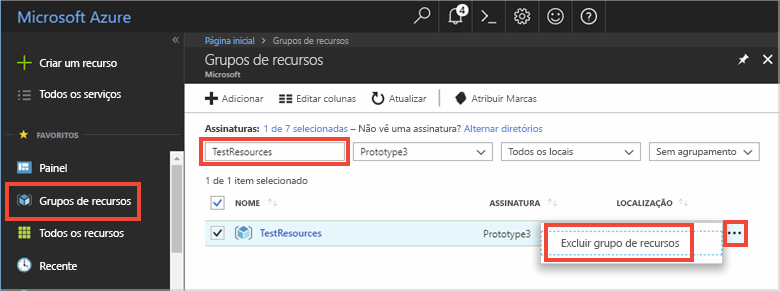

# <a name="quickstart-how-to-use-azure-cache-for-redis-with-java"></a>Início Rápido: Como usar o Cache do Azure para Redis com Java


O Cache do Azure para Redis fornece acesso a um Cache do Azure para Redis dedicado gerenciado pela Microsoft. O cache é acessível por meio de qualquer aplicativo no Microsoft Azure.

Este artigo mostra como começar a usar o Cache do Azure para Redis usando o cliente [Jedis](https://github.com/xetorthio/jedis) do Redis para Java.


Você pode usar qualquer editor de código para concluir as etapas deste início rápido. No entanto, o [Visual Studio Code](https://code.visualstudio.com/) é uma opção excelente nas plataformas Windows, macOS e Linux.

[!INCLUDE [quickstarts-free-trial-note](../../includes/quickstarts-free-trial-note.md)]


## <a name="prerequisites"></a>Pré-requisitos

[Apache Maven](http://maven.apache.org/)


## <a name="create-an-azure-cache-for-redis"></a>Criar um Cache do Azure para Redis

[!INCLUDE [redis-cache-create](../../includes/redis-cache-create.md)]

[!INCLUDE [redis-cache-access-keys](../../includes/redis-cache-access-keys.md)]

Adicionar variáveis de ambiente para o seu **NOME DO HOST** e a chave de acesso **Primária**. Você usará essas variáveis no seu código em vez de incluir as informações confidenciais diretamente no seu código.

```
set REDISCACHEHOSTNAME=contosoCache.redis.cache.windows.net
set REDISCACHEKEY=XXXXXXXXXXXXXXXXXXXXXXXXXXXXXXXXXXXXXXXXXXXX
```

## <a name="create-a-new-java-app"></a>Criar um novo aplicativo Java

Usando o Maven, gere um novo aplicativo de início rápido:

```
mvn archetype:generate -DarchetypeGroupId=org.apache.maven.archetypes -DarchetypeArtifactId=maven-archetype-quickstart -DarchetypeVersion=1.3 -DgroupId=example.demo -DartifactId=redistest -Dversion=1.0
```

Altere para o novo diretório do projeto *redistest*.

Abra o arquivo *pom.xml* e adicione uma dependência para [Jedis](https://github.com/xetorthio/jedis):

```xml
    <dependency>
        <groupId>redis.clients</groupId>
        <artifactId>jedis</artifactId>
        <version>2.9.0</version>
        <type>jar</type>
        <scope>compile</scope>
    </dependency>
```

Salve o arquivo *pom.xml* .

Abra *App.java* e substitua o código pelo código a seguir:

```java
package example.demo;

import redis.clients.jedis.Jedis;
import redis.clients.jedis.JedisShardInfo;

/**
 * Redis test
 *
 */
public class App 
{
    public static void main( String[] args )
    {

        boolean useSsl = true;
        String cacheHostname = System.getenv("REDISCACHEHOSTNAME");
        String cachekey = System.getenv("REDISCACHEKEY");

        // Connect to the Azure Cache for Redis over the SSL port using the key.
        JedisShardInfo shardInfo = new JedisShardInfo(cacheHostname, 6380, useSsl);
        shardInfo.setPassword(cachekey); /* Use your access key. */
        Jedis jedis = new Jedis(shardInfo);      

        // Perform cache operations using the cache connection object...

        // Simple PING command        
        System.out.println( "\nCache Command  : Ping" );
        System.out.println( "Cache Response : " + jedis.ping());

        // Simple get and put of integral data types into the cache
        System.out.println( "\nCache Command  : GET Message" );
        System.out.println( "Cache Response : " + jedis.get("Message"));

        System.out.println( "\nCache Command  : SET Message" );
        System.out.println( "Cache Response : " + jedis.set("Message", "Hello! The cache is working from Java!"));

        // Demostrate "SET Message" executed as expected...
        System.out.println( "\nCache Command  : GET Message" );
        System.out.println( "Cache Response : " + jedis.get("Message"));

        // Get the client list, useful to see if connection list is growing...
        System.out.println( "\nCache Command  : CLIENT LIST" );
        System.out.println( "Cache Response : " + jedis.clientList());

        jedis.close();
    }
}
```

Este código mostra como se conectar a uma instância do Cache do Azure para Redis usando o nome de host de cache e as principais variáveis de ambiente. O código também armazena e recupera um valor de cadeia de caracteres no cache. Os comandos `PING` e `CLIENT LIST` também são executados. 

Salve *App.java*.

## <a name="build-and-run-the-app"></a>Compilar e executar o aplicativo

Execute o seguinte comando do Maven para compilar e executar o aplicativo:

```
mvn compile
mvn exec:java -D exec.mainClass=example.demo.App
```

No exemplo abaixo, você pode ver que a chave `Message` já tinha um valor armazenado em cache, que foi definido por meio do Console do Redis no portal do Azure. O aplicativo atualizou esse valor armazenado em cache. O aplicativo também executou os comandos `PING` e `CLIENT LIST`.


## <a name="clean-up-resources"></a>Limpar recursos

Se você pretende continuar para o próximo tutorial, mantenha os recursos criados neste início rápido e reutilize-os.

Caso contrário, se você não for mais usar o aplicativo de exemplo do início rápido, exclua os recursos do Azure criados neste início rápido para evitar encargos. 

> [!IMPORTANT]
> A exclusão de um grupo de recursos é irreversível, e o grupo de recursos e todos os recursos contidos nele são excluídos permanentemente. Não exclua acidentalmente o grupo de recursos ou os recursos incorretos. Se tiver criado os recursos para hospedar este exemplo dentro de um grupo de recursos existente que contém recursos que você quer manter, exclua cada recurso individualmente de suas respectivas folhas, em vez de excluir o grupo de recursos.
>

Entre no [portal do Azure](https://portal.azure.com) e clique em **Grupos de recursos**.

Na caixa de texto **Filtrar por nome...**, digite o nome do seu grupo de recursos. As instruções deste artigo usaram um grupo de recursos chamado *TestResources*. Em seu grupo de recursos, na lista de resultados, clique em **...**, depois em **Excluir grupo de recursos**.



Você receberá uma solicitação para confirmar a exclusão do grupo de recursos. Digite o nome do grupo de recursos para confirmar e clique em **Excluir**.

Após alguns instantes, o grupo de recursos, e todos os recursos contidos nele, serão excluídos.


## <a name="next-steps"></a>Próximas etapas

Neste guia de início rápido, você aprendeu a usar o Cache do Azure para Redis de um aplicativo Java. Continue para o próximo início rápido usar o Cache do Azure para Redis com um aplicativo Web ASP.NET.

> [!div class="nextstepaction"]
> [Crie um aplicativo Web ASP.NET que usa um Cache do Azure para Redis.](./cache-web-app-howto.md)


