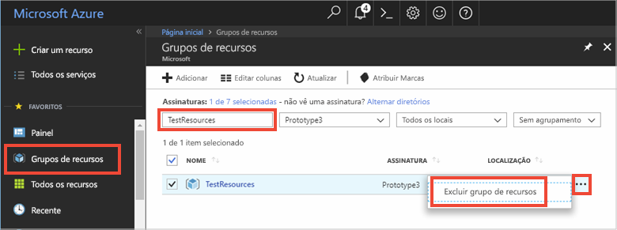

# <a name="quickstart-how-to-use-azure-cache-for-redis-with-nodejs"></a>Início Rápido: Como usar o Cache do Azure para Redis com Node.js


O Cache do Azure para Redis fornece acesso a um Cache do Azure para Redis seguro e dedicado gerenciado pela Microsoft. O cache é acessível por meio de qualquer aplicativo no Microsoft Azure.

Este tópico mostra uma introdução ao Cache do Azure para Redis usando Node.js. 

Você pode usar qualquer editor de código para concluir as etapas deste início rápido. No entanto, o [Visual Studio Code](https://code.visualstudio.com/) é uma opção excelente nas plataformas Windows, macOS e Linux.


[!INCLUDE [quickstarts-free-trial-note](../../includes/quickstarts-free-trial-note.md)]


## <a name="prerequisites"></a>Pré-requisitos
Instale o [node_redis](https://github.com/mranney/node_redis):

    npm install redis

Este tutorial usa o [node_redis](https://github.com/mranney/node_redis). Para exemplos de uso de outros clientes do Node.js, veja a documentação individual para os clientes do Node.js listado em [clientes do Redis Node.js](http://redis.io/clients#nodejs).


## <a name="create-a-cache"></a>Criar um cache
[!INCLUDE [redis-cache-create](../../includes/redis-cache-create.md)]

[!INCLUDE [redis-cache-access-keys](../../includes/redis-cache-access-keys.md)]


Adicionar variáveis de ambiente para o seu **NOME DO HOST** e a chave de acesso **Primária**. Você usará essas variáveis no seu código em vez de incluir as informações confidenciais diretamente no seu código.

```
set REDISCACHEHOSTNAME=contosoCache.redis.cache.windows.net
set REDISCACHEKEY=XXXXXXXXXXXXXXXXXXXXXXXXXXXXXXXXXXXXXXXXXXXX
```


## <a name="connect-to-the-cache"></a>Conectar-se ao cache

Os últimos builds do [node_redis](https://github.com/mranney/node_redis) dão suporte para se conectar ao Cache do Azure para Redis usando SSL. O exemplo a seguir mostra como se conectar ao Cache do Azure para Redis usando o ponto de extremidade SSL 6380. 

```js
var redis = require("redis");

// Add your cache name and access key.
var client = redis.createClient(6380, process.env.REDISCACHEHOSTNAME,
    {auth_pass: process.env.REDISCACHEKEY, tls: {servername: process.env.REDISCACHEHOSTNAME}});
```

Não crie novas conexões para cada operação no seu código. Em vez disso, reutilize conexões sempre que possível. 

## <a name="create-a-new-nodejs-app"></a>Criar um novo aplicativo Node.js

Criar um novo arquivo de script chamado *redistest.js*.

Adicione o exemplo JavaScript a seguir ao arquivo. Este código mostra como se conectar a uma instância do Cache do Azure para Redis usando o nome de host de cache e as principais variáveis de ambiente. O código também armazena e recupera um valor de cadeia de caracteres no cache. Os comandos `PING` e `CLIENT LIST` também são executados. Para obter mais exemplos de como usar Redis com o cliente [node_redis](https://github.com/mranney/node_redis), veja [http://redis.js.org/](http://redis.js.org/).

```js
var redis = require("redis");
var bluebird = require("bluebird");

bluebird.promisifyAll(redis.RedisClient.prototype);
bluebird.promisifyAll(redis.Multi.prototype);

async function testCache() {

    // Connect to the Azure Cache for Redis over the SSL port using the key.
    var cacheConnection = redis.createClient(6380, process.env.REDISCACHEHOSTNAME, 
        {auth_pass: process.env.REDISCACHEKEY, tls: {servername: process.env.REDISCACHEHOSTNAME}});
        
    // Perform cache operations using the cache connection object...

    // Simple PING command
    console.log("\nCache command: PING");
    console.log("Cache response : " + await cacheConnection.pingAsync());

    // Simple get and put of integral data types into the cache
    console.log("\nCache command: GET Message");
    console.log("Cache response : " + await cacheConnection.getAsync("Message"));    

    console.log("\nCache command: SET Message");
    console.log("Cache response : " + await cacheConnection.setAsync("Message",
        "Hello! The cache is working from Node.js!"));    

    // Demostrate "SET Message" executed as expected...
    console.log("\nCache command: GET Message");
    console.log("Cache response : " + await cacheConnection.getAsync("Message"));    

    // Get the client list, useful to see if connection list is growing...
    console.log("\nCache command: CLIENT LIST");
    console.log("Cache response : " + await cacheConnection.clientAsync("LIST"));    
}

testCache();
```

Execute o script com Node.js.

```
node redistest.js
```

No exemplo abaixo, você pode ver que a chave `Message` já tinha um valor armazenado em cache, que foi definido por meio do Console do Redis no portal do Azure. O aplicativo atualizou esse valor armazenado em cache. O aplicativo também executou os comandos `PING` e `CLIENT LIST`.


## <a name="clean-up-resources"></a>Limpar recursos

Se você pretende continuar para o próximo tutorial, mantenha os recursos criados neste início rápido e reutilize-os.

Caso contrário, se você não for mais usar o aplicativo de exemplo do início rápido, exclua os recursos do Azure criados neste início rápido para evitar encargos. 

> [!IMPORTANT]
> A exclusão de um grupo de recursos é irreversível, e o grupo de recursos e todos os recursos contidos nele são excluídos permanentemente. Não exclua acidentalmente o grupo de recursos ou os recursos incorretos. Se tiver criado os recursos para hospedar este exemplo dentro de um grupo de recursos existente que contém recursos que você quer manter, exclua cada recurso individualmente de suas respectivas folhas, em vez de excluir o grupo de recursos.
>

Entre no [portal do Azure](https://portal.azure.com) e clique em **Grupos de recursos**.

Na caixa de texto **Filtrar por nome...**, digite o nome do seu grupo de recursos. As instruções deste artigo usaram um grupo de recursos chamado *TestResources*. Em seu grupo de recursos, na lista de resultados, clique em **...**, depois em **Excluir grupo de recursos**.



Você receberá uma solicitação para confirmar a exclusão do grupo de recursos. Digite o nome do grupo de recursos para confirmar e clique em **Excluir**.

Após alguns instantes, o grupo de recursos, e todos os recursos contidos nele, serão excluídos.


## <a name="next-steps"></a>Próximas etapas

Neste guia de início rápido, você aprendeu a usar o Cache do Azure para Redis de um aplicativo Node.js. Continue para o próximo início rápido usar o Cache do Azure para Redis com um aplicativo Web ASP.NET.

> [!div class="nextstepaction"]
> [Crie um aplicativo Web ASP.NET que usa um Cache do Azure para Redis.](./cache-web-app-howto.md)


