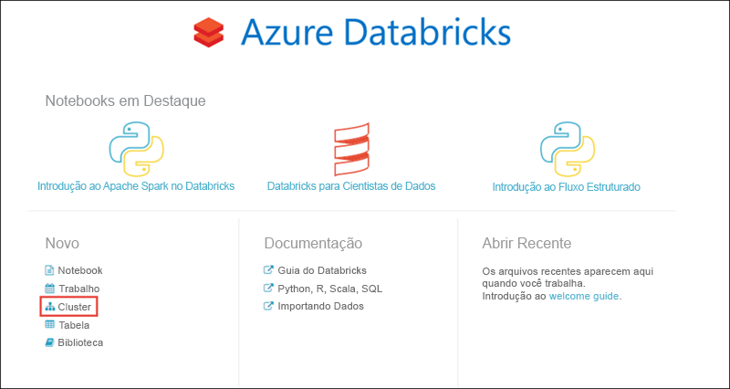

# Tutorial: Extrair, transformar e carregar dados usando o Azure Databricks

Neste tutorial, você executa uma operação de ETL (extração, transformação e carregamento de dados) usando o Azure Databricks. Extraia dados do Azure Data Lake Store no Azure Databricks, execute transformações nos dados no Azure Databricks e carregue os dados transformados no SQL Data Warehouse do Azure.

As etapas neste tutorial usam o conector do SQL Data Warehouse para Azure Databricks a fim de transferir dados para o Azure Databricks. Esse conector, por sua vez, usa o Armazenamento de Blobs do Azure como armazenamento temporário para os dados que estão sendo transferidos entre um cluster do Azure Databricks e o SQL Data Warehouse do Azure.

A ilustração a seguir mostra o fluxo do aplicativo:

Este tutorial cobre as seguintes tarefas:

> [!div class="checklist"]
> * Criar um workspace do Azure Databricks
> * Criar um cluster Spark no Azure Databricks
> * Criar uma conta do Repositório Azure Data Lake
> * Carregar dados no Data Lake Store
> * Criar um bloco de anotações no Azure Databricks
> * Extrair dados do Data Lake Store
> * Transformar dados no Azure Databricks
> * Carregar dados no SQL Data Warehouse do Azure

Se você não tiver uma assinatura do Azure, [crie uma conta gratuita](https://azure.microsoft.com/free/) antes de começar.

## pré-requisitos

Antes de iniciar este tutorial, verifique se você atende aos seguintes requisitos:
- Crie um SQL Data Warehouse do Azure, crie uma regra de firewall no nível do servidor e conecte-se ao servidor como um administrador do servidor. Siga as instruções em [Início Rápido: Criar um SQL Data Warehouse do Azure](../sql-data-warehouse/create-data-warehouse-portal.md)
- Crie uma chave mestra de banco de dados para o SQL Data Warehouse do Azure. Siga as instruções em [Criar uma chave mestra de banco de dados](https://docs.microsoft.com/sql/relational-databases/security/encryption/create-a-database-master-key).
- Crie uma conta do Armazenamento de Blobs do Azure e um contêiner dentro dela. Além disso, recupere a chave de acesso para acessar a conta de armazenamento. Siga as instruções em [Início Rápido: Criar uma conta de Armazenamento de Blobs do Azure](../storage/blobs/storage-quickstart-blobs-portal.md).

## Faça logon no Portal do Azure

Faça logon no [Portal do Azure](https://portal.azure.com/).

## Criar um workspace do Azure Databricks

Nesta seção, você deve cria um workspace do Azure Databricks usando o Portal do Azure.

1. No Portal do Azure, selecione **Criar um recurso** > **Dados + Análise** > **Azure Databricks**.

    

3. Em **Serviço do Azure Databricks**, forneça os valores para criar um workspace do Databricks.

    

    Forneça os seguintes valores:
    
    |Propriedade  |DESCRIÇÃO  |
    |---------|---------|
    |**Nome do workspace**     | Forneça um nome para seu workspace do Databricks        |
    |**Assinatura**     | Na lista suspensa, selecione sua assinatura do Azure.        |
    |**Grupo de recursos**     | Especifique se deseja criar um novo grupo de recursos ou usar um existente. Um grupo de recursos é um contêiner que mantém os recursos relacionados a uma solução do Azure. Para obter mais informações, consulte [Visão geral do Grupo de Recursos do Azure](../azure-resource-manager/resource-group-overview.md). |
    |**Localidade**     | Selecione **Leste dos EUA 2**. Para outras regiões disponíveis, consulte [serviços do Azure por região](https://azure.microsoft.com/regions/services/).        |
    |**Tipo de preço**     |  Escolha entre o cluster **Standard** e o **Premium**. Para saber mais sobre essas camadas, confira [Página de preços do Databricks](https://azure.microsoft.com/pricing/details/databricks/).       |

    Selecione **Fixar no painel** e depois **Criar**.

4. A criação da conta leva alguns minutos. Durante a criação da conta, o portal exibe o bloco **Enviando a implantação para o Azure Databricks** no lado direito. Talvez seja necessário rolar diretamente no painel para ver o bloco. Também é exibida na parte superior da tela de uma barra de progresso. Você pode assistir a área de andamento.

    

## Criar um cluster Spark no Databricks

1. No portal do Azure, vá para o workspace do Databricks que você criou e selecione **Inicializar Workspace**.

2. Você é redirecionado para o portal do Azure Databricks. No portal, selecione **Cluster**.

    

3. Na página **Novo cluster**, forneça os valores para criar um cluster.

    

    Aceite todos os outros padrões diferentes dos seguintes:

    * Insira um nome para o cluster.
    * Para este artigo, crie um cluster com uma versão de tempo de execução **4.1 ou superior**.
    * Verifique se você marcou a caixa de seleção **Terminar depois de \_\_ minutos de inatividade**. Forneça uma duração (em minutos) para encerrar o cluster caso ele não esteja sendo usado.
    
    Selecione **Criar cluster**. Quando o cluster está em execução, você pode anexar blocos de notas a ele e executar trabalhos do Spark.

## Criar uma conta do Repositório Azure Data Lake

Nesta seção, você cria uma conta do Azure Data Lake Store e associa uma entidade de serviço do Azure Active Directory a ela. Posteriormente neste tutorial, você usará essa entidade de serviço no Azure Databricks para acessar o Azure Data Lake Store.

1. No [Portal do Azure](https://portal.azure.com), selecione **Criar um recurso** > **Armazenamento** > **Data Lake Store**.
3. Na folha **Novo Data Lake Store**, forneça os valores conforme mostrado na captura de tela a seguir:

    

    Forneça os seguintes valores:
    
    |Propriedade  |DESCRIÇÃO  |
    |---------|---------|
    |**Nome**     | Insira um nome exclusivo para a conta do Data Lake Store.        |
    |**Assinatura**     | Na lista suspensa, selecione sua assinatura do Azure.        |
    |**Grupo de recursos**     | Para este tutorial, selecione o mesmo grupo de recursos usado ao criar o workspace do Azure Databricks.  |
    |**Localidade**     | Selecione **Leste dos EUA 2**.  |
    |**Pacotes de preços**     |  Selecione **Pré-pago**. |
    | **Configurações de criptografia** | Mantenha as configurações padrão. |

    Selecione **Fixar no painel** e depois **Criar**.

Agora crie uma entidade de serviço do Azure Active Directory e associe à conta do Data Lake Store criada.

### Criar uma entidade de serviço do Azure Active Directory

1. No [Portal do Azure](https://portal.azure.com), selecione **Todos os serviços**e procure **Azure Active Directory**.

2. Selecione **Registros do Aplicativo**.

   

3. Selecione **Novo registro de aplicativo**.

   

4. Forneça um nome e uma URL para o aplicativo. Selecione **aplicativo Web/API** para o tipo de aplicativo que você deseja criar. Forneça uma URL de logon e selecione **Criar**.

   

Para acessar a conta do Data Lake Store pelo Azure Databricks, você deverá ter os seguintes valores da entidade de serviço do Azure Active Directory criada:
- ID do aplicativo
- Chave de autenticação
- ID do locatário

Nas seções a seguir, você recupera esses valores para a entidade de serviço do Azure Active Directory criada anteriormente.

### Obter chave de autenticação e ID do aplicativo para a entidade de serviço

Ao fazer logon por meio de programação, você precisa da ID para seu aplicativo e de uma chave de autenticação. Para obter esses valores, use as seguintes etapas:

1. Em **Registros do Aplicativo** no Azure Active Directory, selecione seu aplicativo.

   

2. Copie a **ID do aplicativo** e armazene-a no código do aplicativo. Alguns [aplicativos de exemplo](#log-in-as-the-application)se refere a esse valor como a ID do Cliente.

   

3. Para gerar uma chave de autenticação, selecione **Configurações**.

   

4. Para gerar uma chave de autenticação, selecione **Chaves**.

   

5. Forneça uma descrição da chave e uma duração para a chave. Ao terminar, escolha **Salvar**.

   

   Após salvar a chave, o valor da chave é exibido. Copie este valor, pois não é possível recuperar a chave posteriormente. Forneça o valor da chave com a ID do aplicativo para fazer logon como o aplicativo. Armazene o valor da chave onde seu aplicativo possa recuperá-lo.

   

### Obter a ID do locatário

Ao fazer logon por meio de programação, você precisa passar a ID de locatário com a solicitação de autenticação.

1. Selecione **Azure Active Directory**.

   

1. Para obter a ID de locatário, selecione **Propriedades** do seu locatário do Azure AD.

   

1. Copie a **ID de diretório**. Esse valor é a ID do locatário.

   

## Carregar dados no Repositório Data Lake

Nesta seção, você carrega um arquivo de dados de exemplo no Data Lake Store. Você pode usar esse arquivo mais tarde no Azure Databricks para executar algumas transformações. Os dados de exemplo (**small_radio_json.json**) que você usa neste tutorial estão disponíveis neste [repositório GitHub](https://github.com/Azure/usql/blob/master/Examples/Samples/Data/json/radiowebsite/small_radio_json.json).

1. No [Portal do Azure](https://portal.azure.com), selecione a conta do Data Lake Store que você criou.

2. Na guia **Visão Geral**, clique em **Data Explorer**.

    

3. No Data Explorer, clique em **Carregar**.

    

4. Em **Carregar arquivos**, navegue até o local do seu arquivo de dados de exemplo e selecione **Adicionar arquivos selecionados**.

    

5. Neste tutorial, você carregou o arquivo de dados na raiz do Data Lake Store. Portanto, o arquivo agora está disponível em `adl://<YOUR_DATA_LAKE_STORE_ACCOUNT_NAME>.azuredatalakestore.net/small_radio_json.json`.

## Associar a entidade de serviço ao Azure Data Lake Store

Nesta seção, você associa os dados da conta do Azure Data Lake Store à entidade de serviço do Azure Active Directory criada. Isso garante o acesso à conta do Data Lake Store no Azure Databricks. Para o cenário neste artigo, você deve ler os dados no Data Lake Store para popular uma tabela no SQL Data Warehouse. De acordo com a [Visão geral do Controle de Acesso no Data Lake Store](../data-lake-store/data-lake-store-access-control.md#common-scenarios-related-to-permissions), para ter acesso de leitura em um arquivo no Data Lake Store, você deve ter:

- **Execute** permissões em todas as pastas na estrutura de pastas que leva ao arquivo.
- **Ler** permissões no próprio arquivo.

Execute as etapas a seguir para conceder essas permissões.

1. No [portal do Azure](https://portal.azure.com), selecione a conta do Data Lake Store que você criou e então selecione **Data Explorer**.

    

2. Nesse cenário, como o arquivo de dados de exemplo está na raiz da estrutura de pastas, você só precisará atribuir permissões **Executar** na raiz da pasta. Para fazer isso, na raiz do data explorer, selecione **Acessar**.

    

3. Em **Acesso**, selecione **Adicionar**.

    

4. Em **Atribuir permissões**, clique em **Selecionar usuário ou grupo** e pesquise a entidade de serviço do Azure Active Directory criado anteriormente.

    

    Selecione a entidade de serviço do AAD que você deseja atribuir e clique em **Selecionar**.

5. Em **Atribuir permissões**, clique em **Selecionar permissões** > **Executar**. Mantenha os outros valores e selecione **OK** sob **Selecionar permissões** e então sob **Atribuir permissões**.

    

6. Volte para o Data Explorer e agora clique no arquivo no qual você deseja atribuir a permissão de leitura. Em **Visualização de Arquivo**, selecione **Acessar**.

    

7. Em **Acesso**, selecione **Adicionar**. Em **Atribuir permissões**, clique em **Selecionar usuário ou grupo** e pesquise a entidade de serviço do Azure Active Directory criado anteriormente.

    

    Selecione a entidade de serviço do AAD que você deseja atribuir e clique em **Selecionar**.

8. Em **Atribuir permissões**, clique em **Selecionar permissões** > **Ler**. Selecione **OK** sob **Selecionar permissões** e então sob **Atribuir permissões**.

    

    A entidade de serviço agora tem permissões suficientes para ler o arquivo de dados de exemplo do Azure Data Lake Store.

## Extrair dados do Data Lake Store

Nesta seção, você cria um bloco de anotações no workspace do Azure Databricks e executa snippets de código para extrair dados do Data Lake Store no Azure Databricks.

1. No [Portal do Azure](https://portal.azure.com), vá para o workspace do Azure Databricks que você criou e selecione **Inicializar Workspace**.

2. No painel esquerdo, escolha **Workspace**. Na lista suspensa **Workspace**, selecione **Criar** > **Notebook**.

    

2. Na caixa de diálogo **Criar Bloco de Anotações**, digite um nome para o bloco de anotações. Selecione **Scala** como linguagem e selecione o cluster Spark criado anteriormente.

    

    Selecione **Criar**.

3. Adicione o snippet a seguir em uma célula de código vazia e substitua os valores do espaço reservado pelos valores que você salvou anteriormente para a entidade de serviço do Azure Active Directory.

        spark.conf.set("dfs.adls.oauth2.access.token.provider.type", "ClientCredential")
        spark.conf.set("dfs.adls.oauth2.client.id", "<APPLICATION-ID>")
        spark.conf.set("dfs.adls.oauth2.credential", "<AUTHENTICATION-KEY>")
        spark.conf.set("dfs.adls.oauth2.refresh.url", "https://login.microsoftonline.com/<TENANT-ID>/oauth2/token")

    Pressione **SHIFT + ENTER** para executar a célula de código.

4. Agora você pode carregar o arquivo json de exemplo no Data Lake Store como um dataframe no Azure Databricks. Cole o snippet a seguir em uma nova célula de código, substitua o valor do espaço reservado e pressione **SHIFT+ENTER**.

        val df = spark.read.json("adl://<DATA LAKE STORE NAME>.azuredatalakestore.net/small_radio_json.json")

5. Execute o snippet de código a seguir para ver o conteúdo do dataframe.

        df.show()

    Você verá um resultado semelhante ao seguinte snippet:

        +---------------------+---------+---------+------+-------------+----------+---------+-------+--------------------+------+--------+-------------+---------+--------------------+------+-------------+------+
        |               artist|     auth|firstName|gender|itemInSession|  lastName|   length|  level|            location|method|    page| registration|sessionId|                song|status|           ts|userId|
        +---------------------+---------+---------+------+-------------+----------+---------+-------+--------------------+------+--------+-------------+---------+--------------------+------+-------------+------+
        | El Arrebato         |Logged In| Annalyse|     F|            2|Montgomery|234.57914| free  |  Killeen-Temple, TX|   PUT|NextSong|1384448062332|     1879|Quiero Quererte Q...|   200|1409318650332|   309|
        | Creedence Clearwa...|Logged In|   Dylann|     M|            9|    Thomas|340.87138| paid  |       Anchorage, AK|   PUT|NextSong|1400723739332|       10|        Born To Move|   200|1409318653332|    11|
        | Gorillaz            |Logged In|     Liam|     M|           11|     Watts|246.17751| paid  |New York-Newark-J...|   PUT|NextSong|1406279422332|     2047|                DARE|   200|1409318685332|   201|
        ...
        ...

Você extraiu os dados do Azure Data Lake Store no Azure Databricks.

## Transformar dados no Azure Databricks

Os dados de exemplo brutos **small_radio_json.json** capturam o público de uma estação de rádio e têm várias colunas. Nesta seção, você transforma os dados para recuperar somente colunas específicas do conjunto de dados.

1. Comece recuperando apenas as colunas *firstName*, *lastName*, *gender*, *location* e *level* do dataframe já criado.

        val specificColumnsDf = df.select("firstname", "lastname", "gender", "location", "level")
        specificColumnsDf.show()

    Você obterá um resultado do tipo mostrado no seguinte snippet de código:

        +---------+----------+------+--------------------+-----+
        |firstname|  lastname|gender|            location|level|
        +---------+----------+------+--------------------+-----+
        | Annalyse|Montgomery|     F|  Killeen-Temple, TX| free|
        |   Dylann|    Thomas|     M|       Anchorage, AK| paid|
        |     Liam|     Watts|     M|New York-Newark-J...| paid|
        |     Tess|  Townsend|     F|Nashville-Davidso...| free|
        |  Margaux|     Smith|     F|Atlanta-Sandy Spr...| free|
        |     Alan|     Morse|     M|Chicago-Napervill...| paid|
        |Gabriella|   Shelton|     F|San Jose-Sunnyval...| free|
        |   Elijah|  Williams|     M|Detroit-Warren-De...| paid|
        |  Margaux|     Smith|     F|Atlanta-Sandy Spr...| free|
        |     Tess|  Townsend|     F|Nashville-Davidso...| free|
        |     Alan|     Morse|     M|Chicago-Napervill...| paid|
        |     Liam|     Watts|     M|New York-Newark-J...| paid|
        |     Liam|     Watts|     M|New York-Newark-J...| paid|
        |   Dylann|    Thomas|     M|       Anchorage, AK| paid|
        |     Alan|     Morse|     M|Chicago-Napervill...| paid|
        |   Elijah|  Williams|     M|Detroit-Warren-De...| paid|
        |  Margaux|     Smith|     F|Atlanta-Sandy Spr...| free|
        |     Alan|     Morse|     M|Chicago-Napervill...| paid|
        |   Dylann|    Thomas|     M|       Anchorage, AK| paid|
        |  Margaux|     Smith|     F|Atlanta-Sandy Spr...| free|
        +---------+----------+------+--------------------+-----+

2. Você pode transformar ainda mais esses dados para renomear a coluna **level** como **subscription_type**.

        val renamedColumnsDf = specificColumnsDf.withColumnRenamed("level", "subscription_type")
        renamedColumnsDf.show()

    Você obterá uma saída do tipo mostrado no snippet de código a seguir.

        +---------+----------+------+--------------------+-----------------+
        |firstname|  lastname|gender|            location|subscription_type|
        +---------+----------+------+--------------------+-----------------+
        | Annalyse|Montgomery|     F|  Killeen-Temple, TX|             free|
        |   Dylann|    Thomas|     M|       Anchorage, AK|             paid|
        |     Liam|     Watts|     M|New York-Newark-J...|             paid|
        |     Tess|  Townsend|     F|Nashville-Davidso...|             free|
        |  Margaux|     Smith|     F|Atlanta-Sandy Spr...|             free|
        |     Alan|     Morse|     M|Chicago-Napervill...|             paid|
        |Gabriella|   Shelton|     F|San Jose-Sunnyval...|             free|
        |   Elijah|  Williams|     M|Detroit-Warren-De...|             paid|
        |  Margaux|     Smith|     F|Atlanta-Sandy Spr...|             free|
        |     Tess|  Townsend|     F|Nashville-Davidso...|             free|
        |     Alan|     Morse|     M|Chicago-Napervill...|             paid|
        |     Liam|     Watts|     M|New York-Newark-J...|             paid|
        |     Liam|     Watts|     M|New York-Newark-J...|             paid|
        |   Dylann|    Thomas|     M|       Anchorage, AK|             paid|
        |     Alan|     Morse|     M|Chicago-Napervill...|             paid|
        |   Elijah|  Williams|     M|Detroit-Warren-De...|             paid|
        |  Margaux|     Smith|     F|Atlanta-Sandy Spr...|             free|
        |     Alan|     Morse|     M|Chicago-Napervill...|             paid|
        |   Dylann|    Thomas|     M|       Anchorage, AK|             paid|
        |  Margaux|     Smith|     F|Atlanta-Sandy Spr...|             free|
        +---------+----------+------+--------------------+-----------------+

## Carregar dados no SQL Data Warehouse do Azure

Nesta seção, você carrega os dados transformados no SQL Data Warehouse do Azure. Usando o conector do SQL Data Warehouse do Azure para o Azure Databricks, você pode carregar um dataframe diretamente como uma tabela no SQL Data Warehouse.

Como mencionado anteriormente, o conector do SQL Data Warehouse usa o Armazenamento de Blobs do Azure como uma localização de armazenamento temporário para carregar dados entre o Azure Databricks e o SQL Data Warehouse do Azure. Portanto, comece fornecendo a configuração para se conectar à conta de armazenamento. Você já deve ter criado a conta como parte dos pré-requisitos para este artigo.

1. Forneça a configuração para acessar a conta do Armazenamento do Azure pelo Azure Databricks. Se você copiar a URL para seu Armazenamento de Blobs do portal, remova *https://* do início.

        val blobStorage = "<STORAGE ACCOUNT NAME>.blob.core.windows.net"
        val blobContainer = "<CONTAINER NAME>"
        val blobAccessKey = "<ACCESS KEY>"

2. Especifique uma pasta temporária que será usada para mover dados entre o Azure Databricks e o SQL Data Warehouse do Azure.

        val tempDir = "wasbs://" + blobContainer + "@" + blobStorage +"/tempDirs"

3. Execute o snippet de código a seguir para armazenar chaves de acesso do Armazenamento de Blobs do Azure na configuração. Isso faz com que você não precise manter a chave de acesso no bloco de anotações em texto sem formatação.

        val acntInfo = "fs.azure.account.key."+ blobStorage
        sc.hadoopConfiguration.set(acntInfo, blobAccessKey)

4. Forneça os valores para se conectar à instância do SQL Data Warehouse do Azure. Você deve ter criado um SQL Data Warehouse como parte dos pré-requisitos.

        //SQL Data Warehouse related settings
        val dwDatabase = "<DATABASE NAME>"
        val dwServer = "<DATABASE SERVER NAME>"
        val dwUser = "<USER NAME>"
        val dwPass = "<PASSWORD>"
        val dwJdbcPort = "1433"
        val dwJdbcExtraOptions = "encrypt=true;trustServerCertificate=true;hostNameInCertificate=*.database.windows.net;loginTimeout=30;"
        val sqlDwUrl = "jdbc:sqlserver://" + dwServer + ".database.windows.net:" + dwJdbcPort + ";database=" + dwDatabase + ";user=" + dwUser+";password=" + dwPass + ";$dwJdbcExtraOptions"
        val sqlDwUrlSmall = "jdbc:sqlserver://" + dwServer + ".database.windows.net:" + dwJdbcPort + ";database=" + dwDatabase + ";user=" + dwUser+";password=" + dwPass

5. Execute o snippet de código a seguir para carregar o dataframe transformado, **renamedColumnsDf**, como uma tabela no SQL Data Warehouse. Esse snippet de código cria uma tabela chamada **SampleTable** no banco de dados SQL. Observe que o SQL DW do Azure requer uma chave mestra. Você pode criar uma chave mestra executando o comando "CREATE MASTER KEY;" no SQL Server Management Studio.

        spark.conf.set(
          "spark.sql.parquet.writeLegacyFormat",
          "true")
    
        renamedColumnsDf.write
            .format("com.databricks.spark.sqldw")
            .option("url", sqlDwUrlSmall)
            .option("dbtable", "SampleTable")
            .option( "forward_spark_azure_storage_credentials","True")
            .option("tempdir", tempDir)
            .mode("overwrite")
            .save()

6. Conecte-se ao banco de dados SQL e verifique se você consegue ver uma **SampleTable**.

    

7. Execute uma consulta select para verificar o conteúdo da tabela. Ela deve ter os mesmos dados que o dataframe **renamedColumnsDf**.

    

## Limpar recursos

Depois de terminar de executar o tutorial, você poderá encerrar o cluster. Para isso, no workspace do Azure Databricks, no painel esquerdo, selecione **Clusters**. No cluster que deseja encerrar, mova o cursor sobre o botão de reticências na coluna **Ações** e selecione o ícone **Terminar**.

Se você não encerrar o cluster manualmente, ele será interrompido automaticamente, desde que você tenha selecionado a caixa de seleção **Terminar depois de \_\_ minutos de inatividade** ao criar o cluster. Nesse caso, o cluster será interrompido automaticamente se ficar inativo durante o tempo especificado.

## Próximas etapas
Neste tutorial, você aprendeu como:

> [!div class="checklist"]
> * Criar um workspace do Azure Databricks
> * Criar um cluster Spark no Azure Databricks
> * Criar uma conta do Repositório Azure Data Lake
> * Carregar dados no Data Lake Store
> * Criar um bloco de anotações no Azure Databricks
> * Extrair dados do Data Lake Store
> * Transformar dados no Azure Databricks
> * Carregar dados no SQL Data Warehouse do Azure

Avance para o próximo tutorial a fim de saber mais sobre o fluxo de dados em tempo real no Azure Databricks usando os Hubs de Eventos do Azure.

> [!div class="nextstepaction"]
>[Transmitir dados para o Azure Databricks usando Hubs de Eventos](databricks-stream-from-eventhubs.md)
